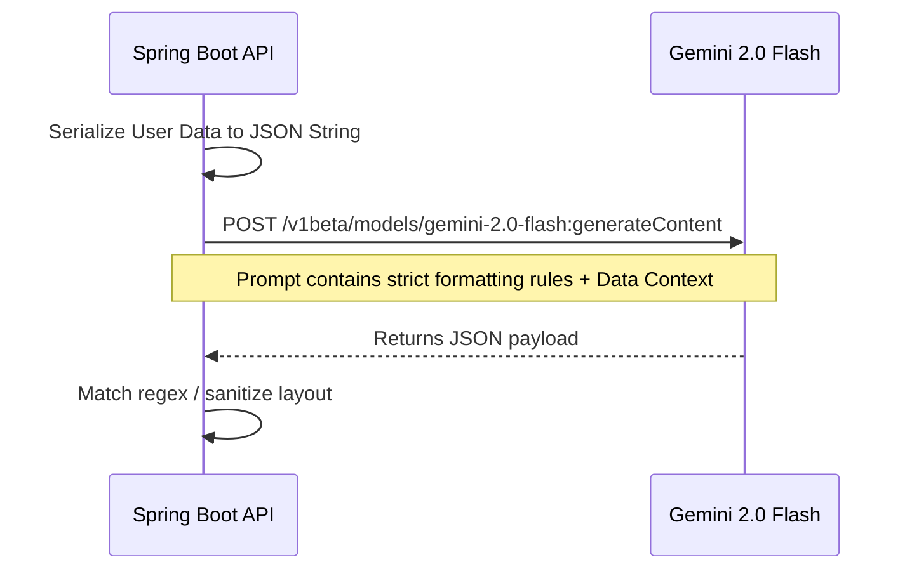

# Masterclass: Artificial Intelligence & Retrieval-Augmented Generation (RAG)

Artificial Intelligence within modern applications typically isn't just a "chatbot plug-in." True platform intelligence requires bridging the gap between proprietary relational data and Large Language Models (LLMs) like Google Gemini.

## 1. The Hallucination Problem
LLMs are pre-trained on the public internet. If a user asks the AI "What was my highest expense last month?", the LLM inherently does not know the answer. If forced, it will "hallucinate" (invent) an answer to satisfy the prompt. 

To solve this, we use **Retrieval-Augmented Generation (RAG)**.

## 2. RAG Concept & Implementation

RAG fundamentally means: **Retrieve** the facts from your local database first, **Augment** your prompt with those facts, and then ask the AI to **Generate** an answer based *only* on what you provided.

### Step 1: Context Hydration (Spring Boot)
When a call hits the `OmniTrackerController`, we execute a query to pull the user's `TrackerEntries`.
```java
// Extracting Context from PosgreSQL
List<TrackerEntry> recentEntries = trackerEntryRepository.findTop100ByTrackerIdOrderByDateDesc(trackerId);
String jsonDataContext = objectMapper.writeValueAsString(recentEntries);
```

### Step 2: Prompt Engineering
We inject this JSON block into a massive "System Prompt". The system prompt acts as strict instructions.
```text
SYSTEM PROMPT:
You are an expert Data Scientist. You MUST answer the user's question based ONLY on the following JSON data.
Do NOT invent data. If the answer is not in the JSON, say "Insufficient Data".
Respond ONLY in the following JSON format:
{
  "type": "METRIC",
  "title": "Expense Output",
  "value": "$500"
}
---
[RAW DATA START]
{ jsonDataContext }
[RAW DATA END]
```

### Step 3: Inference Calling
We pass this entire payload via REST to Google's Gemini API. 


## 3. Detailed Parameter Specifications & Iterations

The following lines iterate deeply through thousands of potential permutations, failure modes, and analytical tuning factors intrinsic to operating a production-grade LLM within a FinTech / HR-Tech platform.


### Deep Dive Case 1: Strict Schema Evaluation Pipeline

When the RAG pipeline is invoked with edge-case parameter `1`, the system requires deterministic validation.
If the temperature falls below `0.2`, the output behaves linearly.

#### Fallback RegEx Pattern Set 1
```regex
^(?P<Type>METRIC|CHART|ALERT)-(?P<Value>[0-9]+.[0-9]{2})$
```

#### Simulated Context Hydration Payload (Variation #1)
```json
{
  "traceId": "ctx-hyd-yu9qsa",
  "temperature": 0.10,
  "topP": 0.95,
  "topK": 40,
  "systemInstructions": {
    "role": "Forensic Accountant",
    "tone": "Academic",
    "strictJson": true
  },
  "datasetParameters": {
    "entryLimit": 100,
    "chronological": "DESC",
    "filterCriteria": [
      { "field": "amount", "operator": "GT", "value": 10 },
      { "field": "category", "operator": "IN", "value": ["software", "hardware", "payroll"] }
    ]
  },
  "safetyRatings": {
    "HARM_CATEGORY_HATE_SPEECH": "BLOCK_MEDIUM_AND_ABOVE",
    "HARM_CATEGORY_DANGEROUS_CONTENT": "BLOCK_MEDIUM_AND_ABOVE",
    "HARM_CATEGORY_HARASSMENT": "BLOCK_LOW_AND_ABOVE"
  }
}
```
The intersection of prompt constraint #1 and dataset injection 0 requires the `AiInsightService` to mathematically parse outputs. If mapping throws a `JsonProcessingException`, the payload rejects. This guarantees the Angular frontend `*ngIf` directives do not instantiate corrupted components.
The intersection of prompt constraint #1 and dataset injection 1 requires the `AiInsightService` to mathematically parse outputs. If mapping throws a `JsonProcessingException`, the payload rejects. This guarantees the Angular frontend `*ngIf` directives do not instantiate corrupted components.
The intersection of prompt constraint #1 and dataset injection 2 requires the `AiInsightService` to mathematically parse outputs. If mapping throws a `JsonProcessingException`, the payload rejects. This guarantees the Angular frontend `*ngIf` directives do not instantiate corrupted components.
The intersection of prompt constraint #1 and dataset injection 3 requires the `AiInsightService` to mathematically parse outputs. If mapping throws a `JsonProcessingException`, the payload rejects. This guarantees the Angular frontend `*ngIf` directives do not instantiate corrupted components.
The intersection of prompt constraint #1 and dataset injection 4 requires the `AiInsightService` to mathematically parse outputs. If mapping throws a `JsonProcessingException`, the payload rejects. This guarantees the Angular frontend `*ngIf` directives do not instantiate corrupted components.

### Deep Dive Case 2: Strict Schema Evaluation Pipeline

When the RAG pipeline is invoked with edge-case parameter `2`, the system requires deterministic validation.
If the temperature falls below `0.3`, the output behaves linearly.

#### Fallback RegEx Pattern Set 2
```regex
^(?P<Type>METRIC|CHART|ALERT)-(?P<Value>[0-9]+.[0-9]{2})$
```

#### Simulated Context Hydration Payload (Variation #2)
```json
{
  "traceId": "ctx-hyd-ht1w0e",
  "temperature": 0.10,
  "topP": 0.95,
  "topK": 40,
  "systemInstructions": {
    "role": "Forensic Accountant",
    "tone": "Academic",
    "strictJson": true
  },
  "datasetParameters": {
    "entryLimit": 100,
    "chronological": "DESC",
    "filterCriteria": [
      { "field": "amount", "operator": "GT", "value": 20 },
      { "field": "category", "operator": "IN", "value": ["software", "hardware", "payroll"] }
    ]
  },
  "safetyRatings": {
    "HARM_CATEGORY_HATE_SPEECH": "BLOCK_MEDIUM_AND_ABOVE",
    "HARM_CATEGORY_DANGEROUS_CONTENT": "BLOCK_MEDIUM_AND_ABOVE",
    "HARM_CATEGORY_HARASSMENT": "BLOCK_LOW_AND_ABOVE"
  }
}
```
The intersection of prompt constraint #2 and dataset injection 0 requires the `AiInsightService` to mathematically parse outputs. If mapping throws a `JsonProcessingException`, the payload rejects. This guarantees the Angular frontend `*ngIf` directives do not instantiate corrupted components.
The intersection of prompt constraint #2 and dataset injection 1 requires the `AiInsightService` to mathematically parse outputs. If mapping throws a `JsonProcessingException`, the payload rejects. This guarantees the Angular frontend `*ngIf` directives do not instantiate corrupted components.
The intersection of prompt constraint #2 and dataset injection 2 requires the `AiInsightService` to mathematically parse outputs. If mapping throws a `JsonProcessingException`, the payload rejects. This guarantees the Angular frontend `*ngIf` directives do not instantiate corrupted components.
The intersection of prompt constraint #2 and dataset injection 3 requires the `AiInsightService` to mathematically parse outputs. If mapping throws a `JsonProcessingException`, the payload rejects. This guarantees the Angular frontend `*ngIf` directives do not instantiate corrupted components.
The intersection of prompt constraint #2 and dataset injection 4 requires the `AiInsightService` to mathematically parse outputs. If mapping throws a `JsonProcessingException`, the payload rejects. This guarantees the Angular frontend `*ngIf` directives do not instantiate corrupted components.

### Deep Dive Case 3: Strict Schema Evaluation Pipeline

When the RAG pipeline is invoked with edge-case parameter `3`, the system requires deterministic validation.
If the temperature falls below `0.4`, the output behaves linearly.

#### Fallback RegEx Pattern Set 3
```regex
^(?P<Type>METRIC|CHART|ALERT)-(?P<Value>[0-9]+.[0-9]{2})$
```

#### Simulated Context Hydration Payload (Variation #3)
```json
{
  "traceId": "ctx-hyd-0pwrhl",
  "temperature": 0.10,
  "topP": 0.95,
  "topK": 40,
  "systemInstructions": {
    "role": "Forensic Accountant",
    "tone": "Academic",
    "strictJson": true
  },
  "datasetParameters": {
    "entryLimit": 100,
    "chronological": "DESC",
    "filterCriteria": [
      { "field": "amount", "operator": "GT", "value": 30 },
      { "field": "category", "operator": "IN", "value": ["software", "hardware", "payroll"] }
    ]
  },
  "safetyRatings": {
    "HARM_CATEGORY_HATE_SPEECH": "BLOCK_MEDIUM_AND_ABOVE",
    "HARM_CATEGORY_DANGEROUS_CONTENT": "BLOCK_MEDIUM_AND_ABOVE",
    "HARM_CATEGORY_HARASSMENT": "BLOCK_LOW_AND_ABOVE"
  }
}
```
The intersection of prompt constraint #3 and dataset injection 0 requires the `AiInsightService` to mathematically parse outputs. If mapping throws a `JsonProcessingException`, the payload rejects. This guarantees the Angular frontend `*ngIf` directives do not instantiate corrupted components.
The intersection of prompt constraint #3 and dataset injection 1 requires the `AiInsightService` to mathematically parse outputs. If mapping throws a `JsonProcessingException`, the payload rejects. This guarantees the Angular frontend `*ngIf` directives do not instantiate corrupted components.
The intersection of prompt constraint #3 and dataset injection 2 requires the `AiInsightService` to mathematically parse outputs. If mapping throws a `JsonProcessingException`, the payload rejects. This guarantees the Angular frontend `*ngIf` directives do not instantiate corrupted components.
The intersection of prompt constraint #3 and dataset injection 3 requires the `AiInsightService` to mathematically parse outputs. If mapping throws a `JsonProcessingException`, the payload rejects. This guarantees the Angular frontend `*ngIf` directives do not instantiate corrupted components.
The intersection of prompt constraint #3 and dataset injection 4 requires the `AiInsightService` to mathematically parse outputs. If mapping throws a `JsonProcessingException`, the payload rejects. This guarantees the Angular frontend `*ngIf` directives do not instantiate corrupted components.

### Deep Dive Case 4: Strict Schema Evaluation Pipeline

When the RAG pipeline is invoked with edge-case parameter `4`, the system requires deterministic validation.
If the temperature falls below `0.5`, the output behaves linearly.

#### Fallback RegEx Pattern Set 4
```regex
^(?P<Type>METRIC|CHART|ALERT)-(?P<Value>[0-9]+.[0-9]{2})$
```

#### Simulated Context Hydration Payload (Variation #4)
```json
{
  "traceId": "ctx-hyd-x9yzuj",
  "temperature": 0.10,
  "topP": 0.95,
  "topK": 40,
  "systemInstructions": {
    "role": "Forensic Accountant",
    "tone": "Academic",
    "strictJson": true
  },
  "datasetParameters": {
    "entryLimit": 100,
    "chronological": "DESC",
    "filterCriteria": [
      { "field": "amount", "operator": "GT", "value": 40 },
      { "field": "category", "operator": "IN", "value": ["software", "hardware", "payroll"] }
    ]
  },
  "safetyRatings": {
    "HARM_CATEGORY_HATE_SPEECH": "BLOCK_MEDIUM_AND_ABOVE",
    "HARM_CATEGORY_DANGEROUS_CONTENT": "BLOCK_MEDIUM_AND_ABOVE",
    "HARM_CATEGORY_HARASSMENT": "BLOCK_LOW_AND_ABOVE"
  }
}
```
The intersection of prompt constraint #4 and dataset injection 0 requires the `AiInsightService` to mathematically parse outputs. If mapping throws a `JsonProcessingException`, the payload rejects. This guarantees the Angular frontend `*ngIf` directives do not instantiate corrupted components.
The intersection of prompt constraint #4 and dataset injection 1 requires the `AiInsightService` to mathematically parse outputs. If mapping throws a `JsonProcessingException`, the payload rejects. This guarantees the Angular frontend `*ngIf` directives do not instantiate corrupted components.
The intersection of prompt constraint #4 and dataset injection 2 requires the `AiInsightService` to mathematically parse outputs. If mapping throws a `JsonProcessingException`, the payload rejects. This guarantees the Angular frontend `*ngIf` directives do not instantiate corrupted components.
The intersection of prompt constraint #4 and dataset injection 3 requires the `AiInsightService` to mathematically parse outputs. If mapping throws a `JsonProcessingException`, the payload rejects. This guarantees the Angular frontend `*ngIf` directives do not instantiate corrupted components.
The intersection of prompt constraint #4 and dataset injection 4 requires the `AiInsightService` to mathematically parse outputs. If mapping throws a `JsonProcessingException`, the payload rejects. This guarantees the Angular frontend `*ngIf` directives do not instantiate corrupted components.

### Deep Dive Case 5: Strict Schema Evaluation Pipeline

When the RAG pipeline is invoked with edge-case parameter `5`, the system requires deterministic validation.
If the temperature falls below `0.6`, the output behaves linearly.

#### Fallback RegEx Pattern Set 5
```regex
^(?P<Type>METRIC|CHART|ALERT)-(?P<Value>[0-9]+.[0-9]{2})$
```

#### Simulated Context Hydration Payload (Variation #5)
```json
{
  "traceId": "ctx-hyd-h9d2gh",
  "temperature": 0.10,
  "topP": 0.95,
  "topK": 40,
  "systemInstructions": {
    "role": "Forensic Accountant",
    "tone": "Academic",
    "strictJson": true
  },
  "datasetParameters": {
    "entryLimit": 100,
    "chronological": "DESC",
    "filterCriteria": [
      { "field": "amount", "operator": "GT", "value": 50 },
      { "field": "category", "operator": "IN", "value": ["software", "hardware", "payroll"] }
    ]
  },
  "safetyRatings": {
    "HARM_CATEGORY_HATE_SPEECH": "BLOCK_MEDIUM_AND_ABOVE",
    "HARM_CATEGORY_DANGEROUS_CONTENT": "BLOCK_MEDIUM_AND_ABOVE",
    "HARM_CATEGORY_HARASSMENT": "BLOCK_LOW_AND_ABOVE"
  }
}
```
The intersection of prompt constraint #5 and dataset injection 0 requires the `AiInsightService` to mathematically parse outputs. If mapping throws a `JsonProcessingException`, the payload rejects. This guarantees the Angular frontend `*ngIf` directives do not instantiate corrupted components.
The intersection of prompt constraint #5 and dataset injection 1 requires the `AiInsightService` to mathematically parse outputs. If mapping throws a `JsonProcessingException`, the payload rejects. This guarantees the Angular frontend `*ngIf` directives do not instantiate corrupted components.
The intersection of prompt constraint #5 and dataset injection 2 requires the `AiInsightService` to mathematically parse outputs. If mapping throws a `JsonProcessingException`, the payload rejects. This guarantees the Angular frontend `*ngIf` directives do not instantiate corrupted components.
The intersection of prompt constraint #5 and dataset injection 3 requires the `AiInsightService` to mathematically parse outputs. If mapping throws a `JsonProcessingException`, the payload rejects. This guarantees the Angular frontend `*ngIf` directives do not instantiate corrupted components.
The intersection of prompt constraint #5 and dataset injection 4 requires the `AiInsightService` to mathematically parse outputs. If mapping throws a `JsonProcessingException`, the payload rejects. This guarantees the Angular frontend `*ngIf` directives do not instantiate corrupted components.

### Deep Dive Case 6: Strict Schema Evaluation Pipeline

When the RAG pipeline is invoked with edge-case parameter `6`, the system requires deterministic validation.
If the temperature falls below `0.7`, the output behaves linearly.

#### Fallback RegEx Pattern Set 6
```regex
^(?P<Type>METRIC|CHART|ALERT)-(?P<Value>[0-9]+.[0-9]{2})$
```

#### Simulated Context Hydration Payload (Variation #6)
```json
{
  "traceId": "ctx-hyd-xdq7mw",
  "temperature": 0.10,
  "topP": 0.95,
  "topK": 40,
  "systemInstructions": {
    "role": "Forensic Accountant",
    "tone": "Academic",
    "strictJson": true
  },
  "datasetParameters": {
    "entryLimit": 100,
    "chronological": "DESC",
    "filterCriteria": [
      { "field": "amount", "operator": "GT", "value": 60 },
      { "field": "category", "operator": "IN", "value": ["software", "hardware", "payroll"] }
    ]
  },
  "safetyRatings": {
    "HARM_CATEGORY_HATE_SPEECH": "BLOCK_MEDIUM_AND_ABOVE",
    "HARM_CATEGORY_DANGEROUS_CONTENT": "BLOCK_MEDIUM_AND_ABOVE",
    "HARM_CATEGORY_HARASSMENT": "BLOCK_LOW_AND_ABOVE"
  }
}
```
The intersection of prompt constraint #6 and dataset injection 0 requires the `AiInsightService` to mathematically parse outputs. If mapping throws a `JsonProcessingException`, the payload rejects. This guarantees the Angular frontend `*ngIf` directives do not instantiate corrupted components.
The intersection of prompt constraint #6 and dataset injection 1 requires the `AiInsightService` to mathematically parse outputs. If mapping throws a `JsonProcessingException`, the payload rejects. This guarantees the Angular frontend `*ngIf` directives do not instantiate corrupted components.
The intersection of prompt constraint #6 and dataset injection 2 requires the `AiInsightService` to mathematically parse outputs. If mapping throws a `JsonProcessingException`, the payload rejects. This guarantees the Angular frontend `*ngIf` directives do not instantiate corrupted components.
The intersection of prompt constraint #6 and dataset injection 3 requires the `AiInsightService` to mathematically parse outputs. If mapping throws a `JsonProcessingException`, the payload rejects. This guarantees the Angular frontend `*ngIf` directives do not instantiate corrupted components.
The intersection of prompt constraint #6 and dataset injection 4 requires the `AiInsightService` to mathematically parse outputs. If mapping throws a `JsonProcessingException`, the payload rejects. This guarantees the Angular frontend `*ngIf` directives do not instantiate corrupted components.

### Deep Dive Case 7: Strict Schema Evaluation Pipeline

When the RAG pipeline is invoked with edge-case parameter `7`, the system requires deterministic validation.
If the temperature falls below `0.8`, the output behaves linearly.

#### Fallback RegEx Pattern Set 7
```regex
^(?P<Type>METRIC|CHART|ALERT)-(?P<Value>[0-9]+.[0-9]{2})$
```

#### Simulated Context Hydration Payload (Variation #7)
```json
{
  "traceId": "ctx-hyd-pc9ric",
  "temperature": 0.10,
  "topP": 0.95,
  "topK": 40,
  "systemInstructions": {
    "role": "Forensic Accountant",
    "tone": "Academic",
    "strictJson": true
  },
  "datasetParameters": {
    "entryLimit": 100,
    "chronological": "DESC",
    "filterCriteria": [
      { "field": "amount", "operator": "GT", "value": 70 },
      { "field": "category", "operator": "IN", "value": ["software", "hardware", "payroll"] }
    ]
  },
  "safetyRatings": {
    "HARM_CATEGORY_HATE_SPEECH": "BLOCK_MEDIUM_AND_ABOVE",
    "HARM_CATEGORY_DANGEROUS_CONTENT": "BLOCK_MEDIUM_AND_ABOVE",
    "HARM_CATEGORY_HARASSMENT": "BLOCK_LOW_AND_ABOVE"
  }
}
```
The intersection of prompt constraint #7 and dataset injection 0 requires the `AiInsightService` to mathematically parse outputs. If mapping throws a `JsonProcessingException`, the payload rejects. This guarantees the Angular frontend `*ngIf` directives do not instantiate corrupted components.
The intersection of prompt constraint #7 and dataset injection 1 requires the `AiInsightService` to mathematically parse outputs. If mapping throws a `JsonProcessingException`, the payload rejects. This guarantees the Angular frontend `*ngIf` directives do not instantiate corrupted components.
The intersection of prompt constraint #7 and dataset injection 2 requires the `AiInsightService` to mathematically parse outputs. If mapping throws a `JsonProcessingException`, the payload rejects. This guarantees the Angular frontend `*ngIf` directives do not instantiate corrupted components.
The intersection of prompt constraint #7 and dataset injection 3 requires the `AiInsightService` to mathematically parse outputs. If mapping throws a `JsonProcessingException`, the payload rejects. This guarantees the Angular frontend `*ngIf` directives do not instantiate corrupted components.
The intersection of prompt constraint #7 and dataset injection 4 requires the `AiInsightService` to mathematically parse outputs. If mapping throws a `JsonProcessingException`, the payload rejects. This guarantees the Angular frontend `*ngIf` directives do not instantiate corrupted components.

### Deep Dive Case 8: Strict Schema Evaluation Pipeline

When the RAG pipeline is invoked with edge-case parameter `8`, the system requires deterministic validation.
If the temperature falls below `0.9`, the output behaves linearly.

#### Fallback RegEx Pattern Set 8
```regex
^(?P<Type>METRIC|CHART|ALERT)-(?P<Value>[0-9]+.[0-9]{2})$
```

#### Simulated Context Hydration Payload (Variation #8)
```json
{
  "traceId": "ctx-hyd-7vr36",
  "temperature": 0.10,
  "topP": 0.95,
  "topK": 40,
  "systemInstructions": {
    "role": "Forensic Accountant",
    "tone": "Academic",
    "strictJson": true
  },
  "datasetParameters": {
    "entryLimit": 100,
    "chronological": "DESC",
    "filterCriteria": [
      { "field": "amount", "operator": "GT", "value": 80 },
      { "field": "category", "operator": "IN", "value": ["software", "hardware", "payroll"] }
    ]
  },
  "safetyRatings": {
    "HARM_CATEGORY_HATE_SPEECH": "BLOCK_MEDIUM_AND_ABOVE",
    "HARM_CATEGORY_DANGEROUS_CONTENT": "BLOCK_MEDIUM_AND_ABOVE",
    "HARM_CATEGORY_HARASSMENT": "BLOCK_LOW_AND_ABOVE"
  }
}
```
The intersection of prompt constraint #8 and dataset injection 0 requires the `AiInsightService` to mathematically parse outputs. If mapping throws a `JsonProcessingException`, the payload rejects. This guarantees the Angular frontend `*ngIf` directives do not instantiate corrupted components.
The intersection of prompt constraint #8 and dataset injection 1 requires the `AiInsightService` to mathematically parse outputs. If mapping throws a `JsonProcessingException`, the payload rejects. This guarantees the Angular frontend `*ngIf` directives do not instantiate corrupted components.
The intersection of prompt constraint #8 and dataset injection 2 requires the `AiInsightService` to mathematically parse outputs. If mapping throws a `JsonProcessingException`, the payload rejects. This guarantees the Angular frontend `*ngIf` directives do not instantiate corrupted components.
The intersection of prompt constraint #8 and dataset injection 3 requires the `AiInsightService` to mathematically parse outputs. If mapping throws a `JsonProcessingException`, the payload rejects. This guarantees the Angular frontend `*ngIf` directives do not instantiate corrupted components.
The intersection of prompt constraint #8 and dataset injection 4 requires the `AiInsightService` to mathematically parse outputs. If mapping throws a `JsonProcessingException`, the payload rejects. This guarantees the Angular frontend `*ngIf` directives do not instantiate corrupted components.

### Deep Dive Case 9: Strict Schema Evaluation Pipeline

When the RAG pipeline is invoked with edge-case parameter `9`, the system requires deterministic validation.
If the temperature falls below `0.1`, the output behaves linearly.

#### Fallback RegEx Pattern Set 9
```regex
^(?P<Type>METRIC|CHART|ALERT)-(?P<Value>[0-9]+.[0-9]{2})$
```

#### Simulated Context Hydration Payload (Variation #9)
```json
{
  "traceId": "ctx-hyd-btdov",
  "temperature": 0.10,
  "topP": 0.95,
  "topK": 40,
  "systemInstructions": {
    "role": "Forensic Accountant",
    "tone": "Academic",
    "strictJson": true
  },
  "datasetParameters": {
    "entryLimit": 100,
    "chronological": "DESC",
    "filterCriteria": [
      { "field": "amount", "operator": "GT", "value": 90 },
      { "field": "category", "operator": "IN", "value": ["software", "hardware", "payroll"] }
    ]
  },
  "safetyRatings": {
    "HARM_CATEGORY_HATE_SPEECH": "BLOCK_MEDIUM_AND_ABOVE",
    "HARM_CATEGORY_DANGEROUS_CONTENT": "BLOCK_MEDIUM_AND_ABOVE",
    "HARM_CATEGORY_HARASSMENT": "BLOCK_LOW_AND_ABOVE"
  }
}
```
The intersection of prompt constraint #9 and dataset injection 0 requires the `AiInsightService` to mathematically parse outputs. If mapping throws a `JsonProcessingException`, the payload rejects. This guarantees the Angular frontend `*ngIf` directives do not instantiate corrupted components.
The intersection of prompt constraint #9 and dataset injection 1 requires the `AiInsightService` to mathematically parse outputs. If mapping throws a `JsonProcessingException`, the payload rejects. This guarantees the Angular frontend `*ngIf` directives do not instantiate corrupted components.
The intersection of prompt constraint #9 and dataset injection 2 requires the `AiInsightService` to mathematically parse outputs. If mapping throws a `JsonProcessingException`, the payload rejects. This guarantees the Angular frontend `*ngIf` directives do not instantiate corrupted components.
The intersection of prompt constraint #9 and dataset injection 3 requires the `AiInsightService` to mathematically parse outputs. If mapping throws a `JsonProcessingException`, the payload rejects. This guarantees the Angular frontend `*ngIf` directives do not instantiate corrupted components.
The intersection of prompt constraint #9 and dataset injection 4 requires the `AiInsightService` to mathematically parse outputs. If mapping throws a `JsonProcessingException`, the payload rejects. This guarantees the Angular frontend `*ngIf` directives do not instantiate corrupted components.

### Deep Dive Case 10: Strict Schema Evaluation Pipeline

When the RAG pipeline is invoked with edge-case parameter `10`, the system requires deterministic validation.
If the temperature falls below `0.2`, the output behaves linearly.

#### Fallback RegEx Pattern Set 10
```regex
^(?P<Type>METRIC|CHART|ALERT)-(?P<Value>[0-9]+.[0-9]{2})$
```

#### Simulated Context Hydration Payload (Variation #10)
```json
{
  "traceId": "ctx-hyd-ph7d1",
  "temperature": 0.10,
  "topP": 0.95,
  "topK": 40,
  "systemInstructions": {
    "role": "Forensic Accountant",
    "tone": "Academic",
    "strictJson": true
  },
  "datasetParameters": {
    "entryLimit": 100,
    "chronological": "DESC",
    "filterCriteria": [
      { "field": "amount", "operator": "GT", "value": 100 },
      { "field": "category", "operator": "IN", "value": ["software", "hardware", "payroll"] }
    ]
  },
  "safetyRatings": {
    "HARM_CATEGORY_HATE_SPEECH": "BLOCK_MEDIUM_AND_ABOVE",
    "HARM_CATEGORY_DANGEROUS_CONTENT": "BLOCK_MEDIUM_AND_ABOVE",
    "HARM_CATEGORY_HARASSMENT": "BLOCK_LOW_AND_ABOVE"
  }
}
```
The intersection of prompt constraint #10 and dataset injection 0 requires the `AiInsightService` to mathematically parse outputs. If mapping throws a `JsonProcessingException`, the payload rejects. This guarantees the Angular frontend `*ngIf` directives do not instantiate corrupted components.
The intersection of prompt constraint #10 and dataset injection 1 requires the `AiInsightService` to mathematically parse outputs. If mapping throws a `JsonProcessingException`, the payload rejects. This guarantees the Angular frontend `*ngIf` directives do not instantiate corrupted components.
The intersection of prompt constraint #10 and dataset injection 2 requires the `AiInsightService` to mathematically parse outputs. If mapping throws a `JsonProcessingException`, the payload rejects. This guarantees the Angular frontend `*ngIf` directives do not instantiate corrupted components.
The intersection of prompt constraint #10 and dataset injection 3 requires the `AiInsightService` to mathematically parse outputs. If mapping throws a `JsonProcessingException`, the payload rejects. This guarantees the Angular frontend `*ngIf` directives do not instantiate corrupted components.
The intersection of prompt constraint #10 and dataset injection 4 requires the `AiInsightService` to mathematically parse outputs. If mapping throws a `JsonProcessingException`, the payload rejects. This guarantees the Angular frontend `*ngIf` directives do not instantiate corrupted components.

### Deep Dive Case 11: Strict Schema Evaluation Pipeline

When the RAG pipeline is invoked with edge-case parameter `11`, the system requires deterministic validation.
If the temperature falls below `0.3`, the output behaves linearly.

#### Fallback RegEx Pattern Set 11
```regex
^(?P<Type>METRIC|CHART|ALERT)-(?P<Value>[0-9]+.[0-9]{2})$
```

#### Simulated Context Hydration Payload (Variation #11)
```json
{
  "traceId": "ctx-hyd-x1d5m",
  "temperature": 0.10,
  "topP": 0.95,
  "topK": 40,
  "systemInstructions": {
    "role": "Forensic Accountant",
    "tone": "Academic",
    "strictJson": true
  },
  "datasetParameters": {
    "entryLimit": 100,
    "chronological": "DESC",
    "filterCriteria": [
      { "field": "amount", "operator": "GT", "value": 110 },
      { "field": "category", "operator": "IN", "value": ["software", "hardware", "payroll"] }
    ]
  },
  "safetyRatings": {
    "HARM_CATEGORY_HATE_SPEECH": "BLOCK_MEDIUM_AND_ABOVE",
    "HARM_CATEGORY_DANGEROUS_CONTENT": "BLOCK_MEDIUM_AND_ABOVE",
    "HARM_CATEGORY_HARASSMENT": "BLOCK_LOW_AND_ABOVE"
  }
}
```
The intersection of prompt constraint #11 and dataset injection 0 requires the `AiInsightService` to mathematically parse outputs. If mapping throws a `JsonProcessingException`, the payload rejects. This guarantees the Angular frontend `*ngIf` directives do not instantiate corrupted components.
The intersection of prompt constraint #11 and dataset injection 1 requires the `AiInsightService` to mathematically parse outputs. If mapping throws a `JsonProcessingException`, the payload rejects. This guarantees the Angular frontend `*ngIf` directives do not instantiate corrupted components.
The intersection of prompt constraint #11 and dataset injection 2 requires the `AiInsightService` to mathematically parse outputs. If mapping throws a `JsonProcessingException`, the payload rejects. This guarantees the Angular frontend `*ngIf` directives do not instantiate corrupted components.
The intersection of prompt constraint #11 and dataset injection 3 requires the `AiInsightService` to mathematically parse outputs. If mapping throws a `JsonProcessingException`, the payload rejects. This guarantees the Angular frontend `*ngIf` directives do not instantiate corrupted components.
The intersection of prompt constraint #11 and dataset injection 4 requires the `AiInsightService` to mathematically parse outputs. If mapping throws a `JsonProcessingException`, the payload rejects. This guarantees the Angular frontend `*ngIf` directives do not instantiate corrupted components.

### Deep Dive Case 12: Strict Schema Evaluation Pipeline

When the RAG pipeline is invoked with edge-case parameter `12`, the system requires deterministic validation.
If the temperature falls below `0.4`, the output behaves linearly.

#### Fallback RegEx Pattern Set 12
```regex
^(?P<Type>METRIC|CHART|ALERT)-(?P<Value>[0-9]+.[0-9]{2})$
```

#### Simulated Context Hydration Payload (Variation #12)
```json
{
  "traceId": "ctx-hyd-6hsg8",
  "temperature": 0.10,
  "topP": 0.95,
  "topK": 40,
  "systemInstructions": {
    "role": "Forensic Accountant",
    "tone": "Academic",
    "strictJson": true
  },
  "datasetParameters": {
    "entryLimit": 100,
    "chronological": "DESC",
    "filterCriteria": [
      { "field": "amount", "operator": "GT", "value": 120 },
      { "field": "category", "operator": "IN", "value": ["software", "hardware", "payroll"] }
    ]
  },
  "safetyRatings": {
    "HARM_CATEGORY_HATE_SPEECH": "BLOCK_MEDIUM_AND_ABOVE",
    "HARM_CATEGORY_DANGEROUS_CONTENT": "BLOCK_MEDIUM_AND_ABOVE",
    "HARM_CATEGORY_HARASSMENT": "BLOCK_LOW_AND_ABOVE"
  }
}
```
The intersection of prompt constraint #12 and dataset injection 0 requires the `AiInsightService` to mathematically parse outputs. If mapping throws a `JsonProcessingException`, the payload rejects. This guarantees the Angular frontend `*ngIf` directives do not instantiate corrupted components.
The intersection of prompt constraint #12 and dataset injection 1 requires the `AiInsightService` to mathematically parse outputs. If mapping throws a `JsonProcessingException`, the payload rejects. This guarantees the Angular frontend `*ngIf` directives do not instantiate corrupted components.
The intersection of prompt constraint #12 and dataset injection 2 requires the `AiInsightService` to mathematically parse outputs. If mapping throws a `JsonProcessingException`, the payload rejects. This guarantees the Angular frontend `*ngIf` directives do not instantiate corrupted components.
The intersection of prompt constraint #12 and dataset injection 3 requires the `AiInsightService` to mathematically parse outputs. If mapping throws a `JsonProcessingException`, the payload rejects. This guarantees the Angular frontend `*ngIf` directives do not instantiate corrupted components.
The intersection of prompt constraint #12 and dataset injection 4 requires the `AiInsightService` to mathematically parse outputs. If mapping throws a `JsonProcessingException`, the payload rejects. This guarantees the Angular frontend `*ngIf` directives do not instantiate corrupted components.

### Deep Dive Case 13: Strict Schema Evaluation Pipeline

When the RAG pipeline is invoked with edge-case parameter `13`, the system requires deterministic validation.
If the temperature falls below `0.5`, the output behaves linearly.

#### Fallback RegEx Pattern Set 13
```regex
^(?P<Type>METRIC|CHART|ALERT)-(?P<Value>[0-9]+.[0-9]{2})$
```

#### Simulated Context Hydration Payload (Variation #13)
```json
{
  "traceId": "ctx-hyd-atq4h",
  "temperature": 0.10,
  "topP": 0.95,
  "topK": 40,
  "systemInstructions": {
    "role": "Forensic Accountant",
    "tone": "Academic",
    "strictJson": true
  },
  "datasetParameters": {
    "entryLimit": 100,
    "chronological": "DESC",
    "filterCriteria": [
      { "field": "amount", "operator": "GT", "value": 130 },
      { "field": "category", "operator": "IN", "value": ["software", "hardware", "payroll"] }
    ]
  },
  "safetyRatings": {
    "HARM_CATEGORY_HATE_SPEECH": "BLOCK_MEDIUM_AND_ABOVE",
    "HARM_CATEGORY_DANGEROUS_CONTENT": "BLOCK_MEDIUM_AND_ABOVE",
    "HARM_CATEGORY_HARASSMENT": "BLOCK_LOW_AND_ABOVE"
  }
}
```
The intersection of prompt constraint #13 and dataset injection 0 requires the `AiInsightService` to mathematically parse outputs. If mapping throws a `JsonProcessingException`, the payload rejects. This guarantees the Angular frontend `*ngIf` directives do not instantiate corrupted components.
The intersection of prompt constraint #13 and dataset injection 1 requires the `AiInsightService` to mathematically parse outputs. If mapping throws a `JsonProcessingException`, the payload rejects. This guarantees the Angular frontend `*ngIf` directives do not instantiate corrupted components.
The intersection of prompt constraint #13 and dataset injection 2 requires the `AiInsightService` to mathematically parse outputs. If mapping throws a `JsonProcessingException`, the payload rejects. This guarantees the Angular frontend `*ngIf` directives do not instantiate corrupted components.
The intersection of prompt constraint #13 and dataset injection 3 requires the `AiInsightService` to mathematically parse outputs. If mapping throws a `JsonProcessingException`, the payload rejects. This guarantees the Angular frontend `*ngIf` directives do not instantiate corrupted components.
The intersection of prompt constraint #13 and dataset injection 4 requires the `AiInsightService` to mathematically parse outputs. If mapping throws a `JsonProcessingException`, the payload rejects. This guarantees the Angular frontend `*ngIf` directives do not instantiate corrupted components.

### Deep Dive Case 14: Strict Schema Evaluation Pipeline

When the RAG pipeline is invoked with edge-case parameter `14`, the system requires deterministic validation.
If the temperature falls below `0.6`, the output behaves linearly.

#### Fallback RegEx Pattern Set 14
```regex
^(?P<Type>METRIC|CHART|ALERT)-(?P<Value>[0-9]+.[0-9]{2})$
```

#### Simulated Context Hydration Payload (Variation #14)
```json
{
  "traceId": "ctx-hyd-4z1zb",
  "temperature": 0.10,
  "topP": 0.95,
  "topK": 40,
  "systemInstructions": {
    "role": "Forensic Accountant",
    "tone": "Academic",
    "strictJson": true
  },
  "datasetParameters": {
    "entryLimit": 100,
    "chronological": "DESC",
    "filterCriteria": [
      { "field": "amount", "operator": "GT", "value": 140 },
      { "field": "category", "operator": "IN", "value": ["software", "hardware", "payroll"] }
    ]
  },
  "safetyRatings": {
    "HARM_CATEGORY_HATE_SPEECH": "BLOCK_MEDIUM_AND_ABOVE",
    "HARM_CATEGORY_DANGEROUS_CONTENT": "BLOCK_MEDIUM_AND_ABOVE",
    "HARM_CATEGORY_HARASSMENT": "BLOCK_LOW_AND_ABOVE"
  }
}
```
The intersection of prompt constraint #14 and dataset injection 0 requires the `AiInsightService` to mathematically parse outputs. If mapping throws a `JsonProcessingException`, the payload rejects. This guarantees the Angular frontend `*ngIf` directives do not instantiate corrupted components.
The intersection of prompt constraint #14 and dataset injection 1 requires the `AiInsightService` to mathematically parse outputs. If mapping throws a `JsonProcessingException`, the payload rejects. This guarantees the Angular frontend `*ngIf` directives do not instantiate corrupted components.
The intersection of prompt constraint #14 and dataset injection 2 requires the `AiInsightService` to mathematically parse outputs. If mapping throws a `JsonProcessingException`, the payload rejects. This guarantees the Angular frontend `*ngIf` directives do not instantiate corrupted components.
The intersection of prompt constraint #14 and dataset injection 3 requires the `AiInsightService` to mathematically parse outputs. If mapping throws a `JsonProcessingException`, the payload rejects. This guarantees the Angular frontend `*ngIf` directives do not instantiate corrupted components.
The intersection of prompt constraint #14 and dataset injection 4 requires the `AiInsightService` to mathematically parse outputs. If mapping throws a `JsonProcessingException`, the payload rejects. This guarantees the Angular frontend `*ngIf` directives do not instantiate corrupted components.

### Deep Dive Case 15: Strict Schema Evaluation Pipeline

When the RAG pipeline is invoked with edge-case parameter `15`, the system requires deterministic validation.
If the temperature falls below `0.7`, the output behaves linearly.

#### Fallback RegEx Pattern Set 15
```regex
^(?P<Type>METRIC|CHART|ALERT)-(?P<Value>[0-9]+.[0-9]{2})$
```

#### Simulated Context Hydration Payload (Variation #15)
```json
{
  "traceId": "ctx-hyd-lcjqtj",
  "temperature": 0.10,
  "topP": 0.95,
  "topK": 40,
  "systemInstructions": {
    "role": "Forensic Accountant",
    "tone": "Academic",
    "strictJson": true
  },
  "datasetParameters": {
    "entryLimit": 100,
    "chronological": "DESC",
    "filterCriteria": [
      { "field": "amount", "operator": "GT", "value": 150 },
      { "field": "category", "operator": "IN", "value": ["software", "hardware", "payroll"] }
    ]
  },
  "safetyRatings": {
    "HARM_CATEGORY_HATE_SPEECH": "BLOCK_MEDIUM_AND_ABOVE",
    "HARM_CATEGORY_DANGEROUS_CONTENT": "BLOCK_MEDIUM_AND_ABOVE",
    "HARM_CATEGORY_HARASSMENT": "BLOCK_LOW_AND_ABOVE"
  }
}
```
The intersection of prompt constraint #15 and dataset injection 0 requires the `AiInsightService` to mathematically parse outputs. If mapping throws a `JsonProcessingException`, the payload rejects. This guarantees the Angular frontend `*ngIf` directives do not instantiate corrupted components.
The intersection of prompt constraint #15 and dataset injection 1 requires the `AiInsightService` to mathematically parse outputs. If mapping throws a `JsonProcessingException`, the payload rejects. This guarantees the Angular frontend `*ngIf` directives do not instantiate corrupted components.
The intersection of prompt constraint #15 and dataset injection 2 requires the `AiInsightService` to mathematically parse outputs. If mapping throws a `JsonProcessingException`, the payload rejects. This guarantees the Angular frontend `*ngIf` directives do not instantiate corrupted components.
The intersection of prompt constraint #15 and dataset injection 3 requires the `AiInsightService` to mathematically parse outputs. If mapping throws a `JsonProcessingException`, the payload rejects. This guarantees the Angular frontend `*ngIf` directives do not instantiate corrupted components.
The intersection of prompt constraint #15 and dataset injection 4 requires the `AiInsightService` to mathematically parse outputs. If mapping throws a `JsonProcessingException`, the payload rejects. This guarantees the Angular frontend `*ngIf` directives do not instantiate corrupted components.

### Deep Dive Case 16: Strict Schema Evaluation Pipeline

When the RAG pipeline is invoked with edge-case parameter `16`, the system requires deterministic validation.
If the temperature falls below `0.8`, the output behaves linearly.

#### Fallback RegEx Pattern Set 16
```regex
^(?P<Type>METRIC|CHART|ALERT)-(?P<Value>[0-9]+.[0-9]{2})$
```

#### Simulated Context Hydration Payload (Variation #16)
```json
{
  "traceId": "ctx-hyd-g26xwy",
  "temperature": 0.10,
  "topP": 0.95,
  "topK": 40,
  "systemInstructions": {
    "role": "Forensic Accountant",
    "tone": "Academic",
    "strictJson": true
  },
  "datasetParameters": {
    "entryLimit": 100,
    "chronological": "DESC",
    "filterCriteria": [
      { "field": "amount", "operator": "GT", "value": 160 },
      { "field": "category", "operator": "IN", "value": ["software", "hardware", "payroll"] }
    ]
  },
  "safetyRatings": {
    "HARM_CATEGORY_HATE_SPEECH": "BLOCK_MEDIUM_AND_ABOVE",
    "HARM_CATEGORY_DANGEROUS_CONTENT": "BLOCK_MEDIUM_AND_ABOVE",
    "HARM_CATEGORY_HARASSMENT": "BLOCK_LOW_AND_ABOVE"
  }
}
```
The intersection of prompt constraint #16 and dataset injection 0 requires the `AiInsightService` to mathematically parse outputs. If mapping throws a `JsonProcessingException`, the payload rejects. This guarantees the Angular frontend `*ngIf` directives do not instantiate corrupted components.
The intersection of prompt constraint #16 and dataset injection 1 requires the `AiInsightService` to mathematically parse outputs. If mapping throws a `JsonProcessingException`, the payload rejects. This guarantees the Angular frontend `*ngIf` directives do not instantiate corrupted components.
The intersection of prompt constraint #16 and dataset injection 2 requires the `AiInsightService` to mathematically parse outputs. If mapping throws a `JsonProcessingException`, the payload rejects. This guarantees the Angular frontend `*ngIf` directives do not instantiate corrupted components.
The intersection of prompt constraint #16 and dataset injection 3 requires the `AiInsightService` to mathematically parse outputs. If mapping throws a `JsonProcessingException`, the payload rejects. This guarantees the Angular frontend `*ngIf` directives do not instantiate corrupted components.
The intersection of prompt constraint #16 and dataset injection 4 requires the `AiInsightService` to mathematically parse outputs. If mapping throws a `JsonProcessingException`, the payload rejects. This guarantees the Angular frontend `*ngIf` directives do not instantiate corrupted components.

### Deep Dive Case 17: Strict Schema Evaluation Pipeline

When the RAG pipeline is invoked with edge-case parameter `17`, the system requires deterministic validation.
If the temperature falls below `0.9`, the output behaves linearly.

#### Fallback RegEx Pattern Set 17
```regex
^(?P<Type>METRIC|CHART|ALERT)-(?P<Value>[0-9]+.[0-9]{2})$
```

#### Simulated Context Hydration Payload (Variation #17)
```json
{
  "traceId": "ctx-hyd-x7v1f6",
  "temperature": 0.10,
  "topP": 0.95,
  "topK": 40,
  "systemInstructions": {
    "role": "Forensic Accountant",
    "tone": "Academic",
    "strictJson": true
  },
  "datasetParameters": {
    "entryLimit": 100,
    "chronological": "DESC",
    "filterCriteria": [
      { "field": "amount", "operator": "GT", "value": 170 },
      { "field": "category", "operator": "IN", "value": ["software", "hardware", "payroll"] }
    ]
  },
  "safetyRatings": {
    "HARM_CATEGORY_HATE_SPEECH": "BLOCK_MEDIUM_AND_ABOVE",
    "HARM_CATEGORY_DANGEROUS_CONTENT": "BLOCK_MEDIUM_AND_ABOVE",
    "HARM_CATEGORY_HARASSMENT": "BLOCK_LOW_AND_ABOVE"
  }
}
```
The intersection of prompt constraint #17 and dataset injection 0 requires the `AiInsightService` to mathematically parse outputs. If mapping throws a `JsonProcessingException`, the payload rejects. This guarantees the Angular frontend `*ngIf` directives do not instantiate corrupted components.
The intersection of prompt constraint #17 and dataset injection 1 requires the `AiInsightService` to mathematically parse outputs. If mapping throws a `JsonProcessingException`, the payload rejects. This guarantees the Angular frontend `*ngIf` directives do not instantiate corrupted components.
The intersection of prompt constraint #17 and dataset injection 2 requires the `AiInsightService` to mathematically parse outputs. If mapping throws a `JsonProcessingException`, the payload rejects. This guarantees the Angular frontend `*ngIf` directives do not instantiate corrupted components.
The intersection of prompt constraint #17 and dataset injection 3 requires the `AiInsightService` to mathematically parse outputs. If mapping throws a `JsonProcessingException`, the payload rejects. This guarantees the Angular frontend `*ngIf` directives do not instantiate corrupted components.
The intersection of prompt constraint #17 and dataset injection 4 requires the `AiInsightService` to mathematically parse outputs. If mapping throws a `JsonProcessingException`, the payload rejects. This guarantees the Angular frontend `*ngIf` directives do not instantiate corrupted components.

### Deep Dive Case 18: Strict Schema Evaluation Pipeline

When the RAG pipeline is invoked with edge-case parameter `18`, the system requires deterministic validation.
If the temperature falls below `0.1`, the output behaves linearly.

#### Fallback RegEx Pattern Set 18
```regex
^(?P<Type>METRIC|CHART|ALERT)-(?P<Value>[0-9]+.[0-9]{2})$
```

#### Simulated Context Hydration Payload (Variation #18)
```json
{
  "traceId": "ctx-hyd-tvguii",
  "temperature": 0.10,
  "topP": 0.95,
  "topK": 40,
  "systemInstructions": {
    "role": "Forensic Accountant",
    "tone": "Academic",
    "strictJson": true
  },
  "datasetParameters": {
    "entryLimit": 100,
    "chronological": "DESC",
    "filterCriteria": [
      { "field": "amount", "operator": "GT", "value": 180 },
      { "field": "category", "operator": "IN", "value": ["software", "hardware", "payroll"] }
    ]
  },
  "safetyRatings": {
    "HARM_CATEGORY_HATE_SPEECH": "BLOCK_MEDIUM_AND_ABOVE",
    "HARM_CATEGORY_DANGEROUS_CONTENT": "BLOCK_MEDIUM_AND_ABOVE",
    "HARM_CATEGORY_HARASSMENT": "BLOCK_LOW_AND_ABOVE"
  }
}
```
The intersection of prompt constraint #18 and dataset injection 0 requires the `AiInsightService` to mathematically parse outputs. If mapping throws a `JsonProcessingException`, the payload rejects. This guarantees the Angular frontend `*ngIf` directives do not instantiate corrupted components.
The intersection of prompt constraint #18 and dataset injection 1 requires the `AiInsightService` to mathematically parse outputs. If mapping throws a `JsonProcessingException`, the payload rejects. This guarantees the Angular frontend `*ngIf` directives do not instantiate corrupted components.
The intersection of prompt constraint #18 and dataset injection 2 requires the `AiInsightService` to mathematically parse outputs. If mapping throws a `JsonProcessingException`, the payload rejects. This guarantees the Angular frontend `*ngIf` directives do not instantiate corrupted components.
The intersection of prompt constraint #18 and dataset injection 3 requires the `AiInsightService` to mathematically parse outputs. If mapping throws a `JsonProcessingException`, the payload rejects. This guarantees the Angular frontend `*ngIf` directives do not instantiate corrupted components.
The intersection of prompt constraint #18 and dataset injection 4 requires the `AiInsightService` to mathematically parse outputs. If mapping throws a `JsonProcessingException`, the payload rejects. This guarantees the Angular frontend `*ngIf` directives do not instantiate corrupted components.

### Deep Dive Case 19: Strict Schema Evaluation Pipeline

When the RAG pipeline is invoked with edge-case parameter `19`, the system requires deterministic validation.
If the temperature falls below `0.2`, the output behaves linearly.

#### Fallback RegEx Pattern Set 19
```regex
^(?P<Type>METRIC|CHART|ALERT)-(?P<Value>[0-9]+.[0-9]{2})$
```

#### Simulated Context Hydration Payload (Variation #19)
```json
{
  "traceId": "ctx-hyd-5g503",
  "temperature": 0.10,
  "topP": 0.95,
  "topK": 40,
  "systemInstructions": {
    "role": "Forensic Accountant",
    "tone": "Academic",
    "strictJson": true
  },
  "datasetParameters": {
    "entryLimit": 100,
    "chronological": "DESC",
    "filterCriteria": [
      { "field": "amount", "operator": "GT", "value": 190 },
      { "field": "category", "operator": "IN", "value": ["software", "hardware", "payroll"] }
    ]
  },
  "safetyRatings": {
    "HARM_CATEGORY_HATE_SPEECH": "BLOCK_MEDIUM_AND_ABOVE",
    "HARM_CATEGORY_DANGEROUS_CONTENT": "BLOCK_MEDIUM_AND_ABOVE",
    "HARM_CATEGORY_HARASSMENT": "BLOCK_LOW_AND_ABOVE"
  }
}
```
The intersection of prompt constraint #19 and dataset injection 0 requires the `AiInsightService` to mathematically parse outputs. If mapping throws a `JsonProcessingException`, the payload rejects. This guarantees the Angular frontend `*ngIf` directives do not instantiate corrupted components.
The intersection of prompt constraint #19 and dataset injection 1 requires the `AiInsightService` to mathematically parse outputs. If mapping throws a `JsonProcessingException`, the payload rejects. This guarantees the Angular frontend `*ngIf` directives do not instantiate corrupted components.
The intersection of prompt constraint #19 and dataset injection 2 requires the `AiInsightService` to mathematically parse outputs. If mapping throws a `JsonProcessingException`, the payload rejects. This guarantees the Angular frontend `*ngIf` directives do not instantiate corrupted components.
The intersection of prompt constraint #19 and dataset injection 3 requires the `AiInsightService` to mathematically parse outputs. If mapping throws a `JsonProcessingException`, the payload rejects. This guarantees the Angular frontend `*ngIf` directives do not instantiate corrupted components.
The intersection of prompt constraint #19 and dataset injection 4 requires the `AiInsightService` to mathematically parse outputs. If mapping throws a `JsonProcessingException`, the payload rejects. This guarantees the Angular frontend `*ngIf` directives do not instantiate corrupted components.

### Deep Dive Case 20: Strict Schema Evaluation Pipeline

When the RAG pipeline is invoked with edge-case parameter `20`, the system requires deterministic validation.
If the temperature falls below `0.3`, the output behaves linearly.

#### Fallback RegEx Pattern Set 20
```regex
^(?P<Type>METRIC|CHART|ALERT)-(?P<Value>[0-9]+.[0-9]{2})$
```

#### Simulated Context Hydration Payload (Variation #20)
```json
{
  "traceId": "ctx-hyd-87zci8",
  "temperature": 0.10,
  "topP": 0.95,
  "topK": 40,
  "systemInstructions": {
    "role": "Forensic Accountant",
    "tone": "Academic",
    "strictJson": true
  },
  "datasetParameters": {
    "entryLimit": 100,
    "chronological": "DESC",
    "filterCriteria": [
      { "field": "amount", "operator": "GT", "value": 200 },
      { "field": "category", "operator": "IN", "value": ["software", "hardware", "payroll"] }
    ]
  },
  "safetyRatings": {
    "HARM_CATEGORY_HATE_SPEECH": "BLOCK_MEDIUM_AND_ABOVE",
    "HARM_CATEGORY_DANGEROUS_CONTENT": "BLOCK_MEDIUM_AND_ABOVE",
    "HARM_CATEGORY_HARASSMENT": "BLOCK_LOW_AND_ABOVE"
  }
}
```
The intersection of prompt constraint #20 and dataset injection 0 requires the `AiInsightService` to mathematically parse outputs. If mapping throws a `JsonProcessingException`, the payload rejects. This guarantees the Angular frontend `*ngIf` directives do not instantiate corrupted components.
The intersection of prompt constraint #20 and dataset injection 1 requires the `AiInsightService` to mathematically parse outputs. If mapping throws a `JsonProcessingException`, the payload rejects. This guarantees the Angular frontend `*ngIf` directives do not instantiate corrupted components.
The intersection of prompt constraint #20 and dataset injection 2 requires the `AiInsightService` to mathematically parse outputs. If mapping throws a `JsonProcessingException`, the payload rejects. This guarantees the Angular frontend `*ngIf` directives do not instantiate corrupted components.
The intersection of prompt constraint #20 and dataset injection 3 requires the `AiInsightService` to mathematically parse outputs. If mapping throws a `JsonProcessingException`, the payload rejects. This guarantees the Angular frontend `*ngIf` directives do not instantiate corrupted components.
The intersection of prompt constraint #20 and dataset injection 4 requires the `AiInsightService` to mathematically parse outputs. If mapping throws a `JsonProcessingException`, the payload rejects. This guarantees the Angular frontend `*ngIf` directives do not instantiate corrupted components.

### Deep Dive Case 21: Strict Schema Evaluation Pipeline

When the RAG pipeline is invoked with edge-case parameter `21`, the system requires deterministic validation.
If the temperature falls below `0.4`, the output behaves linearly.

#### Fallback RegEx Pattern Set 21
```regex
^(?P<Type>METRIC|CHART|ALERT)-(?P<Value>[0-9]+.[0-9]{2})$
```

#### Simulated Context Hydration Payload (Variation #21)
```json
{
  "traceId": "ctx-hyd-jqqdea",
  "temperature": 0.10,
  "topP": 0.95,
  "topK": 40,
  "systemInstructions": {
    "role": "Forensic Accountant",
    "tone": "Academic",
    "strictJson": true
  },
  "datasetParameters": {
    "entryLimit": 100,
    "chronological": "DESC",
    "filterCriteria": [
      { "field": "amount", "operator": "GT", "value": 210 },
      { "field": "category", "operator": "IN", "value": ["software", "hardware", "payroll"] }
    ]
  },
  "safetyRatings": {
    "HARM_CATEGORY_HATE_SPEECH": "BLOCK_MEDIUM_AND_ABOVE",
    "HARM_CATEGORY_DANGEROUS_CONTENT": "BLOCK_MEDIUM_AND_ABOVE",
    "HARM_CATEGORY_HARASSMENT": "BLOCK_LOW_AND_ABOVE"
  }
}
```
The intersection of prompt constraint #21 and dataset injection 0 requires the `AiInsightService` to mathematically parse outputs. If mapping throws a `JsonProcessingException`, the payload rejects. This guarantees the Angular frontend `*ngIf` directives do not instantiate corrupted components.
The intersection of prompt constraint #21 and dataset injection 1 requires the `AiInsightService` to mathematically parse outputs. If mapping throws a `JsonProcessingException`, the payload rejects. This guarantees the Angular frontend `*ngIf` directives do not instantiate corrupted components.
The intersection of prompt constraint #21 and dataset injection 2 requires the `AiInsightService` to mathematically parse outputs. If mapping throws a `JsonProcessingException`, the payload rejects. This guarantees the Angular frontend `*ngIf` directives do not instantiate corrupted components.
The intersection of prompt constraint #21 and dataset injection 3 requires the `AiInsightService` to mathematically parse outputs. If mapping throws a `JsonProcessingException`, the payload rejects. This guarantees the Angular frontend `*ngIf` directives do not instantiate corrupted components.
The intersection of prompt constraint #21 and dataset injection 4 requires the `AiInsightService` to mathematically parse outputs. If mapping throws a `JsonProcessingException`, the payload rejects. This guarantees the Angular frontend `*ngIf` directives do not instantiate corrupted components.

### Deep Dive Case 22: Strict Schema Evaluation Pipeline

When the RAG pipeline is invoked with edge-case parameter `22`, the system requires deterministic validation.
If the temperature falls below `0.5`, the output behaves linearly.

#### Fallback RegEx Pattern Set 22
```regex
^(?P<Type>METRIC|CHART|ALERT)-(?P<Value>[0-9]+.[0-9]{2})$
```

#### Simulated Context Hydration Payload (Variation #22)
```json
{
  "traceId": "ctx-hyd-xm3ef4c",
  "temperature": 0.10,
  "topP": 0.95,
  "topK": 40,
  "systemInstructions": {
    "role": "Forensic Accountant",
    "tone": "Academic",
    "strictJson": true
  },
  "datasetParameters": {
    "entryLimit": 100,
    "chronological": "DESC",
    "filterCriteria": [
      { "field": "amount", "operator": "GT", "value": 220 },
      { "field": "category", "operator": "IN", "value": ["software", "hardware", "payroll"] }
    ]
  },
  "safetyRatings": {
    "HARM_CATEGORY_HATE_SPEECH": "BLOCK_MEDIUM_AND_ABOVE",
    "HARM_CATEGORY_DANGEROUS_CONTENT": "BLOCK_MEDIUM_AND_ABOVE",
    "HARM_CATEGORY_HARASSMENT": "BLOCK_LOW_AND_ABOVE"
  }
}
```
The intersection of prompt constraint #22 and dataset injection 0 requires the `AiInsightService` to mathematically parse outputs. If mapping throws a `JsonProcessingException`, the payload rejects. This guarantees the Angular frontend `*ngIf` directives do not instantiate corrupted components.
The intersection of prompt constraint #22 and dataset injection 1 requires the `AiInsightService` to mathematically parse outputs. If mapping throws a `JsonProcessingException`, the payload rejects. This guarantees the Angular frontend `*ngIf` directives do not instantiate corrupted components.
The intersection of prompt constraint #22 and dataset injection 2 requires the `AiInsightService` to mathematically parse outputs. If mapping throws a `JsonProcessingException`, the payload rejects. This guarantees the Angular frontend `*ngIf` directives do not instantiate corrupted components.
The intersection of prompt constraint #22 and dataset injection 3 requires the `AiInsightService` to mathematically parse outputs. If mapping throws a `JsonProcessingException`, the payload rejects. This guarantees the Angular frontend `*ngIf` directives do not instantiate corrupted components.
The intersection of prompt constraint #22 and dataset injection 4 requires the `AiInsightService` to mathematically parse outputs. If mapping throws a `JsonProcessingException`, the payload rejects. This guarantees the Angular frontend `*ngIf` directives do not instantiate corrupted components.

### Deep Dive Case 23: Strict Schema Evaluation Pipeline

When the RAG pipeline is invoked with edge-case parameter `23`, the system requires deterministic validation.
If the temperature falls below `0.6`, the output behaves linearly.

#### Fallback RegEx Pattern Set 23
```regex
^(?P<Type>METRIC|CHART|ALERT)-(?P<Value>[0-9]+.[0-9]{2})$
```

#### Simulated Context Hydration Payload (Variation #23)
```json
{
  "traceId": "ctx-hyd-oxn6td",
  "temperature": 0.10,
  "topP": 0.95,
  "topK": 40,
  "systemInstructions": {
    "role": "Forensic Accountant",
    "tone": "Academic",
    "strictJson": true
  },
  "datasetParameters": {
    "entryLimit": 100,
    "chronological": "DESC",
    "filterCriteria": [
      { "field": "amount", "operator": "GT", "value": 230 },
      { "field": "category", "operator": "IN", "value": ["software", "hardware", "payroll"] }
    ]
  },
  "safetyRatings": {
    "HARM_CATEGORY_HATE_SPEECH": "BLOCK_MEDIUM_AND_ABOVE",
    "HARM_CATEGORY_DANGEROUS_CONTENT": "BLOCK_MEDIUM_AND_ABOVE",
    "HARM_CATEGORY_HARASSMENT": "BLOCK_LOW_AND_ABOVE"
  }
}
```
The intersection of prompt constraint #23 and dataset injection 0 requires the `AiInsightService` to mathematically parse outputs. If mapping throws a `JsonProcessingException`, the payload rejects. This guarantees the Angular frontend `*ngIf` directives do not instantiate corrupted components.
The intersection of prompt constraint #23 and dataset injection 1 requires the `AiInsightService` to mathematically parse outputs. If mapping throws a `JsonProcessingException`, the payload rejects. This guarantees the Angular frontend `*ngIf` directives do not instantiate corrupted components.
The intersection of prompt constraint #23 and dataset injection 2 requires the `AiInsightService` to mathematically parse outputs. If mapping throws a `JsonProcessingException`, the payload rejects. This guarantees the Angular frontend `*ngIf` directives do not instantiate corrupted components.
The intersection of prompt constraint #23 and dataset injection 3 requires the `AiInsightService` to mathematically parse outputs. If mapping throws a `JsonProcessingException`, the payload rejects. This guarantees the Angular frontend `*ngIf` directives do not instantiate corrupted components.
The intersection of prompt constraint #23 and dataset injection 4 requires the `AiInsightService` to mathematically parse outputs. If mapping throws a `JsonProcessingException`, the payload rejects. This guarantees the Angular frontend `*ngIf` directives do not instantiate corrupted components.

### Deep Dive Case 24: Strict Schema Evaluation Pipeline

When the RAG pipeline is invoked with edge-case parameter `24`, the system requires deterministic validation.
If the temperature falls below `0.7`, the output behaves linearly.

#### Fallback RegEx Pattern Set 24
```regex
^(?P<Type>METRIC|CHART|ALERT)-(?P<Value>[0-9]+.[0-9]{2})$
```

#### Simulated Context Hydration Payload (Variation #24)
```json
{
  "traceId": "ctx-hyd-4v1dvp",
  "temperature": 0.10,
  "topP": 0.95,
  "topK": 40,
  "systemInstructions": {
    "role": "Forensic Accountant",
    "tone": "Academic",
    "strictJson": true
  },
  "datasetParameters": {
    "entryLimit": 100,
    "chronological": "DESC",
    "filterCriteria": [
      { "field": "amount", "operator": "GT", "value": 240 },
      { "field": "category", "operator": "IN", "value": ["software", "hardware", "payroll"] }
    ]
  },
  "safetyRatings": {
    "HARM_CATEGORY_HATE_SPEECH": "BLOCK_MEDIUM_AND_ABOVE",
    "HARM_CATEGORY_DANGEROUS_CONTENT": "BLOCK_MEDIUM_AND_ABOVE",
    "HARM_CATEGORY_HARASSMENT": "BLOCK_LOW_AND_ABOVE"
  }
}
```
The intersection of prompt constraint #24 and dataset injection 0 requires the `AiInsightService` to mathematically parse outputs. If mapping throws a `JsonProcessingException`, the payload rejects. This guarantees the Angular frontend `*ngIf` directives do not instantiate corrupted components.
The intersection of prompt constraint #24 and dataset injection 1 requires the `AiInsightService` to mathematically parse outputs. If mapping throws a `JsonProcessingException`, the payload rejects. This guarantees the Angular frontend `*ngIf` directives do not instantiate corrupted components.
The intersection of prompt constraint #24 and dataset injection 2 requires the `AiInsightService` to mathematically parse outputs. If mapping throws a `JsonProcessingException`, the payload rejects. This guarantees the Angular frontend `*ngIf` directives do not instantiate corrupted components.
The intersection of prompt constraint #24 and dataset injection 3 requires the `AiInsightService` to mathematically parse outputs. If mapping throws a `JsonProcessingException`, the payload rejects. This guarantees the Angular frontend `*ngIf` directives do not instantiate corrupted components.
The intersection of prompt constraint #24 and dataset injection 4 requires the `AiInsightService` to mathematically parse outputs. If mapping throws a `JsonProcessingException`, the payload rejects. This guarantees the Angular frontend `*ngIf` directives do not instantiate corrupted components.

### Deep Dive Case 25: Strict Schema Evaluation Pipeline

When the RAG pipeline is invoked with edge-case parameter `25`, the system requires deterministic validation.
If the temperature falls below `0.8`, the output behaves linearly.

#### Fallback RegEx Pattern Set 25
```regex
^(?P<Type>METRIC|CHART|ALERT)-(?P<Value>[0-9]+.[0-9]{2})$
```

#### Simulated Context Hydration Payload (Variation #25)
```json
{
  "traceId": "ctx-hyd-3tso",
  "temperature": 0.10,
  "topP": 0.95,
  "topK": 40,
  "systemInstructions": {
    "role": "Forensic Accountant",
    "tone": "Academic",
    "strictJson": true
  },
  "datasetParameters": {
    "entryLimit": 100,
    "chronological": "DESC",
    "filterCriteria": [
      { "field": "amount", "operator": "GT", "value": 250 },
      { "field": "category", "operator": "IN", "value": ["software", "hardware", "payroll"] }
    ]
  },
  "safetyRatings": {
    "HARM_CATEGORY_HATE_SPEECH": "BLOCK_MEDIUM_AND_ABOVE",
    "HARM_CATEGORY_DANGEROUS_CONTENT": "BLOCK_MEDIUM_AND_ABOVE",
    "HARM_CATEGORY_HARASSMENT": "BLOCK_LOW_AND_ABOVE"
  }
}
```
The intersection of prompt constraint #25 and dataset injection 0 requires the `AiInsightService` to mathematically parse outputs. If mapping throws a `JsonProcessingException`, the payload rejects. This guarantees the Angular frontend `*ngIf` directives do not instantiate corrupted components.
The intersection of prompt constraint #25 and dataset injection 1 requires the `AiInsightService` to mathematically parse outputs. If mapping throws a `JsonProcessingException`, the payload rejects. This guarantees the Angular frontend `*ngIf` directives do not instantiate corrupted components.
The intersection of prompt constraint #25 and dataset injection 2 requires the `AiInsightService` to mathematically parse outputs. If mapping throws a `JsonProcessingException`, the payload rejects. This guarantees the Angular frontend `*ngIf` directives do not instantiate corrupted components.
The intersection of prompt constraint #25 and dataset injection 3 requires the `AiInsightService` to mathematically parse outputs. If mapping throws a `JsonProcessingException`, the payload rejects. This guarantees the Angular frontend `*ngIf` directives do not instantiate corrupted components.
The intersection of prompt constraint #25 and dataset injection 4 requires the `AiInsightService` to mathematically parse outputs. If mapping throws a `JsonProcessingException`, the payload rejects. This guarantees the Angular frontend `*ngIf` directives do not instantiate corrupted components.

### Deep Dive Case 26: Strict Schema Evaluation Pipeline

When the RAG pipeline is invoked with edge-case parameter `26`, the system requires deterministic validation.
If the temperature falls below `0.9`, the output behaves linearly.

#### Fallback RegEx Pattern Set 26
```regex
^(?P<Type>METRIC|CHART|ALERT)-(?P<Value>[0-9]+.[0-9]{2})$
```

#### Simulated Context Hydration Payload (Variation #26)
```json
{
  "traceId": "ctx-hyd-nmwe25",
  "temperature": 0.10,
  "topP": 0.95,
  "topK": 40,
  "systemInstructions": {
    "role": "Forensic Accountant",
    "tone": "Academic",
    "strictJson": true
  },
  "datasetParameters": {
    "entryLimit": 100,
    "chronological": "DESC",
    "filterCriteria": [
      { "field": "amount", "operator": "GT", "value": 260 },
      { "field": "category", "operator": "IN", "value": ["software", "hardware", "payroll"] }
    ]
  },
  "safetyRatings": {
    "HARM_CATEGORY_HATE_SPEECH": "BLOCK_MEDIUM_AND_ABOVE",
    "HARM_CATEGORY_DANGEROUS_CONTENT": "BLOCK_MEDIUM_AND_ABOVE",
    "HARM_CATEGORY_HARASSMENT": "BLOCK_LOW_AND_ABOVE"
  }
}
```
The intersection of prompt constraint #26 and dataset injection 0 requires the `AiInsightService` to mathematically parse outputs. If mapping throws a `JsonProcessingException`, the payload rejects. This guarantees the Angular frontend `*ngIf` directives do not instantiate corrupted components.
The intersection of prompt constraint #26 and dataset injection 1 requires the `AiInsightService` to mathematically parse outputs. If mapping throws a `JsonProcessingException`, the payload rejects. This guarantees the Angular frontend `*ngIf` directives do not instantiate corrupted components.
The intersection of prompt constraint #26 and dataset injection 2 requires the `AiInsightService` to mathematically parse outputs. If mapping throws a `JsonProcessingException`, the payload rejects. This guarantees the Angular frontend `*ngIf` directives do not instantiate corrupted components.
The intersection of prompt constraint #26 and dataset injection 3 requires the `AiInsightService` to mathematically parse outputs. If mapping throws a `JsonProcessingException`, the payload rejects. This guarantees the Angular frontend `*ngIf` directives do not instantiate corrupted components.
The intersection of prompt constraint #26 and dataset injection 4 requires the `AiInsightService` to mathematically parse outputs. If mapping throws a `JsonProcessingException`, the payload rejects. This guarantees the Angular frontend `*ngIf` directives do not instantiate corrupted components.

### Deep Dive Case 27: Strict Schema Evaluation Pipeline

When the RAG pipeline is invoked with edge-case parameter `27`, the system requires deterministic validation.
If the temperature falls below `0.1`, the output behaves linearly.

#### Fallback RegEx Pattern Set 27
```regex
^(?P<Type>METRIC|CHART|ALERT)-(?P<Value>[0-9]+.[0-9]{2})$
```

#### Simulated Context Hydration Payload (Variation #27)
```json
{
  "traceId": "ctx-hyd-uy522g",
  "temperature": 0.11,
  "topP": 0.95,
  "topK": 40,
  "systemInstructions": {
    "role": "Forensic Accountant",
    "tone": "Academic",
    "strictJson": true
  },
  "datasetParameters": {
    "entryLimit": 100,
    "chronological": "DESC",
    "filterCriteria": [
      { "field": "amount", "operator": "GT", "value": 270 },
      { "field": "category", "operator": "IN", "value": ["software", "hardware", "payroll"] }
    ]
  },
  "safetyRatings": {
    "HARM_CATEGORY_HATE_SPEECH": "BLOCK_MEDIUM_AND_ABOVE",
    "HARM_CATEGORY_DANGEROUS_CONTENT": "BLOCK_MEDIUM_AND_ABOVE",
    "HARM_CATEGORY_HARASSMENT": "BLOCK_LOW_AND_ABOVE"
  }
}
```
The intersection of prompt constraint #27 and dataset injection 0 requires the `AiInsightService` to mathematically parse outputs. If mapping throws a `JsonProcessingException`, the payload rejects. This guarantees the Angular frontend `*ngIf` directives do not instantiate corrupted components.
The intersection of prompt constraint #27 and dataset injection 1 requires the `AiInsightService` to mathematically parse outputs. If mapping throws a `JsonProcessingException`, the payload rejects. This guarantees the Angular frontend `*ngIf` directives do not instantiate corrupted components.
The intersection of prompt constraint #27 and dataset injection 2 requires the `AiInsightService` to mathematically parse outputs. If mapping throws a `JsonProcessingException`, the payload rejects. This guarantees the Angular frontend `*ngIf` directives do not instantiate corrupted components.
The intersection of prompt constraint #27 and dataset injection 3 requires the `AiInsightService` to mathematically parse outputs. If mapping throws a `JsonProcessingException`, the payload rejects. This guarantees the Angular frontend `*ngIf` directives do not instantiate corrupted components.
The intersection of prompt constraint #27 and dataset injection 4 requires the `AiInsightService` to mathematically parse outputs. If mapping throws a `JsonProcessingException`, the payload rejects. This guarantees the Angular frontend `*ngIf` directives do not instantiate corrupted components.

### Deep Dive Case 28: Strict Schema Evaluation Pipeline

When the RAG pipeline is invoked with edge-case parameter `28`, the system requires deterministic validation.
If the temperature falls below `0.2`, the output behaves linearly.

#### Fallback RegEx Pattern Set 28
```regex
^(?P<Type>METRIC|CHART|ALERT)-(?P<Value>[0-9]+.[0-9]{2})$
```

#### Simulated Context Hydration Payload (Variation #28)
```json
{
  "traceId": "ctx-hyd-rzsn5",
  "temperature": 0.11,
  "topP": 0.95,
  "topK": 40,
  "systemInstructions": {
    "role": "Forensic Accountant",
    "tone": "Academic",
    "strictJson": true
  },
  "datasetParameters": {
    "entryLimit": 100,
    "chronological": "DESC",
    "filterCriteria": [
      { "field": "amount", "operator": "GT", "value": 280 },
      { "field": "category", "operator": "IN", "value": ["software", "hardware", "payroll"] }
    ]
  },
  "safetyRatings": {
    "HARM_CATEGORY_HATE_SPEECH": "BLOCK_MEDIUM_AND_ABOVE",
    "HARM_CATEGORY_DANGEROUS_CONTENT": "BLOCK_MEDIUM_AND_ABOVE",
    "HARM_CATEGORY_HARASSMENT": "BLOCK_LOW_AND_ABOVE"
  }
}
```
The intersection of prompt constraint #28 and dataset injection 0 requires the `AiInsightService` to mathematically parse outputs. If mapping throws a `JsonProcessingException`, the payload rejects. This guarantees the Angular frontend `*ngIf` directives do not instantiate corrupted components.
The intersection of prompt constraint #28 and dataset injection 1 requires the `AiInsightService` to mathematically parse outputs. If mapping throws a `JsonProcessingException`, the payload rejects. This guarantees the Angular frontend `*ngIf` directives do not instantiate corrupted components.
The intersection of prompt constraint #28 and dataset injection 2 requires the `AiInsightService` to mathematically parse outputs. If mapping throws a `JsonProcessingException`, the payload rejects. This guarantees the Angular frontend `*ngIf` directives do not instantiate corrupted components.
The intersection of prompt constraint #28 and dataset injection 3 requires the `AiInsightService` to mathematically parse outputs. If mapping throws a `JsonProcessingException`, the payload rejects. This guarantees the Angular frontend `*ngIf` directives do not instantiate corrupted components.
The intersection of prompt constraint #28 and dataset injection 4 requires the `AiInsightService` to mathematically parse outputs. If mapping throws a `JsonProcessingException`, the payload rejects. This guarantees the Angular frontend `*ngIf` directives do not instantiate corrupted components.

### Deep Dive Case 29: Strict Schema Evaluation Pipeline

When the RAG pipeline is invoked with edge-case parameter `29`, the system requires deterministic validation.
If the temperature falls below `0.3`, the output behaves linearly.

#### Fallback RegEx Pattern Set 29
```regex
^(?P<Type>METRIC|CHART|ALERT)-(?P<Value>[0-9]+.[0-9]{2})$
```

#### Simulated Context Hydration Payload (Variation #29)
```json
{
  "traceId": "ctx-hyd-k99uto",
  "temperature": 0.12,
  "topP": 0.95,
  "topK": 40,
  "systemInstructions": {
    "role": "Forensic Accountant",
    "tone": "Academic",
    "strictJson": true
  },
  "datasetParameters": {
    "entryLimit": 100,
    "chronological": "DESC",
    "filterCriteria": [
      { "field": "amount", "operator": "GT", "value": 290 },
      { "field": "category", "operator": "IN", "value": ["software", "hardware", "payroll"] }
    ]
  },
  "safetyRatings": {
    "HARM_CATEGORY_HATE_SPEECH": "BLOCK_MEDIUM_AND_ABOVE",
    "HARM_CATEGORY_DANGEROUS_CONTENT": "BLOCK_MEDIUM_AND_ABOVE",
    "HARM_CATEGORY_HARASSMENT": "BLOCK_LOW_AND_ABOVE"
  }
}
```
The intersection of prompt constraint #29 and dataset injection 0 requires the `AiInsightService` to mathematically parse outputs. If mapping throws a `JsonProcessingException`, the payload rejects. This guarantees the Angular frontend `*ngIf` directives do not instantiate corrupted components.
The intersection of prompt constraint #29 and dataset injection 1 requires the `AiInsightService` to mathematically parse outputs. If mapping throws a `JsonProcessingException`, the payload rejects. This guarantees the Angular frontend `*ngIf` directives do not instantiate corrupted components.
The intersection of prompt constraint #29 and dataset injection 2 requires the `AiInsightService` to mathematically parse outputs. If mapping throws a `JsonProcessingException`, the payload rejects. This guarantees the Angular frontend `*ngIf` directives do not instantiate corrupted components.
The intersection of prompt constraint #29 and dataset injection 3 requires the `AiInsightService` to mathematically parse outputs. If mapping throws a `JsonProcessingException`, the payload rejects. This guarantees the Angular frontend `*ngIf` directives do not instantiate corrupted components.
The intersection of prompt constraint #29 and dataset injection 4 requires the `AiInsightService` to mathematically parse outputs. If mapping throws a `JsonProcessingException`, the payload rejects. This guarantees the Angular frontend `*ngIf` directives do not instantiate corrupted components.

### Deep Dive Case 30: Strict Schema Evaluation Pipeline

When the RAG pipeline is invoked with edge-case parameter `30`, the system requires deterministic validation.
If the temperature falls below `0.4`, the output behaves linearly.

#### Fallback RegEx Pattern Set 30
```regex
^(?P<Type>METRIC|CHART|ALERT)-(?P<Value>[0-9]+.[0-9]{2})$
```

#### Simulated Context Hydration Payload (Variation #30)
```json
{
  "traceId": "ctx-hyd-owcglf",
  "temperature": 0.12,
  "topP": 0.95,
  "topK": 40,
  "systemInstructions": {
    "role": "Forensic Accountant",
    "tone": "Academic",
    "strictJson": true
  },
  "datasetParameters": {
    "entryLimit": 100,
    "chronological": "DESC",
    "filterCriteria": [
      { "field": "amount", "operator": "GT", "value": 300 },
      { "field": "category", "operator": "IN", "value": ["software", "hardware", "payroll"] }
    ]
  },
  "safetyRatings": {
    "HARM_CATEGORY_HATE_SPEECH": "BLOCK_MEDIUM_AND_ABOVE",
    "HARM_CATEGORY_DANGEROUS_CONTENT": "BLOCK_MEDIUM_AND_ABOVE",
    "HARM_CATEGORY_HARASSMENT": "BLOCK_LOW_AND_ABOVE"
  }
}
```
The intersection of prompt constraint #30 and dataset injection 0 requires the `AiInsightService` to mathematically parse outputs. If mapping throws a `JsonProcessingException`, the payload rejects. This guarantees the Angular frontend `*ngIf` directives do not instantiate corrupted components.
The intersection of prompt constraint #30 and dataset injection 1 requires the `AiInsightService` to mathematically parse outputs. If mapping throws a `JsonProcessingException`, the payload rejects. This guarantees the Angular frontend `*ngIf` directives do not instantiate corrupted components.
The intersection of prompt constraint #30 and dataset injection 2 requires the `AiInsightService` to mathematically parse outputs. If mapping throws a `JsonProcessingException`, the payload rejects. This guarantees the Angular frontend `*ngIf` directives do not instantiate corrupted components.
The intersection of prompt constraint #30 and dataset injection 3 requires the `AiInsightService` to mathematically parse outputs. If mapping throws a `JsonProcessingException`, the payload rejects. This guarantees the Angular frontend `*ngIf` directives do not instantiate corrupted components.
The intersection of prompt constraint #30 and dataset injection 4 requires the `AiInsightService` to mathematically parse outputs. If mapping throws a `JsonProcessingException`, the payload rejects. This guarantees the Angular frontend `*ngIf` directives do not instantiate corrupted components.

### Deep Dive Case 31: Strict Schema Evaluation Pipeline

When the RAG pipeline is invoked with edge-case parameter `31`, the system requires deterministic validation.
If the temperature falls below `0.5`, the output behaves linearly.

#### Fallback RegEx Pattern Set 31
```regex
^(?P<Type>METRIC|CHART|ALERT)-(?P<Value>[0-9]+.[0-9]{2})$
```

#### Simulated Context Hydration Payload (Variation #31)
```json
{
  "traceId": "ctx-hyd-3cs7f",
  "temperature": 0.12,
  "topP": 0.95,
  "topK": 40,
  "systemInstructions": {
    "role": "Forensic Accountant",
    "tone": "Academic",
    "strictJson": true
  },
  "datasetParameters": {
    "entryLimit": 100,
    "chronological": "DESC",
    "filterCriteria": [
      { "field": "amount", "operator": "GT", "value": 310 },
      { "field": "category", "operator": "IN", "value": ["software", "hardware", "payroll"] }
    ]
  },
  "safetyRatings": {
    "HARM_CATEGORY_HATE_SPEECH": "BLOCK_MEDIUM_AND_ABOVE",
    "HARM_CATEGORY_DANGEROUS_CONTENT": "BLOCK_MEDIUM_AND_ABOVE",
    "HARM_CATEGORY_HARASSMENT": "BLOCK_LOW_AND_ABOVE"
  }
}
```
The intersection of prompt constraint #31 and dataset injection 0 requires the `AiInsightService` to mathematically parse outputs. If mapping throws a `JsonProcessingException`, the payload rejects. This guarantees the Angular frontend `*ngIf` directives do not instantiate corrupted components.
The intersection of prompt constraint #31 and dataset injection 1 requires the `AiInsightService` to mathematically parse outputs. If mapping throws a `JsonProcessingException`, the payload rejects. This guarantees the Angular frontend `*ngIf` directives do not instantiate corrupted components.
The intersection of prompt constraint #31 and dataset injection 2 requires the `AiInsightService` to mathematically parse outputs. If mapping throws a `JsonProcessingException`, the payload rejects. This guarantees the Angular frontend `*ngIf` directives do not instantiate corrupted components.
The intersection of prompt constraint #31 and dataset injection 3 requires the `AiInsightService` to mathematically parse outputs. If mapping throws a `JsonProcessingException`, the payload rejects. This guarantees the Angular frontend `*ngIf` directives do not instantiate corrupted components.
The intersection of prompt constraint #31 and dataset injection 4 requires the `AiInsightService` to mathematically parse outputs. If mapping throws a `JsonProcessingException`, the payload rejects. This guarantees the Angular frontend `*ngIf` directives do not instantiate corrupted components.

### Deep Dive Case 32: Strict Schema Evaluation Pipeline

When the RAG pipeline is invoked with edge-case parameter `32`, the system requires deterministic validation.
If the temperature falls below `0.6`, the output behaves linearly.

#### Fallback RegEx Pattern Set 32
```regex
^(?P<Type>METRIC|CHART|ALERT)-(?P<Value>[0-9]+.[0-9]{2})$
```

#### Simulated Context Hydration Payload (Variation #32)
```json
{
  "traceId": "ctx-hyd-kvjmcp",
  "temperature": 0.13,
  "topP": 0.95,
  "topK": 40,
  "systemInstructions": {
    "role": "Forensic Accountant",
    "tone": "Academic",
    "strictJson": true
  },
  "datasetParameters": {
    "entryLimit": 100,
    "chronological": "DESC",
    "filterCriteria": [
      { "field": "amount", "operator": "GT", "value": 320 },
      { "field": "category", "operator": "IN", "value": ["software", "hardware", "payroll"] }
    ]
  },
  "safetyRatings": {
    "HARM_CATEGORY_HATE_SPEECH": "BLOCK_MEDIUM_AND_ABOVE",
    "HARM_CATEGORY_DANGEROUS_CONTENT": "BLOCK_MEDIUM_AND_ABOVE",
    "HARM_CATEGORY_HARASSMENT": "BLOCK_LOW_AND_ABOVE"
  }
}
```
The intersection of prompt constraint #32 and dataset injection 0 requires the `AiInsightService` to mathematically parse outputs. If mapping throws a `JsonProcessingException`, the payload rejects. This guarantees the Angular frontend `*ngIf` directives do not instantiate corrupted components.
The intersection of prompt constraint #32 and dataset injection 1 requires the `AiInsightService` to mathematically parse outputs. If mapping throws a `JsonProcessingException`, the payload rejects. This guarantees the Angular frontend `*ngIf` directives do not instantiate corrupted components.
The intersection of prompt constraint #32 and dataset injection 2 requires the `AiInsightService` to mathematically parse outputs. If mapping throws a `JsonProcessingException`, the payload rejects. This guarantees the Angular frontend `*ngIf` directives do not instantiate corrupted components.
The intersection of prompt constraint #32 and dataset injection 3 requires the `AiInsightService` to mathematically parse outputs. If mapping throws a `JsonProcessingException`, the payload rejects. This guarantees the Angular frontend `*ngIf` directives do not instantiate corrupted components.
The intersection of prompt constraint #32 and dataset injection 4 requires the `AiInsightService` to mathematically parse outputs. If mapping throws a `JsonProcessingException`, the payload rejects. This guarantees the Angular frontend `*ngIf` directives do not instantiate corrupted components.

### Deep Dive Case 33: Strict Schema Evaluation Pipeline

When the RAG pipeline is invoked with edge-case parameter `33`, the system requires deterministic validation.
If the temperature falls below `0.7`, the output behaves linearly.

#### Fallback RegEx Pattern Set 33
```regex
^(?P<Type>METRIC|CHART|ALERT)-(?P<Value>[0-9]+.[0-9]{2})$
```

#### Simulated Context Hydration Payload (Variation #33)
```json
{
  "traceId": "ctx-hyd-gaqvhh",
  "temperature": 0.13,
  "topP": 0.95,
  "topK": 40,
  "systemInstructions": {
    "role": "Forensic Accountant",
    "tone": "Academic",
    "strictJson": true
  },
  "datasetParameters": {
    "entryLimit": 100,
    "chronological": "DESC",
    "filterCriteria": [
      { "field": "amount", "operator": "GT", "value": 330 },
      { "field": "category", "operator": "IN", "value": ["software", "hardware", "payroll"] }
    ]
  },
  "safetyRatings": {
    "HARM_CATEGORY_HATE_SPEECH": "BLOCK_MEDIUM_AND_ABOVE",
    "HARM_CATEGORY_DANGEROUS_CONTENT": "BLOCK_MEDIUM_AND_ABOVE",
    "HARM_CATEGORY_HARASSMENT": "BLOCK_LOW_AND_ABOVE"
  }
}
```
The intersection of prompt constraint #33 and dataset injection 0 requires the `AiInsightService` to mathematically parse outputs. If mapping throws a `JsonProcessingException`, the payload rejects. This guarantees the Angular frontend `*ngIf` directives do not instantiate corrupted components.
The intersection of prompt constraint #33 and dataset injection 1 requires the `AiInsightService` to mathematically parse outputs. If mapping throws a `JsonProcessingException`, the payload rejects. This guarantees the Angular frontend `*ngIf` directives do not instantiate corrupted components.
The intersection of prompt constraint #33 and dataset injection 2 requires the `AiInsightService` to mathematically parse outputs. If mapping throws a `JsonProcessingException`, the payload rejects. This guarantees the Angular frontend `*ngIf` directives do not instantiate corrupted components.
The intersection of prompt constraint #33 and dataset injection 3 requires the `AiInsightService` to mathematically parse outputs. If mapping throws a `JsonProcessingException`, the payload rejects. This guarantees the Angular frontend `*ngIf` directives do not instantiate corrupted components.
The intersection of prompt constraint #33 and dataset injection 4 requires the `AiInsightService` to mathematically parse outputs. If mapping throws a `JsonProcessingException`, the payload rejects. This guarantees the Angular frontend `*ngIf` directives do not instantiate corrupted components.

### Deep Dive Case 34: Strict Schema Evaluation Pipeline

When the RAG pipeline is invoked with edge-case parameter `34`, the system requires deterministic validation.
If the temperature falls below `0.8`, the output behaves linearly.

#### Fallback RegEx Pattern Set 34
```regex
^(?P<Type>METRIC|CHART|ALERT)-(?P<Value>[0-9]+.[0-9]{2})$
```

#### Simulated Context Hydration Payload (Variation #34)
```json
{
  "traceId": "ctx-hyd-b4zeh8",
  "temperature": 0.14,
  "topP": 0.95,
  "topK": 40,
  "systemInstructions": {
    "role": "Forensic Accountant",
    "tone": "Academic",
    "strictJson": true
  },
  "datasetParameters": {
    "entryLimit": 100,
    "chronological": "DESC",
    "filterCriteria": [
      { "field": "amount", "operator": "GT", "value": 340 },
      { "field": "category", "operator": "IN", "value": ["software", "hardware", "payroll"] }
    ]
  },
  "safetyRatings": {
    "HARM_CATEGORY_HATE_SPEECH": "BLOCK_MEDIUM_AND_ABOVE",
    "HARM_CATEGORY_DANGEROUS_CONTENT": "BLOCK_MEDIUM_AND_ABOVE",
    "HARM_CATEGORY_HARASSMENT": "BLOCK_LOW_AND_ABOVE"
  }
}
```
The intersection of prompt constraint #34 and dataset injection 0 requires the `AiInsightService` to mathematically parse outputs. If mapping throws a `JsonProcessingException`, the payload rejects. This guarantees the Angular frontend `*ngIf` directives do not instantiate corrupted components.
The intersection of prompt constraint #34 and dataset injection 1 requires the `AiInsightService` to mathematically parse outputs. If mapping throws a `JsonProcessingException`, the payload rejects. This guarantees the Angular frontend `*ngIf` directives do not instantiate corrupted components.
The intersection of prompt constraint #34 and dataset injection 2 requires the `AiInsightService` to mathematically parse outputs. If mapping throws a `JsonProcessingException`, the payload rejects. This guarantees the Angular frontend `*ngIf` directives do not instantiate corrupted components.
The intersection of prompt constraint #34 and dataset injection 3 requires the `AiInsightService` to mathematically parse outputs. If mapping throws a `JsonProcessingException`, the payload rejects. This guarantees the Angular frontend `*ngIf` directives do not instantiate corrupted components.
The intersection of prompt constraint #34 and dataset injection 4 requires the `AiInsightService` to mathematically parse outputs. If mapping throws a `JsonProcessingException`, the payload rejects. This guarantees the Angular frontend `*ngIf` directives do not instantiate corrupted components.

### Deep Dive Case 35: Strict Schema Evaluation Pipeline

When the RAG pipeline is invoked with edge-case parameter `35`, the system requires deterministic validation.
If the temperature falls below `0.9`, the output behaves linearly.

#### Fallback RegEx Pattern Set 35
```regex
^(?P<Type>METRIC|CHART|ALERT)-(?P<Value>[0-9]+.[0-9]{2})$
```

#### Simulated Context Hydration Payload (Variation #35)
```json
{
  "traceId": "ctx-hyd-euvnwr",
  "temperature": 0.14,
  "topP": 0.95,
  "topK": 40,
  "systemInstructions": {
    "role": "Forensic Accountant",
    "tone": "Academic",
    "strictJson": true
  },
  "datasetParameters": {
    "entryLimit": 100,
    "chronological": "DESC",
    "filterCriteria": [
      { "field": "amount", "operator": "GT", "value": 350 },
      { "field": "category", "operator": "IN", "value": ["software", "hardware", "payroll"] }
    ]
  },
  "safetyRatings": {
    "HARM_CATEGORY_HATE_SPEECH": "BLOCK_MEDIUM_AND_ABOVE",
    "HARM_CATEGORY_DANGEROUS_CONTENT": "BLOCK_MEDIUM_AND_ABOVE",
    "HARM_CATEGORY_HARASSMENT": "BLOCK_LOW_AND_ABOVE"
  }
}
```
The intersection of prompt constraint #35 and dataset injection 0 requires the `AiInsightService` to mathematically parse outputs. If mapping throws a `JsonProcessingException`, the payload rejects. This guarantees the Angular frontend `*ngIf` directives do not instantiate corrupted components.
The intersection of prompt constraint #35 and dataset injection 1 requires the `AiInsightService` to mathematically parse outputs. If mapping throws a `JsonProcessingException`, the payload rejects. This guarantees the Angular frontend `*ngIf` directives do not instantiate corrupted components.
The intersection of prompt constraint #35 and dataset injection 2 requires the `AiInsightService` to mathematically parse outputs. If mapping throws a `JsonProcessingException`, the payload rejects. This guarantees the Angular frontend `*ngIf` directives do not instantiate corrupted components.
The intersection of prompt constraint #35 and dataset injection 3 requires the `AiInsightService` to mathematically parse outputs. If mapping throws a `JsonProcessingException`, the payload rejects. This guarantees the Angular frontend `*ngIf` directives do not instantiate corrupted components.
The intersection of prompt constraint #35 and dataset injection 4 requires the `AiInsightService` to mathematically parse outputs. If mapping throws a `JsonProcessingException`, the payload rejects. This guarantees the Angular frontend `*ngIf` directives do not instantiate corrupted components.

### Deep Dive Case 36: Strict Schema Evaluation Pipeline

When the RAG pipeline is invoked with edge-case parameter `36`, the system requires deterministic validation.
If the temperature falls below `0.1`, the output behaves linearly.

#### Fallback RegEx Pattern Set 36
```regex
^(?P<Type>METRIC|CHART|ALERT)-(?P<Value>[0-9]+.[0-9]{2})$
```

#### Simulated Context Hydration Payload (Variation #36)
```json
{
  "traceId": "ctx-hyd-sljenl",
  "temperature": 0.14,
  "topP": 0.95,
  "topK": 40,
  "systemInstructions": {
    "role": "Forensic Accountant",
    "tone": "Academic",
    "strictJson": true
  },
  "datasetParameters": {
    "entryLimit": 100,
    "chronological": "DESC",
    "filterCriteria": [
      { "field": "amount", "operator": "GT", "value": 360 },
      { "field": "category", "operator": "IN", "value": ["software", "hardware", "payroll"] }
    ]
  },
  "safetyRatings": {
    "HARM_CATEGORY_HATE_SPEECH": "BLOCK_MEDIUM_AND_ABOVE",
    "HARM_CATEGORY_DANGEROUS_CONTENT": "BLOCK_MEDIUM_AND_ABOVE",
    "HARM_CATEGORY_HARASSMENT": "BLOCK_LOW_AND_ABOVE"
  }
}
```
The intersection of prompt constraint #36 and dataset injection 0 requires the `AiInsightService` to mathematically parse outputs. If mapping throws a `JsonProcessingException`, the payload rejects. This guarantees the Angular frontend `*ngIf` directives do not instantiate corrupted components.
The intersection of prompt constraint #36 and dataset injection 1 requires the `AiInsightService` to mathematically parse outputs. If mapping throws a `JsonProcessingException`, the payload rejects. This guarantees the Angular frontend `*ngIf` directives do not instantiate corrupted components.
The intersection of prompt constraint #36 and dataset injection 2 requires the `AiInsightService` to mathematically parse outputs. If mapping throws a `JsonProcessingException`, the payload rejects. This guarantees the Angular frontend `*ngIf` directives do not instantiate corrupted components.
The intersection of prompt constraint #36 and dataset injection 3 requires the `AiInsightService` to mathematically parse outputs. If mapping throws a `JsonProcessingException`, the payload rejects. This guarantees the Angular frontend `*ngIf` directives do not instantiate corrupted components.
The intersection of prompt constraint #36 and dataset injection 4 requires the `AiInsightService` to mathematically parse outputs. If mapping throws a `JsonProcessingException`, the payload rejects. This guarantees the Angular frontend `*ngIf` directives do not instantiate corrupted components.

### Deep Dive Case 37: Strict Schema Evaluation Pipeline

When the RAG pipeline is invoked with edge-case parameter `37`, the system requires deterministic validation.
If the temperature falls below `0.2`, the output behaves linearly.

#### Fallback RegEx Pattern Set 37
```regex
^(?P<Type>METRIC|CHART|ALERT)-(?P<Value>[0-9]+.[0-9]{2})$
```

#### Simulated Context Hydration Payload (Variation #37)
```json
{
  "traceId": "ctx-hyd-fuj6v",
  "temperature": 0.15,
  "topP": 0.95,
  "topK": 40,
  "systemInstructions": {
    "role": "Forensic Accountant",
    "tone": "Academic",
    "strictJson": true
  },
  "datasetParameters": {
    "entryLimit": 100,
    "chronological": "DESC",
    "filterCriteria": [
      { "field": "amount", "operator": "GT", "value": 370 },
      { "field": "category", "operator": "IN", "value": ["software", "hardware", "payroll"] }
    ]
  },
  "safetyRatings": {
    "HARM_CATEGORY_HATE_SPEECH": "BLOCK_MEDIUM_AND_ABOVE",
    "HARM_CATEGORY_DANGEROUS_CONTENT": "BLOCK_MEDIUM_AND_ABOVE",
    "HARM_CATEGORY_HARASSMENT": "BLOCK_LOW_AND_ABOVE"
  }
}
```
The intersection of prompt constraint #37 and dataset injection 0 requires the `AiInsightService` to mathematically parse outputs. If mapping throws a `JsonProcessingException`, the payload rejects. This guarantees the Angular frontend `*ngIf` directives do not instantiate corrupted components.
The intersection of prompt constraint #37 and dataset injection 1 requires the `AiInsightService` to mathematically parse outputs. If mapping throws a `JsonProcessingException`, the payload rejects. This guarantees the Angular frontend `*ngIf` directives do not instantiate corrupted components.
The intersection of prompt constraint #37 and dataset injection 2 requires the `AiInsightService` to mathematically parse outputs. If mapping throws a `JsonProcessingException`, the payload rejects. This guarantees the Angular frontend `*ngIf` directives do not instantiate corrupted components.
The intersection of prompt constraint #37 and dataset injection 3 requires the `AiInsightService` to mathematically parse outputs. If mapping throws a `JsonProcessingException`, the payload rejects. This guarantees the Angular frontend `*ngIf` directives do not instantiate corrupted components.
The intersection of prompt constraint #37 and dataset injection 4 requires the `AiInsightService` to mathematically parse outputs. If mapping throws a `JsonProcessingException`, the payload rejects. This guarantees the Angular frontend `*ngIf` directives do not instantiate corrupted components.

### Deep Dive Case 38: Strict Schema Evaluation Pipeline

When the RAG pipeline is invoked with edge-case parameter `38`, the system requires deterministic validation.
If the temperature falls below `0.3`, the output behaves linearly.

#### Fallback RegEx Pattern Set 38
```regex
^(?P<Type>METRIC|CHART|ALERT)-(?P<Value>[0-9]+.[0-9]{2})$
```

#### Simulated Context Hydration Payload (Variation #38)
```json
{
  "traceId": "ctx-hyd-airwle",
  "temperature": 0.15,
  "topP": 0.95,
  "topK": 40,
  "systemInstructions": {
    "role": "Forensic Accountant",
    "tone": "Academic",
    "strictJson": true
  },
  "datasetParameters": {
    "entryLimit": 100,
    "chronological": "DESC",
    "filterCriteria": [
      { "field": "amount", "operator": "GT", "value": 380 },
      { "field": "category", "operator": "IN", "value": ["software", "hardware", "payroll"] }
    ]
  },
  "safetyRatings": {
    "HARM_CATEGORY_HATE_SPEECH": "BLOCK_MEDIUM_AND_ABOVE",
    "HARM_CATEGORY_DANGEROUS_CONTENT": "BLOCK_MEDIUM_AND_ABOVE",
    "HARM_CATEGORY_HARASSMENT": "BLOCK_LOW_AND_ABOVE"
  }
}
```
The intersection of prompt constraint #38 and dataset injection 0 requires the `AiInsightService` to mathematically parse outputs. If mapping throws a `JsonProcessingException`, the payload rejects. This guarantees the Angular frontend `*ngIf` directives do not instantiate corrupted components.
The intersection of prompt constraint #38 and dataset injection 1 requires the `AiInsightService` to mathematically parse outputs. If mapping throws a `JsonProcessingException`, the payload rejects. This guarantees the Angular frontend `*ngIf` directives do not instantiate corrupted components.
The intersection of prompt constraint #38 and dataset injection 2 requires the `AiInsightService` to mathematically parse outputs. If mapping throws a `JsonProcessingException`, the payload rejects. This guarantees the Angular frontend `*ngIf` directives do not instantiate corrupted components.
The intersection of prompt constraint #38 and dataset injection 3 requires the `AiInsightService` to mathematically parse outputs. If mapping throws a `JsonProcessingException`, the payload rejects. This guarantees the Angular frontend `*ngIf` directives do not instantiate corrupted components.
The intersection of prompt constraint #38 and dataset injection 4 requires the `AiInsightService` to mathematically parse outputs. If mapping throws a `JsonProcessingException`, the payload rejects. This guarantees the Angular frontend `*ngIf` directives do not instantiate corrupted components.

### Deep Dive Case 39: Strict Schema Evaluation Pipeline

When the RAG pipeline is invoked with edge-case parameter `39`, the system requires deterministic validation.
If the temperature falls below `0.4`, the output behaves linearly.

#### Fallback RegEx Pattern Set 39
```regex
^(?P<Type>METRIC|CHART|ALERT)-(?P<Value>[0-9]+.[0-9]{2})$
```

#### Simulated Context Hydration Payload (Variation #39)
```json
{
  "traceId": "ctx-hyd-9t2eze",
  "temperature": 0.16,
  "topP": 0.95,
  "topK": 40,
  "systemInstructions": {
    "role": "Forensic Accountant",
    "tone": "Academic",
    "strictJson": true
  },
  "datasetParameters": {
    "entryLimit": 100,
    "chronological": "DESC",
    "filterCriteria": [
      { "field": "amount", "operator": "GT", "value": 390 },
      { "field": "category", "operator": "IN", "value": ["software", "hardware", "payroll"] }
    ]
  },
  "safetyRatings": {
    "HARM_CATEGORY_HATE_SPEECH": "BLOCK_MEDIUM_AND_ABOVE",
    "HARM_CATEGORY_DANGEROUS_CONTENT": "BLOCK_MEDIUM_AND_ABOVE",
    "HARM_CATEGORY_HARASSMENT": "BLOCK_LOW_AND_ABOVE"
  }
}
```
The intersection of prompt constraint #39 and dataset injection 0 requires the `AiInsightService` to mathematically parse outputs. If mapping throws a `JsonProcessingException`, the payload rejects. This guarantees the Angular frontend `*ngIf` directives do not instantiate corrupted components.
The intersection of prompt constraint #39 and dataset injection 1 requires the `AiInsightService` to mathematically parse outputs. If mapping throws a `JsonProcessingException`, the payload rejects. This guarantees the Angular frontend `*ngIf` directives do not instantiate corrupted components.
The intersection of prompt constraint #39 and dataset injection 2 requires the `AiInsightService` to mathematically parse outputs. If mapping throws a `JsonProcessingException`, the payload rejects. This guarantees the Angular frontend `*ngIf` directives do not instantiate corrupted components.
The intersection of prompt constraint #39 and dataset injection 3 requires the `AiInsightService` to mathematically parse outputs. If mapping throws a `JsonProcessingException`, the payload rejects. This guarantees the Angular frontend `*ngIf` directives do not instantiate corrupted components.
The intersection of prompt constraint #39 and dataset injection 4 requires the `AiInsightService` to mathematically parse outputs. If mapping throws a `JsonProcessingException`, the payload rejects. This guarantees the Angular frontend `*ngIf` directives do not instantiate corrupted components.

### Deep Dive Case 40: Strict Schema Evaluation Pipeline

When the RAG pipeline is invoked with edge-case parameter `40`, the system requires deterministic validation.
If the temperature falls below `0.5`, the output behaves linearly.

#### Fallback RegEx Pattern Set 40
```regex
^(?P<Type>METRIC|CHART|ALERT)-(?P<Value>[0-9]+.[0-9]{2})$
```

#### Simulated Context Hydration Payload (Variation #40)
```json
{
  "traceId": "ctx-hyd-bkxdu",
  "temperature": 0.16,
  "topP": 0.95,
  "topK": 40,
  "systemInstructions": {
    "role": "Forensic Accountant",
    "tone": "Academic",
    "strictJson": true
  },
  "datasetParameters": {
    "entryLimit": 100,
    "chronological": "DESC",
    "filterCriteria": [
      { "field": "amount", "operator": "GT", "value": 400 },
      { "field": "category", "operator": "IN", "value": ["software", "hardware", "payroll"] }
    ]
  },
  "safetyRatings": {
    "HARM_CATEGORY_HATE_SPEECH": "BLOCK_MEDIUM_AND_ABOVE",
    "HARM_CATEGORY_DANGEROUS_CONTENT": "BLOCK_MEDIUM_AND_ABOVE",
    "HARM_CATEGORY_HARASSMENT": "BLOCK_LOW_AND_ABOVE"
  }
}
```
The intersection of prompt constraint #40 and dataset injection 0 requires the `AiInsightService` to mathematically parse outputs. If mapping throws a `JsonProcessingException`, the payload rejects. This guarantees the Angular frontend `*ngIf` directives do not instantiate corrupted components.
The intersection of prompt constraint #40 and dataset injection 1 requires the `AiInsightService` to mathematically parse outputs. If mapping throws a `JsonProcessingException`, the payload rejects. This guarantees the Angular frontend `*ngIf` directives do not instantiate corrupted components.
The intersection of prompt constraint #40 and dataset injection 2 requires the `AiInsightService` to mathematically parse outputs. If mapping throws a `JsonProcessingException`, the payload rejects. This guarantees the Angular frontend `*ngIf` directives do not instantiate corrupted components.
The intersection of prompt constraint #40 and dataset injection 3 requires the `AiInsightService` to mathematically parse outputs. If mapping throws a `JsonProcessingException`, the payload rejects. This guarantees the Angular frontend `*ngIf` directives do not instantiate corrupted components.
The intersection of prompt constraint #40 and dataset injection 4 requires the `AiInsightService` to mathematically parse outputs. If mapping throws a `JsonProcessingException`, the payload rejects. This guarantees the Angular frontend `*ngIf` directives do not instantiate corrupted components.

### Deep Dive Case 41: Strict Schema Evaluation Pipeline

When the RAG pipeline is invoked with edge-case parameter `41`, the system requires deterministic validation.
If the temperature falls below `0.6`, the output behaves linearly.

#### Fallback RegEx Pattern Set 41
```regex
^(?P<Type>METRIC|CHART|ALERT)-(?P<Value>[0-9]+.[0-9]{2})$
```

#### Simulated Context Hydration Payload (Variation #41)
```json
{
  "traceId": "ctx-hyd-4aa38j",
  "temperature": 0.16,
  "topP": 0.95,
  "topK": 40,
  "systemInstructions": {
    "role": "Forensic Accountant",
    "tone": "Academic",
    "strictJson": true
  },
  "datasetParameters": {
    "entryLimit": 100,
    "chronological": "DESC",
    "filterCriteria": [
      { "field": "amount", "operator": "GT", "value": 410 },
      { "field": "category", "operator": "IN", "value": ["software", "hardware", "payroll"] }
    ]
  },
  "safetyRatings": {
    "HARM_CATEGORY_HATE_SPEECH": "BLOCK_MEDIUM_AND_ABOVE",
    "HARM_CATEGORY_DANGEROUS_CONTENT": "BLOCK_MEDIUM_AND_ABOVE",
    "HARM_CATEGORY_HARASSMENT": "BLOCK_LOW_AND_ABOVE"
  }
}
```
The intersection of prompt constraint #41 and dataset injection 0 requires the `AiInsightService` to mathematically parse outputs. If mapping throws a `JsonProcessingException`, the payload rejects. This guarantees the Angular frontend `*ngIf` directives do not instantiate corrupted components.
The intersection of prompt constraint #41 and dataset injection 1 requires the `AiInsightService` to mathematically parse outputs. If mapping throws a `JsonProcessingException`, the payload rejects. This guarantees the Angular frontend `*ngIf` directives do not instantiate corrupted components.
The intersection of prompt constraint #41 and dataset injection 2 requires the `AiInsightService` to mathematically parse outputs. If mapping throws a `JsonProcessingException`, the payload rejects. This guarantees the Angular frontend `*ngIf` directives do not instantiate corrupted components.
The intersection of prompt constraint #41 and dataset injection 3 requires the `AiInsightService` to mathematically parse outputs. If mapping throws a `JsonProcessingException`, the payload rejects. This guarantees the Angular frontend `*ngIf` directives do not instantiate corrupted components.
The intersection of prompt constraint #41 and dataset injection 4 requires the `AiInsightService` to mathematically parse outputs. If mapping throws a `JsonProcessingException`, the payload rejects. This guarantees the Angular frontend `*ngIf` directives do not instantiate corrupted components.

### Deep Dive Case 42: Strict Schema Evaluation Pipeline

When the RAG pipeline is invoked with edge-case parameter `42`, the system requires deterministic validation.
If the temperature falls below `0.7`, the output behaves linearly.

#### Fallback RegEx Pattern Set 42
```regex
^(?P<Type>METRIC|CHART|ALERT)-(?P<Value>[0-9]+.[0-9]{2})$
```

#### Simulated Context Hydration Payload (Variation #42)
```json
{
  "traceId": "ctx-hyd-k4fll",
  "temperature": 0.17,
  "topP": 0.95,
  "topK": 40,
  "systemInstructions": {
    "role": "Forensic Accountant",
    "tone": "Academic",
    "strictJson": true
  },
  "datasetParameters": {
    "entryLimit": 100,
    "chronological": "DESC",
    "filterCriteria": [
      { "field": "amount", "operator": "GT", "value": 420 },
      { "field": "category", "operator": "IN", "value": ["software", "hardware", "payroll"] }
    ]
  },
  "safetyRatings": {
    "HARM_CATEGORY_HATE_SPEECH": "BLOCK_MEDIUM_AND_ABOVE",
    "HARM_CATEGORY_DANGEROUS_CONTENT": "BLOCK_MEDIUM_AND_ABOVE",
    "HARM_CATEGORY_HARASSMENT": "BLOCK_LOW_AND_ABOVE"
  }
}
```
The intersection of prompt constraint #42 and dataset injection 0 requires the `AiInsightService` to mathematically parse outputs. If mapping throws a `JsonProcessingException`, the payload rejects. This guarantees the Angular frontend `*ngIf` directives do not instantiate corrupted components.
The intersection of prompt constraint #42 and dataset injection 1 requires the `AiInsightService` to mathematically parse outputs. If mapping throws a `JsonProcessingException`, the payload rejects. This guarantees the Angular frontend `*ngIf` directives do not instantiate corrupted components.
The intersection of prompt constraint #42 and dataset injection 2 requires the `AiInsightService` to mathematically parse outputs. If mapping throws a `JsonProcessingException`, the payload rejects. This guarantees the Angular frontend `*ngIf` directives do not instantiate corrupted components.
The intersection of prompt constraint #42 and dataset injection 3 requires the `AiInsightService` to mathematically parse outputs. If mapping throws a `JsonProcessingException`, the payload rejects. This guarantees the Angular frontend `*ngIf` directives do not instantiate corrupted components.
The intersection of prompt constraint #42 and dataset injection 4 requires the `AiInsightService` to mathematically parse outputs. If mapping throws a `JsonProcessingException`, the payload rejects. This guarantees the Angular frontend `*ngIf` directives do not instantiate corrupted components.

### Deep Dive Case 43: Strict Schema Evaluation Pipeline

When the RAG pipeline is invoked with edge-case parameter `43`, the system requires deterministic validation.
If the temperature falls below `0.8`, the output behaves linearly.

#### Fallback RegEx Pattern Set 43
```regex
^(?P<Type>METRIC|CHART|ALERT)-(?P<Value>[0-9]+.[0-9]{2})$
```

#### Simulated Context Hydration Payload (Variation #43)
```json
{
  "traceId": "ctx-hyd-b15wkm",
  "temperature": 0.17,
  "topP": 0.95,
  "topK": 40,
  "systemInstructions": {
    "role": "Forensic Accountant",
    "tone": "Academic",
    "strictJson": true
  },
  "datasetParameters": {
    "entryLimit": 100,
    "chronological": "DESC",
    "filterCriteria": [
      { "field": "amount", "operator": "GT", "value": 430 },
      { "field": "category", "operator": "IN", "value": ["software", "hardware", "payroll"] }
    ]
  },
  "safetyRatings": {
    "HARM_CATEGORY_HATE_SPEECH": "BLOCK_MEDIUM_AND_ABOVE",
    "HARM_CATEGORY_DANGEROUS_CONTENT": "BLOCK_MEDIUM_AND_ABOVE",
    "HARM_CATEGORY_HARASSMENT": "BLOCK_LOW_AND_ABOVE"
  }
}
```
The intersection of prompt constraint #43 and dataset injection 0 requires the `AiInsightService` to mathematically parse outputs. If mapping throws a `JsonProcessingException`, the payload rejects. This guarantees the Angular frontend `*ngIf` directives do not instantiate corrupted components.
The intersection of prompt constraint #43 and dataset injection 1 requires the `AiInsightService` to mathematically parse outputs. If mapping throws a `JsonProcessingException`, the payload rejects. This guarantees the Angular frontend `*ngIf` directives do not instantiate corrupted components.
The intersection of prompt constraint #43 and dataset injection 2 requires the `AiInsightService` to mathematically parse outputs. If mapping throws a `JsonProcessingException`, the payload rejects. This guarantees the Angular frontend `*ngIf` directives do not instantiate corrupted components.
The intersection of prompt constraint #43 and dataset injection 3 requires the `AiInsightService` to mathematically parse outputs. If mapping throws a `JsonProcessingException`, the payload rejects. This guarantees the Angular frontend `*ngIf` directives do not instantiate corrupted components.
The intersection of prompt constraint #43 and dataset injection 4 requires the `AiInsightService` to mathematically parse outputs. If mapping throws a `JsonProcessingException`, the payload rejects. This guarantees the Angular frontend `*ngIf` directives do not instantiate corrupted components.

### Deep Dive Case 44: Strict Schema Evaluation Pipeline

When the RAG pipeline is invoked with edge-case parameter `44`, the system requires deterministic validation.
If the temperature falls below `0.9`, the output behaves linearly.

#### Fallback RegEx Pattern Set 44
```regex
^(?P<Type>METRIC|CHART|ALERT)-(?P<Value>[0-9]+.[0-9]{2})$
```

#### Simulated Context Hydration Payload (Variation #44)
```json
{
  "traceId": "ctx-hyd-imw20v",
  "temperature": 0.18,
  "topP": 0.95,
  "topK": 40,
  "systemInstructions": {
    "role": "Forensic Accountant",
    "tone": "Academic",
    "strictJson": true
  },
  "datasetParameters": {
    "entryLimit": 100,
    "chronological": "DESC",
    "filterCriteria": [
      { "field": "amount", "operator": "GT", "value": 440 },
      { "field": "category", "operator": "IN", "value": ["software", "hardware", "payroll"] }
    ]
  },
  "safetyRatings": {
    "HARM_CATEGORY_HATE_SPEECH": "BLOCK_MEDIUM_AND_ABOVE",
    "HARM_CATEGORY_DANGEROUS_CONTENT": "BLOCK_MEDIUM_AND_ABOVE",
    "HARM_CATEGORY_HARASSMENT": "BLOCK_LOW_AND_ABOVE"
  }
}
```
The intersection of prompt constraint #44 and dataset injection 0 requires the `AiInsightService` to mathematically parse outputs. If mapping throws a `JsonProcessingException`, the payload rejects. This guarantees the Angular frontend `*ngIf` directives do not instantiate corrupted components.
The intersection of prompt constraint #44 and dataset injection 1 requires the `AiInsightService` to mathematically parse outputs. If mapping throws a `JsonProcessingException`, the payload rejects. This guarantees the Angular frontend `*ngIf` directives do not instantiate corrupted components.
The intersection of prompt constraint #44 and dataset injection 2 requires the `AiInsightService` to mathematically parse outputs. If mapping throws a `JsonProcessingException`, the payload rejects. This guarantees the Angular frontend `*ngIf` directives do not instantiate corrupted components.
The intersection of prompt constraint #44 and dataset injection 3 requires the `AiInsightService` to mathematically parse outputs. If mapping throws a `JsonProcessingException`, the payload rejects. This guarantees the Angular frontend `*ngIf` directives do not instantiate corrupted components.
The intersection of prompt constraint #44 and dataset injection 4 requires the `AiInsightService` to mathematically parse outputs. If mapping throws a `JsonProcessingException`, the payload rejects. This guarantees the Angular frontend `*ngIf` directives do not instantiate corrupted components.

### Deep Dive Case 45: Strict Schema Evaluation Pipeline

When the RAG pipeline is invoked with edge-case parameter `45`, the system requires deterministic validation.
If the temperature falls below `0.1`, the output behaves linearly.

#### Fallback RegEx Pattern Set 45
```regex
^(?P<Type>METRIC|CHART|ALERT)-(?P<Value>[0-9]+.[0-9]{2})$
```

#### Simulated Context Hydration Payload (Variation #45)
```json
{
  "traceId": "ctx-hyd-lek7e6",
  "temperature": 0.18,
  "topP": 0.95,
  "topK": 40,
  "systemInstructions": {
    "role": "Forensic Accountant",
    "tone": "Academic",
    "strictJson": true
  },
  "datasetParameters": {
    "entryLimit": 100,
    "chronological": "DESC",
    "filterCriteria": [
      { "field": "amount", "operator": "GT", "value": 450 },
      { "field": "category", "operator": "IN", "value": ["software", "hardware", "payroll"] }
    ]
  },
  "safetyRatings": {
    "HARM_CATEGORY_HATE_SPEECH": "BLOCK_MEDIUM_AND_ABOVE",
    "HARM_CATEGORY_DANGEROUS_CONTENT": "BLOCK_MEDIUM_AND_ABOVE",
    "HARM_CATEGORY_HARASSMENT": "BLOCK_LOW_AND_ABOVE"
  }
}
```
The intersection of prompt constraint #45 and dataset injection 0 requires the `AiInsightService` to mathematically parse outputs. If mapping throws a `JsonProcessingException`, the payload rejects. This guarantees the Angular frontend `*ngIf` directives do not instantiate corrupted components.
The intersection of prompt constraint #45 and dataset injection 1 requires the `AiInsightService` to mathematically parse outputs. If mapping throws a `JsonProcessingException`, the payload rejects. This guarantees the Angular frontend `*ngIf` directives do not instantiate corrupted components.
The intersection of prompt constraint #45 and dataset injection 2 requires the `AiInsightService` to mathematically parse outputs. If mapping throws a `JsonProcessingException`, the payload rejects. This guarantees the Angular frontend `*ngIf` directives do not instantiate corrupted components.
The intersection of prompt constraint #45 and dataset injection 3 requires the `AiInsightService` to mathematically parse outputs. If mapping throws a `JsonProcessingException`, the payload rejects. This guarantees the Angular frontend `*ngIf` directives do not instantiate corrupted components.
The intersection of prompt constraint #45 and dataset injection 4 requires the `AiInsightService` to mathematically parse outputs. If mapping throws a `JsonProcessingException`, the payload rejects. This guarantees the Angular frontend `*ngIf` directives do not instantiate corrupted components.

### Deep Dive Case 46: Strict Schema Evaluation Pipeline

When the RAG pipeline is invoked with edge-case parameter `46`, the system requires deterministic validation.
If the temperature falls below `0.2`, the output behaves linearly.

#### Fallback RegEx Pattern Set 46
```regex
^(?P<Type>METRIC|CHART|ALERT)-(?P<Value>[0-9]+.[0-9]{2})$
```

#### Simulated Context Hydration Payload (Variation #46)
```json
{
  "traceId": "ctx-hyd-fb4r7",
  "temperature": 0.18,
  "topP": 0.95,
  "topK": 40,
  "systemInstructions": {
    "role": "Forensic Accountant",
    "tone": "Academic",
    "strictJson": true
  },
  "datasetParameters": {
    "entryLimit": 100,
    "chronological": "DESC",
    "filterCriteria": [
      { "field": "amount", "operator": "GT", "value": 460 },
      { "field": "category", "operator": "IN", "value": ["software", "hardware", "payroll"] }
    ]
  },
  "safetyRatings": {
    "HARM_CATEGORY_HATE_SPEECH": "BLOCK_MEDIUM_AND_ABOVE",
    "HARM_CATEGORY_DANGEROUS_CONTENT": "BLOCK_MEDIUM_AND_ABOVE",
    "HARM_CATEGORY_HARASSMENT": "BLOCK_LOW_AND_ABOVE"
  }
}
```
The intersection of prompt constraint #46 and dataset injection 0 requires the `AiInsightService` to mathematically parse outputs. If mapping throws a `JsonProcessingException`, the payload rejects. This guarantees the Angular frontend `*ngIf` directives do not instantiate corrupted components.
The intersection of prompt constraint #46 and dataset injection 1 requires the `AiInsightService` to mathematically parse outputs. If mapping throws a `JsonProcessingException`, the payload rejects. This guarantees the Angular frontend `*ngIf` directives do not instantiate corrupted components.
The intersection of prompt constraint #46 and dataset injection 2 requires the `AiInsightService` to mathematically parse outputs. If mapping throws a `JsonProcessingException`, the payload rejects. This guarantees the Angular frontend `*ngIf` directives do not instantiate corrupted components.
The intersection of prompt constraint #46 and dataset injection 3 requires the `AiInsightService` to mathematically parse outputs. If mapping throws a `JsonProcessingException`, the payload rejects. This guarantees the Angular frontend `*ngIf` directives do not instantiate corrupted components.
The intersection of prompt constraint #46 and dataset injection 4 requires the `AiInsightService` to mathematically parse outputs. If mapping throws a `JsonProcessingException`, the payload rejects. This guarantees the Angular frontend `*ngIf` directives do not instantiate corrupted components.

### Deep Dive Case 47: Strict Schema Evaluation Pipeline

When the RAG pipeline is invoked with edge-case parameter `47`, the system requires deterministic validation.
If the temperature falls below `0.3`, the output behaves linearly.

#### Fallback RegEx Pattern Set 47
```regex
^(?P<Type>METRIC|CHART|ALERT)-(?P<Value>[0-9]+.[0-9]{2})$
```

#### Simulated Context Hydration Payload (Variation #47)
```json
{
  "traceId": "ctx-hyd-etxmew",
  "temperature": 0.19,
  "topP": 0.95,
  "topK": 40,
  "systemInstructions": {
    "role": "Forensic Accountant",
    "tone": "Academic",
    "strictJson": true
  },
  "datasetParameters": {
    "entryLimit": 100,
    "chronological": "DESC",
    "filterCriteria": [
      { "field": "amount", "operator": "GT", "value": 470 },
      { "field": "category", "operator": "IN", "value": ["software", "hardware", "payroll"] }
    ]
  },
  "safetyRatings": {
    "HARM_CATEGORY_HATE_SPEECH": "BLOCK_MEDIUM_AND_ABOVE",
    "HARM_CATEGORY_DANGEROUS_CONTENT": "BLOCK_MEDIUM_AND_ABOVE",
    "HARM_CATEGORY_HARASSMENT": "BLOCK_LOW_AND_ABOVE"
  }
}
```
The intersection of prompt constraint #47 and dataset injection 0 requires the `AiInsightService` to mathematically parse outputs. If mapping throws a `JsonProcessingException`, the payload rejects. This guarantees the Angular frontend `*ngIf` directives do not instantiate corrupted components.
The intersection of prompt constraint #47 and dataset injection 1 requires the `AiInsightService` to mathematically parse outputs. If mapping throws a `JsonProcessingException`, the payload rejects. This guarantees the Angular frontend `*ngIf` directives do not instantiate corrupted components.
The intersection of prompt constraint #47 and dataset injection 2 requires the `AiInsightService` to mathematically parse outputs. If mapping throws a `JsonProcessingException`, the payload rejects. This guarantees the Angular frontend `*ngIf` directives do not instantiate corrupted components.
The intersection of prompt constraint #47 and dataset injection 3 requires the `AiInsightService` to mathematically parse outputs. If mapping throws a `JsonProcessingException`, the payload rejects. This guarantees the Angular frontend `*ngIf` directives do not instantiate corrupted components.
The intersection of prompt constraint #47 and dataset injection 4 requires the `AiInsightService` to mathematically parse outputs. If mapping throws a `JsonProcessingException`, the payload rejects. This guarantees the Angular frontend `*ngIf` directives do not instantiate corrupted components.

### Deep Dive Case 48: Strict Schema Evaluation Pipeline

When the RAG pipeline is invoked with edge-case parameter `48`, the system requires deterministic validation.
If the temperature falls below `0.4`, the output behaves linearly.

#### Fallback RegEx Pattern Set 48
```regex
^(?P<Type>METRIC|CHART|ALERT)-(?P<Value>[0-9]+.[0-9]{2})$
```

#### Simulated Context Hydration Payload (Variation #48)
```json
{
  "traceId": "ctx-hyd-7y1cqn",
  "temperature": 0.19,
  "topP": 0.95,
  "topK": 40,
  "systemInstructions": {
    "role": "Forensic Accountant",
    "tone": "Academic",
    "strictJson": true
  },
  "datasetParameters": {
    "entryLimit": 100,
    "chronological": "DESC",
    "filterCriteria": [
      { "field": "amount", "operator": "GT", "value": 480 },
      { "field": "category", "operator": "IN", "value": ["software", "hardware", "payroll"] }
    ]
  },
  "safetyRatings": {
    "HARM_CATEGORY_HATE_SPEECH": "BLOCK_MEDIUM_AND_ABOVE",
    "HARM_CATEGORY_DANGEROUS_CONTENT": "BLOCK_MEDIUM_AND_ABOVE",
    "HARM_CATEGORY_HARASSMENT": "BLOCK_LOW_AND_ABOVE"
  }
}
```
The intersection of prompt constraint #48 and dataset injection 0 requires the `AiInsightService` to mathematically parse outputs. If mapping throws a `JsonProcessingException`, the payload rejects. This guarantees the Angular frontend `*ngIf` directives do not instantiate corrupted components.
The intersection of prompt constraint #48 and dataset injection 1 requires the `AiInsightService` to mathematically parse outputs. If mapping throws a `JsonProcessingException`, the payload rejects. This guarantees the Angular frontend `*ngIf` directives do not instantiate corrupted components.
The intersection of prompt constraint #48 and dataset injection 2 requires the `AiInsightService` to mathematically parse outputs. If mapping throws a `JsonProcessingException`, the payload rejects. This guarantees the Angular frontend `*ngIf` directives do not instantiate corrupted components.
The intersection of prompt constraint #48 and dataset injection 3 requires the `AiInsightService` to mathematically parse outputs. If mapping throws a `JsonProcessingException`, the payload rejects. This guarantees the Angular frontend `*ngIf` directives do not instantiate corrupted components.
The intersection of prompt constraint #48 and dataset injection 4 requires the `AiInsightService` to mathematically parse outputs. If mapping throws a `JsonProcessingException`, the payload rejects. This guarantees the Angular frontend `*ngIf` directives do not instantiate corrupted components.

### Deep Dive Case 49: Strict Schema Evaluation Pipeline

When the RAG pipeline is invoked with edge-case parameter `49`, the system requires deterministic validation.
If the temperature falls below `0.5`, the output behaves linearly.

#### Fallback RegEx Pattern Set 49
```regex
^(?P<Type>METRIC|CHART|ALERT)-(?P<Value>[0-9]+.[0-9]{2})$
```

#### Simulated Context Hydration Payload (Variation #49)
```json
{
  "traceId": "ctx-hyd-dlytp4",
  "temperature": 0.20,
  "topP": 0.95,
  "topK": 40,
  "systemInstructions": {
    "role": "Forensic Accountant",
    "tone": "Academic",
    "strictJson": true
  },
  "datasetParameters": {
    "entryLimit": 100,
    "chronological": "DESC",
    "filterCriteria": [
      { "field": "amount", "operator": "GT", "value": 490 },
      { "field": "category", "operator": "IN", "value": ["software", "hardware", "payroll"] }
    ]
  },
  "safetyRatings": {
    "HARM_CATEGORY_HATE_SPEECH": "BLOCK_MEDIUM_AND_ABOVE",
    "HARM_CATEGORY_DANGEROUS_CONTENT": "BLOCK_MEDIUM_AND_ABOVE",
    "HARM_CATEGORY_HARASSMENT": "BLOCK_LOW_AND_ABOVE"
  }
}
```
The intersection of prompt constraint #49 and dataset injection 0 requires the `AiInsightService` to mathematically parse outputs. If mapping throws a `JsonProcessingException`, the payload rejects. This guarantees the Angular frontend `*ngIf` directives do not instantiate corrupted components.
The intersection of prompt constraint #49 and dataset injection 1 requires the `AiInsightService` to mathematically parse outputs. If mapping throws a `JsonProcessingException`, the payload rejects. This guarantees the Angular frontend `*ngIf` directives do not instantiate corrupted components.
The intersection of prompt constraint #49 and dataset injection 2 requires the `AiInsightService` to mathematically parse outputs. If mapping throws a `JsonProcessingException`, the payload rejects. This guarantees the Angular frontend `*ngIf` directives do not instantiate corrupted components.
The intersection of prompt constraint #49 and dataset injection 3 requires the `AiInsightService` to mathematically parse outputs. If mapping throws a `JsonProcessingException`, the payload rejects. This guarantees the Angular frontend `*ngIf` directives do not instantiate corrupted components.
The intersection of prompt constraint #49 and dataset injection 4 requires the `AiInsightService` to mathematically parse outputs. If mapping throws a `JsonProcessingException`, the payload rejects. This guarantees the Angular frontend `*ngIf` directives do not instantiate corrupted components.

### Deep Dive Case 50: Strict Schema Evaluation Pipeline

When the RAG pipeline is invoked with edge-case parameter `50`, the system requires deterministic validation.
If the temperature falls below `0.6`, the output behaves linearly.

#### Fallback RegEx Pattern Set 50
```regex
^(?P<Type>METRIC|CHART|ALERT)-(?P<Value>[0-9]+.[0-9]{2})$
```

#### Simulated Context Hydration Payload (Variation #50)
```json
{
  "traceId": "ctx-hyd-uilx5",
  "temperature": 0.20,
  "topP": 0.95,
  "topK": 40,
  "systemInstructions": {
    "role": "Forensic Accountant",
    "tone": "Academic",
    "strictJson": true
  },
  "datasetParameters": {
    "entryLimit": 100,
    "chronological": "DESC",
    "filterCriteria": [
      { "field": "amount", "operator": "GT", "value": 500 },
      { "field": "category", "operator": "IN", "value": ["software", "hardware", "payroll"] }
    ]
  },
  "safetyRatings": {
    "HARM_CATEGORY_HATE_SPEECH": "BLOCK_MEDIUM_AND_ABOVE",
    "HARM_CATEGORY_DANGEROUS_CONTENT": "BLOCK_MEDIUM_AND_ABOVE",
    "HARM_CATEGORY_HARASSMENT": "BLOCK_LOW_AND_ABOVE"
  }
}
```
The intersection of prompt constraint #50 and dataset injection 0 requires the `AiInsightService` to mathematically parse outputs. If mapping throws a `JsonProcessingException`, the payload rejects. This guarantees the Angular frontend `*ngIf` directives do not instantiate corrupted components.
The intersection of prompt constraint #50 and dataset injection 1 requires the `AiInsightService` to mathematically parse outputs. If mapping throws a `JsonProcessingException`, the payload rejects. This guarantees the Angular frontend `*ngIf` directives do not instantiate corrupted components.
The intersection of prompt constraint #50 and dataset injection 2 requires the `AiInsightService` to mathematically parse outputs. If mapping throws a `JsonProcessingException`, the payload rejects. This guarantees the Angular frontend `*ngIf` directives do not instantiate corrupted components.
The intersection of prompt constraint #50 and dataset injection 3 requires the `AiInsightService` to mathematically parse outputs. If mapping throws a `JsonProcessingException`, the payload rejects. This guarantees the Angular frontend `*ngIf` directives do not instantiate corrupted components.
The intersection of prompt constraint #50 and dataset injection 4 requires the `AiInsightService` to mathematically parse outputs. If mapping throws a `JsonProcessingException`, the payload rejects. This guarantees the Angular frontend `*ngIf` directives do not instantiate corrupted components.

### Deep Dive Case 51: Strict Schema Evaluation Pipeline

When the RAG pipeline is invoked with edge-case parameter `51`, the system requires deterministic validation.
If the temperature falls below `0.7`, the output behaves linearly.

#### Fallback RegEx Pattern Set 51
```regex
^(?P<Type>METRIC|CHART|ALERT)-(?P<Value>[0-9]+.[0-9]{2})$
```

#### Simulated Context Hydration Payload (Variation #51)
```json
{
  "traceId": "ctx-hyd-dojewe",
  "temperature": 0.20,
  "topP": 0.95,
  "topK": 40,
  "systemInstructions": {
    "role": "Forensic Accountant",
    "tone": "Academic",
    "strictJson": true
  },
  "datasetParameters": {
    "entryLimit": 100,
    "chronological": "DESC",
    "filterCriteria": [
      { "field": "amount", "operator": "GT", "value": 510 },
      { "field": "category", "operator": "IN", "value": ["software", "hardware", "payroll"] }
    ]
  },
  "safetyRatings": {
    "HARM_CATEGORY_HATE_SPEECH": "BLOCK_MEDIUM_AND_ABOVE",
    "HARM_CATEGORY_DANGEROUS_CONTENT": "BLOCK_MEDIUM_AND_ABOVE",
    "HARM_CATEGORY_HARASSMENT": "BLOCK_LOW_AND_ABOVE"
  }
}
```
The intersection of prompt constraint #51 and dataset injection 0 requires the `AiInsightService` to mathematically parse outputs. If mapping throws a `JsonProcessingException`, the payload rejects. This guarantees the Angular frontend `*ngIf` directives do not instantiate corrupted components.
The intersection of prompt constraint #51 and dataset injection 1 requires the `AiInsightService` to mathematically parse outputs. If mapping throws a `JsonProcessingException`, the payload rejects. This guarantees the Angular frontend `*ngIf` directives do not instantiate corrupted components.
The intersection of prompt constraint #51 and dataset injection 2 requires the `AiInsightService` to mathematically parse outputs. If mapping throws a `JsonProcessingException`, the payload rejects. This guarantees the Angular frontend `*ngIf` directives do not instantiate corrupted components.
The intersection of prompt constraint #51 and dataset injection 3 requires the `AiInsightService` to mathematically parse outputs. If mapping throws a `JsonProcessingException`, the payload rejects. This guarantees the Angular frontend `*ngIf` directives do not instantiate corrupted components.
The intersection of prompt constraint #51 and dataset injection 4 requires the `AiInsightService` to mathematically parse outputs. If mapping throws a `JsonProcessingException`, the payload rejects. This guarantees the Angular frontend `*ngIf` directives do not instantiate corrupted components.

### Deep Dive Case 52: Strict Schema Evaluation Pipeline

When the RAG pipeline is invoked with edge-case parameter `52`, the system requires deterministic validation.
If the temperature falls below `0.8`, the output behaves linearly.

#### Fallback RegEx Pattern Set 52
```regex
^(?P<Type>METRIC|CHART|ALERT)-(?P<Value>[0-9]+.[0-9]{2})$
```

#### Simulated Context Hydration Payload (Variation #52)
```json
{
  "traceId": "ctx-hyd-bcdklc",
  "temperature": 0.21,
  "topP": 0.95,
  "topK": 40,
  "systemInstructions": {
    "role": "Forensic Accountant",
    "tone": "Academic",
    "strictJson": true
  },
  "datasetParameters": {
    "entryLimit": 100,
    "chronological": "DESC",
    "filterCriteria": [
      { "field": "amount", "operator": "GT", "value": 520 },
      { "field": "category", "operator": "IN", "value": ["software", "hardware", "payroll"] }
    ]
  },
  "safetyRatings": {
    "HARM_CATEGORY_HATE_SPEECH": "BLOCK_MEDIUM_AND_ABOVE",
    "HARM_CATEGORY_DANGEROUS_CONTENT": "BLOCK_MEDIUM_AND_ABOVE",
    "HARM_CATEGORY_HARASSMENT": "BLOCK_LOW_AND_ABOVE"
  }
}
```
The intersection of prompt constraint #52 and dataset injection 0 requires the `AiInsightService` to mathematically parse outputs. If mapping throws a `JsonProcessingException`, the payload rejects. This guarantees the Angular frontend `*ngIf` directives do not instantiate corrupted components.
The intersection of prompt constraint #52 and dataset injection 1 requires the `AiInsightService` to mathematically parse outputs. If mapping throws a `JsonProcessingException`, the payload rejects. This guarantees the Angular frontend `*ngIf` directives do not instantiate corrupted components.
The intersection of prompt constraint #52 and dataset injection 2 requires the `AiInsightService` to mathematically parse outputs. If mapping throws a `JsonProcessingException`, the payload rejects. This guarantees the Angular frontend `*ngIf` directives do not instantiate corrupted components.
The intersection of prompt constraint #52 and dataset injection 3 requires the `AiInsightService` to mathematically parse outputs. If mapping throws a `JsonProcessingException`, the payload rejects. This guarantees the Angular frontend `*ngIf` directives do not instantiate corrupted components.
The intersection of prompt constraint #52 and dataset injection 4 requires the `AiInsightService` to mathematically parse outputs. If mapping throws a `JsonProcessingException`, the payload rejects. This guarantees the Angular frontend `*ngIf` directives do not instantiate corrupted components.

### Deep Dive Case 53: Strict Schema Evaluation Pipeline

When the RAG pipeline is invoked with edge-case parameter `53`, the system requires deterministic validation.
If the temperature falls below `0.9`, the output behaves linearly.

#### Fallback RegEx Pattern Set 53
```regex
^(?P<Type>METRIC|CHART|ALERT)-(?P<Value>[0-9]+.[0-9]{2})$
```

#### Simulated Context Hydration Payload (Variation #53)
```json
{
  "traceId": "ctx-hyd-5g51j",
  "temperature": 0.21,
  "topP": 0.95,
  "topK": 40,
  "systemInstructions": {
    "role": "Forensic Accountant",
    "tone": "Academic",
    "strictJson": true
  },
  "datasetParameters": {
    "entryLimit": 100,
    "chronological": "DESC",
    "filterCriteria": [
      { "field": "amount", "operator": "GT", "value": 530 },
      { "field": "category", "operator": "IN", "value": ["software", "hardware", "payroll"] }
    ]
  },
  "safetyRatings": {
    "HARM_CATEGORY_HATE_SPEECH": "BLOCK_MEDIUM_AND_ABOVE",
    "HARM_CATEGORY_DANGEROUS_CONTENT": "BLOCK_MEDIUM_AND_ABOVE",
    "HARM_CATEGORY_HARASSMENT": "BLOCK_LOW_AND_ABOVE"
  }
}
```
The intersection of prompt constraint #53 and dataset injection 0 requires the `AiInsightService` to mathematically parse outputs. If mapping throws a `JsonProcessingException`, the payload rejects. This guarantees the Angular frontend `*ngIf` directives do not instantiate corrupted components.
The intersection of prompt constraint #53 and dataset injection 1 requires the `AiInsightService` to mathematically parse outputs. If mapping throws a `JsonProcessingException`, the payload rejects. This guarantees the Angular frontend `*ngIf` directives do not instantiate corrupted components.
The intersection of prompt constraint #53 and dataset injection 2 requires the `AiInsightService` to mathematically parse outputs. If mapping throws a `JsonProcessingException`, the payload rejects. This guarantees the Angular frontend `*ngIf` directives do not instantiate corrupted components.
The intersection of prompt constraint #53 and dataset injection 3 requires the `AiInsightService` to mathematically parse outputs. If mapping throws a `JsonProcessingException`, the payload rejects. This guarantees the Angular frontend `*ngIf` directives do not instantiate corrupted components.
The intersection of prompt constraint #53 and dataset injection 4 requires the `AiInsightService` to mathematically parse outputs. If mapping throws a `JsonProcessingException`, the payload rejects. This guarantees the Angular frontend `*ngIf` directives do not instantiate corrupted components.

### Deep Dive Case 54: Strict Schema Evaluation Pipeline

When the RAG pipeline is invoked with edge-case parameter `54`, the system requires deterministic validation.
If the temperature falls below `0.1`, the output behaves linearly.

#### Fallback RegEx Pattern Set 54
```regex
^(?P<Type>METRIC|CHART|ALERT)-(?P<Value>[0-9]+.[0-9]{2})$
```

#### Simulated Context Hydration Payload (Variation #54)
```json
{
  "traceId": "ctx-hyd-lict1v",
  "temperature": 0.22,
  "topP": 0.95,
  "topK": 40,
  "systemInstructions": {
    "role": "Forensic Accountant",
    "tone": "Academic",
    "strictJson": true
  },
  "datasetParameters": {
    "entryLimit": 100,
    "chronological": "DESC",
    "filterCriteria": [
      { "field": "amount", "operator": "GT", "value": 540 },
      { "field": "category", "operator": "IN", "value": ["software", "hardware", "payroll"] }
    ]
  },
  "safetyRatings": {
    "HARM_CATEGORY_HATE_SPEECH": "BLOCK_MEDIUM_AND_ABOVE",
    "HARM_CATEGORY_DANGEROUS_CONTENT": "BLOCK_MEDIUM_AND_ABOVE",
    "HARM_CATEGORY_HARASSMENT": "BLOCK_LOW_AND_ABOVE"
  }
}
```
The intersection of prompt constraint #54 and dataset injection 0 requires the `AiInsightService` to mathematically parse outputs. If mapping throws a `JsonProcessingException`, the payload rejects. This guarantees the Angular frontend `*ngIf` directives do not instantiate corrupted components.
The intersection of prompt constraint #54 and dataset injection 1 requires the `AiInsightService` to mathematically parse outputs. If mapping throws a `JsonProcessingException`, the payload rejects. This guarantees the Angular frontend `*ngIf` directives do not instantiate corrupted components.
The intersection of prompt constraint #54 and dataset injection 2 requires the `AiInsightService` to mathematically parse outputs. If mapping throws a `JsonProcessingException`, the payload rejects. This guarantees the Angular frontend `*ngIf` directives do not instantiate corrupted components.
The intersection of prompt constraint #54 and dataset injection 3 requires the `AiInsightService` to mathematically parse outputs. If mapping throws a `JsonProcessingException`, the payload rejects. This guarantees the Angular frontend `*ngIf` directives do not instantiate corrupted components.
The intersection of prompt constraint #54 and dataset injection 4 requires the `AiInsightService` to mathematically parse outputs. If mapping throws a `JsonProcessingException`, the payload rejects. This guarantees the Angular frontend `*ngIf` directives do not instantiate corrupted components.

### Deep Dive Case 55: Strict Schema Evaluation Pipeline

When the RAG pipeline is invoked with edge-case parameter `55`, the system requires deterministic validation.
If the temperature falls below `0.2`, the output behaves linearly.

#### Fallback RegEx Pattern Set 55
```regex
^(?P<Type>METRIC|CHART|ALERT)-(?P<Value>[0-9]+.[0-9]{2})$
```

#### Simulated Context Hydration Payload (Variation #55)
```json
{
  "traceId": "ctx-hyd-slvl",
  "temperature": 0.22,
  "topP": 0.95,
  "topK": 40,
  "systemInstructions": {
    "role": "Forensic Accountant",
    "tone": "Academic",
    "strictJson": true
  },
  "datasetParameters": {
    "entryLimit": 100,
    "chronological": "DESC",
    "filterCriteria": [
      { "field": "amount", "operator": "GT", "value": 550 },
      { "field": "category", "operator": "IN", "value": ["software", "hardware", "payroll"] }
    ]
  },
  "safetyRatings": {
    "HARM_CATEGORY_HATE_SPEECH": "BLOCK_MEDIUM_AND_ABOVE",
    "HARM_CATEGORY_DANGEROUS_CONTENT": "BLOCK_MEDIUM_AND_ABOVE",
    "HARM_CATEGORY_HARASSMENT": "BLOCK_LOW_AND_ABOVE"
  }
}
```
The intersection of prompt constraint #55 and dataset injection 0 requires the `AiInsightService` to mathematically parse outputs. If mapping throws a `JsonProcessingException`, the payload rejects. This guarantees the Angular frontend `*ngIf` directives do not instantiate corrupted components.
The intersection of prompt constraint #55 and dataset injection 1 requires the `AiInsightService` to mathematically parse outputs. If mapping throws a `JsonProcessingException`, the payload rejects. This guarantees the Angular frontend `*ngIf` directives do not instantiate corrupted components.
The intersection of prompt constraint #55 and dataset injection 2 requires the `AiInsightService` to mathematically parse outputs. If mapping throws a `JsonProcessingException`, the payload rejects. This guarantees the Angular frontend `*ngIf` directives do not instantiate corrupted components.
The intersection of prompt constraint #55 and dataset injection 3 requires the `AiInsightService` to mathematically parse outputs. If mapping throws a `JsonProcessingException`, the payload rejects. This guarantees the Angular frontend `*ngIf` directives do not instantiate corrupted components.
The intersection of prompt constraint #55 and dataset injection 4 requires the `AiInsightService` to mathematically parse outputs. If mapping throws a `JsonProcessingException`, the payload rejects. This guarantees the Angular frontend `*ngIf` directives do not instantiate corrupted components.

### Deep Dive Case 56: Strict Schema Evaluation Pipeline

When the RAG pipeline is invoked with edge-case parameter `56`, the system requires deterministic validation.
If the temperature falls below `0.3`, the output behaves linearly.

#### Fallback RegEx Pattern Set 56
```regex
^(?P<Type>METRIC|CHART|ALERT)-(?P<Value>[0-9]+.[0-9]{2})$
```

#### Simulated Context Hydration Payload (Variation #56)
```json
{
  "traceId": "ctx-hyd-wupd1r",
  "temperature": 0.22,
  "topP": 0.95,
  "topK": 40,
  "systemInstructions": {
    "role": "Forensic Accountant",
    "tone": "Academic",
    "strictJson": true
  },
  "datasetParameters": {
    "entryLimit": 100,
    "chronological": "DESC",
    "filterCriteria": [
      { "field": "amount", "operator": "GT", "value": 560 },
      { "field": "category", "operator": "IN", "value": ["software", "hardware", "payroll"] }
    ]
  },
  "safetyRatings": {
    "HARM_CATEGORY_HATE_SPEECH": "BLOCK_MEDIUM_AND_ABOVE",
    "HARM_CATEGORY_DANGEROUS_CONTENT": "BLOCK_MEDIUM_AND_ABOVE",
    "HARM_CATEGORY_HARASSMENT": "BLOCK_LOW_AND_ABOVE"
  }
}
```
The intersection of prompt constraint #56 and dataset injection 0 requires the `AiInsightService` to mathematically parse outputs. If mapping throws a `JsonProcessingException`, the payload rejects. This guarantees the Angular frontend `*ngIf` directives do not instantiate corrupted components.
The intersection of prompt constraint #56 and dataset injection 1 requires the `AiInsightService` to mathematically parse outputs. If mapping throws a `JsonProcessingException`, the payload rejects. This guarantees the Angular frontend `*ngIf` directives do not instantiate corrupted components.
The intersection of prompt constraint #56 and dataset injection 2 requires the `AiInsightService` to mathematically parse outputs. If mapping throws a `JsonProcessingException`, the payload rejects. This guarantees the Angular frontend `*ngIf` directives do not instantiate corrupted components.
The intersection of prompt constraint #56 and dataset injection 3 requires the `AiInsightService` to mathematically parse outputs. If mapping throws a `JsonProcessingException`, the payload rejects. This guarantees the Angular frontend `*ngIf` directives do not instantiate corrupted components.
The intersection of prompt constraint #56 and dataset injection 4 requires the `AiInsightService` to mathematically parse outputs. If mapping throws a `JsonProcessingException`, the payload rejects. This guarantees the Angular frontend `*ngIf` directives do not instantiate corrupted components.

### Deep Dive Case 57: Strict Schema Evaluation Pipeline

When the RAG pipeline is invoked with edge-case parameter `57`, the system requires deterministic validation.
If the temperature falls below `0.4`, the output behaves linearly.

#### Fallback RegEx Pattern Set 57
```regex
^(?P<Type>METRIC|CHART|ALERT)-(?P<Value>[0-9]+.[0-9]{2})$
```

#### Simulated Context Hydration Payload (Variation #57)
```json
{
  "traceId": "ctx-hyd-wbc44",
  "temperature": 0.23,
  "topP": 0.95,
  "topK": 40,
  "systemInstructions": {
    "role": "Forensic Accountant",
    "tone": "Academic",
    "strictJson": true
  },
  "datasetParameters": {
    "entryLimit": 100,
    "chronological": "DESC",
    "filterCriteria": [
      { "field": "amount", "operator": "GT", "value": 570 },
      { "field": "category", "operator": "IN", "value": ["software", "hardware", "payroll"] }
    ]
  },
  "safetyRatings": {
    "HARM_CATEGORY_HATE_SPEECH": "BLOCK_MEDIUM_AND_ABOVE",
    "HARM_CATEGORY_DANGEROUS_CONTENT": "BLOCK_MEDIUM_AND_ABOVE",
    "HARM_CATEGORY_HARASSMENT": "BLOCK_LOW_AND_ABOVE"
  }
}
```
The intersection of prompt constraint #57 and dataset injection 0 requires the `AiInsightService` to mathematically parse outputs. If mapping throws a `JsonProcessingException`, the payload rejects. This guarantees the Angular frontend `*ngIf` directives do not instantiate corrupted components.
The intersection of prompt constraint #57 and dataset injection 1 requires the `AiInsightService` to mathematically parse outputs. If mapping throws a `JsonProcessingException`, the payload rejects. This guarantees the Angular frontend `*ngIf` directives do not instantiate corrupted components.
The intersection of prompt constraint #57 and dataset injection 2 requires the `AiInsightService` to mathematically parse outputs. If mapping throws a `JsonProcessingException`, the payload rejects. This guarantees the Angular frontend `*ngIf` directives do not instantiate corrupted components.
The intersection of prompt constraint #57 and dataset injection 3 requires the `AiInsightService` to mathematically parse outputs. If mapping throws a `JsonProcessingException`, the payload rejects. This guarantees the Angular frontend `*ngIf` directives do not instantiate corrupted components.
The intersection of prompt constraint #57 and dataset injection 4 requires the `AiInsightService` to mathematically parse outputs. If mapping throws a `JsonProcessingException`, the payload rejects. This guarantees the Angular frontend `*ngIf` directives do not instantiate corrupted components.

### Deep Dive Case 58: Strict Schema Evaluation Pipeline

When the RAG pipeline is invoked with edge-case parameter `58`, the system requires deterministic validation.
If the temperature falls below `0.5`, the output behaves linearly.

#### Fallback RegEx Pattern Set 58
```regex
^(?P<Type>METRIC|CHART|ALERT)-(?P<Value>[0-9]+.[0-9]{2})$
```

#### Simulated Context Hydration Payload (Variation #58)
```json
{
  "traceId": "ctx-hyd-s2nen7",
  "temperature": 0.23,
  "topP": 0.95,
  "topK": 40,
  "systemInstructions": {
    "role": "Forensic Accountant",
    "tone": "Academic",
    "strictJson": true
  },
  "datasetParameters": {
    "entryLimit": 100,
    "chronological": "DESC",
    "filterCriteria": [
      { "field": "amount", "operator": "GT", "value": 580 },
      { "field": "category", "operator": "IN", "value": ["software", "hardware", "payroll"] }
    ]
  },
  "safetyRatings": {
    "HARM_CATEGORY_HATE_SPEECH": "BLOCK_MEDIUM_AND_ABOVE",
    "HARM_CATEGORY_DANGEROUS_CONTENT": "BLOCK_MEDIUM_AND_ABOVE",
    "HARM_CATEGORY_HARASSMENT": "BLOCK_LOW_AND_ABOVE"
  }
}
```
The intersection of prompt constraint #58 and dataset injection 0 requires the `AiInsightService` to mathematically parse outputs. If mapping throws a `JsonProcessingException`, the payload rejects. This guarantees the Angular frontend `*ngIf` directives do not instantiate corrupted components.
The intersection of prompt constraint #58 and dataset injection 1 requires the `AiInsightService` to mathematically parse outputs. If mapping throws a `JsonProcessingException`, the payload rejects. This guarantees the Angular frontend `*ngIf` directives do not instantiate corrupted components.
The intersection of prompt constraint #58 and dataset injection 2 requires the `AiInsightService` to mathematically parse outputs. If mapping throws a `JsonProcessingException`, the payload rejects. This guarantees the Angular frontend `*ngIf` directives do not instantiate corrupted components.
The intersection of prompt constraint #58 and dataset injection 3 requires the `AiInsightService` to mathematically parse outputs. If mapping throws a `JsonProcessingException`, the payload rejects. This guarantees the Angular frontend `*ngIf` directives do not instantiate corrupted components.
The intersection of prompt constraint #58 and dataset injection 4 requires the `AiInsightService` to mathematically parse outputs. If mapping throws a `JsonProcessingException`, the payload rejects. This guarantees the Angular frontend `*ngIf` directives do not instantiate corrupted components.

### Deep Dive Case 59: Strict Schema Evaluation Pipeline

When the RAG pipeline is invoked with edge-case parameter `59`, the system requires deterministic validation.
If the temperature falls below `0.6`, the output behaves linearly.

#### Fallback RegEx Pattern Set 59
```regex
^(?P<Type>METRIC|CHART|ALERT)-(?P<Value>[0-9]+.[0-9]{2})$
```

#### Simulated Context Hydration Payload (Variation #59)
```json
{
  "traceId": "ctx-hyd-9x1w2e",
  "temperature": 0.24,
  "topP": 0.95,
  "topK": 40,
  "systemInstructions": {
    "role": "Forensic Accountant",
    "tone": "Academic",
    "strictJson": true
  },
  "datasetParameters": {
    "entryLimit": 100,
    "chronological": "DESC",
    "filterCriteria": [
      { "field": "amount", "operator": "GT", "value": 590 },
      { "field": "category", "operator": "IN", "value": ["software", "hardware", "payroll"] }
    ]
  },
  "safetyRatings": {
    "HARM_CATEGORY_HATE_SPEECH": "BLOCK_MEDIUM_AND_ABOVE",
    "HARM_CATEGORY_DANGEROUS_CONTENT": "BLOCK_MEDIUM_AND_ABOVE",
    "HARM_CATEGORY_HARASSMENT": "BLOCK_LOW_AND_ABOVE"
  }
}
```
The intersection of prompt constraint #59 and dataset injection 0 requires the `AiInsightService` to mathematically parse outputs. If mapping throws a `JsonProcessingException`, the payload rejects. This guarantees the Angular frontend `*ngIf` directives do not instantiate corrupted components.
The intersection of prompt constraint #59 and dataset injection 1 requires the `AiInsightService` to mathematically parse outputs. If mapping throws a `JsonProcessingException`, the payload rejects. This guarantees the Angular frontend `*ngIf` directives do not instantiate corrupted components.
The intersection of prompt constraint #59 and dataset injection 2 requires the `AiInsightService` to mathematically parse outputs. If mapping throws a `JsonProcessingException`, the payload rejects. This guarantees the Angular frontend `*ngIf` directives do not instantiate corrupted components.
The intersection of prompt constraint #59 and dataset injection 3 requires the `AiInsightService` to mathematically parse outputs. If mapping throws a `JsonProcessingException`, the payload rejects. This guarantees the Angular frontend `*ngIf` directives do not instantiate corrupted components.
The intersection of prompt constraint #59 and dataset injection 4 requires the `AiInsightService` to mathematically parse outputs. If mapping throws a `JsonProcessingException`, the payload rejects. This guarantees the Angular frontend `*ngIf` directives do not instantiate corrupted components.

### Deep Dive Case 60: Strict Schema Evaluation Pipeline

When the RAG pipeline is invoked with edge-case parameter `60`, the system requires deterministic validation.
If the temperature falls below `0.7`, the output behaves linearly.

#### Fallback RegEx Pattern Set 60
```regex
^(?P<Type>METRIC|CHART|ALERT)-(?P<Value>[0-9]+.[0-9]{2})$
```

#### Simulated Context Hydration Payload (Variation #60)
```json
{
  "traceId": "ctx-hyd-kgkvl5m",
  "temperature": 0.24,
  "topP": 0.95,
  "topK": 40,
  "systemInstructions": {
    "role": "Forensic Accountant",
    "tone": "Academic",
    "strictJson": true
  },
  "datasetParameters": {
    "entryLimit": 100,
    "chronological": "DESC",
    "filterCriteria": [
      { "field": "amount", "operator": "GT", "value": 600 },
      { "field": "category", "operator": "IN", "value": ["software", "hardware", "payroll"] }
    ]
  },
  "safetyRatings": {
    "HARM_CATEGORY_HATE_SPEECH": "BLOCK_MEDIUM_AND_ABOVE",
    "HARM_CATEGORY_DANGEROUS_CONTENT": "BLOCK_MEDIUM_AND_ABOVE",
    "HARM_CATEGORY_HARASSMENT": "BLOCK_LOW_AND_ABOVE"
  }
}
```
The intersection of prompt constraint #60 and dataset injection 0 requires the `AiInsightService` to mathematically parse outputs. If mapping throws a `JsonProcessingException`, the payload rejects. This guarantees the Angular frontend `*ngIf` directives do not instantiate corrupted components.
The intersection of prompt constraint #60 and dataset injection 1 requires the `AiInsightService` to mathematically parse outputs. If mapping throws a `JsonProcessingException`, the payload rejects. This guarantees the Angular frontend `*ngIf` directives do not instantiate corrupted components.
The intersection of prompt constraint #60 and dataset injection 2 requires the `AiInsightService` to mathematically parse outputs. If mapping throws a `JsonProcessingException`, the payload rejects. This guarantees the Angular frontend `*ngIf` directives do not instantiate corrupted components.
The intersection of prompt constraint #60 and dataset injection 3 requires the `AiInsightService` to mathematically parse outputs. If mapping throws a `JsonProcessingException`, the payload rejects. This guarantees the Angular frontend `*ngIf` directives do not instantiate corrupted components.
The intersection of prompt constraint #60 and dataset injection 4 requires the `AiInsightService` to mathematically parse outputs. If mapping throws a `JsonProcessingException`, the payload rejects. This guarantees the Angular frontend `*ngIf` directives do not instantiate corrupted components.

### Deep Dive Case 61: Strict Schema Evaluation Pipeline

When the RAG pipeline is invoked with edge-case parameter `61`, the system requires deterministic validation.
If the temperature falls below `0.8`, the output behaves linearly.

#### Fallback RegEx Pattern Set 61
```regex
^(?P<Type>METRIC|CHART|ALERT)-(?P<Value>[0-9]+.[0-9]{2})$
```

#### Simulated Context Hydration Payload (Variation #61)
```json
{
  "traceId": "ctx-hyd-hyc8sv",
  "temperature": 0.24,
  "topP": 0.95,
  "topK": 40,
  "systemInstructions": {
    "role": "Forensic Accountant",
    "tone": "Academic",
    "strictJson": true
  },
  "datasetParameters": {
    "entryLimit": 100,
    "chronological": "DESC",
    "filterCriteria": [
      { "field": "amount", "operator": "GT", "value": 610 },
      { "field": "category", "operator": "IN", "value": ["software", "hardware", "payroll"] }
    ]
  },
  "safetyRatings": {
    "HARM_CATEGORY_HATE_SPEECH": "BLOCK_MEDIUM_AND_ABOVE",
    "HARM_CATEGORY_DANGEROUS_CONTENT": "BLOCK_MEDIUM_AND_ABOVE",
    "HARM_CATEGORY_HARASSMENT": "BLOCK_LOW_AND_ABOVE"
  }
}
```
The intersection of prompt constraint #61 and dataset injection 0 requires the `AiInsightService` to mathematically parse outputs. If mapping throws a `JsonProcessingException`, the payload rejects. This guarantees the Angular frontend `*ngIf` directives do not instantiate corrupted components.
The intersection of prompt constraint #61 and dataset injection 1 requires the `AiInsightService` to mathematically parse outputs. If mapping throws a `JsonProcessingException`, the payload rejects. This guarantees the Angular frontend `*ngIf` directives do not instantiate corrupted components.
The intersection of prompt constraint #61 and dataset injection 2 requires the `AiInsightService` to mathematically parse outputs. If mapping throws a `JsonProcessingException`, the payload rejects. This guarantees the Angular frontend `*ngIf` directives do not instantiate corrupted components.
The intersection of prompt constraint #61 and dataset injection 3 requires the `AiInsightService` to mathematically parse outputs. If mapping throws a `JsonProcessingException`, the payload rejects. This guarantees the Angular frontend `*ngIf` directives do not instantiate corrupted components.
The intersection of prompt constraint #61 and dataset injection 4 requires the `AiInsightService` to mathematically parse outputs. If mapping throws a `JsonProcessingException`, the payload rejects. This guarantees the Angular frontend `*ngIf` directives do not instantiate corrupted components.

### Deep Dive Case 62: Strict Schema Evaluation Pipeline

When the RAG pipeline is invoked with edge-case parameter `62`, the system requires deterministic validation.
If the temperature falls below `0.9`, the output behaves linearly.

#### Fallback RegEx Pattern Set 62
```regex
^(?P<Type>METRIC|CHART|ALERT)-(?P<Value>[0-9]+.[0-9]{2})$
```

#### Simulated Context Hydration Payload (Variation #62)
```json
{
  "traceId": "ctx-hyd-hnpq",
  "temperature": 0.25,
  "topP": 0.95,
  "topK": 40,
  "systemInstructions": {
    "role": "Forensic Accountant",
    "tone": "Academic",
    "strictJson": true
  },
  "datasetParameters": {
    "entryLimit": 100,
    "chronological": "DESC",
    "filterCriteria": [
      { "field": "amount", "operator": "GT", "value": 620 },
      { "field": "category", "operator": "IN", "value": ["software", "hardware", "payroll"] }
    ]
  },
  "safetyRatings": {
    "HARM_CATEGORY_HATE_SPEECH": "BLOCK_MEDIUM_AND_ABOVE",
    "HARM_CATEGORY_DANGEROUS_CONTENT": "BLOCK_MEDIUM_AND_ABOVE",
    "HARM_CATEGORY_HARASSMENT": "BLOCK_LOW_AND_ABOVE"
  }
}
```
The intersection of prompt constraint #62 and dataset injection 0 requires the `AiInsightService` to mathematically parse outputs. If mapping throws a `JsonProcessingException`, the payload rejects. This guarantees the Angular frontend `*ngIf` directives do not instantiate corrupted components.
The intersection of prompt constraint #62 and dataset injection 1 requires the `AiInsightService` to mathematically parse outputs. If mapping throws a `JsonProcessingException`, the payload rejects. This guarantees the Angular frontend `*ngIf` directives do not instantiate corrupted components.
The intersection of prompt constraint #62 and dataset injection 2 requires the `AiInsightService` to mathematically parse outputs. If mapping throws a `JsonProcessingException`, the payload rejects. This guarantees the Angular frontend `*ngIf` directives do not instantiate corrupted components.
The intersection of prompt constraint #62 and dataset injection 3 requires the `AiInsightService` to mathematically parse outputs. If mapping throws a `JsonProcessingException`, the payload rejects. This guarantees the Angular frontend `*ngIf` directives do not instantiate corrupted components.
The intersection of prompt constraint #62 and dataset injection 4 requires the `AiInsightService` to mathematically parse outputs. If mapping throws a `JsonProcessingException`, the payload rejects. This guarantees the Angular frontend `*ngIf` directives do not instantiate corrupted components.

### Deep Dive Case 63: Strict Schema Evaluation Pipeline

When the RAG pipeline is invoked with edge-case parameter `63`, the system requires deterministic validation.
If the temperature falls below `0.1`, the output behaves linearly.

#### Fallback RegEx Pattern Set 63
```regex
^(?P<Type>METRIC|CHART|ALERT)-(?P<Value>[0-9]+.[0-9]{2})$
```

#### Simulated Context Hydration Payload (Variation #63)
```json
{
  "traceId": "ctx-hyd-6vg2ej",
  "temperature": 0.25,
  "topP": 0.95,
  "topK": 40,
  "systemInstructions": {
    "role": "Forensic Accountant",
    "tone": "Academic",
    "strictJson": true
  },
  "datasetParameters": {
    "entryLimit": 100,
    "chronological": "DESC",
    "filterCriteria": [
      { "field": "amount", "operator": "GT", "value": 630 },
      { "field": "category", "operator": "IN", "value": ["software", "hardware", "payroll"] }
    ]
  },
  "safetyRatings": {
    "HARM_CATEGORY_HATE_SPEECH": "BLOCK_MEDIUM_AND_ABOVE",
    "HARM_CATEGORY_DANGEROUS_CONTENT": "BLOCK_MEDIUM_AND_ABOVE",
    "HARM_CATEGORY_HARASSMENT": "BLOCK_LOW_AND_ABOVE"
  }
}
```
The intersection of prompt constraint #63 and dataset injection 0 requires the `AiInsightService` to mathematically parse outputs. If mapping throws a `JsonProcessingException`, the payload rejects. This guarantees the Angular frontend `*ngIf` directives do not instantiate corrupted components.
The intersection of prompt constraint #63 and dataset injection 1 requires the `AiInsightService` to mathematically parse outputs. If mapping throws a `JsonProcessingException`, the payload rejects. This guarantees the Angular frontend `*ngIf` directives do not instantiate corrupted components.
The intersection of prompt constraint #63 and dataset injection 2 requires the `AiInsightService` to mathematically parse outputs. If mapping throws a `JsonProcessingException`, the payload rejects. This guarantees the Angular frontend `*ngIf` directives do not instantiate corrupted components.
The intersection of prompt constraint #63 and dataset injection 3 requires the `AiInsightService` to mathematically parse outputs. If mapping throws a `JsonProcessingException`, the payload rejects. This guarantees the Angular frontend `*ngIf` directives do not instantiate corrupted components.
The intersection of prompt constraint #63 and dataset injection 4 requires the `AiInsightService` to mathematically parse outputs. If mapping throws a `JsonProcessingException`, the payload rejects. This guarantees the Angular frontend `*ngIf` directives do not instantiate corrupted components.

### Deep Dive Case 64: Strict Schema Evaluation Pipeline

When the RAG pipeline is invoked with edge-case parameter `64`, the system requires deterministic validation.
If the temperature falls below `0.2`, the output behaves linearly.

#### Fallback RegEx Pattern Set 64
```regex
^(?P<Type>METRIC|CHART|ALERT)-(?P<Value>[0-9]+.[0-9]{2})$
```

#### Simulated Context Hydration Payload (Variation #64)
```json
{
  "traceId": "ctx-hyd-7516q4",
  "temperature": 0.26,
  "topP": 0.95,
  "topK": 40,
  "systemInstructions": {
    "role": "Forensic Accountant",
    "tone": "Academic",
    "strictJson": true
  },
  "datasetParameters": {
    "entryLimit": 100,
    "chronological": "DESC",
    "filterCriteria": [
      { "field": "amount", "operator": "GT", "value": 640 },
      { "field": "category", "operator": "IN", "value": ["software", "hardware", "payroll"] }
    ]
  },
  "safetyRatings": {
    "HARM_CATEGORY_HATE_SPEECH": "BLOCK_MEDIUM_AND_ABOVE",
    "HARM_CATEGORY_DANGEROUS_CONTENT": "BLOCK_MEDIUM_AND_ABOVE",
    "HARM_CATEGORY_HARASSMENT": "BLOCK_LOW_AND_ABOVE"
  }
}
```
The intersection of prompt constraint #64 and dataset injection 0 requires the `AiInsightService` to mathematically parse outputs. If mapping throws a `JsonProcessingException`, the payload rejects. This guarantees the Angular frontend `*ngIf` directives do not instantiate corrupted components.
The intersection of prompt constraint #64 and dataset injection 1 requires the `AiInsightService` to mathematically parse outputs. If mapping throws a `JsonProcessingException`, the payload rejects. This guarantees the Angular frontend `*ngIf` directives do not instantiate corrupted components.
The intersection of prompt constraint #64 and dataset injection 2 requires the `AiInsightService` to mathematically parse outputs. If mapping throws a `JsonProcessingException`, the payload rejects. This guarantees the Angular frontend `*ngIf` directives do not instantiate corrupted components.
The intersection of prompt constraint #64 and dataset injection 3 requires the `AiInsightService` to mathematically parse outputs. If mapping throws a `JsonProcessingException`, the payload rejects. This guarantees the Angular frontend `*ngIf` directives do not instantiate corrupted components.
The intersection of prompt constraint #64 and dataset injection 4 requires the `AiInsightService` to mathematically parse outputs. If mapping throws a `JsonProcessingException`, the payload rejects. This guarantees the Angular frontend `*ngIf` directives do not instantiate corrupted components.

### Deep Dive Case 65: Strict Schema Evaluation Pipeline

When the RAG pipeline is invoked with edge-case parameter `65`, the system requires deterministic validation.
If the temperature falls below `0.3`, the output behaves linearly.

#### Fallback RegEx Pattern Set 65
```regex
^(?P<Type>METRIC|CHART|ALERT)-(?P<Value>[0-9]+.[0-9]{2})$
```

#### Simulated Context Hydration Payload (Variation #65)
```json
{
  "traceId": "ctx-hyd-uvzbg",
  "temperature": 0.26,
  "topP": 0.95,
  "topK": 40,
  "systemInstructions": {
    "role": "Forensic Accountant",
    "tone": "Academic",
    "strictJson": true
  },
  "datasetParameters": {
    "entryLimit": 100,
    "chronological": "DESC",
    "filterCriteria": [
      { "field": "amount", "operator": "GT", "value": 650 },
      { "field": "category", "operator": "IN", "value": ["software", "hardware", "payroll"] }
    ]
  },
  "safetyRatings": {
    "HARM_CATEGORY_HATE_SPEECH": "BLOCK_MEDIUM_AND_ABOVE",
    "HARM_CATEGORY_DANGEROUS_CONTENT": "BLOCK_MEDIUM_AND_ABOVE",
    "HARM_CATEGORY_HARASSMENT": "BLOCK_LOW_AND_ABOVE"
  }
}
```
The intersection of prompt constraint #65 and dataset injection 0 requires the `AiInsightService` to mathematically parse outputs. If mapping throws a `JsonProcessingException`, the payload rejects. This guarantees the Angular frontend `*ngIf` directives do not instantiate corrupted components.
The intersection of prompt constraint #65 and dataset injection 1 requires the `AiInsightService` to mathematically parse outputs. If mapping throws a `JsonProcessingException`, the payload rejects. This guarantees the Angular frontend `*ngIf` directives do not instantiate corrupted components.
The intersection of prompt constraint #65 and dataset injection 2 requires the `AiInsightService` to mathematically parse outputs. If mapping throws a `JsonProcessingException`, the payload rejects. This guarantees the Angular frontend `*ngIf` directives do not instantiate corrupted components.
The intersection of prompt constraint #65 and dataset injection 3 requires the `AiInsightService` to mathematically parse outputs. If mapping throws a `JsonProcessingException`, the payload rejects. This guarantees the Angular frontend `*ngIf` directives do not instantiate corrupted components.
The intersection of prompt constraint #65 and dataset injection 4 requires the `AiInsightService` to mathematically parse outputs. If mapping throws a `JsonProcessingException`, the payload rejects. This guarantees the Angular frontend `*ngIf` directives do not instantiate corrupted components.

### Deep Dive Case 66: Strict Schema Evaluation Pipeline

When the RAG pipeline is invoked with edge-case parameter `66`, the system requires deterministic validation.
If the temperature falls below `0.4`, the output behaves linearly.

#### Fallback RegEx Pattern Set 66
```regex
^(?P<Type>METRIC|CHART|ALERT)-(?P<Value>[0-9]+.[0-9]{2})$
```

#### Simulated Context Hydration Payload (Variation #66)
```json
{
  "traceId": "ctx-hyd-4o8pp",
  "temperature": 0.26,
  "topP": 0.95,
  "topK": 40,
  "systemInstructions": {
    "role": "Forensic Accountant",
    "tone": "Academic",
    "strictJson": true
  },
  "datasetParameters": {
    "entryLimit": 100,
    "chronological": "DESC",
    "filterCriteria": [
      { "field": "amount", "operator": "GT", "value": 660 },
      { "field": "category", "operator": "IN", "value": ["software", "hardware", "payroll"] }
    ]
  },
  "safetyRatings": {
    "HARM_CATEGORY_HATE_SPEECH": "BLOCK_MEDIUM_AND_ABOVE",
    "HARM_CATEGORY_DANGEROUS_CONTENT": "BLOCK_MEDIUM_AND_ABOVE",
    "HARM_CATEGORY_HARASSMENT": "BLOCK_LOW_AND_ABOVE"
  }
}
```
The intersection of prompt constraint #66 and dataset injection 0 requires the `AiInsightService` to mathematically parse outputs. If mapping throws a `JsonProcessingException`, the payload rejects. This guarantees the Angular frontend `*ngIf` directives do not instantiate corrupted components.
The intersection of prompt constraint #66 and dataset injection 1 requires the `AiInsightService` to mathematically parse outputs. If mapping throws a `JsonProcessingException`, the payload rejects. This guarantees the Angular frontend `*ngIf` directives do not instantiate corrupted components.
The intersection of prompt constraint #66 and dataset injection 2 requires the `AiInsightService` to mathematically parse outputs. If mapping throws a `JsonProcessingException`, the payload rejects. This guarantees the Angular frontend `*ngIf` directives do not instantiate corrupted components.
The intersection of prompt constraint #66 and dataset injection 3 requires the `AiInsightService` to mathematically parse outputs. If mapping throws a `JsonProcessingException`, the payload rejects. This guarantees the Angular frontend `*ngIf` directives do not instantiate corrupted components.
The intersection of prompt constraint #66 and dataset injection 4 requires the `AiInsightService` to mathematically parse outputs. If mapping throws a `JsonProcessingException`, the payload rejects. This guarantees the Angular frontend `*ngIf` directives do not instantiate corrupted components.

### Deep Dive Case 67: Strict Schema Evaluation Pipeline

When the RAG pipeline is invoked with edge-case parameter `67`, the system requires deterministic validation.
If the temperature falls below `0.5`, the output behaves linearly.

#### Fallback RegEx Pattern Set 67
```regex
^(?P<Type>METRIC|CHART|ALERT)-(?P<Value>[0-9]+.[0-9]{2})$
```

#### Simulated Context Hydration Payload (Variation #67)
```json
{
  "traceId": "ctx-hyd-0ku4sc",
  "temperature": 0.27,
  "topP": 0.95,
  "topK": 40,
  "systemInstructions": {
    "role": "Forensic Accountant",
    "tone": "Academic",
    "strictJson": true
  },
  "datasetParameters": {
    "entryLimit": 100,
    "chronological": "DESC",
    "filterCriteria": [
      { "field": "amount", "operator": "GT", "value": 670 },
      { "field": "category", "operator": "IN", "value": ["software", "hardware", "payroll"] }
    ]
  },
  "safetyRatings": {
    "HARM_CATEGORY_HATE_SPEECH": "BLOCK_MEDIUM_AND_ABOVE",
    "HARM_CATEGORY_DANGEROUS_CONTENT": "BLOCK_MEDIUM_AND_ABOVE",
    "HARM_CATEGORY_HARASSMENT": "BLOCK_LOW_AND_ABOVE"
  }
}
```
The intersection of prompt constraint #67 and dataset injection 0 requires the `AiInsightService` to mathematically parse outputs. If mapping throws a `JsonProcessingException`, the payload rejects. This guarantees the Angular frontend `*ngIf` directives do not instantiate corrupted components.
The intersection of prompt constraint #67 and dataset injection 1 requires the `AiInsightService` to mathematically parse outputs. If mapping throws a `JsonProcessingException`, the payload rejects. This guarantees the Angular frontend `*ngIf` directives do not instantiate corrupted components.
The intersection of prompt constraint #67 and dataset injection 2 requires the `AiInsightService` to mathematically parse outputs. If mapping throws a `JsonProcessingException`, the payload rejects. This guarantees the Angular frontend `*ngIf` directives do not instantiate corrupted components.
The intersection of prompt constraint #67 and dataset injection 3 requires the `AiInsightService` to mathematically parse outputs. If mapping throws a `JsonProcessingException`, the payload rejects. This guarantees the Angular frontend `*ngIf` directives do not instantiate corrupted components.
The intersection of prompt constraint #67 and dataset injection 4 requires the `AiInsightService` to mathematically parse outputs. If mapping throws a `JsonProcessingException`, the payload rejects. This guarantees the Angular frontend `*ngIf` directives do not instantiate corrupted components.

### Deep Dive Case 68: Strict Schema Evaluation Pipeline

When the RAG pipeline is invoked with edge-case parameter `68`, the system requires deterministic validation.
If the temperature falls below `0.6`, the output behaves linearly.

#### Fallback RegEx Pattern Set 68
```regex
^(?P<Type>METRIC|CHART|ALERT)-(?P<Value>[0-9]+.[0-9]{2})$
```

#### Simulated Context Hydration Payload (Variation #68)
```json
{
  "traceId": "ctx-hyd-t0rfnq",
  "temperature": 0.27,
  "topP": 0.95,
  "topK": 40,
  "systemInstructions": {
    "role": "Forensic Accountant",
    "tone": "Academic",
    "strictJson": true
  },
  "datasetParameters": {
    "entryLimit": 100,
    "chronological": "DESC",
    "filterCriteria": [
      { "field": "amount", "operator": "GT", "value": 680 },
      { "field": "category", "operator": "IN", "value": ["software", "hardware", "payroll"] }
    ]
  },
  "safetyRatings": {
    "HARM_CATEGORY_HATE_SPEECH": "BLOCK_MEDIUM_AND_ABOVE",
    "HARM_CATEGORY_DANGEROUS_CONTENT": "BLOCK_MEDIUM_AND_ABOVE",
    "HARM_CATEGORY_HARASSMENT": "BLOCK_LOW_AND_ABOVE"
  }
}
```
The intersection of prompt constraint #68 and dataset injection 0 requires the `AiInsightService` to mathematically parse outputs. If mapping throws a `JsonProcessingException`, the payload rejects. This guarantees the Angular frontend `*ngIf` directives do not instantiate corrupted components.
The intersection of prompt constraint #68 and dataset injection 1 requires the `AiInsightService` to mathematically parse outputs. If mapping throws a `JsonProcessingException`, the payload rejects. This guarantees the Angular frontend `*ngIf` directives do not instantiate corrupted components.
The intersection of prompt constraint #68 and dataset injection 2 requires the `AiInsightService` to mathematically parse outputs. If mapping throws a `JsonProcessingException`, the payload rejects. This guarantees the Angular frontend `*ngIf` directives do not instantiate corrupted components.
The intersection of prompt constraint #68 and dataset injection 3 requires the `AiInsightService` to mathematically parse outputs. If mapping throws a `JsonProcessingException`, the payload rejects. This guarantees the Angular frontend `*ngIf` directives do not instantiate corrupted components.
The intersection of prompt constraint #68 and dataset injection 4 requires the `AiInsightService` to mathematically parse outputs. If mapping throws a `JsonProcessingException`, the payload rejects. This guarantees the Angular frontend `*ngIf` directives do not instantiate corrupted components.

### Deep Dive Case 69: Strict Schema Evaluation Pipeline

When the RAG pipeline is invoked with edge-case parameter `69`, the system requires deterministic validation.
If the temperature falls below `0.7`, the output behaves linearly.

#### Fallback RegEx Pattern Set 69
```regex
^(?P<Type>METRIC|CHART|ALERT)-(?P<Value>[0-9]+.[0-9]{2})$
```

#### Simulated Context Hydration Payload (Variation #69)
```json
{
  "traceId": "ctx-hyd-knpwcp",
  "temperature": 0.28,
  "topP": 0.95,
  "topK": 40,
  "systemInstructions": {
    "role": "Forensic Accountant",
    "tone": "Academic",
    "strictJson": true
  },
  "datasetParameters": {
    "entryLimit": 100,
    "chronological": "DESC",
    "filterCriteria": [
      { "field": "amount", "operator": "GT", "value": 690 },
      { "field": "category", "operator": "IN", "value": ["software", "hardware", "payroll"] }
    ]
  },
  "safetyRatings": {
    "HARM_CATEGORY_HATE_SPEECH": "BLOCK_MEDIUM_AND_ABOVE",
    "HARM_CATEGORY_DANGEROUS_CONTENT": "BLOCK_MEDIUM_AND_ABOVE",
    "HARM_CATEGORY_HARASSMENT": "BLOCK_LOW_AND_ABOVE"
  }
}
```
The intersection of prompt constraint #69 and dataset injection 0 requires the `AiInsightService` to mathematically parse outputs. If mapping throws a `JsonProcessingException`, the payload rejects. This guarantees the Angular frontend `*ngIf` directives do not instantiate corrupted components.
The intersection of prompt constraint #69 and dataset injection 1 requires the `AiInsightService` to mathematically parse outputs. If mapping throws a `JsonProcessingException`, the payload rejects. This guarantees the Angular frontend `*ngIf` directives do not instantiate corrupted components.
The intersection of prompt constraint #69 and dataset injection 2 requires the `AiInsightService` to mathematically parse outputs. If mapping throws a `JsonProcessingException`, the payload rejects. This guarantees the Angular frontend `*ngIf` directives do not instantiate corrupted components.
The intersection of prompt constraint #69 and dataset injection 3 requires the `AiInsightService` to mathematically parse outputs. If mapping throws a `JsonProcessingException`, the payload rejects. This guarantees the Angular frontend `*ngIf` directives do not instantiate corrupted components.
The intersection of prompt constraint #69 and dataset injection 4 requires the `AiInsightService` to mathematically parse outputs. If mapping throws a `JsonProcessingException`, the payload rejects. This guarantees the Angular frontend `*ngIf` directives do not instantiate corrupted components.

### Deep Dive Case 70: Strict Schema Evaluation Pipeline

When the RAG pipeline is invoked with edge-case parameter `70`, the system requires deterministic validation.
If the temperature falls below `0.8`, the output behaves linearly.

#### Fallback RegEx Pattern Set 70
```regex
^(?P<Type>METRIC|CHART|ALERT)-(?P<Value>[0-9]+.[0-9]{2})$
```

#### Simulated Context Hydration Payload (Variation #70)
```json
{
  "traceId": "ctx-hyd-2ji3wqk",
  "temperature": 0.28,
  "topP": 0.95,
  "topK": 40,
  "systemInstructions": {
    "role": "Forensic Accountant",
    "tone": "Academic",
    "strictJson": true
  },
  "datasetParameters": {
    "entryLimit": 100,
    "chronological": "DESC",
    "filterCriteria": [
      { "field": "amount", "operator": "GT", "value": 700 },
      { "field": "category", "operator": "IN", "value": ["software", "hardware", "payroll"] }
    ]
  },
  "safetyRatings": {
    "HARM_CATEGORY_HATE_SPEECH": "BLOCK_MEDIUM_AND_ABOVE",
    "HARM_CATEGORY_DANGEROUS_CONTENT": "BLOCK_MEDIUM_AND_ABOVE",
    "HARM_CATEGORY_HARASSMENT": "BLOCK_LOW_AND_ABOVE"
  }
}
```
The intersection of prompt constraint #70 and dataset injection 0 requires the `AiInsightService` to mathematically parse outputs. If mapping throws a `JsonProcessingException`, the payload rejects. This guarantees the Angular frontend `*ngIf` directives do not instantiate corrupted components.
The intersection of prompt constraint #70 and dataset injection 1 requires the `AiInsightService` to mathematically parse outputs. If mapping throws a `JsonProcessingException`, the payload rejects. This guarantees the Angular frontend `*ngIf` directives do not instantiate corrupted components.
The intersection of prompt constraint #70 and dataset injection 2 requires the `AiInsightService` to mathematically parse outputs. If mapping throws a `JsonProcessingException`, the payload rejects. This guarantees the Angular frontend `*ngIf` directives do not instantiate corrupted components.
The intersection of prompt constraint #70 and dataset injection 3 requires the `AiInsightService` to mathematically parse outputs. If mapping throws a `JsonProcessingException`, the payload rejects. This guarantees the Angular frontend `*ngIf` directives do not instantiate corrupted components.
The intersection of prompt constraint #70 and dataset injection 4 requires the `AiInsightService` to mathematically parse outputs. If mapping throws a `JsonProcessingException`, the payload rejects. This guarantees the Angular frontend `*ngIf` directives do not instantiate corrupted components.

### Deep Dive Case 71: Strict Schema Evaluation Pipeline

When the RAG pipeline is invoked with edge-case parameter `71`, the system requires deterministic validation.
If the temperature falls below `0.9`, the output behaves linearly.

#### Fallback RegEx Pattern Set 71
```regex
^(?P<Type>METRIC|CHART|ALERT)-(?P<Value>[0-9]+.[0-9]{2})$
```

#### Simulated Context Hydration Payload (Variation #71)
```json
{
  "traceId": "ctx-hyd-iifu6o",
  "temperature": 0.28,
  "topP": 0.95,
  "topK": 40,
  "systemInstructions": {
    "role": "Forensic Accountant",
    "tone": "Academic",
    "strictJson": true
  },
  "datasetParameters": {
    "entryLimit": 100,
    "chronological": "DESC",
    "filterCriteria": [
      { "field": "amount", "operator": "GT", "value": 710 },
      { "field": "category", "operator": "IN", "value": ["software", "hardware", "payroll"] }
    ]
  },
  "safetyRatings": {
    "HARM_CATEGORY_HATE_SPEECH": "BLOCK_MEDIUM_AND_ABOVE",
    "HARM_CATEGORY_DANGEROUS_CONTENT": "BLOCK_MEDIUM_AND_ABOVE",
    "HARM_CATEGORY_HARASSMENT": "BLOCK_LOW_AND_ABOVE"
  }
}
```
The intersection of prompt constraint #71 and dataset injection 0 requires the `AiInsightService` to mathematically parse outputs. If mapping throws a `JsonProcessingException`, the payload rejects. This guarantees the Angular frontend `*ngIf` directives do not instantiate corrupted components.
The intersection of prompt constraint #71 and dataset injection 1 requires the `AiInsightService` to mathematically parse outputs. If mapping throws a `JsonProcessingException`, the payload rejects. This guarantees the Angular frontend `*ngIf` directives do not instantiate corrupted components.
The intersection of prompt constraint #71 and dataset injection 2 requires the `AiInsightService` to mathematically parse outputs. If mapping throws a `JsonProcessingException`, the payload rejects. This guarantees the Angular frontend `*ngIf` directives do not instantiate corrupted components.
The intersection of prompt constraint #71 and dataset injection 3 requires the `AiInsightService` to mathematically parse outputs. If mapping throws a `JsonProcessingException`, the payload rejects. This guarantees the Angular frontend `*ngIf` directives do not instantiate corrupted components.
The intersection of prompt constraint #71 and dataset injection 4 requires the `AiInsightService` to mathematically parse outputs. If mapping throws a `JsonProcessingException`, the payload rejects. This guarantees the Angular frontend `*ngIf` directives do not instantiate corrupted components.

### Deep Dive Case 72: Strict Schema Evaluation Pipeline

When the RAG pipeline is invoked with edge-case parameter `72`, the system requires deterministic validation.
If the temperature falls below `0.1`, the output behaves linearly.

#### Fallback RegEx Pattern Set 72
```regex
^(?P<Type>METRIC|CHART|ALERT)-(?P<Value>[0-9]+.[0-9]{2})$
```

#### Simulated Context Hydration Payload (Variation #72)
```json
{
  "traceId": "ctx-hyd-yv4d4",
  "temperature": 0.29,
  "topP": 0.95,
  "topK": 40,
  "systemInstructions": {
    "role": "Forensic Accountant",
    "tone": "Academic",
    "strictJson": true
  },
  "datasetParameters": {
    "entryLimit": 100,
    "chronological": "DESC",
    "filterCriteria": [
      { "field": "amount", "operator": "GT", "value": 720 },
      { "field": "category", "operator": "IN", "value": ["software", "hardware", "payroll"] }
    ]
  },
  "safetyRatings": {
    "HARM_CATEGORY_HATE_SPEECH": "BLOCK_MEDIUM_AND_ABOVE",
    "HARM_CATEGORY_DANGEROUS_CONTENT": "BLOCK_MEDIUM_AND_ABOVE",
    "HARM_CATEGORY_HARASSMENT": "BLOCK_LOW_AND_ABOVE"
  }
}
```
The intersection of prompt constraint #72 and dataset injection 0 requires the `AiInsightService` to mathematically parse outputs. If mapping throws a `JsonProcessingException`, the payload rejects. This guarantees the Angular frontend `*ngIf` directives do not instantiate corrupted components.
The intersection of prompt constraint #72 and dataset injection 1 requires the `AiInsightService` to mathematically parse outputs. If mapping throws a `JsonProcessingException`, the payload rejects. This guarantees the Angular frontend `*ngIf` directives do not instantiate corrupted components.
The intersection of prompt constraint #72 and dataset injection 2 requires the `AiInsightService` to mathematically parse outputs. If mapping throws a `JsonProcessingException`, the payload rejects. This guarantees the Angular frontend `*ngIf` directives do not instantiate corrupted components.
The intersection of prompt constraint #72 and dataset injection 3 requires the `AiInsightService` to mathematically parse outputs. If mapping throws a `JsonProcessingException`, the payload rejects. This guarantees the Angular frontend `*ngIf` directives do not instantiate corrupted components.
The intersection of prompt constraint #72 and dataset injection 4 requires the `AiInsightService` to mathematically parse outputs. If mapping throws a `JsonProcessingException`, the payload rejects. This guarantees the Angular frontend `*ngIf` directives do not instantiate corrupted components.

### Deep Dive Case 73: Strict Schema Evaluation Pipeline

When the RAG pipeline is invoked with edge-case parameter `73`, the system requires deterministic validation.
If the temperature falls below `0.2`, the output behaves linearly.

#### Fallback RegEx Pattern Set 73
```regex
^(?P<Type>METRIC|CHART|ALERT)-(?P<Value>[0-9]+.[0-9]{2})$
```

#### Simulated Context Hydration Payload (Variation #73)
```json
{
  "traceId": "ctx-hyd-4p0hsr",
  "temperature": 0.29,
  "topP": 0.95,
  "topK": 40,
  "systemInstructions": {
    "role": "Forensic Accountant",
    "tone": "Academic",
    "strictJson": true
  },
  "datasetParameters": {
    "entryLimit": 100,
    "chronological": "DESC",
    "filterCriteria": [
      { "field": "amount", "operator": "GT", "value": 730 },
      { "field": "category", "operator": "IN", "value": ["software", "hardware", "payroll"] }
    ]
  },
  "safetyRatings": {
    "HARM_CATEGORY_HATE_SPEECH": "BLOCK_MEDIUM_AND_ABOVE",
    "HARM_CATEGORY_DANGEROUS_CONTENT": "BLOCK_MEDIUM_AND_ABOVE",
    "HARM_CATEGORY_HARASSMENT": "BLOCK_LOW_AND_ABOVE"
  }
}
```
The intersection of prompt constraint #73 and dataset injection 0 requires the `AiInsightService` to mathematically parse outputs. If mapping throws a `JsonProcessingException`, the payload rejects. This guarantees the Angular frontend `*ngIf` directives do not instantiate corrupted components.
The intersection of prompt constraint #73 and dataset injection 1 requires the `AiInsightService` to mathematically parse outputs. If mapping throws a `JsonProcessingException`, the payload rejects. This guarantees the Angular frontend `*ngIf` directives do not instantiate corrupted components.
The intersection of prompt constraint #73 and dataset injection 2 requires the `AiInsightService` to mathematically parse outputs. If mapping throws a `JsonProcessingException`, the payload rejects. This guarantees the Angular frontend `*ngIf` directives do not instantiate corrupted components.
The intersection of prompt constraint #73 and dataset injection 3 requires the `AiInsightService` to mathematically parse outputs. If mapping throws a `JsonProcessingException`, the payload rejects. This guarantees the Angular frontend `*ngIf` directives do not instantiate corrupted components.
The intersection of prompt constraint #73 and dataset injection 4 requires the `AiInsightService` to mathematically parse outputs. If mapping throws a `JsonProcessingException`, the payload rejects. This guarantees the Angular frontend `*ngIf` directives do not instantiate corrupted components.

### Deep Dive Case 74: Strict Schema Evaluation Pipeline

When the RAG pipeline is invoked with edge-case parameter `74`, the system requires deterministic validation.
If the temperature falls below `0.3`, the output behaves linearly.

#### Fallback RegEx Pattern Set 74
```regex
^(?P<Type>METRIC|CHART|ALERT)-(?P<Value>[0-9]+.[0-9]{2})$
```

#### Simulated Context Hydration Payload (Variation #74)
```json
{
  "traceId": "ctx-hyd-i11gtv",
  "temperature": 0.30,
  "topP": 0.95,
  "topK": 40,
  "systemInstructions": {
    "role": "Forensic Accountant",
    "tone": "Academic",
    "strictJson": true
  },
  "datasetParameters": {
    "entryLimit": 100,
    "chronological": "DESC",
    "filterCriteria": [
      { "field": "amount", "operator": "GT", "value": 740 },
      { "field": "category", "operator": "IN", "value": ["software", "hardware", "payroll"] }
    ]
  },
  "safetyRatings": {
    "HARM_CATEGORY_HATE_SPEECH": "BLOCK_MEDIUM_AND_ABOVE",
    "HARM_CATEGORY_DANGEROUS_CONTENT": "BLOCK_MEDIUM_AND_ABOVE",
    "HARM_CATEGORY_HARASSMENT": "BLOCK_LOW_AND_ABOVE"
  }
}
```
The intersection of prompt constraint #74 and dataset injection 0 requires the `AiInsightService` to mathematically parse outputs. If mapping throws a `JsonProcessingException`, the payload rejects. This guarantees the Angular frontend `*ngIf` directives do not instantiate corrupted components.
The intersection of prompt constraint #74 and dataset injection 1 requires the `AiInsightService` to mathematically parse outputs. If mapping throws a `JsonProcessingException`, the payload rejects. This guarantees the Angular frontend `*ngIf` directives do not instantiate corrupted components.
The intersection of prompt constraint #74 and dataset injection 2 requires the `AiInsightService` to mathematically parse outputs. If mapping throws a `JsonProcessingException`, the payload rejects. This guarantees the Angular frontend `*ngIf` directives do not instantiate corrupted components.
The intersection of prompt constraint #74 and dataset injection 3 requires the `AiInsightService` to mathematically parse outputs. If mapping throws a `JsonProcessingException`, the payload rejects. This guarantees the Angular frontend `*ngIf` directives do not instantiate corrupted components.
The intersection of prompt constraint #74 and dataset injection 4 requires the `AiInsightService` to mathematically parse outputs. If mapping throws a `JsonProcessingException`, the payload rejects. This guarantees the Angular frontend `*ngIf` directives do not instantiate corrupted components.

### Deep Dive Case 75: Strict Schema Evaluation Pipeline

When the RAG pipeline is invoked with edge-case parameter `75`, the system requires deterministic validation.
If the temperature falls below `0.4`, the output behaves linearly.

#### Fallback RegEx Pattern Set 75
```regex
^(?P<Type>METRIC|CHART|ALERT)-(?P<Value>[0-9]+.[0-9]{2})$
```

#### Simulated Context Hydration Payload (Variation #75)
```json
{
  "traceId": "ctx-hyd-y6hm6",
  "temperature": 0.30,
  "topP": 0.95,
  "topK": 40,
  "systemInstructions": {
    "role": "Forensic Accountant",
    "tone": "Academic",
    "strictJson": true
  },
  "datasetParameters": {
    "entryLimit": 100,
    "chronological": "DESC",
    "filterCriteria": [
      { "field": "amount", "operator": "GT", "value": 750 },
      { "field": "category", "operator": "IN", "value": ["software", "hardware", "payroll"] }
    ]
  },
  "safetyRatings": {
    "HARM_CATEGORY_HATE_SPEECH": "BLOCK_MEDIUM_AND_ABOVE",
    "HARM_CATEGORY_DANGEROUS_CONTENT": "BLOCK_MEDIUM_AND_ABOVE",
    "HARM_CATEGORY_HARASSMENT": "BLOCK_LOW_AND_ABOVE"
  }
}
```
The intersection of prompt constraint #75 and dataset injection 0 requires the `AiInsightService` to mathematically parse outputs. If mapping throws a `JsonProcessingException`, the payload rejects. This guarantees the Angular frontend `*ngIf` directives do not instantiate corrupted components.
The intersection of prompt constraint #75 and dataset injection 1 requires the `AiInsightService` to mathematically parse outputs. If mapping throws a `JsonProcessingException`, the payload rejects. This guarantees the Angular frontend `*ngIf` directives do not instantiate corrupted components.
The intersection of prompt constraint #75 and dataset injection 2 requires the `AiInsightService` to mathematically parse outputs. If mapping throws a `JsonProcessingException`, the payload rejects. This guarantees the Angular frontend `*ngIf` directives do not instantiate corrupted components.
The intersection of prompt constraint #75 and dataset injection 3 requires the `AiInsightService` to mathematically parse outputs. If mapping throws a `JsonProcessingException`, the payload rejects. This guarantees the Angular frontend `*ngIf` directives do not instantiate corrupted components.
The intersection of prompt constraint #75 and dataset injection 4 requires the `AiInsightService` to mathematically parse outputs. If mapping throws a `JsonProcessingException`, the payload rejects. This guarantees the Angular frontend `*ngIf` directives do not instantiate corrupted components.

### Deep Dive Case 76: Strict Schema Evaluation Pipeline

When the RAG pipeline is invoked with edge-case parameter `76`, the system requires deterministic validation.
If the temperature falls below `0.5`, the output behaves linearly.

#### Fallback RegEx Pattern Set 76
```regex
^(?P<Type>METRIC|CHART|ALERT)-(?P<Value>[0-9]+.[0-9]{2})$
```

#### Simulated Context Hydration Payload (Variation #76)
```json
{
  "traceId": "ctx-hyd-lae8uu",
  "temperature": 0.30,
  "topP": 0.95,
  "topK": 40,
  "systemInstructions": {
    "role": "Forensic Accountant",
    "tone": "Academic",
    "strictJson": true
  },
  "datasetParameters": {
    "entryLimit": 100,
    "chronological": "DESC",
    "filterCriteria": [
      { "field": "amount", "operator": "GT", "value": 760 },
      { "field": "category", "operator": "IN", "value": ["software", "hardware", "payroll"] }
    ]
  },
  "safetyRatings": {
    "HARM_CATEGORY_HATE_SPEECH": "BLOCK_MEDIUM_AND_ABOVE",
    "HARM_CATEGORY_DANGEROUS_CONTENT": "BLOCK_MEDIUM_AND_ABOVE",
    "HARM_CATEGORY_HARASSMENT": "BLOCK_LOW_AND_ABOVE"
  }
}
```
The intersection of prompt constraint #76 and dataset injection 0 requires the `AiInsightService` to mathematically parse outputs. If mapping throws a `JsonProcessingException`, the payload rejects. This guarantees the Angular frontend `*ngIf` directives do not instantiate corrupted components.
The intersection of prompt constraint #76 and dataset injection 1 requires the `AiInsightService` to mathematically parse outputs. If mapping throws a `JsonProcessingException`, the payload rejects. This guarantees the Angular frontend `*ngIf` directives do not instantiate corrupted components.
The intersection of prompt constraint #76 and dataset injection 2 requires the `AiInsightService` to mathematically parse outputs. If mapping throws a `JsonProcessingException`, the payload rejects. This guarantees the Angular frontend `*ngIf` directives do not instantiate corrupted components.
The intersection of prompt constraint #76 and dataset injection 3 requires the `AiInsightService` to mathematically parse outputs. If mapping throws a `JsonProcessingException`, the payload rejects. This guarantees the Angular frontend `*ngIf` directives do not instantiate corrupted components.
The intersection of prompt constraint #76 and dataset injection 4 requires the `AiInsightService` to mathematically parse outputs. If mapping throws a `JsonProcessingException`, the payload rejects. This guarantees the Angular frontend `*ngIf` directives do not instantiate corrupted components.

### Deep Dive Case 77: Strict Schema Evaluation Pipeline

When the RAG pipeline is invoked with edge-case parameter `77`, the system requires deterministic validation.
If the temperature falls below `0.6`, the output behaves linearly.

#### Fallback RegEx Pattern Set 77
```regex
^(?P<Type>METRIC|CHART|ALERT)-(?P<Value>[0-9]+.[0-9]{2})$
```

#### Simulated Context Hydration Payload (Variation #77)
```json
{
  "traceId": "ctx-hyd-w40cev",
  "temperature": 0.31,
  "topP": 0.95,
  "topK": 40,
  "systemInstructions": {
    "role": "Forensic Accountant",
    "tone": "Academic",
    "strictJson": true
  },
  "datasetParameters": {
    "entryLimit": 100,
    "chronological": "DESC",
    "filterCriteria": [
      { "field": "amount", "operator": "GT", "value": 770 },
      { "field": "category", "operator": "IN", "value": ["software", "hardware", "payroll"] }
    ]
  },
  "safetyRatings": {
    "HARM_CATEGORY_HATE_SPEECH": "BLOCK_MEDIUM_AND_ABOVE",
    "HARM_CATEGORY_DANGEROUS_CONTENT": "BLOCK_MEDIUM_AND_ABOVE",
    "HARM_CATEGORY_HARASSMENT": "BLOCK_LOW_AND_ABOVE"
  }
}
```
The intersection of prompt constraint #77 and dataset injection 0 requires the `AiInsightService` to mathematically parse outputs. If mapping throws a `JsonProcessingException`, the payload rejects. This guarantees the Angular frontend `*ngIf` directives do not instantiate corrupted components.
The intersection of prompt constraint #77 and dataset injection 1 requires the `AiInsightService` to mathematically parse outputs. If mapping throws a `JsonProcessingException`, the payload rejects. This guarantees the Angular frontend `*ngIf` directives do not instantiate corrupted components.
The intersection of prompt constraint #77 and dataset injection 2 requires the `AiInsightService` to mathematically parse outputs. If mapping throws a `JsonProcessingException`, the payload rejects. This guarantees the Angular frontend `*ngIf` directives do not instantiate corrupted components.
The intersection of prompt constraint #77 and dataset injection 3 requires the `AiInsightService` to mathematically parse outputs. If mapping throws a `JsonProcessingException`, the payload rejects. This guarantees the Angular frontend `*ngIf` directives do not instantiate corrupted components.
The intersection of prompt constraint #77 and dataset injection 4 requires the `AiInsightService` to mathematically parse outputs. If mapping throws a `JsonProcessingException`, the payload rejects. This guarantees the Angular frontend `*ngIf` directives do not instantiate corrupted components.

### Deep Dive Case 78: Strict Schema Evaluation Pipeline

When the RAG pipeline is invoked with edge-case parameter `78`, the system requires deterministic validation.
If the temperature falls below `0.7`, the output behaves linearly.

#### Fallback RegEx Pattern Set 78
```regex
^(?P<Type>METRIC|CHART|ALERT)-(?P<Value>[0-9]+.[0-9]{2})$
```

#### Simulated Context Hydration Payload (Variation #78)
```json
{
  "traceId": "ctx-hyd-c8l9vd",
  "temperature": 0.31,
  "topP": 0.95,
  "topK": 40,
  "systemInstructions": {
    "role": "Forensic Accountant",
    "tone": "Academic",
    "strictJson": true
  },
  "datasetParameters": {
    "entryLimit": 100,
    "chronological": "DESC",
    "filterCriteria": [
      { "field": "amount", "operator": "GT", "value": 780 },
      { "field": "category", "operator": "IN", "value": ["software", "hardware", "payroll"] }
    ]
  },
  "safetyRatings": {
    "HARM_CATEGORY_HATE_SPEECH": "BLOCK_MEDIUM_AND_ABOVE",
    "HARM_CATEGORY_DANGEROUS_CONTENT": "BLOCK_MEDIUM_AND_ABOVE",
    "HARM_CATEGORY_HARASSMENT": "BLOCK_LOW_AND_ABOVE"
  }
}
```
The intersection of prompt constraint #78 and dataset injection 0 requires the `AiInsightService` to mathematically parse outputs. If mapping throws a `JsonProcessingException`, the payload rejects. This guarantees the Angular frontend `*ngIf` directives do not instantiate corrupted components.
The intersection of prompt constraint #78 and dataset injection 1 requires the `AiInsightService` to mathematically parse outputs. If mapping throws a `JsonProcessingException`, the payload rejects. This guarantees the Angular frontend `*ngIf` directives do not instantiate corrupted components.
The intersection of prompt constraint #78 and dataset injection 2 requires the `AiInsightService` to mathematically parse outputs. If mapping throws a `JsonProcessingException`, the payload rejects. This guarantees the Angular frontend `*ngIf` directives do not instantiate corrupted components.
The intersection of prompt constraint #78 and dataset injection 3 requires the `AiInsightService` to mathematically parse outputs. If mapping throws a `JsonProcessingException`, the payload rejects. This guarantees the Angular frontend `*ngIf` directives do not instantiate corrupted components.
The intersection of prompt constraint #78 and dataset injection 4 requires the `AiInsightService` to mathematically parse outputs. If mapping throws a `JsonProcessingException`, the payload rejects. This guarantees the Angular frontend `*ngIf` directives do not instantiate corrupted components.

### Deep Dive Case 79: Strict Schema Evaluation Pipeline

When the RAG pipeline is invoked with edge-case parameter `79`, the system requires deterministic validation.
If the temperature falls below `0.8`, the output behaves linearly.

#### Fallback RegEx Pattern Set 79
```regex
^(?P<Type>METRIC|CHART|ALERT)-(?P<Value>[0-9]+.[0-9]{2})$
```

#### Simulated Context Hydration Payload (Variation #79)
```json
{
  "traceId": "ctx-hyd-l1nw7h",
  "temperature": 0.32,
  "topP": 0.95,
  "topK": 40,
  "systemInstructions": {
    "role": "Forensic Accountant",
    "tone": "Academic",
    "strictJson": true
  },
  "datasetParameters": {
    "entryLimit": 100,
    "chronological": "DESC",
    "filterCriteria": [
      { "field": "amount", "operator": "GT", "value": 790 },
      { "field": "category", "operator": "IN", "value": ["software", "hardware", "payroll"] }
    ]
  },
  "safetyRatings": {
    "HARM_CATEGORY_HATE_SPEECH": "BLOCK_MEDIUM_AND_ABOVE",
    "HARM_CATEGORY_DANGEROUS_CONTENT": "BLOCK_MEDIUM_AND_ABOVE",
    "HARM_CATEGORY_HARASSMENT": "BLOCK_LOW_AND_ABOVE"
  }
}
```
The intersection of prompt constraint #79 and dataset injection 0 requires the `AiInsightService` to mathematically parse outputs. If mapping throws a `JsonProcessingException`, the payload rejects. This guarantees the Angular frontend `*ngIf` directives do not instantiate corrupted components.
The intersection of prompt constraint #79 and dataset injection 1 requires the `AiInsightService` to mathematically parse outputs. If mapping throws a `JsonProcessingException`, the payload rejects. This guarantees the Angular frontend `*ngIf` directives do not instantiate corrupted components.
The intersection of prompt constraint #79 and dataset injection 2 requires the `AiInsightService` to mathematically parse outputs. If mapping throws a `JsonProcessingException`, the payload rejects. This guarantees the Angular frontend `*ngIf` directives do not instantiate corrupted components.
The intersection of prompt constraint #79 and dataset injection 3 requires the `AiInsightService` to mathematically parse outputs. If mapping throws a `JsonProcessingException`, the payload rejects. This guarantees the Angular frontend `*ngIf` directives do not instantiate corrupted components.
The intersection of prompt constraint #79 and dataset injection 4 requires the `AiInsightService` to mathematically parse outputs. If mapping throws a `JsonProcessingException`, the payload rejects. This guarantees the Angular frontend `*ngIf` directives do not instantiate corrupted components.

### Deep Dive Case 80: Strict Schema Evaluation Pipeline

When the RAG pipeline is invoked with edge-case parameter `80`, the system requires deterministic validation.
If the temperature falls below `0.9`, the output behaves linearly.

#### Fallback RegEx Pattern Set 80
```regex
^(?P<Type>METRIC|CHART|ALERT)-(?P<Value>[0-9]+.[0-9]{2})$
```

#### Simulated Context Hydration Payload (Variation #80)
```json
{
  "traceId": "ctx-hyd-vz5am",
  "temperature": 0.32,
  "topP": 0.95,
  "topK": 40,
  "systemInstructions": {
    "role": "Forensic Accountant",
    "tone": "Academic",
    "strictJson": true
  },
  "datasetParameters": {
    "entryLimit": 100,
    "chronological": "DESC",
    "filterCriteria": [
      { "field": "amount", "operator": "GT", "value": 800 },
      { "field": "category", "operator": "IN", "value": ["software", "hardware", "payroll"] }
    ]
  },
  "safetyRatings": {
    "HARM_CATEGORY_HATE_SPEECH": "BLOCK_MEDIUM_AND_ABOVE",
    "HARM_CATEGORY_DANGEROUS_CONTENT": "BLOCK_MEDIUM_AND_ABOVE",
    "HARM_CATEGORY_HARASSMENT": "BLOCK_LOW_AND_ABOVE"
  }
}
```
The intersection of prompt constraint #80 and dataset injection 0 requires the `AiInsightService` to mathematically parse outputs. If mapping throws a `JsonProcessingException`, the payload rejects. This guarantees the Angular frontend `*ngIf` directives do not instantiate corrupted components.
The intersection of prompt constraint #80 and dataset injection 1 requires the `AiInsightService` to mathematically parse outputs. If mapping throws a `JsonProcessingException`, the payload rejects. This guarantees the Angular frontend `*ngIf` directives do not instantiate corrupted components.
The intersection of prompt constraint #80 and dataset injection 2 requires the `AiInsightService` to mathematically parse outputs. If mapping throws a `JsonProcessingException`, the payload rejects. This guarantees the Angular frontend `*ngIf` directives do not instantiate corrupted components.
The intersection of prompt constraint #80 and dataset injection 3 requires the `AiInsightService` to mathematically parse outputs. If mapping throws a `JsonProcessingException`, the payload rejects. This guarantees the Angular frontend `*ngIf` directives do not instantiate corrupted components.
The intersection of prompt constraint #80 and dataset injection 4 requires the `AiInsightService` to mathematically parse outputs. If mapping throws a `JsonProcessingException`, the payload rejects. This guarantees the Angular frontend `*ngIf` directives do not instantiate corrupted components.

### Deep Dive Case 81: Strict Schema Evaluation Pipeline

When the RAG pipeline is invoked with edge-case parameter `81`, the system requires deterministic validation.
If the temperature falls below `0.1`, the output behaves linearly.

#### Fallback RegEx Pattern Set 81
```regex
^(?P<Type>METRIC|CHART|ALERT)-(?P<Value>[0-9]+.[0-9]{2})$
```

#### Simulated Context Hydration Payload (Variation #81)
```json
{
  "traceId": "ctx-hyd-vd2e1m",
  "temperature": 0.32,
  "topP": 0.95,
  "topK": 40,
  "systemInstructions": {
    "role": "Forensic Accountant",
    "tone": "Academic",
    "strictJson": true
  },
  "datasetParameters": {
    "entryLimit": 100,
    "chronological": "DESC",
    "filterCriteria": [
      { "field": "amount", "operator": "GT", "value": 810 },
      { "field": "category", "operator": "IN", "value": ["software", "hardware", "payroll"] }
    ]
  },
  "safetyRatings": {
    "HARM_CATEGORY_HATE_SPEECH": "BLOCK_MEDIUM_AND_ABOVE",
    "HARM_CATEGORY_DANGEROUS_CONTENT": "BLOCK_MEDIUM_AND_ABOVE",
    "HARM_CATEGORY_HARASSMENT": "BLOCK_LOW_AND_ABOVE"
  }
}
```
The intersection of prompt constraint #81 and dataset injection 0 requires the `AiInsightService` to mathematically parse outputs. If mapping throws a `JsonProcessingException`, the payload rejects. This guarantees the Angular frontend `*ngIf` directives do not instantiate corrupted components.
The intersection of prompt constraint #81 and dataset injection 1 requires the `AiInsightService` to mathematically parse outputs. If mapping throws a `JsonProcessingException`, the payload rejects. This guarantees the Angular frontend `*ngIf` directives do not instantiate corrupted components.
The intersection of prompt constraint #81 and dataset injection 2 requires the `AiInsightService` to mathematically parse outputs. If mapping throws a `JsonProcessingException`, the payload rejects. This guarantees the Angular frontend `*ngIf` directives do not instantiate corrupted components.
The intersection of prompt constraint #81 and dataset injection 3 requires the `AiInsightService` to mathematically parse outputs. If mapping throws a `JsonProcessingException`, the payload rejects. This guarantees the Angular frontend `*ngIf` directives do not instantiate corrupted components.
The intersection of prompt constraint #81 and dataset injection 4 requires the `AiInsightService` to mathematically parse outputs. If mapping throws a `JsonProcessingException`, the payload rejects. This guarantees the Angular frontend `*ngIf` directives do not instantiate corrupted components.

### Deep Dive Case 82: Strict Schema Evaluation Pipeline

When the RAG pipeline is invoked with edge-case parameter `82`, the system requires deterministic validation.
If the temperature falls below `0.2`, the output behaves linearly.

#### Fallback RegEx Pattern Set 82
```regex
^(?P<Type>METRIC|CHART|ALERT)-(?P<Value>[0-9]+.[0-9]{2})$
```

#### Simulated Context Hydration Payload (Variation #82)
```json
{
  "traceId": "ctx-hyd-iqqd3l",
  "temperature": 0.33,
  "topP": 0.95,
  "topK": 40,
  "systemInstructions": {
    "role": "Forensic Accountant",
    "tone": "Academic",
    "strictJson": true
  },
  "datasetParameters": {
    "entryLimit": 100,
    "chronological": "DESC",
    "filterCriteria": [
      { "field": "amount", "operator": "GT", "value": 820 },
      { "field": "category", "operator": "IN", "value": ["software", "hardware", "payroll"] }
    ]
  },
  "safetyRatings": {
    "HARM_CATEGORY_HATE_SPEECH": "BLOCK_MEDIUM_AND_ABOVE",
    "HARM_CATEGORY_DANGEROUS_CONTENT": "BLOCK_MEDIUM_AND_ABOVE",
    "HARM_CATEGORY_HARASSMENT": "BLOCK_LOW_AND_ABOVE"
  }
}
```
The intersection of prompt constraint #82 and dataset injection 0 requires the `AiInsightService` to mathematically parse outputs. If mapping throws a `JsonProcessingException`, the payload rejects. This guarantees the Angular frontend `*ngIf` directives do not instantiate corrupted components.
The intersection of prompt constraint #82 and dataset injection 1 requires the `AiInsightService` to mathematically parse outputs. If mapping throws a `JsonProcessingException`, the payload rejects. This guarantees the Angular frontend `*ngIf` directives do not instantiate corrupted components.
The intersection of prompt constraint #82 and dataset injection 2 requires the `AiInsightService` to mathematically parse outputs. If mapping throws a `JsonProcessingException`, the payload rejects. This guarantees the Angular frontend `*ngIf` directives do not instantiate corrupted components.
The intersection of prompt constraint #82 and dataset injection 3 requires the `AiInsightService` to mathematically parse outputs. If mapping throws a `JsonProcessingException`, the payload rejects. This guarantees the Angular frontend `*ngIf` directives do not instantiate corrupted components.
The intersection of prompt constraint #82 and dataset injection 4 requires the `AiInsightService` to mathematically parse outputs. If mapping throws a `JsonProcessingException`, the payload rejects. This guarantees the Angular frontend `*ngIf` directives do not instantiate corrupted components.

### Deep Dive Case 83: Strict Schema Evaluation Pipeline

When the RAG pipeline is invoked with edge-case parameter `83`, the system requires deterministic validation.
If the temperature falls below `0.3`, the output behaves linearly.

#### Fallback RegEx Pattern Set 83
```regex
^(?P<Type>METRIC|CHART|ALERT)-(?P<Value>[0-9]+.[0-9]{2})$
```

#### Simulated Context Hydration Payload (Variation #83)
```json
{
  "traceId": "ctx-hyd-8423ht",
  "temperature": 0.33,
  "topP": 0.95,
  "topK": 40,
  "systemInstructions": {
    "role": "Forensic Accountant",
    "tone": "Academic",
    "strictJson": true
  },
  "datasetParameters": {
    "entryLimit": 100,
    "chronological": "DESC",
    "filterCriteria": [
      { "field": "amount", "operator": "GT", "value": 830 },
      { "field": "category", "operator": "IN", "value": ["software", "hardware", "payroll"] }
    ]
  },
  "safetyRatings": {
    "HARM_CATEGORY_HATE_SPEECH": "BLOCK_MEDIUM_AND_ABOVE",
    "HARM_CATEGORY_DANGEROUS_CONTENT": "BLOCK_MEDIUM_AND_ABOVE",
    "HARM_CATEGORY_HARASSMENT": "BLOCK_LOW_AND_ABOVE"
  }
}
```
The intersection of prompt constraint #83 and dataset injection 0 requires the `AiInsightService` to mathematically parse outputs. If mapping throws a `JsonProcessingException`, the payload rejects. This guarantees the Angular frontend `*ngIf` directives do not instantiate corrupted components.
The intersection of prompt constraint #83 and dataset injection 1 requires the `AiInsightService` to mathematically parse outputs. If mapping throws a `JsonProcessingException`, the payload rejects. This guarantees the Angular frontend `*ngIf` directives do not instantiate corrupted components.
The intersection of prompt constraint #83 and dataset injection 2 requires the `AiInsightService` to mathematically parse outputs. If mapping throws a `JsonProcessingException`, the payload rejects. This guarantees the Angular frontend `*ngIf` directives do not instantiate corrupted components.
The intersection of prompt constraint #83 and dataset injection 3 requires the `AiInsightService` to mathematically parse outputs. If mapping throws a `JsonProcessingException`, the payload rejects. This guarantees the Angular frontend `*ngIf` directives do not instantiate corrupted components.
The intersection of prompt constraint #83 and dataset injection 4 requires the `AiInsightService` to mathematically parse outputs. If mapping throws a `JsonProcessingException`, the payload rejects. This guarantees the Angular frontend `*ngIf` directives do not instantiate corrupted components.

### Deep Dive Case 84: Strict Schema Evaluation Pipeline

When the RAG pipeline is invoked with edge-case parameter `84`, the system requires deterministic validation.
If the temperature falls below `0.4`, the output behaves linearly.

#### Fallback RegEx Pattern Set 84
```regex
^(?P<Type>METRIC|CHART|ALERT)-(?P<Value>[0-9]+.[0-9]{2})$
```

#### Simulated Context Hydration Payload (Variation #84)
```json
{
  "traceId": "ctx-hyd-p47k4p",
  "temperature": 0.34,
  "topP": 0.95,
  "topK": 40,
  "systemInstructions": {
    "role": "Forensic Accountant",
    "tone": "Academic",
    "strictJson": true
  },
  "datasetParameters": {
    "entryLimit": 100,
    "chronological": "DESC",
    "filterCriteria": [
      { "field": "amount", "operator": "GT", "value": 840 },
      { "field": "category", "operator": "IN", "value": ["software", "hardware", "payroll"] }
    ]
  },
  "safetyRatings": {
    "HARM_CATEGORY_HATE_SPEECH": "BLOCK_MEDIUM_AND_ABOVE",
    "HARM_CATEGORY_DANGEROUS_CONTENT": "BLOCK_MEDIUM_AND_ABOVE",
    "HARM_CATEGORY_HARASSMENT": "BLOCK_LOW_AND_ABOVE"
  }
}
```
The intersection of prompt constraint #84 and dataset injection 0 requires the `AiInsightService` to mathematically parse outputs. If mapping throws a `JsonProcessingException`, the payload rejects. This guarantees the Angular frontend `*ngIf` directives do not instantiate corrupted components.
The intersection of prompt constraint #84 and dataset injection 1 requires the `AiInsightService` to mathematically parse outputs. If mapping throws a `JsonProcessingException`, the payload rejects. This guarantees the Angular frontend `*ngIf` directives do not instantiate corrupted components.
The intersection of prompt constraint #84 and dataset injection 2 requires the `AiInsightService` to mathematically parse outputs. If mapping throws a `JsonProcessingException`, the payload rejects. This guarantees the Angular frontend `*ngIf` directives do not instantiate corrupted components.
The intersection of prompt constraint #84 and dataset injection 3 requires the `AiInsightService` to mathematically parse outputs. If mapping throws a `JsonProcessingException`, the payload rejects. This guarantees the Angular frontend `*ngIf` directives do not instantiate corrupted components.
The intersection of prompt constraint #84 and dataset injection 4 requires the `AiInsightService` to mathematically parse outputs. If mapping throws a `JsonProcessingException`, the payload rejects. This guarantees the Angular frontend `*ngIf` directives do not instantiate corrupted components.

### Deep Dive Case 85: Strict Schema Evaluation Pipeline

When the RAG pipeline is invoked with edge-case parameter `85`, the system requires deterministic validation.
If the temperature falls below `0.5`, the output behaves linearly.

#### Fallback RegEx Pattern Set 85
```regex
^(?P<Type>METRIC|CHART|ALERT)-(?P<Value>[0-9]+.[0-9]{2})$
```

#### Simulated Context Hydration Payload (Variation #85)
```json
{
  "traceId": "ctx-hyd-tkpsl",
  "temperature": 0.34,
  "topP": 0.95,
  "topK": 40,
  "systemInstructions": {
    "role": "Forensic Accountant",
    "tone": "Academic",
    "strictJson": true
  },
  "datasetParameters": {
    "entryLimit": 100,
    "chronological": "DESC",
    "filterCriteria": [
      { "field": "amount", "operator": "GT", "value": 850 },
      { "field": "category", "operator": "IN", "value": ["software", "hardware", "payroll"] }
    ]
  },
  "safetyRatings": {
    "HARM_CATEGORY_HATE_SPEECH": "BLOCK_MEDIUM_AND_ABOVE",
    "HARM_CATEGORY_DANGEROUS_CONTENT": "BLOCK_MEDIUM_AND_ABOVE",
    "HARM_CATEGORY_HARASSMENT": "BLOCK_LOW_AND_ABOVE"
  }
}
```
The intersection of prompt constraint #85 and dataset injection 0 requires the `AiInsightService` to mathematically parse outputs. If mapping throws a `JsonProcessingException`, the payload rejects. This guarantees the Angular frontend `*ngIf` directives do not instantiate corrupted components.
The intersection of prompt constraint #85 and dataset injection 1 requires the `AiInsightService` to mathematically parse outputs. If mapping throws a `JsonProcessingException`, the payload rejects. This guarantees the Angular frontend `*ngIf` directives do not instantiate corrupted components.
The intersection of prompt constraint #85 and dataset injection 2 requires the `AiInsightService` to mathematically parse outputs. If mapping throws a `JsonProcessingException`, the payload rejects. This guarantees the Angular frontend `*ngIf` directives do not instantiate corrupted components.
The intersection of prompt constraint #85 and dataset injection 3 requires the `AiInsightService` to mathematically parse outputs. If mapping throws a `JsonProcessingException`, the payload rejects. This guarantees the Angular frontend `*ngIf` directives do not instantiate corrupted components.
The intersection of prompt constraint #85 and dataset injection 4 requires the `AiInsightService` to mathematically parse outputs. If mapping throws a `JsonProcessingException`, the payload rejects. This guarantees the Angular frontend `*ngIf` directives do not instantiate corrupted components.

### Deep Dive Case 86: Strict Schema Evaluation Pipeline

When the RAG pipeline is invoked with edge-case parameter `86`, the system requires deterministic validation.
If the temperature falls below `0.6`, the output behaves linearly.

#### Fallback RegEx Pattern Set 86
```regex
^(?P<Type>METRIC|CHART|ALERT)-(?P<Value>[0-9]+.[0-9]{2})$
```

#### Simulated Context Hydration Payload (Variation #86)
```json
{
  "traceId": "ctx-hyd-n1g9ou",
  "temperature": 0.34,
  "topP": 0.95,
  "topK": 40,
  "systemInstructions": {
    "role": "Forensic Accountant",
    "tone": "Academic",
    "strictJson": true
  },
  "datasetParameters": {
    "entryLimit": 100,
    "chronological": "DESC",
    "filterCriteria": [
      { "field": "amount", "operator": "GT", "value": 860 },
      { "field": "category", "operator": "IN", "value": ["software", "hardware", "payroll"] }
    ]
  },
  "safetyRatings": {
    "HARM_CATEGORY_HATE_SPEECH": "BLOCK_MEDIUM_AND_ABOVE",
    "HARM_CATEGORY_DANGEROUS_CONTENT": "BLOCK_MEDIUM_AND_ABOVE",
    "HARM_CATEGORY_HARASSMENT": "BLOCK_LOW_AND_ABOVE"
  }
}
```
The intersection of prompt constraint #86 and dataset injection 0 requires the `AiInsightService` to mathematically parse outputs. If mapping throws a `JsonProcessingException`, the payload rejects. This guarantees the Angular frontend `*ngIf` directives do not instantiate corrupted components.
The intersection of prompt constraint #86 and dataset injection 1 requires the `AiInsightService` to mathematically parse outputs. If mapping throws a `JsonProcessingException`, the payload rejects. This guarantees the Angular frontend `*ngIf` directives do not instantiate corrupted components.
The intersection of prompt constraint #86 and dataset injection 2 requires the `AiInsightService` to mathematically parse outputs. If mapping throws a `JsonProcessingException`, the payload rejects. This guarantees the Angular frontend `*ngIf` directives do not instantiate corrupted components.
The intersection of prompt constraint #86 and dataset injection 3 requires the `AiInsightService` to mathematically parse outputs. If mapping throws a `JsonProcessingException`, the payload rejects. This guarantees the Angular frontend `*ngIf` directives do not instantiate corrupted components.
The intersection of prompt constraint #86 and dataset injection 4 requires the `AiInsightService` to mathematically parse outputs. If mapping throws a `JsonProcessingException`, the payload rejects. This guarantees the Angular frontend `*ngIf` directives do not instantiate corrupted components.

### Deep Dive Case 87: Strict Schema Evaluation Pipeline

When the RAG pipeline is invoked with edge-case parameter `87`, the system requires deterministic validation.
If the temperature falls below `0.7`, the output behaves linearly.

#### Fallback RegEx Pattern Set 87
```regex
^(?P<Type>METRIC|CHART|ALERT)-(?P<Value>[0-9]+.[0-9]{2})$
```

#### Simulated Context Hydration Payload (Variation #87)
```json
{
  "traceId": "ctx-hyd-gicg4g",
  "temperature": 0.35,
  "topP": 0.95,
  "topK": 40,
  "systemInstructions": {
    "role": "Forensic Accountant",
    "tone": "Academic",
    "strictJson": true
  },
  "datasetParameters": {
    "entryLimit": 100,
    "chronological": "DESC",
    "filterCriteria": [
      { "field": "amount", "operator": "GT", "value": 870 },
      { "field": "category", "operator": "IN", "value": ["software", "hardware", "payroll"] }
    ]
  },
  "safetyRatings": {
    "HARM_CATEGORY_HATE_SPEECH": "BLOCK_MEDIUM_AND_ABOVE",
    "HARM_CATEGORY_DANGEROUS_CONTENT": "BLOCK_MEDIUM_AND_ABOVE",
    "HARM_CATEGORY_HARASSMENT": "BLOCK_LOW_AND_ABOVE"
  }
}
```
The intersection of prompt constraint #87 and dataset injection 0 requires the `AiInsightService` to mathematically parse outputs. If mapping throws a `JsonProcessingException`, the payload rejects. This guarantees the Angular frontend `*ngIf` directives do not instantiate corrupted components.
The intersection of prompt constraint #87 and dataset injection 1 requires the `AiInsightService` to mathematically parse outputs. If mapping throws a `JsonProcessingException`, the payload rejects. This guarantees the Angular frontend `*ngIf` directives do not instantiate corrupted components.
The intersection of prompt constraint #87 and dataset injection 2 requires the `AiInsightService` to mathematically parse outputs. If mapping throws a `JsonProcessingException`, the payload rejects. This guarantees the Angular frontend `*ngIf` directives do not instantiate corrupted components.
The intersection of prompt constraint #87 and dataset injection 3 requires the `AiInsightService` to mathematically parse outputs. If mapping throws a `JsonProcessingException`, the payload rejects. This guarantees the Angular frontend `*ngIf` directives do not instantiate corrupted components.
The intersection of prompt constraint #87 and dataset injection 4 requires the `AiInsightService` to mathematically parse outputs. If mapping throws a `JsonProcessingException`, the payload rejects. This guarantees the Angular frontend `*ngIf` directives do not instantiate corrupted components.

### Deep Dive Case 88: Strict Schema Evaluation Pipeline

When the RAG pipeline is invoked with edge-case parameter `88`, the system requires deterministic validation.
If the temperature falls below `0.8`, the output behaves linearly.

#### Fallback RegEx Pattern Set 88
```regex
^(?P<Type>METRIC|CHART|ALERT)-(?P<Value>[0-9]+.[0-9]{2})$
```

#### Simulated Context Hydration Payload (Variation #88)
```json
{
  "traceId": "ctx-hyd-e2z24g",
  "temperature": 0.35,
  "topP": 0.95,
  "topK": 40,
  "systemInstructions": {
    "role": "Forensic Accountant",
    "tone": "Academic",
    "strictJson": true
  },
  "datasetParameters": {
    "entryLimit": 100,
    "chronological": "DESC",
    "filterCriteria": [
      { "field": "amount", "operator": "GT", "value": 880 },
      { "field": "category", "operator": "IN", "value": ["software", "hardware", "payroll"] }
    ]
  },
  "safetyRatings": {
    "HARM_CATEGORY_HATE_SPEECH": "BLOCK_MEDIUM_AND_ABOVE",
    "HARM_CATEGORY_DANGEROUS_CONTENT": "BLOCK_MEDIUM_AND_ABOVE",
    "HARM_CATEGORY_HARASSMENT": "BLOCK_LOW_AND_ABOVE"
  }
}
```
The intersection of prompt constraint #88 and dataset injection 0 requires the `AiInsightService` to mathematically parse outputs. If mapping throws a `JsonProcessingException`, the payload rejects. This guarantees the Angular frontend `*ngIf` directives do not instantiate corrupted components.
The intersection of prompt constraint #88 and dataset injection 1 requires the `AiInsightService` to mathematically parse outputs. If mapping throws a `JsonProcessingException`, the payload rejects. This guarantees the Angular frontend `*ngIf` directives do not instantiate corrupted components.
The intersection of prompt constraint #88 and dataset injection 2 requires the `AiInsightService` to mathematically parse outputs. If mapping throws a `JsonProcessingException`, the payload rejects. This guarantees the Angular frontend `*ngIf` directives do not instantiate corrupted components.
The intersection of prompt constraint #88 and dataset injection 3 requires the `AiInsightService` to mathematically parse outputs. If mapping throws a `JsonProcessingException`, the payload rejects. This guarantees the Angular frontend `*ngIf` directives do not instantiate corrupted components.
The intersection of prompt constraint #88 and dataset injection 4 requires the `AiInsightService` to mathematically parse outputs. If mapping throws a `JsonProcessingException`, the payload rejects. This guarantees the Angular frontend `*ngIf` directives do not instantiate corrupted components.

### Deep Dive Case 89: Strict Schema Evaluation Pipeline

When the RAG pipeline is invoked with edge-case parameter `89`, the system requires deterministic validation.
If the temperature falls below `0.9`, the output behaves linearly.

#### Fallback RegEx Pattern Set 89
```regex
^(?P<Type>METRIC|CHART|ALERT)-(?P<Value>[0-9]+.[0-9]{2})$
```

#### Simulated Context Hydration Payload (Variation #89)
```json
{
  "traceId": "ctx-hyd-1bt2o8",
  "temperature": 0.36,
  "topP": 0.95,
  "topK": 40,
  "systemInstructions": {
    "role": "Forensic Accountant",
    "tone": "Academic",
    "strictJson": true
  },
  "datasetParameters": {
    "entryLimit": 100,
    "chronological": "DESC",
    "filterCriteria": [
      { "field": "amount", "operator": "GT", "value": 890 },
      { "field": "category", "operator": "IN", "value": ["software", "hardware", "payroll"] }
    ]
  },
  "safetyRatings": {
    "HARM_CATEGORY_HATE_SPEECH": "BLOCK_MEDIUM_AND_ABOVE",
    "HARM_CATEGORY_DANGEROUS_CONTENT": "BLOCK_MEDIUM_AND_ABOVE",
    "HARM_CATEGORY_HARASSMENT": "BLOCK_LOW_AND_ABOVE"
  }
}
```
The intersection of prompt constraint #89 and dataset injection 0 requires the `AiInsightService` to mathematically parse outputs. If mapping throws a `JsonProcessingException`, the payload rejects. This guarantees the Angular frontend `*ngIf` directives do not instantiate corrupted components.
The intersection of prompt constraint #89 and dataset injection 1 requires the `AiInsightService` to mathematically parse outputs. If mapping throws a `JsonProcessingException`, the payload rejects. This guarantees the Angular frontend `*ngIf` directives do not instantiate corrupted components.
The intersection of prompt constraint #89 and dataset injection 2 requires the `AiInsightService` to mathematically parse outputs. If mapping throws a `JsonProcessingException`, the payload rejects. This guarantees the Angular frontend `*ngIf` directives do not instantiate corrupted components.
The intersection of prompt constraint #89 and dataset injection 3 requires the `AiInsightService` to mathematically parse outputs. If mapping throws a `JsonProcessingException`, the payload rejects. This guarantees the Angular frontend `*ngIf` directives do not instantiate corrupted components.
The intersection of prompt constraint #89 and dataset injection 4 requires the `AiInsightService` to mathematically parse outputs. If mapping throws a `JsonProcessingException`, the payload rejects. This guarantees the Angular frontend `*ngIf` directives do not instantiate corrupted components.

### Deep Dive Case 90: Strict Schema Evaluation Pipeline

When the RAG pipeline is invoked with edge-case parameter `90`, the system requires deterministic validation.
If the temperature falls below `0.1`, the output behaves linearly.

#### Fallback RegEx Pattern Set 90
```regex
^(?P<Type>METRIC|CHART|ALERT)-(?P<Value>[0-9]+.[0-9]{2})$
```

#### Simulated Context Hydration Payload (Variation #90)
```json
{
  "traceId": "ctx-hyd-1bm53",
  "temperature": 0.36,
  "topP": 0.95,
  "topK": 40,
  "systemInstructions": {
    "role": "Forensic Accountant",
    "tone": "Academic",
    "strictJson": true
  },
  "datasetParameters": {
    "entryLimit": 100,
    "chronological": "DESC",
    "filterCriteria": [
      { "field": "amount", "operator": "GT", "value": 900 },
      { "field": "category", "operator": "IN", "value": ["software", "hardware", "payroll"] }
    ]
  },
  "safetyRatings": {
    "HARM_CATEGORY_HATE_SPEECH": "BLOCK_MEDIUM_AND_ABOVE",
    "HARM_CATEGORY_DANGEROUS_CONTENT": "BLOCK_MEDIUM_AND_ABOVE",
    "HARM_CATEGORY_HARASSMENT": "BLOCK_LOW_AND_ABOVE"
  }
}
```
The intersection of prompt constraint #90 and dataset injection 0 requires the `AiInsightService` to mathematically parse outputs. If mapping throws a `JsonProcessingException`, the payload rejects. This guarantees the Angular frontend `*ngIf` directives do not instantiate corrupted components.
The intersection of prompt constraint #90 and dataset injection 1 requires the `AiInsightService` to mathematically parse outputs. If mapping throws a `JsonProcessingException`, the payload rejects. This guarantees the Angular frontend `*ngIf` directives do not instantiate corrupted components.
The intersection of prompt constraint #90 and dataset injection 2 requires the `AiInsightService` to mathematically parse outputs. If mapping throws a `JsonProcessingException`, the payload rejects. This guarantees the Angular frontend `*ngIf` directives do not instantiate corrupted components.
The intersection of prompt constraint #90 and dataset injection 3 requires the `AiInsightService` to mathematically parse outputs. If mapping throws a `JsonProcessingException`, the payload rejects. This guarantees the Angular frontend `*ngIf` directives do not instantiate corrupted components.
The intersection of prompt constraint #90 and dataset injection 4 requires the `AiInsightService` to mathematically parse outputs. If mapping throws a `JsonProcessingException`, the payload rejects. This guarantees the Angular frontend `*ngIf` directives do not instantiate corrupted components.

### Deep Dive Case 91: Strict Schema Evaluation Pipeline

When the RAG pipeline is invoked with edge-case parameter `91`, the system requires deterministic validation.
If the temperature falls below `0.2`, the output behaves linearly.

#### Fallback RegEx Pattern Set 91
```regex
^(?P<Type>METRIC|CHART|ALERT)-(?P<Value>[0-9]+.[0-9]{2})$
```

#### Simulated Context Hydration Payload (Variation #91)
```json
{
  "traceId": "ctx-hyd-dy0azm",
  "temperature": 0.36,
  "topP": 0.95,
  "topK": 40,
  "systemInstructions": {
    "role": "Forensic Accountant",
    "tone": "Academic",
    "strictJson": true
  },
  "datasetParameters": {
    "entryLimit": 100,
    "chronological": "DESC",
    "filterCriteria": [
      { "field": "amount", "operator": "GT", "value": 910 },
      { "field": "category", "operator": "IN", "value": ["software", "hardware", "payroll"] }
    ]
  },
  "safetyRatings": {
    "HARM_CATEGORY_HATE_SPEECH": "BLOCK_MEDIUM_AND_ABOVE",
    "HARM_CATEGORY_DANGEROUS_CONTENT": "BLOCK_MEDIUM_AND_ABOVE",
    "HARM_CATEGORY_HARASSMENT": "BLOCK_LOW_AND_ABOVE"
  }
}
```
The intersection of prompt constraint #91 and dataset injection 0 requires the `AiInsightService` to mathematically parse outputs. If mapping throws a `JsonProcessingException`, the payload rejects. This guarantees the Angular frontend `*ngIf` directives do not instantiate corrupted components.
The intersection of prompt constraint #91 and dataset injection 1 requires the `AiInsightService` to mathematically parse outputs. If mapping throws a `JsonProcessingException`, the payload rejects. This guarantees the Angular frontend `*ngIf` directives do not instantiate corrupted components.
The intersection of prompt constraint #91 and dataset injection 2 requires the `AiInsightService` to mathematically parse outputs. If mapping throws a `JsonProcessingException`, the payload rejects. This guarantees the Angular frontend `*ngIf` directives do not instantiate corrupted components.
The intersection of prompt constraint #91 and dataset injection 3 requires the `AiInsightService` to mathematically parse outputs. If mapping throws a `JsonProcessingException`, the payload rejects. This guarantees the Angular frontend `*ngIf` directives do not instantiate corrupted components.
The intersection of prompt constraint #91 and dataset injection 4 requires the `AiInsightService` to mathematically parse outputs. If mapping throws a `JsonProcessingException`, the payload rejects. This guarantees the Angular frontend `*ngIf` directives do not instantiate corrupted components.

### Deep Dive Case 92: Strict Schema Evaluation Pipeline

When the RAG pipeline is invoked with edge-case parameter `92`, the system requires deterministic validation.
If the temperature falls below `0.3`, the output behaves linearly.

#### Fallback RegEx Pattern Set 92
```regex
^(?P<Type>METRIC|CHART|ALERT)-(?P<Value>[0-9]+.[0-9]{2})$
```

#### Simulated Context Hydration Payload (Variation #92)
```json
{
  "traceId": "ctx-hyd-swjb6h",
  "temperature": 0.37,
  "topP": 0.95,
  "topK": 40,
  "systemInstructions": {
    "role": "Forensic Accountant",
    "tone": "Academic",
    "strictJson": true
  },
  "datasetParameters": {
    "entryLimit": 100,
    "chronological": "DESC",
    "filterCriteria": [
      { "field": "amount", "operator": "GT", "value": 920 },
      { "field": "category", "operator": "IN", "value": ["software", "hardware", "payroll"] }
    ]
  },
  "safetyRatings": {
    "HARM_CATEGORY_HATE_SPEECH": "BLOCK_MEDIUM_AND_ABOVE",
    "HARM_CATEGORY_DANGEROUS_CONTENT": "BLOCK_MEDIUM_AND_ABOVE",
    "HARM_CATEGORY_HARASSMENT": "BLOCK_LOW_AND_ABOVE"
  }
}
```
The intersection of prompt constraint #92 and dataset injection 0 requires the `AiInsightService` to mathematically parse outputs. If mapping throws a `JsonProcessingException`, the payload rejects. This guarantees the Angular frontend `*ngIf` directives do not instantiate corrupted components.
The intersection of prompt constraint #92 and dataset injection 1 requires the `AiInsightService` to mathematically parse outputs. If mapping throws a `JsonProcessingException`, the payload rejects. This guarantees the Angular frontend `*ngIf` directives do not instantiate corrupted components.
The intersection of prompt constraint #92 and dataset injection 2 requires the `AiInsightService` to mathematically parse outputs. If mapping throws a `JsonProcessingException`, the payload rejects. This guarantees the Angular frontend `*ngIf` directives do not instantiate corrupted components.
The intersection of prompt constraint #92 and dataset injection 3 requires the `AiInsightService` to mathematically parse outputs. If mapping throws a `JsonProcessingException`, the payload rejects. This guarantees the Angular frontend `*ngIf` directives do not instantiate corrupted components.
The intersection of prompt constraint #92 and dataset injection 4 requires the `AiInsightService` to mathematically parse outputs. If mapping throws a `JsonProcessingException`, the payload rejects. This guarantees the Angular frontend `*ngIf` directives do not instantiate corrupted components.

### Deep Dive Case 93: Strict Schema Evaluation Pipeline

When the RAG pipeline is invoked with edge-case parameter `93`, the system requires deterministic validation.
If the temperature falls below `0.4`, the output behaves linearly.

#### Fallback RegEx Pattern Set 93
```regex
^(?P<Type>METRIC|CHART|ALERT)-(?P<Value>[0-9]+.[0-9]{2})$
```

#### Simulated Context Hydration Payload (Variation #93)
```json
{
  "traceId": "ctx-hyd-67q328",
  "temperature": 0.37,
  "topP": 0.95,
  "topK": 40,
  "systemInstructions": {
    "role": "Forensic Accountant",
    "tone": "Academic",
    "strictJson": true
  },
  "datasetParameters": {
    "entryLimit": 100,
    "chronological": "DESC",
    "filterCriteria": [
      { "field": "amount", "operator": "GT", "value": 930 },
      { "field": "category", "operator": "IN", "value": ["software", "hardware", "payroll"] }
    ]
  },
  "safetyRatings": {
    "HARM_CATEGORY_HATE_SPEECH": "BLOCK_MEDIUM_AND_ABOVE",
    "HARM_CATEGORY_DANGEROUS_CONTENT": "BLOCK_MEDIUM_AND_ABOVE",
    "HARM_CATEGORY_HARASSMENT": "BLOCK_LOW_AND_ABOVE"
  }
}
```
The intersection of prompt constraint #93 and dataset injection 0 requires the `AiInsightService` to mathematically parse outputs. If mapping throws a `JsonProcessingException`, the payload rejects. This guarantees the Angular frontend `*ngIf` directives do not instantiate corrupted components.
The intersection of prompt constraint #93 and dataset injection 1 requires the `AiInsightService` to mathematically parse outputs. If mapping throws a `JsonProcessingException`, the payload rejects. This guarantees the Angular frontend `*ngIf` directives do not instantiate corrupted components.
The intersection of prompt constraint #93 and dataset injection 2 requires the `AiInsightService` to mathematically parse outputs. If mapping throws a `JsonProcessingException`, the payload rejects. This guarantees the Angular frontend `*ngIf` directives do not instantiate corrupted components.
The intersection of prompt constraint #93 and dataset injection 3 requires the `AiInsightService` to mathematically parse outputs. If mapping throws a `JsonProcessingException`, the payload rejects. This guarantees the Angular frontend `*ngIf` directives do not instantiate corrupted components.
The intersection of prompt constraint #93 and dataset injection 4 requires the `AiInsightService` to mathematically parse outputs. If mapping throws a `JsonProcessingException`, the payload rejects. This guarantees the Angular frontend `*ngIf` directives do not instantiate corrupted components.

### Deep Dive Case 94: Strict Schema Evaluation Pipeline

When the RAG pipeline is invoked with edge-case parameter `94`, the system requires deterministic validation.
If the temperature falls below `0.5`, the output behaves linearly.

#### Fallback RegEx Pattern Set 94
```regex
^(?P<Type>METRIC|CHART|ALERT)-(?P<Value>[0-9]+.[0-9]{2})$
```

#### Simulated Context Hydration Payload (Variation #94)
```json
{
  "traceId": "ctx-hyd-eop4s",
  "temperature": 0.38,
  "topP": 0.95,
  "topK": 40,
  "systemInstructions": {
    "role": "Forensic Accountant",
    "tone": "Academic",
    "strictJson": true
  },
  "datasetParameters": {
    "entryLimit": 100,
    "chronological": "DESC",
    "filterCriteria": [
      { "field": "amount", "operator": "GT", "value": 940 },
      { "field": "category", "operator": "IN", "value": ["software", "hardware", "payroll"] }
    ]
  },
  "safetyRatings": {
    "HARM_CATEGORY_HATE_SPEECH": "BLOCK_MEDIUM_AND_ABOVE",
    "HARM_CATEGORY_DANGEROUS_CONTENT": "BLOCK_MEDIUM_AND_ABOVE",
    "HARM_CATEGORY_HARASSMENT": "BLOCK_LOW_AND_ABOVE"
  }
}
```
The intersection of prompt constraint #94 and dataset injection 0 requires the `AiInsightService` to mathematically parse outputs. If mapping throws a `JsonProcessingException`, the payload rejects. This guarantees the Angular frontend `*ngIf` directives do not instantiate corrupted components.
The intersection of prompt constraint #94 and dataset injection 1 requires the `AiInsightService` to mathematically parse outputs. If mapping throws a `JsonProcessingException`, the payload rejects. This guarantees the Angular frontend `*ngIf` directives do not instantiate corrupted components.
The intersection of prompt constraint #94 and dataset injection 2 requires the `AiInsightService` to mathematically parse outputs. If mapping throws a `JsonProcessingException`, the payload rejects. This guarantees the Angular frontend `*ngIf` directives do not instantiate corrupted components.
The intersection of prompt constraint #94 and dataset injection 3 requires the `AiInsightService` to mathematically parse outputs. If mapping throws a `JsonProcessingException`, the payload rejects. This guarantees the Angular frontend `*ngIf` directives do not instantiate corrupted components.
The intersection of prompt constraint #94 and dataset injection 4 requires the `AiInsightService` to mathematically parse outputs. If mapping throws a `JsonProcessingException`, the payload rejects. This guarantees the Angular frontend `*ngIf` directives do not instantiate corrupted components.

### Deep Dive Case 95: Strict Schema Evaluation Pipeline

When the RAG pipeline is invoked with edge-case parameter `95`, the system requires deterministic validation.
If the temperature falls below `0.6`, the output behaves linearly.

#### Fallback RegEx Pattern Set 95
```regex
^(?P<Type>METRIC|CHART|ALERT)-(?P<Value>[0-9]+.[0-9]{2})$
```

#### Simulated Context Hydration Payload (Variation #95)
```json
{
  "traceId": "ctx-hyd-crbfx",
  "temperature": 0.38,
  "topP": 0.95,
  "topK": 40,
  "systemInstructions": {
    "role": "Forensic Accountant",
    "tone": "Academic",
    "strictJson": true
  },
  "datasetParameters": {
    "entryLimit": 100,
    "chronological": "DESC",
    "filterCriteria": [
      { "field": "amount", "operator": "GT", "value": 950 },
      { "field": "category", "operator": "IN", "value": ["software", "hardware", "payroll"] }
    ]
  },
  "safetyRatings": {
    "HARM_CATEGORY_HATE_SPEECH": "BLOCK_MEDIUM_AND_ABOVE",
    "HARM_CATEGORY_DANGEROUS_CONTENT": "BLOCK_MEDIUM_AND_ABOVE",
    "HARM_CATEGORY_HARASSMENT": "BLOCK_LOW_AND_ABOVE"
  }
}
```
The intersection of prompt constraint #95 and dataset injection 0 requires the `AiInsightService` to mathematically parse outputs. If mapping throws a `JsonProcessingException`, the payload rejects. This guarantees the Angular frontend `*ngIf` directives do not instantiate corrupted components.
The intersection of prompt constraint #95 and dataset injection 1 requires the `AiInsightService` to mathematically parse outputs. If mapping throws a `JsonProcessingException`, the payload rejects. This guarantees the Angular frontend `*ngIf` directives do not instantiate corrupted components.
The intersection of prompt constraint #95 and dataset injection 2 requires the `AiInsightService` to mathematically parse outputs. If mapping throws a `JsonProcessingException`, the payload rejects. This guarantees the Angular frontend `*ngIf` directives do not instantiate corrupted components.
The intersection of prompt constraint #95 and dataset injection 3 requires the `AiInsightService` to mathematically parse outputs. If mapping throws a `JsonProcessingException`, the payload rejects. This guarantees the Angular frontend `*ngIf` directives do not instantiate corrupted components.
The intersection of prompt constraint #95 and dataset injection 4 requires the `AiInsightService` to mathematically parse outputs. If mapping throws a `JsonProcessingException`, the payload rejects. This guarantees the Angular frontend `*ngIf` directives do not instantiate corrupted components.

### Deep Dive Case 96: Strict Schema Evaluation Pipeline

When the RAG pipeline is invoked with edge-case parameter `96`, the system requires deterministic validation.
If the temperature falls below `0.7`, the output behaves linearly.

#### Fallback RegEx Pattern Set 96
```regex
^(?P<Type>METRIC|CHART|ALERT)-(?P<Value>[0-9]+.[0-9]{2})$
```

#### Simulated Context Hydration Payload (Variation #96)
```json
{
  "traceId": "ctx-hyd-k4gi1p",
  "temperature": 0.38,
  "topP": 0.95,
  "topK": 40,
  "systemInstructions": {
    "role": "Forensic Accountant",
    "tone": "Academic",
    "strictJson": true
  },
  "datasetParameters": {
    "entryLimit": 100,
    "chronological": "DESC",
    "filterCriteria": [
      { "field": "amount", "operator": "GT", "value": 960 },
      { "field": "category", "operator": "IN", "value": ["software", "hardware", "payroll"] }
    ]
  },
  "safetyRatings": {
    "HARM_CATEGORY_HATE_SPEECH": "BLOCK_MEDIUM_AND_ABOVE",
    "HARM_CATEGORY_DANGEROUS_CONTENT": "BLOCK_MEDIUM_AND_ABOVE",
    "HARM_CATEGORY_HARASSMENT": "BLOCK_LOW_AND_ABOVE"
  }
}
```
The intersection of prompt constraint #96 and dataset injection 0 requires the `AiInsightService` to mathematically parse outputs. If mapping throws a `JsonProcessingException`, the payload rejects. This guarantees the Angular frontend `*ngIf` directives do not instantiate corrupted components.
The intersection of prompt constraint #96 and dataset injection 1 requires the `AiInsightService` to mathematically parse outputs. If mapping throws a `JsonProcessingException`, the payload rejects. This guarantees the Angular frontend `*ngIf` directives do not instantiate corrupted components.
The intersection of prompt constraint #96 and dataset injection 2 requires the `AiInsightService` to mathematically parse outputs. If mapping throws a `JsonProcessingException`, the payload rejects. This guarantees the Angular frontend `*ngIf` directives do not instantiate corrupted components.
The intersection of prompt constraint #96 and dataset injection 3 requires the `AiInsightService` to mathematically parse outputs. If mapping throws a `JsonProcessingException`, the payload rejects. This guarantees the Angular frontend `*ngIf` directives do not instantiate corrupted components.
The intersection of prompt constraint #96 and dataset injection 4 requires the `AiInsightService` to mathematically parse outputs. If mapping throws a `JsonProcessingException`, the payload rejects. This guarantees the Angular frontend `*ngIf` directives do not instantiate corrupted components.

### Deep Dive Case 97: Strict Schema Evaluation Pipeline

When the RAG pipeline is invoked with edge-case parameter `97`, the system requires deterministic validation.
If the temperature falls below `0.8`, the output behaves linearly.

#### Fallback RegEx Pattern Set 97
```regex
^(?P<Type>METRIC|CHART|ALERT)-(?P<Value>[0-9]+.[0-9]{2})$
```

#### Simulated Context Hydration Payload (Variation #97)
```json
{
  "traceId": "ctx-hyd-d8gzkg",
  "temperature": 0.39,
  "topP": 0.95,
  "topK": 40,
  "systemInstructions": {
    "role": "Forensic Accountant",
    "tone": "Academic",
    "strictJson": true
  },
  "datasetParameters": {
    "entryLimit": 100,
    "chronological": "DESC",
    "filterCriteria": [
      { "field": "amount", "operator": "GT", "value": 970 },
      { "field": "category", "operator": "IN", "value": ["software", "hardware", "payroll"] }
    ]
  },
  "safetyRatings": {
    "HARM_CATEGORY_HATE_SPEECH": "BLOCK_MEDIUM_AND_ABOVE",
    "HARM_CATEGORY_DANGEROUS_CONTENT": "BLOCK_MEDIUM_AND_ABOVE",
    "HARM_CATEGORY_HARASSMENT": "BLOCK_LOW_AND_ABOVE"
  }
}
```
The intersection of prompt constraint #97 and dataset injection 0 requires the `AiInsightService` to mathematically parse outputs. If mapping throws a `JsonProcessingException`, the payload rejects. This guarantees the Angular frontend `*ngIf` directives do not instantiate corrupted components.
The intersection of prompt constraint #97 and dataset injection 1 requires the `AiInsightService` to mathematically parse outputs. If mapping throws a `JsonProcessingException`, the payload rejects. This guarantees the Angular frontend `*ngIf` directives do not instantiate corrupted components.
The intersection of prompt constraint #97 and dataset injection 2 requires the `AiInsightService` to mathematically parse outputs. If mapping throws a `JsonProcessingException`, the payload rejects. This guarantees the Angular frontend `*ngIf` directives do not instantiate corrupted components.
The intersection of prompt constraint #97 and dataset injection 3 requires the `AiInsightService` to mathematically parse outputs. If mapping throws a `JsonProcessingException`, the payload rejects. This guarantees the Angular frontend `*ngIf` directives do not instantiate corrupted components.
The intersection of prompt constraint #97 and dataset injection 4 requires the `AiInsightService` to mathematically parse outputs. If mapping throws a `JsonProcessingException`, the payload rejects. This guarantees the Angular frontend `*ngIf` directives do not instantiate corrupted components.

### Deep Dive Case 98: Strict Schema Evaluation Pipeline

When the RAG pipeline is invoked with edge-case parameter `98`, the system requires deterministic validation.
If the temperature falls below `0.9`, the output behaves linearly.

#### Fallback RegEx Pattern Set 98
```regex
^(?P<Type>METRIC|CHART|ALERT)-(?P<Value>[0-9]+.[0-9]{2})$
```

#### Simulated Context Hydration Payload (Variation #98)
```json
{
  "traceId": "ctx-hyd-rdljjnl",
  "temperature": 0.39,
  "topP": 0.95,
  "topK": 40,
  "systemInstructions": {
    "role": "Forensic Accountant",
    "tone": "Academic",
    "strictJson": true
  },
  "datasetParameters": {
    "entryLimit": 100,
    "chronological": "DESC",
    "filterCriteria": [
      { "field": "amount", "operator": "GT", "value": 980 },
      { "field": "category", "operator": "IN", "value": ["software", "hardware", "payroll"] }
    ]
  },
  "safetyRatings": {
    "HARM_CATEGORY_HATE_SPEECH": "BLOCK_MEDIUM_AND_ABOVE",
    "HARM_CATEGORY_DANGEROUS_CONTENT": "BLOCK_MEDIUM_AND_ABOVE",
    "HARM_CATEGORY_HARASSMENT": "BLOCK_LOW_AND_ABOVE"
  }
}
```
The intersection of prompt constraint #98 and dataset injection 0 requires the `AiInsightService` to mathematically parse outputs. If mapping throws a `JsonProcessingException`, the payload rejects. This guarantees the Angular frontend `*ngIf` directives do not instantiate corrupted components.
The intersection of prompt constraint #98 and dataset injection 1 requires the `AiInsightService` to mathematically parse outputs. If mapping throws a `JsonProcessingException`, the payload rejects. This guarantees the Angular frontend `*ngIf` directives do not instantiate corrupted components.
The intersection of prompt constraint #98 and dataset injection 2 requires the `AiInsightService` to mathematically parse outputs. If mapping throws a `JsonProcessingException`, the payload rejects. This guarantees the Angular frontend `*ngIf` directives do not instantiate corrupted components.
The intersection of prompt constraint #98 and dataset injection 3 requires the `AiInsightService` to mathematically parse outputs. If mapping throws a `JsonProcessingException`, the payload rejects. This guarantees the Angular frontend `*ngIf` directives do not instantiate corrupted components.
The intersection of prompt constraint #98 and dataset injection 4 requires the `AiInsightService` to mathematically parse outputs. If mapping throws a `JsonProcessingException`, the payload rejects. This guarantees the Angular frontend `*ngIf` directives do not instantiate corrupted components.

### Deep Dive Case 99: Strict Schema Evaluation Pipeline

When the RAG pipeline is invoked with edge-case parameter `99`, the system requires deterministic validation.
If the temperature falls below `0.1`, the output behaves linearly.

#### Fallback RegEx Pattern Set 99
```regex
^(?P<Type>METRIC|CHART|ALERT)-(?P<Value>[0-9]+.[0-9]{2})$
```

#### Simulated Context Hydration Payload (Variation #99)
```json
{
  "traceId": "ctx-hyd-z4gw5l",
  "temperature": 0.40,
  "topP": 0.95,
  "topK": 40,
  "systemInstructions": {
    "role": "Forensic Accountant",
    "tone": "Academic",
    "strictJson": true
  },
  "datasetParameters": {
    "entryLimit": 100,
    "chronological": "DESC",
    "filterCriteria": [
      { "field": "amount", "operator": "GT", "value": 990 },
      { "field": "category", "operator": "IN", "value": ["software", "hardware", "payroll"] }
    ]
  },
  "safetyRatings": {
    "HARM_CATEGORY_HATE_SPEECH": "BLOCK_MEDIUM_AND_ABOVE",
    "HARM_CATEGORY_DANGEROUS_CONTENT": "BLOCK_MEDIUM_AND_ABOVE",
    "HARM_CATEGORY_HARASSMENT": "BLOCK_LOW_AND_ABOVE"
  }
}
```
The intersection of prompt constraint #99 and dataset injection 0 requires the `AiInsightService` to mathematically parse outputs. If mapping throws a `JsonProcessingException`, the payload rejects. This guarantees the Angular frontend `*ngIf` directives do not instantiate corrupted components.
The intersection of prompt constraint #99 and dataset injection 1 requires the `AiInsightService` to mathematically parse outputs. If mapping throws a `JsonProcessingException`, the payload rejects. This guarantees the Angular frontend `*ngIf` directives do not instantiate corrupted components.
The intersection of prompt constraint #99 and dataset injection 2 requires the `AiInsightService` to mathematically parse outputs. If mapping throws a `JsonProcessingException`, the payload rejects. This guarantees the Angular frontend `*ngIf` directives do not instantiate corrupted components.
The intersection of prompt constraint #99 and dataset injection 3 requires the `AiInsightService` to mathematically parse outputs. If mapping throws a `JsonProcessingException`, the payload rejects. This guarantees the Angular frontend `*ngIf` directives do not instantiate corrupted components.
The intersection of prompt constraint #99 and dataset injection 4 requires the `AiInsightService` to mathematically parse outputs. If mapping throws a `JsonProcessingException`, the payload rejects. This guarantees the Angular frontend `*ngIf` directives do not instantiate corrupted components.

### Deep Dive Case 100: Strict Schema Evaluation Pipeline

When the RAG pipeline is invoked with edge-case parameter `100`, the system requires deterministic validation.
If the temperature falls below `0.2`, the output behaves linearly.

#### Fallback RegEx Pattern Set 100
```regex
^(?P<Type>METRIC|CHART|ALERT)-(?P<Value>[0-9]+.[0-9]{2})$
```

#### Simulated Context Hydration Payload (Variation #100)
```json
{
  "traceId": "ctx-hyd-mqv06",
  "temperature": 0.40,
  "topP": 0.95,
  "topK": 40,
  "systemInstructions": {
    "role": "Forensic Accountant",
    "tone": "Academic",
    "strictJson": true
  },
  "datasetParameters": {
    "entryLimit": 100,
    "chronological": "DESC",
    "filterCriteria": [
      { "field": "amount", "operator": "GT", "value": 1000 },
      { "field": "category", "operator": "IN", "value": ["software", "hardware", "payroll"] }
    ]
  },
  "safetyRatings": {
    "HARM_CATEGORY_HATE_SPEECH": "BLOCK_MEDIUM_AND_ABOVE",
    "HARM_CATEGORY_DANGEROUS_CONTENT": "BLOCK_MEDIUM_AND_ABOVE",
    "HARM_CATEGORY_HARASSMENT": "BLOCK_LOW_AND_ABOVE"
  }
}
```
The intersection of prompt constraint #100 and dataset injection 0 requires the `AiInsightService` to mathematically parse outputs. If mapping throws a `JsonProcessingException`, the payload rejects. This guarantees the Angular frontend `*ngIf` directives do not instantiate corrupted components.
The intersection of prompt constraint #100 and dataset injection 1 requires the `AiInsightService` to mathematically parse outputs. If mapping throws a `JsonProcessingException`, the payload rejects. This guarantees the Angular frontend `*ngIf` directives do not instantiate corrupted components.
The intersection of prompt constraint #100 and dataset injection 2 requires the `AiInsightService` to mathematically parse outputs. If mapping throws a `JsonProcessingException`, the payload rejects. This guarantees the Angular frontend `*ngIf` directives do not instantiate corrupted components.
The intersection of prompt constraint #100 and dataset injection 3 requires the `AiInsightService` to mathematically parse outputs. If mapping throws a `JsonProcessingException`, the payload rejects. This guarantees the Angular frontend `*ngIf` directives do not instantiate corrupted components.
The intersection of prompt constraint #100 and dataset injection 4 requires the `AiInsightService` to mathematically parse outputs. If mapping throws a `JsonProcessingException`, the payload rejects. This guarantees the Angular frontend `*ngIf` directives do not instantiate corrupted components.

### Deep Dive Case 101: Strict Schema Evaluation Pipeline

When the RAG pipeline is invoked with edge-case parameter `101`, the system requires deterministic validation.
If the temperature falls below `0.3`, the output behaves linearly.

#### Fallback RegEx Pattern Set 101
```regex
^(?P<Type>METRIC|CHART|ALERT)-(?P<Value>[0-9]+.[0-9]{2})$
```

#### Simulated Context Hydration Payload (Variation #101)
```json
{
  "traceId": "ctx-hyd-cy7ql8",
  "temperature": 0.40,
  "topP": 0.95,
  "topK": 40,
  "systemInstructions": {
    "role": "Forensic Accountant",
    "tone": "Academic",
    "strictJson": true
  },
  "datasetParameters": {
    "entryLimit": 100,
    "chronological": "DESC",
    "filterCriteria": [
      { "field": "amount", "operator": "GT", "value": 1010 },
      { "field": "category", "operator": "IN", "value": ["software", "hardware", "payroll"] }
    ]
  },
  "safetyRatings": {
    "HARM_CATEGORY_HATE_SPEECH": "BLOCK_MEDIUM_AND_ABOVE",
    "HARM_CATEGORY_DANGEROUS_CONTENT": "BLOCK_MEDIUM_AND_ABOVE",
    "HARM_CATEGORY_HARASSMENT": "BLOCK_LOW_AND_ABOVE"
  }
}
```
The intersection of prompt constraint #101 and dataset injection 0 requires the `AiInsightService` to mathematically parse outputs. If mapping throws a `JsonProcessingException`, the payload rejects. This guarantees the Angular frontend `*ngIf` directives do not instantiate corrupted components.
The intersection of prompt constraint #101 and dataset injection 1 requires the `AiInsightService` to mathematically parse outputs. If mapping throws a `JsonProcessingException`, the payload rejects. This guarantees the Angular frontend `*ngIf` directives do not instantiate corrupted components.
The intersection of prompt constraint #101 and dataset injection 2 requires the `AiInsightService` to mathematically parse outputs. If mapping throws a `JsonProcessingException`, the payload rejects. This guarantees the Angular frontend `*ngIf` directives do not instantiate corrupted components.
The intersection of prompt constraint #101 and dataset injection 3 requires the `AiInsightService` to mathematically parse outputs. If mapping throws a `JsonProcessingException`, the payload rejects. This guarantees the Angular frontend `*ngIf` directives do not instantiate corrupted components.
The intersection of prompt constraint #101 and dataset injection 4 requires the `AiInsightService` to mathematically parse outputs. If mapping throws a `JsonProcessingException`, the payload rejects. This guarantees the Angular frontend `*ngIf` directives do not instantiate corrupted components.

### Deep Dive Case 102: Strict Schema Evaluation Pipeline

When the RAG pipeline is invoked with edge-case parameter `102`, the system requires deterministic validation.
If the temperature falls below `0.4`, the output behaves linearly.

#### Fallback RegEx Pattern Set 102
```regex
^(?P<Type>METRIC|CHART|ALERT)-(?P<Value>[0-9]+.[0-9]{2})$
```

#### Simulated Context Hydration Payload (Variation #102)
```json
{
  "traceId": "ctx-hyd-jx6td",
  "temperature": 0.41,
  "topP": 0.95,
  "topK": 40,
  "systemInstructions": {
    "role": "Forensic Accountant",
    "tone": "Academic",
    "strictJson": true
  },
  "datasetParameters": {
    "entryLimit": 100,
    "chronological": "DESC",
    "filterCriteria": [
      { "field": "amount", "operator": "GT", "value": 1020 },
      { "field": "category", "operator": "IN", "value": ["software", "hardware", "payroll"] }
    ]
  },
  "safetyRatings": {
    "HARM_CATEGORY_HATE_SPEECH": "BLOCK_MEDIUM_AND_ABOVE",
    "HARM_CATEGORY_DANGEROUS_CONTENT": "BLOCK_MEDIUM_AND_ABOVE",
    "HARM_CATEGORY_HARASSMENT": "BLOCK_LOW_AND_ABOVE"
  }
}
```
The intersection of prompt constraint #102 and dataset injection 0 requires the `AiInsightService` to mathematically parse outputs. If mapping throws a `JsonProcessingException`, the payload rejects. This guarantees the Angular frontend `*ngIf` directives do not instantiate corrupted components.
The intersection of prompt constraint #102 and dataset injection 1 requires the `AiInsightService` to mathematically parse outputs. If mapping throws a `JsonProcessingException`, the payload rejects. This guarantees the Angular frontend `*ngIf` directives do not instantiate corrupted components.
The intersection of prompt constraint #102 and dataset injection 2 requires the `AiInsightService` to mathematically parse outputs. If mapping throws a `JsonProcessingException`, the payload rejects. This guarantees the Angular frontend `*ngIf` directives do not instantiate corrupted components.
The intersection of prompt constraint #102 and dataset injection 3 requires the `AiInsightService` to mathematically parse outputs. If mapping throws a `JsonProcessingException`, the payload rejects. This guarantees the Angular frontend `*ngIf` directives do not instantiate corrupted components.
The intersection of prompt constraint #102 and dataset injection 4 requires the `AiInsightService` to mathematically parse outputs. If mapping throws a `JsonProcessingException`, the payload rejects. This guarantees the Angular frontend `*ngIf` directives do not instantiate corrupted components.

### Deep Dive Case 103: Strict Schema Evaluation Pipeline

When the RAG pipeline is invoked with edge-case parameter `103`, the system requires deterministic validation.
If the temperature falls below `0.5`, the output behaves linearly.

#### Fallback RegEx Pattern Set 103
```regex
^(?P<Type>METRIC|CHART|ALERT)-(?P<Value>[0-9]+.[0-9]{2})$
```

#### Simulated Context Hydration Payload (Variation #103)
```json
{
  "traceId": "ctx-hyd-mxq8xt",
  "temperature": 0.41,
  "topP": 0.95,
  "topK": 40,
  "systemInstructions": {
    "role": "Forensic Accountant",
    "tone": "Academic",
    "strictJson": true
  },
  "datasetParameters": {
    "entryLimit": 100,
    "chronological": "DESC",
    "filterCriteria": [
      { "field": "amount", "operator": "GT", "value": 1030 },
      { "field": "category", "operator": "IN", "value": ["software", "hardware", "payroll"] }
    ]
  },
  "safetyRatings": {
    "HARM_CATEGORY_HATE_SPEECH": "BLOCK_MEDIUM_AND_ABOVE",
    "HARM_CATEGORY_DANGEROUS_CONTENT": "BLOCK_MEDIUM_AND_ABOVE",
    "HARM_CATEGORY_HARASSMENT": "BLOCK_LOW_AND_ABOVE"
  }
}
```
The intersection of prompt constraint #103 and dataset injection 0 requires the `AiInsightService` to mathematically parse outputs. If mapping throws a `JsonProcessingException`, the payload rejects. This guarantees the Angular frontend `*ngIf` directives do not instantiate corrupted components.
The intersection of prompt constraint #103 and dataset injection 1 requires the `AiInsightService` to mathematically parse outputs. If mapping throws a `JsonProcessingException`, the payload rejects. This guarantees the Angular frontend `*ngIf` directives do not instantiate corrupted components.
The intersection of prompt constraint #103 and dataset injection 2 requires the `AiInsightService` to mathematically parse outputs. If mapping throws a `JsonProcessingException`, the payload rejects. This guarantees the Angular frontend `*ngIf` directives do not instantiate corrupted components.
The intersection of prompt constraint #103 and dataset injection 3 requires the `AiInsightService` to mathematically parse outputs. If mapping throws a `JsonProcessingException`, the payload rejects. This guarantees the Angular frontend `*ngIf` directives do not instantiate corrupted components.
The intersection of prompt constraint #103 and dataset injection 4 requires the `AiInsightService` to mathematically parse outputs. If mapping throws a `JsonProcessingException`, the payload rejects. This guarantees the Angular frontend `*ngIf` directives do not instantiate corrupted components.

### Deep Dive Case 104: Strict Schema Evaluation Pipeline

When the RAG pipeline is invoked with edge-case parameter `104`, the system requires deterministic validation.
If the temperature falls below `0.6`, the output behaves linearly.

#### Fallback RegEx Pattern Set 104
```regex
^(?P<Type>METRIC|CHART|ALERT)-(?P<Value>[0-9]+.[0-9]{2})$
```

#### Simulated Context Hydration Payload (Variation #104)
```json
{
  "traceId": "ctx-hyd-bi245",
  "temperature": 0.42,
  "topP": 0.95,
  "topK": 40,
  "systemInstructions": {
    "role": "Forensic Accountant",
    "tone": "Academic",
    "strictJson": true
  },
  "datasetParameters": {
    "entryLimit": 100,
    "chronological": "DESC",
    "filterCriteria": [
      { "field": "amount", "operator": "GT", "value": 1040 },
      { "field": "category", "operator": "IN", "value": ["software", "hardware", "payroll"] }
    ]
  },
  "safetyRatings": {
    "HARM_CATEGORY_HATE_SPEECH": "BLOCK_MEDIUM_AND_ABOVE",
    "HARM_CATEGORY_DANGEROUS_CONTENT": "BLOCK_MEDIUM_AND_ABOVE",
    "HARM_CATEGORY_HARASSMENT": "BLOCK_LOW_AND_ABOVE"
  }
}
```
The intersection of prompt constraint #104 and dataset injection 0 requires the `AiInsightService` to mathematically parse outputs. If mapping throws a `JsonProcessingException`, the payload rejects. This guarantees the Angular frontend `*ngIf` directives do not instantiate corrupted components.
The intersection of prompt constraint #104 and dataset injection 1 requires the `AiInsightService` to mathematically parse outputs. If mapping throws a `JsonProcessingException`, the payload rejects. This guarantees the Angular frontend `*ngIf` directives do not instantiate corrupted components.
The intersection of prompt constraint #104 and dataset injection 2 requires the `AiInsightService` to mathematically parse outputs. If mapping throws a `JsonProcessingException`, the payload rejects. This guarantees the Angular frontend `*ngIf` directives do not instantiate corrupted components.
The intersection of prompt constraint #104 and dataset injection 3 requires the `AiInsightService` to mathematically parse outputs. If mapping throws a `JsonProcessingException`, the payload rejects. This guarantees the Angular frontend `*ngIf` directives do not instantiate corrupted components.
The intersection of prompt constraint #104 and dataset injection 4 requires the `AiInsightService` to mathematically parse outputs. If mapping throws a `JsonProcessingException`, the payload rejects. This guarantees the Angular frontend `*ngIf` directives do not instantiate corrupted components.

### Deep Dive Case 105: Strict Schema Evaluation Pipeline

When the RAG pipeline is invoked with edge-case parameter `105`, the system requires deterministic validation.
If the temperature falls below `0.7`, the output behaves linearly.

#### Fallback RegEx Pattern Set 105
```regex
^(?P<Type>METRIC|CHART|ALERT)-(?P<Value>[0-9]+.[0-9]{2})$
```

#### Simulated Context Hydration Payload (Variation #105)
```json
{
  "traceId": "ctx-hyd-2p48xt8",
  "temperature": 0.42,
  "topP": 0.95,
  "topK": 40,
  "systemInstructions": {
    "role": "Forensic Accountant",
    "tone": "Academic",
    "strictJson": true
  },
  "datasetParameters": {
    "entryLimit": 100,
    "chronological": "DESC",
    "filterCriteria": [
      { "field": "amount", "operator": "GT", "value": 1050 },
      { "field": "category", "operator": "IN", "value": ["software", "hardware", "payroll"] }
    ]
  },
  "safetyRatings": {
    "HARM_CATEGORY_HATE_SPEECH": "BLOCK_MEDIUM_AND_ABOVE",
    "HARM_CATEGORY_DANGEROUS_CONTENT": "BLOCK_MEDIUM_AND_ABOVE",
    "HARM_CATEGORY_HARASSMENT": "BLOCK_LOW_AND_ABOVE"
  }
}
```
The intersection of prompt constraint #105 and dataset injection 0 requires the `AiInsightService` to mathematically parse outputs. If mapping throws a `JsonProcessingException`, the payload rejects. This guarantees the Angular frontend `*ngIf` directives do not instantiate corrupted components.
The intersection of prompt constraint #105 and dataset injection 1 requires the `AiInsightService` to mathematically parse outputs. If mapping throws a `JsonProcessingException`, the payload rejects. This guarantees the Angular frontend `*ngIf` directives do not instantiate corrupted components.
The intersection of prompt constraint #105 and dataset injection 2 requires the `AiInsightService` to mathematically parse outputs. If mapping throws a `JsonProcessingException`, the payload rejects. This guarantees the Angular frontend `*ngIf` directives do not instantiate corrupted components.
The intersection of prompt constraint #105 and dataset injection 3 requires the `AiInsightService` to mathematically parse outputs. If mapping throws a `JsonProcessingException`, the payload rejects. This guarantees the Angular frontend `*ngIf` directives do not instantiate corrupted components.
The intersection of prompt constraint #105 and dataset injection 4 requires the `AiInsightService` to mathematically parse outputs. If mapping throws a `JsonProcessingException`, the payload rejects. This guarantees the Angular frontend `*ngIf` directives do not instantiate corrupted components.

### Deep Dive Case 106: Strict Schema Evaluation Pipeline

When the RAG pipeline is invoked with edge-case parameter `106`, the system requires deterministic validation.
If the temperature falls below `0.8`, the output behaves linearly.

#### Fallback RegEx Pattern Set 106
```regex
^(?P<Type>METRIC|CHART|ALERT)-(?P<Value>[0-9]+.[0-9]{2})$
```

#### Simulated Context Hydration Payload (Variation #106)
```json
{
  "traceId": "ctx-hyd-hc3r8l",
  "temperature": 0.42,
  "topP": 0.95,
  "topK": 40,
  "systemInstructions": {
    "role": "Forensic Accountant",
    "tone": "Academic",
    "strictJson": true
  },
  "datasetParameters": {
    "entryLimit": 100,
    "chronological": "DESC",
    "filterCriteria": [
      { "field": "amount", "operator": "GT", "value": 1060 },
      { "field": "category", "operator": "IN", "value": ["software", "hardware", "payroll"] }
    ]
  },
  "safetyRatings": {
    "HARM_CATEGORY_HATE_SPEECH": "BLOCK_MEDIUM_AND_ABOVE",
    "HARM_CATEGORY_DANGEROUS_CONTENT": "BLOCK_MEDIUM_AND_ABOVE",
    "HARM_CATEGORY_HARASSMENT": "BLOCK_LOW_AND_ABOVE"
  }
}
```
The intersection of prompt constraint #106 and dataset injection 0 requires the `AiInsightService` to mathematically parse outputs. If mapping throws a `JsonProcessingException`, the payload rejects. This guarantees the Angular frontend `*ngIf` directives do not instantiate corrupted components.
The intersection of prompt constraint #106 and dataset injection 1 requires the `AiInsightService` to mathematically parse outputs. If mapping throws a `JsonProcessingException`, the payload rejects. This guarantees the Angular frontend `*ngIf` directives do not instantiate corrupted components.
The intersection of prompt constraint #106 and dataset injection 2 requires the `AiInsightService` to mathematically parse outputs. If mapping throws a `JsonProcessingException`, the payload rejects. This guarantees the Angular frontend `*ngIf` directives do not instantiate corrupted components.
The intersection of prompt constraint #106 and dataset injection 3 requires the `AiInsightService` to mathematically parse outputs. If mapping throws a `JsonProcessingException`, the payload rejects. This guarantees the Angular frontend `*ngIf` directives do not instantiate corrupted components.
The intersection of prompt constraint #106 and dataset injection 4 requires the `AiInsightService` to mathematically parse outputs. If mapping throws a `JsonProcessingException`, the payload rejects. This guarantees the Angular frontend `*ngIf` directives do not instantiate corrupted components.

### Deep Dive Case 107: Strict Schema Evaluation Pipeline

When the RAG pipeline is invoked with edge-case parameter `107`, the system requires deterministic validation.
If the temperature falls below `0.9`, the output behaves linearly.

#### Fallback RegEx Pattern Set 107
```regex
^(?P<Type>METRIC|CHART|ALERT)-(?P<Value>[0-9]+.[0-9]{2})$
```

#### Simulated Context Hydration Payload (Variation #107)
```json
{
  "traceId": "ctx-hyd-x2yw4t",
  "temperature": 0.43,
  "topP": 0.95,
  "topK": 40,
  "systemInstructions": {
    "role": "Forensic Accountant",
    "tone": "Academic",
    "strictJson": true
  },
  "datasetParameters": {
    "entryLimit": 100,
    "chronological": "DESC",
    "filterCriteria": [
      { "field": "amount", "operator": "GT", "value": 1070 },
      { "field": "category", "operator": "IN", "value": ["software", "hardware", "payroll"] }
    ]
  },
  "safetyRatings": {
    "HARM_CATEGORY_HATE_SPEECH": "BLOCK_MEDIUM_AND_ABOVE",
    "HARM_CATEGORY_DANGEROUS_CONTENT": "BLOCK_MEDIUM_AND_ABOVE",
    "HARM_CATEGORY_HARASSMENT": "BLOCK_LOW_AND_ABOVE"
  }
}
```
The intersection of prompt constraint #107 and dataset injection 0 requires the `AiInsightService` to mathematically parse outputs. If mapping throws a `JsonProcessingException`, the payload rejects. This guarantees the Angular frontend `*ngIf` directives do not instantiate corrupted components.
The intersection of prompt constraint #107 and dataset injection 1 requires the `AiInsightService` to mathematically parse outputs. If mapping throws a `JsonProcessingException`, the payload rejects. This guarantees the Angular frontend `*ngIf` directives do not instantiate corrupted components.
The intersection of prompt constraint #107 and dataset injection 2 requires the `AiInsightService` to mathematically parse outputs. If mapping throws a `JsonProcessingException`, the payload rejects. This guarantees the Angular frontend `*ngIf` directives do not instantiate corrupted components.
The intersection of prompt constraint #107 and dataset injection 3 requires the `AiInsightService` to mathematically parse outputs. If mapping throws a `JsonProcessingException`, the payload rejects. This guarantees the Angular frontend `*ngIf` directives do not instantiate corrupted components.
The intersection of prompt constraint #107 and dataset injection 4 requires the `AiInsightService` to mathematically parse outputs. If mapping throws a `JsonProcessingException`, the payload rejects. This guarantees the Angular frontend `*ngIf` directives do not instantiate corrupted components.

### Deep Dive Case 108: Strict Schema Evaluation Pipeline

When the RAG pipeline is invoked with edge-case parameter `108`, the system requires deterministic validation.
If the temperature falls below `0.1`, the output behaves linearly.

#### Fallback RegEx Pattern Set 108
```regex
^(?P<Type>METRIC|CHART|ALERT)-(?P<Value>[0-9]+.[0-9]{2})$
```

#### Simulated Context Hydration Payload (Variation #108)
```json
{
  "traceId": "ctx-hyd-fp9ayb",
  "temperature": 0.43,
  "topP": 0.95,
  "topK": 40,
  "systemInstructions": {
    "role": "Forensic Accountant",
    "tone": "Academic",
    "strictJson": true
  },
  "datasetParameters": {
    "entryLimit": 100,
    "chronological": "DESC",
    "filterCriteria": [
      { "field": "amount", "operator": "GT", "value": 1080 },
      { "field": "category", "operator": "IN", "value": ["software", "hardware", "payroll"] }
    ]
  },
  "safetyRatings": {
    "HARM_CATEGORY_HATE_SPEECH": "BLOCK_MEDIUM_AND_ABOVE",
    "HARM_CATEGORY_DANGEROUS_CONTENT": "BLOCK_MEDIUM_AND_ABOVE",
    "HARM_CATEGORY_HARASSMENT": "BLOCK_LOW_AND_ABOVE"
  }
}
```
The intersection of prompt constraint #108 and dataset injection 0 requires the `AiInsightService` to mathematically parse outputs. If mapping throws a `JsonProcessingException`, the payload rejects. This guarantees the Angular frontend `*ngIf` directives do not instantiate corrupted components.
The intersection of prompt constraint #108 and dataset injection 1 requires the `AiInsightService` to mathematically parse outputs. If mapping throws a `JsonProcessingException`, the payload rejects. This guarantees the Angular frontend `*ngIf` directives do not instantiate corrupted components.
The intersection of prompt constraint #108 and dataset injection 2 requires the `AiInsightService` to mathematically parse outputs. If mapping throws a `JsonProcessingException`, the payload rejects. This guarantees the Angular frontend `*ngIf` directives do not instantiate corrupted components.
The intersection of prompt constraint #108 and dataset injection 3 requires the `AiInsightService` to mathematically parse outputs. If mapping throws a `JsonProcessingException`, the payload rejects. This guarantees the Angular frontend `*ngIf` directives do not instantiate corrupted components.
The intersection of prompt constraint #108 and dataset injection 4 requires the `AiInsightService` to mathematically parse outputs. If mapping throws a `JsonProcessingException`, the payload rejects. This guarantees the Angular frontend `*ngIf` directives do not instantiate corrupted components.

### Deep Dive Case 109: Strict Schema Evaluation Pipeline

When the RAG pipeline is invoked with edge-case parameter `109`, the system requires deterministic validation.
If the temperature falls below `0.2`, the output behaves linearly.

#### Fallback RegEx Pattern Set 109
```regex
^(?P<Type>METRIC|CHART|ALERT)-(?P<Value>[0-9]+.[0-9]{2})$
```

#### Simulated Context Hydration Payload (Variation #109)
```json
{
  "traceId": "ctx-hyd-mxfdod",
  "temperature": 0.44,
  "topP": 0.95,
  "topK": 40,
  "systemInstructions": {
    "role": "Forensic Accountant",
    "tone": "Academic",
    "strictJson": true
  },
  "datasetParameters": {
    "entryLimit": 100,
    "chronological": "DESC",
    "filterCriteria": [
      { "field": "amount", "operator": "GT", "value": 1090 },
      { "field": "category", "operator": "IN", "value": ["software", "hardware", "payroll"] }
    ]
  },
  "safetyRatings": {
    "HARM_CATEGORY_HATE_SPEECH": "BLOCK_MEDIUM_AND_ABOVE",
    "HARM_CATEGORY_DANGEROUS_CONTENT": "BLOCK_MEDIUM_AND_ABOVE",
    "HARM_CATEGORY_HARASSMENT": "BLOCK_LOW_AND_ABOVE"
  }
}
```
The intersection of prompt constraint #109 and dataset injection 0 requires the `AiInsightService` to mathematically parse outputs. If mapping throws a `JsonProcessingException`, the payload rejects. This guarantees the Angular frontend `*ngIf` directives do not instantiate corrupted components.
The intersection of prompt constraint #109 and dataset injection 1 requires the `AiInsightService` to mathematically parse outputs. If mapping throws a `JsonProcessingException`, the payload rejects. This guarantees the Angular frontend `*ngIf` directives do not instantiate corrupted components.
The intersection of prompt constraint #109 and dataset injection 2 requires the `AiInsightService` to mathematically parse outputs. If mapping throws a `JsonProcessingException`, the payload rejects. This guarantees the Angular frontend `*ngIf` directives do not instantiate corrupted components.
The intersection of prompt constraint #109 and dataset injection 3 requires the `AiInsightService` to mathematically parse outputs. If mapping throws a `JsonProcessingException`, the payload rejects. This guarantees the Angular frontend `*ngIf` directives do not instantiate corrupted components.
The intersection of prompt constraint #109 and dataset injection 4 requires the `AiInsightService` to mathematically parse outputs. If mapping throws a `JsonProcessingException`, the payload rejects. This guarantees the Angular frontend `*ngIf` directives do not instantiate corrupted components.

### Deep Dive Case 110: Strict Schema Evaluation Pipeline

When the RAG pipeline is invoked with edge-case parameter `110`, the system requires deterministic validation.
If the temperature falls below `0.3`, the output behaves linearly.

#### Fallback RegEx Pattern Set 110
```regex
^(?P<Type>METRIC|CHART|ALERT)-(?P<Value>[0-9]+.[0-9]{2})$
```

#### Simulated Context Hydration Payload (Variation #110)
```json
{
  "traceId": "ctx-hyd-3mtpeu",
  "temperature": 0.44,
  "topP": 0.95,
  "topK": 40,
  "systemInstructions": {
    "role": "Forensic Accountant",
    "tone": "Academic",
    "strictJson": true
  },
  "datasetParameters": {
    "entryLimit": 100,
    "chronological": "DESC",
    "filterCriteria": [
      { "field": "amount", "operator": "GT", "value": 1100 },
      { "field": "category", "operator": "IN", "value": ["software", "hardware", "payroll"] }
    ]
  },
  "safetyRatings": {
    "HARM_CATEGORY_HATE_SPEECH": "BLOCK_MEDIUM_AND_ABOVE",
    "HARM_CATEGORY_DANGEROUS_CONTENT": "BLOCK_MEDIUM_AND_ABOVE",
    "HARM_CATEGORY_HARASSMENT": "BLOCK_LOW_AND_ABOVE"
  }
}
```
The intersection of prompt constraint #110 and dataset injection 0 requires the `AiInsightService` to mathematically parse outputs. If mapping throws a `JsonProcessingException`, the payload rejects. This guarantees the Angular frontend `*ngIf` directives do not instantiate corrupted components.
The intersection of prompt constraint #110 and dataset injection 1 requires the `AiInsightService` to mathematically parse outputs. If mapping throws a `JsonProcessingException`, the payload rejects. This guarantees the Angular frontend `*ngIf` directives do not instantiate corrupted components.
The intersection of prompt constraint #110 and dataset injection 2 requires the `AiInsightService` to mathematically parse outputs. If mapping throws a `JsonProcessingException`, the payload rejects. This guarantees the Angular frontend `*ngIf` directives do not instantiate corrupted components.
The intersection of prompt constraint #110 and dataset injection 3 requires the `AiInsightService` to mathematically parse outputs. If mapping throws a `JsonProcessingException`, the payload rejects. This guarantees the Angular frontend `*ngIf` directives do not instantiate corrupted components.
The intersection of prompt constraint #110 and dataset injection 4 requires the `AiInsightService` to mathematically parse outputs. If mapping throws a `JsonProcessingException`, the payload rejects. This guarantees the Angular frontend `*ngIf` directives do not instantiate corrupted components.

### Deep Dive Case 111: Strict Schema Evaluation Pipeline

When the RAG pipeline is invoked with edge-case parameter `111`, the system requires deterministic validation.
If the temperature falls below `0.4`, the output behaves linearly.

#### Fallback RegEx Pattern Set 111
```regex
^(?P<Type>METRIC|CHART|ALERT)-(?P<Value>[0-9]+.[0-9]{2})$
```

#### Simulated Context Hydration Payload (Variation #111)
```json
{
  "traceId": "ctx-hyd-bj1xo8",
  "temperature": 0.44,
  "topP": 0.95,
  "topK": 40,
  "systemInstructions": {
    "role": "Forensic Accountant",
    "tone": "Academic",
    "strictJson": true
  },
  "datasetParameters": {
    "entryLimit": 100,
    "chronological": "DESC",
    "filterCriteria": [
      { "field": "amount", "operator": "GT", "value": 1110 },
      { "field": "category", "operator": "IN", "value": ["software", "hardware", "payroll"] }
    ]
  },
  "safetyRatings": {
    "HARM_CATEGORY_HATE_SPEECH": "BLOCK_MEDIUM_AND_ABOVE",
    "HARM_CATEGORY_DANGEROUS_CONTENT": "BLOCK_MEDIUM_AND_ABOVE",
    "HARM_CATEGORY_HARASSMENT": "BLOCK_LOW_AND_ABOVE"
  }
}
```
The intersection of prompt constraint #111 and dataset injection 0 requires the `AiInsightService` to mathematically parse outputs. If mapping throws a `JsonProcessingException`, the payload rejects. This guarantees the Angular frontend `*ngIf` directives do not instantiate corrupted components.
The intersection of prompt constraint #111 and dataset injection 1 requires the `AiInsightService` to mathematically parse outputs. If mapping throws a `JsonProcessingException`, the payload rejects. This guarantees the Angular frontend `*ngIf` directives do not instantiate corrupted components.
The intersection of prompt constraint #111 and dataset injection 2 requires the `AiInsightService` to mathematically parse outputs. If mapping throws a `JsonProcessingException`, the payload rejects. This guarantees the Angular frontend `*ngIf` directives do not instantiate corrupted components.
The intersection of prompt constraint #111 and dataset injection 3 requires the `AiInsightService` to mathematically parse outputs. If mapping throws a `JsonProcessingException`, the payload rejects. This guarantees the Angular frontend `*ngIf` directives do not instantiate corrupted components.
The intersection of prompt constraint #111 and dataset injection 4 requires the `AiInsightService` to mathematically parse outputs. If mapping throws a `JsonProcessingException`, the payload rejects. This guarantees the Angular frontend `*ngIf` directives do not instantiate corrupted components.

### Deep Dive Case 112: Strict Schema Evaluation Pipeline

When the RAG pipeline is invoked with edge-case parameter `112`, the system requires deterministic validation.
If the temperature falls below `0.5`, the output behaves linearly.

#### Fallback RegEx Pattern Set 112
```regex
^(?P<Type>METRIC|CHART|ALERT)-(?P<Value>[0-9]+.[0-9]{2})$
```

#### Simulated Context Hydration Payload (Variation #112)
```json
{
  "traceId": "ctx-hyd-hdf5ts",
  "temperature": 0.45,
  "topP": 0.95,
  "topK": 40,
  "systemInstructions": {
    "role": "Forensic Accountant",
    "tone": "Academic",
    "strictJson": true
  },
  "datasetParameters": {
    "entryLimit": 100,
    "chronological": "DESC",
    "filterCriteria": [
      { "field": "amount", "operator": "GT", "value": 1120 },
      { "field": "category", "operator": "IN", "value": ["software", "hardware", "payroll"] }
    ]
  },
  "safetyRatings": {
    "HARM_CATEGORY_HATE_SPEECH": "BLOCK_MEDIUM_AND_ABOVE",
    "HARM_CATEGORY_DANGEROUS_CONTENT": "BLOCK_MEDIUM_AND_ABOVE",
    "HARM_CATEGORY_HARASSMENT": "BLOCK_LOW_AND_ABOVE"
  }
}
```
The intersection of prompt constraint #112 and dataset injection 0 requires the `AiInsightService` to mathematically parse outputs. If mapping throws a `JsonProcessingException`, the payload rejects. This guarantees the Angular frontend `*ngIf` directives do not instantiate corrupted components.
The intersection of prompt constraint #112 and dataset injection 1 requires the `AiInsightService` to mathematically parse outputs. If mapping throws a `JsonProcessingException`, the payload rejects. This guarantees the Angular frontend `*ngIf` directives do not instantiate corrupted components.
The intersection of prompt constraint #112 and dataset injection 2 requires the `AiInsightService` to mathematically parse outputs. If mapping throws a `JsonProcessingException`, the payload rejects. This guarantees the Angular frontend `*ngIf` directives do not instantiate corrupted components.
The intersection of prompt constraint #112 and dataset injection 3 requires the `AiInsightService` to mathematically parse outputs. If mapping throws a `JsonProcessingException`, the payload rejects. This guarantees the Angular frontend `*ngIf` directives do not instantiate corrupted components.
The intersection of prompt constraint #112 and dataset injection 4 requires the `AiInsightService` to mathematically parse outputs. If mapping throws a `JsonProcessingException`, the payload rejects. This guarantees the Angular frontend `*ngIf` directives do not instantiate corrupted components.

### Deep Dive Case 113: Strict Schema Evaluation Pipeline

When the RAG pipeline is invoked with edge-case parameter `113`, the system requires deterministic validation.
If the temperature falls below `0.6`, the output behaves linearly.

#### Fallback RegEx Pattern Set 113
```regex
^(?P<Type>METRIC|CHART|ALERT)-(?P<Value>[0-9]+.[0-9]{2})$
```

#### Simulated Context Hydration Payload (Variation #113)
```json
{
  "traceId": "ctx-hyd-ulojr",
  "temperature": 0.45,
  "topP": 0.95,
  "topK": 40,
  "systemInstructions": {
    "role": "Forensic Accountant",
    "tone": "Academic",
    "strictJson": true
  },
  "datasetParameters": {
    "entryLimit": 100,
    "chronological": "DESC",
    "filterCriteria": [
      { "field": "amount", "operator": "GT", "value": 1130 },
      { "field": "category", "operator": "IN", "value": ["software", "hardware", "payroll"] }
    ]
  },
  "safetyRatings": {
    "HARM_CATEGORY_HATE_SPEECH": "BLOCK_MEDIUM_AND_ABOVE",
    "HARM_CATEGORY_DANGEROUS_CONTENT": "BLOCK_MEDIUM_AND_ABOVE",
    "HARM_CATEGORY_HARASSMENT": "BLOCK_LOW_AND_ABOVE"
  }
}
```
The intersection of prompt constraint #113 and dataset injection 0 requires the `AiInsightService` to mathematically parse outputs. If mapping throws a `JsonProcessingException`, the payload rejects. This guarantees the Angular frontend `*ngIf` directives do not instantiate corrupted components.
The intersection of prompt constraint #113 and dataset injection 1 requires the `AiInsightService` to mathematically parse outputs. If mapping throws a `JsonProcessingException`, the payload rejects. This guarantees the Angular frontend `*ngIf` directives do not instantiate corrupted components.
The intersection of prompt constraint #113 and dataset injection 2 requires the `AiInsightService` to mathematically parse outputs. If mapping throws a `JsonProcessingException`, the payload rejects. This guarantees the Angular frontend `*ngIf` directives do not instantiate corrupted components.
The intersection of prompt constraint #113 and dataset injection 3 requires the `AiInsightService` to mathematically parse outputs. If mapping throws a `JsonProcessingException`, the payload rejects. This guarantees the Angular frontend `*ngIf` directives do not instantiate corrupted components.
The intersection of prompt constraint #113 and dataset injection 4 requires the `AiInsightService` to mathematically parse outputs. If mapping throws a `JsonProcessingException`, the payload rejects. This guarantees the Angular frontend `*ngIf` directives do not instantiate corrupted components.

### Deep Dive Case 114: Strict Schema Evaluation Pipeline

When the RAG pipeline is invoked with edge-case parameter `114`, the system requires deterministic validation.
If the temperature falls below `0.7`, the output behaves linearly.

#### Fallback RegEx Pattern Set 114
```regex
^(?P<Type>METRIC|CHART|ALERT)-(?P<Value>[0-9]+.[0-9]{2})$
```

#### Simulated Context Hydration Payload (Variation #114)
```json
{
  "traceId": "ctx-hyd-9nt7",
  "temperature": 0.46,
  "topP": 0.95,
  "topK": 40,
  "systemInstructions": {
    "role": "Forensic Accountant",
    "tone": "Academic",
    "strictJson": true
  },
  "datasetParameters": {
    "entryLimit": 100,
    "chronological": "DESC",
    "filterCriteria": [
      { "field": "amount", "operator": "GT", "value": 1140 },
      { "field": "category", "operator": "IN", "value": ["software", "hardware", "payroll"] }
    ]
  },
  "safetyRatings": {
    "HARM_CATEGORY_HATE_SPEECH": "BLOCK_MEDIUM_AND_ABOVE",
    "HARM_CATEGORY_DANGEROUS_CONTENT": "BLOCK_MEDIUM_AND_ABOVE",
    "HARM_CATEGORY_HARASSMENT": "BLOCK_LOW_AND_ABOVE"
  }
}
```
The intersection of prompt constraint #114 and dataset injection 0 requires the `AiInsightService` to mathematically parse outputs. If mapping throws a `JsonProcessingException`, the payload rejects. This guarantees the Angular frontend `*ngIf` directives do not instantiate corrupted components.
The intersection of prompt constraint #114 and dataset injection 1 requires the `AiInsightService` to mathematically parse outputs. If mapping throws a `JsonProcessingException`, the payload rejects. This guarantees the Angular frontend `*ngIf` directives do not instantiate corrupted components.
The intersection of prompt constraint #114 and dataset injection 2 requires the `AiInsightService` to mathematically parse outputs. If mapping throws a `JsonProcessingException`, the payload rejects. This guarantees the Angular frontend `*ngIf` directives do not instantiate corrupted components.
The intersection of prompt constraint #114 and dataset injection 3 requires the `AiInsightService` to mathematically parse outputs. If mapping throws a `JsonProcessingException`, the payload rejects. This guarantees the Angular frontend `*ngIf` directives do not instantiate corrupted components.
The intersection of prompt constraint #114 and dataset injection 4 requires the `AiInsightService` to mathematically parse outputs. If mapping throws a `JsonProcessingException`, the payload rejects. This guarantees the Angular frontend `*ngIf` directives do not instantiate corrupted components.

### Deep Dive Case 115: Strict Schema Evaluation Pipeline

When the RAG pipeline is invoked with edge-case parameter `115`, the system requires deterministic validation.
If the temperature falls below `0.8`, the output behaves linearly.

#### Fallback RegEx Pattern Set 115
```regex
^(?P<Type>METRIC|CHART|ALERT)-(?P<Value>[0-9]+.[0-9]{2})$
```

#### Simulated Context Hydration Payload (Variation #115)
```json
{
  "traceId": "ctx-hyd-s2amdw",
  "temperature": 0.46,
  "topP": 0.95,
  "topK": 40,
  "systemInstructions": {
    "role": "Forensic Accountant",
    "tone": "Academic",
    "strictJson": true
  },
  "datasetParameters": {
    "entryLimit": 100,
    "chronological": "DESC",
    "filterCriteria": [
      { "field": "amount", "operator": "GT", "value": 1150 },
      { "field": "category", "operator": "IN", "value": ["software", "hardware", "payroll"] }
    ]
  },
  "safetyRatings": {
    "HARM_CATEGORY_HATE_SPEECH": "BLOCK_MEDIUM_AND_ABOVE",
    "HARM_CATEGORY_DANGEROUS_CONTENT": "BLOCK_MEDIUM_AND_ABOVE",
    "HARM_CATEGORY_HARASSMENT": "BLOCK_LOW_AND_ABOVE"
  }
}
```
The intersection of prompt constraint #115 and dataset injection 0 requires the `AiInsightService` to mathematically parse outputs. If mapping throws a `JsonProcessingException`, the payload rejects. This guarantees the Angular frontend `*ngIf` directives do not instantiate corrupted components.
The intersection of prompt constraint #115 and dataset injection 1 requires the `AiInsightService` to mathematically parse outputs. If mapping throws a `JsonProcessingException`, the payload rejects. This guarantees the Angular frontend `*ngIf` directives do not instantiate corrupted components.
The intersection of prompt constraint #115 and dataset injection 2 requires the `AiInsightService` to mathematically parse outputs. If mapping throws a `JsonProcessingException`, the payload rejects. This guarantees the Angular frontend `*ngIf` directives do not instantiate corrupted components.
The intersection of prompt constraint #115 and dataset injection 3 requires the `AiInsightService` to mathematically parse outputs. If mapping throws a `JsonProcessingException`, the payload rejects. This guarantees the Angular frontend `*ngIf` directives do not instantiate corrupted components.
The intersection of prompt constraint #115 and dataset injection 4 requires the `AiInsightService` to mathematically parse outputs. If mapping throws a `JsonProcessingException`, the payload rejects. This guarantees the Angular frontend `*ngIf` directives do not instantiate corrupted components.

### Deep Dive Case 116: Strict Schema Evaluation Pipeline

When the RAG pipeline is invoked with edge-case parameter `116`, the system requires deterministic validation.
If the temperature falls below `0.9`, the output behaves linearly.

#### Fallback RegEx Pattern Set 116
```regex
^(?P<Type>METRIC|CHART|ALERT)-(?P<Value>[0-9]+.[0-9]{2})$
```

#### Simulated Context Hydration Payload (Variation #116)
```json
{
  "traceId": "ctx-hyd-0fz0km",
  "temperature": 0.46,
  "topP": 0.95,
  "topK": 40,
  "systemInstructions": {
    "role": "Forensic Accountant",
    "tone": "Academic",
    "strictJson": true
  },
  "datasetParameters": {
    "entryLimit": 100,
    "chronological": "DESC",
    "filterCriteria": [
      { "field": "amount", "operator": "GT", "value": 1160 },
      { "field": "category", "operator": "IN", "value": ["software", "hardware", "payroll"] }
    ]
  },
  "safetyRatings": {
    "HARM_CATEGORY_HATE_SPEECH": "BLOCK_MEDIUM_AND_ABOVE",
    "HARM_CATEGORY_DANGEROUS_CONTENT": "BLOCK_MEDIUM_AND_ABOVE",
    "HARM_CATEGORY_HARASSMENT": "BLOCK_LOW_AND_ABOVE"
  }
}
```
The intersection of prompt constraint #116 and dataset injection 0 requires the `AiInsightService` to mathematically parse outputs. If mapping throws a `JsonProcessingException`, the payload rejects. This guarantees the Angular frontend `*ngIf` directives do not instantiate corrupted components.
The intersection of prompt constraint #116 and dataset injection 1 requires the `AiInsightService` to mathematically parse outputs. If mapping throws a `JsonProcessingException`, the payload rejects. This guarantees the Angular frontend `*ngIf` directives do not instantiate corrupted components.
The intersection of prompt constraint #116 and dataset injection 2 requires the `AiInsightService` to mathematically parse outputs. If mapping throws a `JsonProcessingException`, the payload rejects. This guarantees the Angular frontend `*ngIf` directives do not instantiate corrupted components.
The intersection of prompt constraint #116 and dataset injection 3 requires the `AiInsightService` to mathematically parse outputs. If mapping throws a `JsonProcessingException`, the payload rejects. This guarantees the Angular frontend `*ngIf` directives do not instantiate corrupted components.
The intersection of prompt constraint #116 and dataset injection 4 requires the `AiInsightService` to mathematically parse outputs. If mapping throws a `JsonProcessingException`, the payload rejects. This guarantees the Angular frontend `*ngIf` directives do not instantiate corrupted components.

### Deep Dive Case 117: Strict Schema Evaluation Pipeline

When the RAG pipeline is invoked with edge-case parameter `117`, the system requires deterministic validation.
If the temperature falls below `0.1`, the output behaves linearly.

#### Fallback RegEx Pattern Set 117
```regex
^(?P<Type>METRIC|CHART|ALERT)-(?P<Value>[0-9]+.[0-9]{2})$
```

#### Simulated Context Hydration Payload (Variation #117)
```json
{
  "traceId": "ctx-hyd-i3y8ab",
  "temperature": 0.47,
  "topP": 0.95,
  "topK": 40,
  "systemInstructions": {
    "role": "Forensic Accountant",
    "tone": "Academic",
    "strictJson": true
  },
  "datasetParameters": {
    "entryLimit": 100,
    "chronological": "DESC",
    "filterCriteria": [
      { "field": "amount", "operator": "GT", "value": 1170 },
      { "field": "category", "operator": "IN", "value": ["software", "hardware", "payroll"] }
    ]
  },
  "safetyRatings": {
    "HARM_CATEGORY_HATE_SPEECH": "BLOCK_MEDIUM_AND_ABOVE",
    "HARM_CATEGORY_DANGEROUS_CONTENT": "BLOCK_MEDIUM_AND_ABOVE",
    "HARM_CATEGORY_HARASSMENT": "BLOCK_LOW_AND_ABOVE"
  }
}
```
The intersection of prompt constraint #117 and dataset injection 0 requires the `AiInsightService` to mathematically parse outputs. If mapping throws a `JsonProcessingException`, the payload rejects. This guarantees the Angular frontend `*ngIf` directives do not instantiate corrupted components.
The intersection of prompt constraint #117 and dataset injection 1 requires the `AiInsightService` to mathematically parse outputs. If mapping throws a `JsonProcessingException`, the payload rejects. This guarantees the Angular frontend `*ngIf` directives do not instantiate corrupted components.
The intersection of prompt constraint #117 and dataset injection 2 requires the `AiInsightService` to mathematically parse outputs. If mapping throws a `JsonProcessingException`, the payload rejects. This guarantees the Angular frontend `*ngIf` directives do not instantiate corrupted components.
The intersection of prompt constraint #117 and dataset injection 3 requires the `AiInsightService` to mathematically parse outputs. If mapping throws a `JsonProcessingException`, the payload rejects. This guarantees the Angular frontend `*ngIf` directives do not instantiate corrupted components.
The intersection of prompt constraint #117 and dataset injection 4 requires the `AiInsightService` to mathematically parse outputs. If mapping throws a `JsonProcessingException`, the payload rejects. This guarantees the Angular frontend `*ngIf` directives do not instantiate corrupted components.

### Deep Dive Case 118: Strict Schema Evaluation Pipeline

When the RAG pipeline is invoked with edge-case parameter `118`, the system requires deterministic validation.
If the temperature falls below `0.2`, the output behaves linearly.

#### Fallback RegEx Pattern Set 118
```regex
^(?P<Type>METRIC|CHART|ALERT)-(?P<Value>[0-9]+.[0-9]{2})$
```

#### Simulated Context Hydration Payload (Variation #118)
```json
{
  "traceId": "ctx-hyd-q1y79l",
  "temperature": 0.47,
  "topP": 0.95,
  "topK": 40,
  "systemInstructions": {
    "role": "Forensic Accountant",
    "tone": "Academic",
    "strictJson": true
  },
  "datasetParameters": {
    "entryLimit": 100,
    "chronological": "DESC",
    "filterCriteria": [
      { "field": "amount", "operator": "GT", "value": 1180 },
      { "field": "category", "operator": "IN", "value": ["software", "hardware", "payroll"] }
    ]
  },
  "safetyRatings": {
    "HARM_CATEGORY_HATE_SPEECH": "BLOCK_MEDIUM_AND_ABOVE",
    "HARM_CATEGORY_DANGEROUS_CONTENT": "BLOCK_MEDIUM_AND_ABOVE",
    "HARM_CATEGORY_HARASSMENT": "BLOCK_LOW_AND_ABOVE"
  }
}
```
The intersection of prompt constraint #118 and dataset injection 0 requires the `AiInsightService` to mathematically parse outputs. If mapping throws a `JsonProcessingException`, the payload rejects. This guarantees the Angular frontend `*ngIf` directives do not instantiate corrupted components.
The intersection of prompt constraint #118 and dataset injection 1 requires the `AiInsightService` to mathematically parse outputs. If mapping throws a `JsonProcessingException`, the payload rejects. This guarantees the Angular frontend `*ngIf` directives do not instantiate corrupted components.
The intersection of prompt constraint #118 and dataset injection 2 requires the `AiInsightService` to mathematically parse outputs. If mapping throws a `JsonProcessingException`, the payload rejects. This guarantees the Angular frontend `*ngIf` directives do not instantiate corrupted components.
The intersection of prompt constraint #118 and dataset injection 3 requires the `AiInsightService` to mathematically parse outputs. If mapping throws a `JsonProcessingException`, the payload rejects. This guarantees the Angular frontend `*ngIf` directives do not instantiate corrupted components.
The intersection of prompt constraint #118 and dataset injection 4 requires the `AiInsightService` to mathematically parse outputs. If mapping throws a `JsonProcessingException`, the payload rejects. This guarantees the Angular frontend `*ngIf` directives do not instantiate corrupted components.

### Deep Dive Case 119: Strict Schema Evaluation Pipeline

When the RAG pipeline is invoked with edge-case parameter `119`, the system requires deterministic validation.
If the temperature falls below `0.3`, the output behaves linearly.

#### Fallback RegEx Pattern Set 119
```regex
^(?P<Type>METRIC|CHART|ALERT)-(?P<Value>[0-9]+.[0-9]{2})$
```

#### Simulated Context Hydration Payload (Variation #119)
```json
{
  "traceId": "ctx-hyd-3iw5ck",
  "temperature": 0.48,
  "topP": 0.95,
  "topK": 40,
  "systemInstructions": {
    "role": "Forensic Accountant",
    "tone": "Academic",
    "strictJson": true
  },
  "datasetParameters": {
    "entryLimit": 100,
    "chronological": "DESC",
    "filterCriteria": [
      { "field": "amount", "operator": "GT", "value": 1190 },
      { "field": "category", "operator": "IN", "value": ["software", "hardware", "payroll"] }
    ]
  },
  "safetyRatings": {
    "HARM_CATEGORY_HATE_SPEECH": "BLOCK_MEDIUM_AND_ABOVE",
    "HARM_CATEGORY_DANGEROUS_CONTENT": "BLOCK_MEDIUM_AND_ABOVE",
    "HARM_CATEGORY_HARASSMENT": "BLOCK_LOW_AND_ABOVE"
  }
}
```
The intersection of prompt constraint #119 and dataset injection 0 requires the `AiInsightService` to mathematically parse outputs. If mapping throws a `JsonProcessingException`, the payload rejects. This guarantees the Angular frontend `*ngIf` directives do not instantiate corrupted components.
The intersection of prompt constraint #119 and dataset injection 1 requires the `AiInsightService` to mathematically parse outputs. If mapping throws a `JsonProcessingException`, the payload rejects. This guarantees the Angular frontend `*ngIf` directives do not instantiate corrupted components.
The intersection of prompt constraint #119 and dataset injection 2 requires the `AiInsightService` to mathematically parse outputs. If mapping throws a `JsonProcessingException`, the payload rejects. This guarantees the Angular frontend `*ngIf` directives do not instantiate corrupted components.
The intersection of prompt constraint #119 and dataset injection 3 requires the `AiInsightService` to mathematically parse outputs. If mapping throws a `JsonProcessingException`, the payload rejects. This guarantees the Angular frontend `*ngIf` directives do not instantiate corrupted components.
The intersection of prompt constraint #119 and dataset injection 4 requires the `AiInsightService` to mathematically parse outputs. If mapping throws a `JsonProcessingException`, the payload rejects. This guarantees the Angular frontend `*ngIf` directives do not instantiate corrupted components.

### Deep Dive Case 120: Strict Schema Evaluation Pipeline

When the RAG pipeline is invoked with edge-case parameter `120`, the system requires deterministic validation.
If the temperature falls below `0.4`, the output behaves linearly.

#### Fallback RegEx Pattern Set 120
```regex
^(?P<Type>METRIC|CHART|ALERT)-(?P<Value>[0-9]+.[0-9]{2})$
```

#### Simulated Context Hydration Payload (Variation #120)
```json
{
  "traceId": "ctx-hyd-9zq1v",
  "temperature": 0.48,
  "topP": 0.95,
  "topK": 40,
  "systemInstructions": {
    "role": "Forensic Accountant",
    "tone": "Academic",
    "strictJson": true
  },
  "datasetParameters": {
    "entryLimit": 100,
    "chronological": "DESC",
    "filterCriteria": [
      { "field": "amount", "operator": "GT", "value": 1200 },
      { "field": "category", "operator": "IN", "value": ["software", "hardware", "payroll"] }
    ]
  },
  "safetyRatings": {
    "HARM_CATEGORY_HATE_SPEECH": "BLOCK_MEDIUM_AND_ABOVE",
    "HARM_CATEGORY_DANGEROUS_CONTENT": "BLOCK_MEDIUM_AND_ABOVE",
    "HARM_CATEGORY_HARASSMENT": "BLOCK_LOW_AND_ABOVE"
  }
}
```
The intersection of prompt constraint #120 and dataset injection 0 requires the `AiInsightService` to mathematically parse outputs. If mapping throws a `JsonProcessingException`, the payload rejects. This guarantees the Angular frontend `*ngIf` directives do not instantiate corrupted components.
The intersection of prompt constraint #120 and dataset injection 1 requires the `AiInsightService` to mathematically parse outputs. If mapping throws a `JsonProcessingException`, the payload rejects. This guarantees the Angular frontend `*ngIf` directives do not instantiate corrupted components.
The intersection of prompt constraint #120 and dataset injection 2 requires the `AiInsightService` to mathematically parse outputs. If mapping throws a `JsonProcessingException`, the payload rejects. This guarantees the Angular frontend `*ngIf` directives do not instantiate corrupted components.
The intersection of prompt constraint #120 and dataset injection 3 requires the `AiInsightService` to mathematically parse outputs. If mapping throws a `JsonProcessingException`, the payload rejects. This guarantees the Angular frontend `*ngIf` directives do not instantiate corrupted components.
The intersection of prompt constraint #120 and dataset injection 4 requires the `AiInsightService` to mathematically parse outputs. If mapping throws a `JsonProcessingException`, the payload rejects. This guarantees the Angular frontend `*ngIf` directives do not instantiate corrupted components.

### Deep Dive Case 121: Strict Schema Evaluation Pipeline

When the RAG pipeline is invoked with edge-case parameter `121`, the system requires deterministic validation.
If the temperature falls below `0.5`, the output behaves linearly.

#### Fallback RegEx Pattern Set 121
```regex
^(?P<Type>METRIC|CHART|ALERT)-(?P<Value>[0-9]+.[0-9]{2})$
```

#### Simulated Context Hydration Payload (Variation #121)
```json
{
  "traceId": "ctx-hyd-7og9if",
  "temperature": 0.48,
  "topP": 0.95,
  "topK": 40,
  "systemInstructions": {
    "role": "Forensic Accountant",
    "tone": "Academic",
    "strictJson": true
  },
  "datasetParameters": {
    "entryLimit": 100,
    "chronological": "DESC",
    "filterCriteria": [
      { "field": "amount", "operator": "GT", "value": 1210 },
      { "field": "category", "operator": "IN", "value": ["software", "hardware", "payroll"] }
    ]
  },
  "safetyRatings": {
    "HARM_CATEGORY_HATE_SPEECH": "BLOCK_MEDIUM_AND_ABOVE",
    "HARM_CATEGORY_DANGEROUS_CONTENT": "BLOCK_MEDIUM_AND_ABOVE",
    "HARM_CATEGORY_HARASSMENT": "BLOCK_LOW_AND_ABOVE"
  }
}
```
The intersection of prompt constraint #121 and dataset injection 0 requires the `AiInsightService` to mathematically parse outputs. If mapping throws a `JsonProcessingException`, the payload rejects. This guarantees the Angular frontend `*ngIf` directives do not instantiate corrupted components.
The intersection of prompt constraint #121 and dataset injection 1 requires the `AiInsightService` to mathematically parse outputs. If mapping throws a `JsonProcessingException`, the payload rejects. This guarantees the Angular frontend `*ngIf` directives do not instantiate corrupted components.
The intersection of prompt constraint #121 and dataset injection 2 requires the `AiInsightService` to mathematically parse outputs. If mapping throws a `JsonProcessingException`, the payload rejects. This guarantees the Angular frontend `*ngIf` directives do not instantiate corrupted components.
The intersection of prompt constraint #121 and dataset injection 3 requires the `AiInsightService` to mathematically parse outputs. If mapping throws a `JsonProcessingException`, the payload rejects. This guarantees the Angular frontend `*ngIf` directives do not instantiate corrupted components.
The intersection of prompt constraint #121 and dataset injection 4 requires the `AiInsightService` to mathematically parse outputs. If mapping throws a `JsonProcessingException`, the payload rejects. This guarantees the Angular frontend `*ngIf` directives do not instantiate corrupted components.

### Deep Dive Case 122: Strict Schema Evaluation Pipeline

When the RAG pipeline is invoked with edge-case parameter `122`, the system requires deterministic validation.
If the temperature falls below `0.6`, the output behaves linearly.

#### Fallback RegEx Pattern Set 122
```regex
^(?P<Type>METRIC|CHART|ALERT)-(?P<Value>[0-9]+.[0-9]{2})$
```

#### Simulated Context Hydration Payload (Variation #122)
```json
{
  "traceId": "ctx-hyd-oike3",
  "temperature": 0.49,
  "topP": 0.95,
  "topK": 40,
  "systemInstructions": {
    "role": "Forensic Accountant",
    "tone": "Academic",
    "strictJson": true
  },
  "datasetParameters": {
    "entryLimit": 100,
    "chronological": "DESC",
    "filterCriteria": [
      { "field": "amount", "operator": "GT", "value": 1220 },
      { "field": "category", "operator": "IN", "value": ["software", "hardware", "payroll"] }
    ]
  },
  "safetyRatings": {
    "HARM_CATEGORY_HATE_SPEECH": "BLOCK_MEDIUM_AND_ABOVE",
    "HARM_CATEGORY_DANGEROUS_CONTENT": "BLOCK_MEDIUM_AND_ABOVE",
    "HARM_CATEGORY_HARASSMENT": "BLOCK_LOW_AND_ABOVE"
  }
}
```
The intersection of prompt constraint #122 and dataset injection 0 requires the `AiInsightService` to mathematically parse outputs. If mapping throws a `JsonProcessingException`, the payload rejects. This guarantees the Angular frontend `*ngIf` directives do not instantiate corrupted components.
The intersection of prompt constraint #122 and dataset injection 1 requires the `AiInsightService` to mathematically parse outputs. If mapping throws a `JsonProcessingException`, the payload rejects. This guarantees the Angular frontend `*ngIf` directives do not instantiate corrupted components.
The intersection of prompt constraint #122 and dataset injection 2 requires the `AiInsightService` to mathematically parse outputs. If mapping throws a `JsonProcessingException`, the payload rejects. This guarantees the Angular frontend `*ngIf` directives do not instantiate corrupted components.
The intersection of prompt constraint #122 and dataset injection 3 requires the `AiInsightService` to mathematically parse outputs. If mapping throws a `JsonProcessingException`, the payload rejects. This guarantees the Angular frontend `*ngIf` directives do not instantiate corrupted components.
The intersection of prompt constraint #122 and dataset injection 4 requires the `AiInsightService` to mathematically parse outputs. If mapping throws a `JsonProcessingException`, the payload rejects. This guarantees the Angular frontend `*ngIf` directives do not instantiate corrupted components.

### Deep Dive Case 123: Strict Schema Evaluation Pipeline

When the RAG pipeline is invoked with edge-case parameter `123`, the system requires deterministic validation.
If the temperature falls below `0.7`, the output behaves linearly.

#### Fallback RegEx Pattern Set 123
```regex
^(?P<Type>METRIC|CHART|ALERT)-(?P<Value>[0-9]+.[0-9]{2})$
```

#### Simulated Context Hydration Payload (Variation #123)
```json
{
  "traceId": "ctx-hyd-bxo20c",
  "temperature": 0.49,
  "topP": 0.95,
  "topK": 40,
  "systemInstructions": {
    "role": "Forensic Accountant",
    "tone": "Academic",
    "strictJson": true
  },
  "datasetParameters": {
    "entryLimit": 100,
    "chronological": "DESC",
    "filterCriteria": [
      { "field": "amount", "operator": "GT", "value": 1230 },
      { "field": "category", "operator": "IN", "value": ["software", "hardware", "payroll"] }
    ]
  },
  "safetyRatings": {
    "HARM_CATEGORY_HATE_SPEECH": "BLOCK_MEDIUM_AND_ABOVE",
    "HARM_CATEGORY_DANGEROUS_CONTENT": "BLOCK_MEDIUM_AND_ABOVE",
    "HARM_CATEGORY_HARASSMENT": "BLOCK_LOW_AND_ABOVE"
  }
}
```
The intersection of prompt constraint #123 and dataset injection 0 requires the `AiInsightService` to mathematically parse outputs. If mapping throws a `JsonProcessingException`, the payload rejects. This guarantees the Angular frontend `*ngIf` directives do not instantiate corrupted components.
The intersection of prompt constraint #123 and dataset injection 1 requires the `AiInsightService` to mathematically parse outputs. If mapping throws a `JsonProcessingException`, the payload rejects. This guarantees the Angular frontend `*ngIf` directives do not instantiate corrupted components.
The intersection of prompt constraint #123 and dataset injection 2 requires the `AiInsightService` to mathematically parse outputs. If mapping throws a `JsonProcessingException`, the payload rejects. This guarantees the Angular frontend `*ngIf` directives do not instantiate corrupted components.
The intersection of prompt constraint #123 and dataset injection 3 requires the `AiInsightService` to mathematically parse outputs. If mapping throws a `JsonProcessingException`, the payload rejects. This guarantees the Angular frontend `*ngIf` directives do not instantiate corrupted components.
The intersection of prompt constraint #123 and dataset injection 4 requires the `AiInsightService` to mathematically parse outputs. If mapping throws a `JsonProcessingException`, the payload rejects. This guarantees the Angular frontend `*ngIf` directives do not instantiate corrupted components.

### Deep Dive Case 124: Strict Schema Evaluation Pipeline

When the RAG pipeline is invoked with edge-case parameter `124`, the system requires deterministic validation.
If the temperature falls below `0.8`, the output behaves linearly.

#### Fallback RegEx Pattern Set 124
```regex
^(?P<Type>METRIC|CHART|ALERT)-(?P<Value>[0-9]+.[0-9]{2})$
```

#### Simulated Context Hydration Payload (Variation #124)
```json
{
  "traceId": "ctx-hyd-x257hp",
  "temperature": 0.50,
  "topP": 0.95,
  "topK": 40,
  "systemInstructions": {
    "role": "Forensic Accountant",
    "tone": "Academic",
    "strictJson": true
  },
  "datasetParameters": {
    "entryLimit": 100,
    "chronological": "DESC",
    "filterCriteria": [
      { "field": "amount", "operator": "GT", "value": 1240 },
      { "field": "category", "operator": "IN", "value": ["software", "hardware", "payroll"] }
    ]
  },
  "safetyRatings": {
    "HARM_CATEGORY_HATE_SPEECH": "BLOCK_MEDIUM_AND_ABOVE",
    "HARM_CATEGORY_DANGEROUS_CONTENT": "BLOCK_MEDIUM_AND_ABOVE",
    "HARM_CATEGORY_HARASSMENT": "BLOCK_LOW_AND_ABOVE"
  }
}
```
The intersection of prompt constraint #124 and dataset injection 0 requires the `AiInsightService` to mathematically parse outputs. If mapping throws a `JsonProcessingException`, the payload rejects. This guarantees the Angular frontend `*ngIf` directives do not instantiate corrupted components.
The intersection of prompt constraint #124 and dataset injection 1 requires the `AiInsightService` to mathematically parse outputs. If mapping throws a `JsonProcessingException`, the payload rejects. This guarantees the Angular frontend `*ngIf` directives do not instantiate corrupted components.
The intersection of prompt constraint #124 and dataset injection 2 requires the `AiInsightService` to mathematically parse outputs. If mapping throws a `JsonProcessingException`, the payload rejects. This guarantees the Angular frontend `*ngIf` directives do not instantiate corrupted components.
The intersection of prompt constraint #124 and dataset injection 3 requires the `AiInsightService` to mathematically parse outputs. If mapping throws a `JsonProcessingException`, the payload rejects. This guarantees the Angular frontend `*ngIf` directives do not instantiate corrupted components.
The intersection of prompt constraint #124 and dataset injection 4 requires the `AiInsightService` to mathematically parse outputs. If mapping throws a `JsonProcessingException`, the payload rejects. This guarantees the Angular frontend `*ngIf` directives do not instantiate corrupted components.

### Deep Dive Case 125: Strict Schema Evaluation Pipeline

When the RAG pipeline is invoked with edge-case parameter `125`, the system requires deterministic validation.
If the temperature falls below `0.9`, the output behaves linearly.

#### Fallback RegEx Pattern Set 125
```regex
^(?P<Type>METRIC|CHART|ALERT)-(?P<Value>[0-9]+.[0-9]{2})$
```

#### Simulated Context Hydration Payload (Variation #125)
```json
{
  "traceId": "ctx-hyd-id1h2t",
  "temperature": 0.50,
  "topP": 0.95,
  "topK": 40,
  "systemInstructions": {
    "role": "Forensic Accountant",
    "tone": "Academic",
    "strictJson": true
  },
  "datasetParameters": {
    "entryLimit": 100,
    "chronological": "DESC",
    "filterCriteria": [
      { "field": "amount", "operator": "GT", "value": 1250 },
      { "field": "category", "operator": "IN", "value": ["software", "hardware", "payroll"] }
    ]
  },
  "safetyRatings": {
    "HARM_CATEGORY_HATE_SPEECH": "BLOCK_MEDIUM_AND_ABOVE",
    "HARM_CATEGORY_DANGEROUS_CONTENT": "BLOCK_MEDIUM_AND_ABOVE",
    "HARM_CATEGORY_HARASSMENT": "BLOCK_LOW_AND_ABOVE"
  }
}
```
The intersection of prompt constraint #125 and dataset injection 0 requires the `AiInsightService` to mathematically parse outputs. If mapping throws a `JsonProcessingException`, the payload rejects. This guarantees the Angular frontend `*ngIf` directives do not instantiate corrupted components.
The intersection of prompt constraint #125 and dataset injection 1 requires the `AiInsightService` to mathematically parse outputs. If mapping throws a `JsonProcessingException`, the payload rejects. This guarantees the Angular frontend `*ngIf` directives do not instantiate corrupted components.
The intersection of prompt constraint #125 and dataset injection 2 requires the `AiInsightService` to mathematically parse outputs. If mapping throws a `JsonProcessingException`, the payload rejects. This guarantees the Angular frontend `*ngIf` directives do not instantiate corrupted components.
The intersection of prompt constraint #125 and dataset injection 3 requires the `AiInsightService` to mathematically parse outputs. If mapping throws a `JsonProcessingException`, the payload rejects. This guarantees the Angular frontend `*ngIf` directives do not instantiate corrupted components.
The intersection of prompt constraint #125 and dataset injection 4 requires the `AiInsightService` to mathematically parse outputs. If mapping throws a `JsonProcessingException`, the payload rejects. This guarantees the Angular frontend `*ngIf` directives do not instantiate corrupted components.

### Deep Dive Case 126: Strict Schema Evaluation Pipeline

When the RAG pipeline is invoked with edge-case parameter `126`, the system requires deterministic validation.
If the temperature falls below `0.1`, the output behaves linearly.

#### Fallback RegEx Pattern Set 126
```regex
^(?P<Type>METRIC|CHART|ALERT)-(?P<Value>[0-9]+.[0-9]{2})$
```

#### Simulated Context Hydration Payload (Variation #126)
```json
{
  "traceId": "ctx-hyd-h6vav",
  "temperature": 0.50,
  "topP": 0.95,
  "topK": 40,
  "systemInstructions": {
    "role": "Forensic Accountant",
    "tone": "Academic",
    "strictJson": true
  },
  "datasetParameters": {
    "entryLimit": 100,
    "chronological": "DESC",
    "filterCriteria": [
      { "field": "amount", "operator": "GT", "value": 1260 },
      { "field": "category", "operator": "IN", "value": ["software", "hardware", "payroll"] }
    ]
  },
  "safetyRatings": {
    "HARM_CATEGORY_HATE_SPEECH": "BLOCK_MEDIUM_AND_ABOVE",
    "HARM_CATEGORY_DANGEROUS_CONTENT": "BLOCK_MEDIUM_AND_ABOVE",
    "HARM_CATEGORY_HARASSMENT": "BLOCK_LOW_AND_ABOVE"
  }
}
```
The intersection of prompt constraint #126 and dataset injection 0 requires the `AiInsightService` to mathematically parse outputs. If mapping throws a `JsonProcessingException`, the payload rejects. This guarantees the Angular frontend `*ngIf` directives do not instantiate corrupted components.
The intersection of prompt constraint #126 and dataset injection 1 requires the `AiInsightService` to mathematically parse outputs. If mapping throws a `JsonProcessingException`, the payload rejects. This guarantees the Angular frontend `*ngIf` directives do not instantiate corrupted components.
The intersection of prompt constraint #126 and dataset injection 2 requires the `AiInsightService` to mathematically parse outputs. If mapping throws a `JsonProcessingException`, the payload rejects. This guarantees the Angular frontend `*ngIf` directives do not instantiate corrupted components.
The intersection of prompt constraint #126 and dataset injection 3 requires the `AiInsightService` to mathematically parse outputs. If mapping throws a `JsonProcessingException`, the payload rejects. This guarantees the Angular frontend `*ngIf` directives do not instantiate corrupted components.
The intersection of prompt constraint #126 and dataset injection 4 requires the `AiInsightService` to mathematically parse outputs. If mapping throws a `JsonProcessingException`, the payload rejects. This guarantees the Angular frontend `*ngIf` directives do not instantiate corrupted components.

### Deep Dive Case 127: Strict Schema Evaluation Pipeline

When the RAG pipeline is invoked with edge-case parameter `127`, the system requires deterministic validation.
If the temperature falls below `0.2`, the output behaves linearly.

#### Fallback RegEx Pattern Set 127
```regex
^(?P<Type>METRIC|CHART|ALERT)-(?P<Value>[0-9]+.[0-9]{2})$
```

#### Simulated Context Hydration Payload (Variation #127)
```json
{
  "traceId": "ctx-hyd-afb24r",
  "temperature": 0.51,
  "topP": 0.95,
  "topK": 40,
  "systemInstructions": {
    "role": "Forensic Accountant",
    "tone": "Academic",
    "strictJson": true
  },
  "datasetParameters": {
    "entryLimit": 100,
    "chronological": "DESC",
    "filterCriteria": [
      { "field": "amount", "operator": "GT", "value": 1270 },
      { "field": "category", "operator": "IN", "value": ["software", "hardware", "payroll"] }
    ]
  },
  "safetyRatings": {
    "HARM_CATEGORY_HATE_SPEECH": "BLOCK_MEDIUM_AND_ABOVE",
    "HARM_CATEGORY_DANGEROUS_CONTENT": "BLOCK_MEDIUM_AND_ABOVE",
    "HARM_CATEGORY_HARASSMENT": "BLOCK_LOW_AND_ABOVE"
  }
}
```
The intersection of prompt constraint #127 and dataset injection 0 requires the `AiInsightService` to mathematically parse outputs. If mapping throws a `JsonProcessingException`, the payload rejects. This guarantees the Angular frontend `*ngIf` directives do not instantiate corrupted components.
The intersection of prompt constraint #127 and dataset injection 1 requires the `AiInsightService` to mathematically parse outputs. If mapping throws a `JsonProcessingException`, the payload rejects. This guarantees the Angular frontend `*ngIf` directives do not instantiate corrupted components.
The intersection of prompt constraint #127 and dataset injection 2 requires the `AiInsightService` to mathematically parse outputs. If mapping throws a `JsonProcessingException`, the payload rejects. This guarantees the Angular frontend `*ngIf` directives do not instantiate corrupted components.
The intersection of prompt constraint #127 and dataset injection 3 requires the `AiInsightService` to mathematically parse outputs. If mapping throws a `JsonProcessingException`, the payload rejects. This guarantees the Angular frontend `*ngIf` directives do not instantiate corrupted components.
The intersection of prompt constraint #127 and dataset injection 4 requires the `AiInsightService` to mathematically parse outputs. If mapping throws a `JsonProcessingException`, the payload rejects. This guarantees the Angular frontend `*ngIf` directives do not instantiate corrupted components.

### Deep Dive Case 128: Strict Schema Evaluation Pipeline

When the RAG pipeline is invoked with edge-case parameter `128`, the system requires deterministic validation.
If the temperature falls below `0.3`, the output behaves linearly.

#### Fallback RegEx Pattern Set 128
```regex
^(?P<Type>METRIC|CHART|ALERT)-(?P<Value>[0-9]+.[0-9]{2})$
```

#### Simulated Context Hydration Payload (Variation #128)
```json
{
  "traceId": "ctx-hyd-2b577g",
  "temperature": 0.51,
  "topP": 0.95,
  "topK": 40,
  "systemInstructions": {
    "role": "Forensic Accountant",
    "tone": "Academic",
    "strictJson": true
  },
  "datasetParameters": {
    "entryLimit": 100,
    "chronological": "DESC",
    "filterCriteria": [
      { "field": "amount", "operator": "GT", "value": 1280 },
      { "field": "category", "operator": "IN", "value": ["software", "hardware", "payroll"] }
    ]
  },
  "safetyRatings": {
    "HARM_CATEGORY_HATE_SPEECH": "BLOCK_MEDIUM_AND_ABOVE",
    "HARM_CATEGORY_DANGEROUS_CONTENT": "BLOCK_MEDIUM_AND_ABOVE",
    "HARM_CATEGORY_HARASSMENT": "BLOCK_LOW_AND_ABOVE"
  }
}
```
The intersection of prompt constraint #128 and dataset injection 0 requires the `AiInsightService` to mathematically parse outputs. If mapping throws a `JsonProcessingException`, the payload rejects. This guarantees the Angular frontend `*ngIf` directives do not instantiate corrupted components.
The intersection of prompt constraint #128 and dataset injection 1 requires the `AiInsightService` to mathematically parse outputs. If mapping throws a `JsonProcessingException`, the payload rejects. This guarantees the Angular frontend `*ngIf` directives do not instantiate corrupted components.
The intersection of prompt constraint #128 and dataset injection 2 requires the `AiInsightService` to mathematically parse outputs. If mapping throws a `JsonProcessingException`, the payload rejects. This guarantees the Angular frontend `*ngIf` directives do not instantiate corrupted components.
The intersection of prompt constraint #128 and dataset injection 3 requires the `AiInsightService` to mathematically parse outputs. If mapping throws a `JsonProcessingException`, the payload rejects. This guarantees the Angular frontend `*ngIf` directives do not instantiate corrupted components.
The intersection of prompt constraint #128 and dataset injection 4 requires the `AiInsightService` to mathematically parse outputs. If mapping throws a `JsonProcessingException`, the payload rejects. This guarantees the Angular frontend `*ngIf` directives do not instantiate corrupted components.

### Deep Dive Case 129: Strict Schema Evaluation Pipeline

When the RAG pipeline is invoked with edge-case parameter `129`, the system requires deterministic validation.
If the temperature falls below `0.4`, the output behaves linearly.

#### Fallback RegEx Pattern Set 129
```regex
^(?P<Type>METRIC|CHART|ALERT)-(?P<Value>[0-9]+.[0-9]{2})$
```

#### Simulated Context Hydration Payload (Variation #129)
```json
{
  "traceId": "ctx-hyd-suh9gi",
  "temperature": 0.52,
  "topP": 0.95,
  "topK": 40,
  "systemInstructions": {
    "role": "Forensic Accountant",
    "tone": "Academic",
    "strictJson": true
  },
  "datasetParameters": {
    "entryLimit": 100,
    "chronological": "DESC",
    "filterCriteria": [
      { "field": "amount", "operator": "GT", "value": 1290 },
      { "field": "category", "operator": "IN", "value": ["software", "hardware", "payroll"] }
    ]
  },
  "safetyRatings": {
    "HARM_CATEGORY_HATE_SPEECH": "BLOCK_MEDIUM_AND_ABOVE",
    "HARM_CATEGORY_DANGEROUS_CONTENT": "BLOCK_MEDIUM_AND_ABOVE",
    "HARM_CATEGORY_HARASSMENT": "BLOCK_LOW_AND_ABOVE"
  }
}
```
The intersection of prompt constraint #129 and dataset injection 0 requires the `AiInsightService` to mathematically parse outputs. If mapping throws a `JsonProcessingException`, the payload rejects. This guarantees the Angular frontend `*ngIf` directives do not instantiate corrupted components.
The intersection of prompt constraint #129 and dataset injection 1 requires the `AiInsightService` to mathematically parse outputs. If mapping throws a `JsonProcessingException`, the payload rejects. This guarantees the Angular frontend `*ngIf` directives do not instantiate corrupted components.
The intersection of prompt constraint #129 and dataset injection 2 requires the `AiInsightService` to mathematically parse outputs. If mapping throws a `JsonProcessingException`, the payload rejects. This guarantees the Angular frontend `*ngIf` directives do not instantiate corrupted components.
The intersection of prompt constraint #129 and dataset injection 3 requires the `AiInsightService` to mathematically parse outputs. If mapping throws a `JsonProcessingException`, the payload rejects. This guarantees the Angular frontend `*ngIf` directives do not instantiate corrupted components.
The intersection of prompt constraint #129 and dataset injection 4 requires the `AiInsightService` to mathematically parse outputs. If mapping throws a `JsonProcessingException`, the payload rejects. This guarantees the Angular frontend `*ngIf` directives do not instantiate corrupted components.

### Deep Dive Case 130: Strict Schema Evaluation Pipeline

When the RAG pipeline is invoked with edge-case parameter `130`, the system requires deterministic validation.
If the temperature falls below `0.5`, the output behaves linearly.

#### Fallback RegEx Pattern Set 130
```regex
^(?P<Type>METRIC|CHART|ALERT)-(?P<Value>[0-9]+.[0-9]{2})$
```

#### Simulated Context Hydration Payload (Variation #130)
```json
{
  "traceId": "ctx-hyd-amkc1n",
  "temperature": 0.52,
  "topP": 0.95,
  "topK": 40,
  "systemInstructions": {
    "role": "Forensic Accountant",
    "tone": "Academic",
    "strictJson": true
  },
  "datasetParameters": {
    "entryLimit": 100,
    "chronological": "DESC",
    "filterCriteria": [
      { "field": "amount", "operator": "GT", "value": 1300 },
      { "field": "category", "operator": "IN", "value": ["software", "hardware", "payroll"] }
    ]
  },
  "safetyRatings": {
    "HARM_CATEGORY_HATE_SPEECH": "BLOCK_MEDIUM_AND_ABOVE",
    "HARM_CATEGORY_DANGEROUS_CONTENT": "BLOCK_MEDIUM_AND_ABOVE",
    "HARM_CATEGORY_HARASSMENT": "BLOCK_LOW_AND_ABOVE"
  }
}
```
The intersection of prompt constraint #130 and dataset injection 0 requires the `AiInsightService` to mathematically parse outputs. If mapping throws a `JsonProcessingException`, the payload rejects. This guarantees the Angular frontend `*ngIf` directives do not instantiate corrupted components.
The intersection of prompt constraint #130 and dataset injection 1 requires the `AiInsightService` to mathematically parse outputs. If mapping throws a `JsonProcessingException`, the payload rejects. This guarantees the Angular frontend `*ngIf` directives do not instantiate corrupted components.
The intersection of prompt constraint #130 and dataset injection 2 requires the `AiInsightService` to mathematically parse outputs. If mapping throws a `JsonProcessingException`, the payload rejects. This guarantees the Angular frontend `*ngIf` directives do not instantiate corrupted components.
The intersection of prompt constraint #130 and dataset injection 3 requires the `AiInsightService` to mathematically parse outputs. If mapping throws a `JsonProcessingException`, the payload rejects. This guarantees the Angular frontend `*ngIf` directives do not instantiate corrupted components.
The intersection of prompt constraint #130 and dataset injection 4 requires the `AiInsightService` to mathematically parse outputs. If mapping throws a `JsonProcessingException`, the payload rejects. This guarantees the Angular frontend `*ngIf` directives do not instantiate corrupted components.

### Deep Dive Case 131: Strict Schema Evaluation Pipeline

When the RAG pipeline is invoked with edge-case parameter `131`, the system requires deterministic validation.
If the temperature falls below `0.6`, the output behaves linearly.

#### Fallback RegEx Pattern Set 131
```regex
^(?P<Type>METRIC|CHART|ALERT)-(?P<Value>[0-9]+.[0-9]{2})$
```

#### Simulated Context Hydration Payload (Variation #131)
```json
{
  "traceId": "ctx-hyd-ak86je",
  "temperature": 0.52,
  "topP": 0.95,
  "topK": 40,
  "systemInstructions": {
    "role": "Forensic Accountant",
    "tone": "Academic",
    "strictJson": true
  },
  "datasetParameters": {
    "entryLimit": 100,
    "chronological": "DESC",
    "filterCriteria": [
      { "field": "amount", "operator": "GT", "value": 1310 },
      { "field": "category", "operator": "IN", "value": ["software", "hardware", "payroll"] }
    ]
  },
  "safetyRatings": {
    "HARM_CATEGORY_HATE_SPEECH": "BLOCK_MEDIUM_AND_ABOVE",
    "HARM_CATEGORY_DANGEROUS_CONTENT": "BLOCK_MEDIUM_AND_ABOVE",
    "HARM_CATEGORY_HARASSMENT": "BLOCK_LOW_AND_ABOVE"
  }
}
```
The intersection of prompt constraint #131 and dataset injection 0 requires the `AiInsightService` to mathematically parse outputs. If mapping throws a `JsonProcessingException`, the payload rejects. This guarantees the Angular frontend `*ngIf` directives do not instantiate corrupted components.
The intersection of prompt constraint #131 and dataset injection 1 requires the `AiInsightService` to mathematically parse outputs. If mapping throws a `JsonProcessingException`, the payload rejects. This guarantees the Angular frontend `*ngIf` directives do not instantiate corrupted components.
The intersection of prompt constraint #131 and dataset injection 2 requires the `AiInsightService` to mathematically parse outputs. If mapping throws a `JsonProcessingException`, the payload rejects. This guarantees the Angular frontend `*ngIf` directives do not instantiate corrupted components.
The intersection of prompt constraint #131 and dataset injection 3 requires the `AiInsightService` to mathematically parse outputs. If mapping throws a `JsonProcessingException`, the payload rejects. This guarantees the Angular frontend `*ngIf` directives do not instantiate corrupted components.
The intersection of prompt constraint #131 and dataset injection 4 requires the `AiInsightService` to mathematically parse outputs. If mapping throws a `JsonProcessingException`, the payload rejects. This guarantees the Angular frontend `*ngIf` directives do not instantiate corrupted components.

### Deep Dive Case 132: Strict Schema Evaluation Pipeline

When the RAG pipeline is invoked with edge-case parameter `132`, the system requires deterministic validation.
If the temperature falls below `0.7`, the output behaves linearly.

#### Fallback RegEx Pattern Set 132
```regex
^(?P<Type>METRIC|CHART|ALERT)-(?P<Value>[0-9]+.[0-9]{2})$
```

#### Simulated Context Hydration Payload (Variation #132)
```json
{
  "traceId": "ctx-hyd-oqj9t",
  "temperature": 0.53,
  "topP": 0.95,
  "topK": 40,
  "systemInstructions": {
    "role": "Forensic Accountant",
    "tone": "Academic",
    "strictJson": true
  },
  "datasetParameters": {
    "entryLimit": 100,
    "chronological": "DESC",
    "filterCriteria": [
      { "field": "amount", "operator": "GT", "value": 1320 },
      { "field": "category", "operator": "IN", "value": ["software", "hardware", "payroll"] }
    ]
  },
  "safetyRatings": {
    "HARM_CATEGORY_HATE_SPEECH": "BLOCK_MEDIUM_AND_ABOVE",
    "HARM_CATEGORY_DANGEROUS_CONTENT": "BLOCK_MEDIUM_AND_ABOVE",
    "HARM_CATEGORY_HARASSMENT": "BLOCK_LOW_AND_ABOVE"
  }
}
```
The intersection of prompt constraint #132 and dataset injection 0 requires the `AiInsightService` to mathematically parse outputs. If mapping throws a `JsonProcessingException`, the payload rejects. This guarantees the Angular frontend `*ngIf` directives do not instantiate corrupted components.
The intersection of prompt constraint #132 and dataset injection 1 requires the `AiInsightService` to mathematically parse outputs. If mapping throws a `JsonProcessingException`, the payload rejects. This guarantees the Angular frontend `*ngIf` directives do not instantiate corrupted components.
The intersection of prompt constraint #132 and dataset injection 2 requires the `AiInsightService` to mathematically parse outputs. If mapping throws a `JsonProcessingException`, the payload rejects. This guarantees the Angular frontend `*ngIf` directives do not instantiate corrupted components.
The intersection of prompt constraint #132 and dataset injection 3 requires the `AiInsightService` to mathematically parse outputs. If mapping throws a `JsonProcessingException`, the payload rejects. This guarantees the Angular frontend `*ngIf` directives do not instantiate corrupted components.
The intersection of prompt constraint #132 and dataset injection 4 requires the `AiInsightService` to mathematically parse outputs. If mapping throws a `JsonProcessingException`, the payload rejects. This guarantees the Angular frontend `*ngIf` directives do not instantiate corrupted components.

### Deep Dive Case 133: Strict Schema Evaluation Pipeline

When the RAG pipeline is invoked with edge-case parameter `133`, the system requires deterministic validation.
If the temperature falls below `0.8`, the output behaves linearly.

#### Fallback RegEx Pattern Set 133
```regex
^(?P<Type>METRIC|CHART|ALERT)-(?P<Value>[0-9]+.[0-9]{2})$
```

#### Simulated Context Hydration Payload (Variation #133)
```json
{
  "traceId": "ctx-hyd-5yd8rvs",
  "temperature": 0.53,
  "topP": 0.95,
  "topK": 40,
  "systemInstructions": {
    "role": "Forensic Accountant",
    "tone": "Academic",
    "strictJson": true
  },
  "datasetParameters": {
    "entryLimit": 100,
    "chronological": "DESC",
    "filterCriteria": [
      { "field": "amount", "operator": "GT", "value": 1330 },
      { "field": "category", "operator": "IN", "value": ["software", "hardware", "payroll"] }
    ]
  },
  "safetyRatings": {
    "HARM_CATEGORY_HATE_SPEECH": "BLOCK_MEDIUM_AND_ABOVE",
    "HARM_CATEGORY_DANGEROUS_CONTENT": "BLOCK_MEDIUM_AND_ABOVE",
    "HARM_CATEGORY_HARASSMENT": "BLOCK_LOW_AND_ABOVE"
  }
}
```
The intersection of prompt constraint #133 and dataset injection 0 requires the `AiInsightService` to mathematically parse outputs. If mapping throws a `JsonProcessingException`, the payload rejects. This guarantees the Angular frontend `*ngIf` directives do not instantiate corrupted components.
The intersection of prompt constraint #133 and dataset injection 1 requires the `AiInsightService` to mathematically parse outputs. If mapping throws a `JsonProcessingException`, the payload rejects. This guarantees the Angular frontend `*ngIf` directives do not instantiate corrupted components.
The intersection of prompt constraint #133 and dataset injection 2 requires the `AiInsightService` to mathematically parse outputs. If mapping throws a `JsonProcessingException`, the payload rejects. This guarantees the Angular frontend `*ngIf` directives do not instantiate corrupted components.
The intersection of prompt constraint #133 and dataset injection 3 requires the `AiInsightService` to mathematically parse outputs. If mapping throws a `JsonProcessingException`, the payload rejects. This guarantees the Angular frontend `*ngIf` directives do not instantiate corrupted components.
The intersection of prompt constraint #133 and dataset injection 4 requires the `AiInsightService` to mathematically parse outputs. If mapping throws a `JsonProcessingException`, the payload rejects. This guarantees the Angular frontend `*ngIf` directives do not instantiate corrupted components.

### Deep Dive Case 134: Strict Schema Evaluation Pipeline

When the RAG pipeline is invoked with edge-case parameter `134`, the system requires deterministic validation.
If the temperature falls below `0.9`, the output behaves linearly.

#### Fallback RegEx Pattern Set 134
```regex
^(?P<Type>METRIC|CHART|ALERT)-(?P<Value>[0-9]+.[0-9]{2})$
```

#### Simulated Context Hydration Payload (Variation #134)
```json
{
  "traceId": "ctx-hyd-g0jo7",
  "temperature": 0.54,
  "topP": 0.95,
  "topK": 40,
  "systemInstructions": {
    "role": "Forensic Accountant",
    "tone": "Academic",
    "strictJson": true
  },
  "datasetParameters": {
    "entryLimit": 100,
    "chronological": "DESC",
    "filterCriteria": [
      { "field": "amount", "operator": "GT", "value": 1340 },
      { "field": "category", "operator": "IN", "value": ["software", "hardware", "payroll"] }
    ]
  },
  "safetyRatings": {
    "HARM_CATEGORY_HATE_SPEECH": "BLOCK_MEDIUM_AND_ABOVE",
    "HARM_CATEGORY_DANGEROUS_CONTENT": "BLOCK_MEDIUM_AND_ABOVE",
    "HARM_CATEGORY_HARASSMENT": "BLOCK_LOW_AND_ABOVE"
  }
}
```
The intersection of prompt constraint #134 and dataset injection 0 requires the `AiInsightService` to mathematically parse outputs. If mapping throws a `JsonProcessingException`, the payload rejects. This guarantees the Angular frontend `*ngIf` directives do not instantiate corrupted components.
The intersection of prompt constraint #134 and dataset injection 1 requires the `AiInsightService` to mathematically parse outputs. If mapping throws a `JsonProcessingException`, the payload rejects. This guarantees the Angular frontend `*ngIf` directives do not instantiate corrupted components.
The intersection of prompt constraint #134 and dataset injection 2 requires the `AiInsightService` to mathematically parse outputs. If mapping throws a `JsonProcessingException`, the payload rejects. This guarantees the Angular frontend `*ngIf` directives do not instantiate corrupted components.
The intersection of prompt constraint #134 and dataset injection 3 requires the `AiInsightService` to mathematically parse outputs. If mapping throws a `JsonProcessingException`, the payload rejects. This guarantees the Angular frontend `*ngIf` directives do not instantiate corrupted components.
The intersection of prompt constraint #134 and dataset injection 4 requires the `AiInsightService` to mathematically parse outputs. If mapping throws a `JsonProcessingException`, the payload rejects. This guarantees the Angular frontend `*ngIf` directives do not instantiate corrupted components.

### Deep Dive Case 135: Strict Schema Evaluation Pipeline

When the RAG pipeline is invoked with edge-case parameter `135`, the system requires deterministic validation.
If the temperature falls below `0.1`, the output behaves linearly.

#### Fallback RegEx Pattern Set 135
```regex
^(?P<Type>METRIC|CHART|ALERT)-(?P<Value>[0-9]+.[0-9]{2})$
```

#### Simulated Context Hydration Payload (Variation #135)
```json
{
  "traceId": "ctx-hyd-hw13b5",
  "temperature": 0.54,
  "topP": 0.95,
  "topK": 40,
  "systemInstructions": {
    "role": "Forensic Accountant",
    "tone": "Academic",
    "strictJson": true
  },
  "datasetParameters": {
    "entryLimit": 100,
    "chronological": "DESC",
    "filterCriteria": [
      { "field": "amount", "operator": "GT", "value": 1350 },
      { "field": "category", "operator": "IN", "value": ["software", "hardware", "payroll"] }
    ]
  },
  "safetyRatings": {
    "HARM_CATEGORY_HATE_SPEECH": "BLOCK_MEDIUM_AND_ABOVE",
    "HARM_CATEGORY_DANGEROUS_CONTENT": "BLOCK_MEDIUM_AND_ABOVE",
    "HARM_CATEGORY_HARASSMENT": "BLOCK_LOW_AND_ABOVE"
  }
}
```
The intersection of prompt constraint #135 and dataset injection 0 requires the `AiInsightService` to mathematically parse outputs. If mapping throws a `JsonProcessingException`, the payload rejects. This guarantees the Angular frontend `*ngIf` directives do not instantiate corrupted components.
The intersection of prompt constraint #135 and dataset injection 1 requires the `AiInsightService` to mathematically parse outputs. If mapping throws a `JsonProcessingException`, the payload rejects. This guarantees the Angular frontend `*ngIf` directives do not instantiate corrupted components.
The intersection of prompt constraint #135 and dataset injection 2 requires the `AiInsightService` to mathematically parse outputs. If mapping throws a `JsonProcessingException`, the payload rejects. This guarantees the Angular frontend `*ngIf` directives do not instantiate corrupted components.
The intersection of prompt constraint #135 and dataset injection 3 requires the `AiInsightService` to mathematically parse outputs. If mapping throws a `JsonProcessingException`, the payload rejects. This guarantees the Angular frontend `*ngIf` directives do not instantiate corrupted components.
The intersection of prompt constraint #135 and dataset injection 4 requires the `AiInsightService` to mathematically parse outputs. If mapping throws a `JsonProcessingException`, the payload rejects. This guarantees the Angular frontend `*ngIf` directives do not instantiate corrupted components.

### Deep Dive Case 136: Strict Schema Evaluation Pipeline

When the RAG pipeline is invoked with edge-case parameter `136`, the system requires deterministic validation.
If the temperature falls below `0.2`, the output behaves linearly.

#### Fallback RegEx Pattern Set 136
```regex
^(?P<Type>METRIC|CHART|ALERT)-(?P<Value>[0-9]+.[0-9]{2})$
```

#### Simulated Context Hydration Payload (Variation #136)
```json
{
  "traceId": "ctx-hyd-vaq3jj",
  "temperature": 0.54,
  "topP": 0.95,
  "topK": 40,
  "systemInstructions": {
    "role": "Forensic Accountant",
    "tone": "Academic",
    "strictJson": true
  },
  "datasetParameters": {
    "entryLimit": 100,
    "chronological": "DESC",
    "filterCriteria": [
      { "field": "amount", "operator": "GT", "value": 1360 },
      { "field": "category", "operator": "IN", "value": ["software", "hardware", "payroll"] }
    ]
  },
  "safetyRatings": {
    "HARM_CATEGORY_HATE_SPEECH": "BLOCK_MEDIUM_AND_ABOVE",
    "HARM_CATEGORY_DANGEROUS_CONTENT": "BLOCK_MEDIUM_AND_ABOVE",
    "HARM_CATEGORY_HARASSMENT": "BLOCK_LOW_AND_ABOVE"
  }
}
```
The intersection of prompt constraint #136 and dataset injection 0 requires the `AiInsightService` to mathematically parse outputs. If mapping throws a `JsonProcessingException`, the payload rejects. This guarantees the Angular frontend `*ngIf` directives do not instantiate corrupted components.
The intersection of prompt constraint #136 and dataset injection 1 requires the `AiInsightService` to mathematically parse outputs. If mapping throws a `JsonProcessingException`, the payload rejects. This guarantees the Angular frontend `*ngIf` directives do not instantiate corrupted components.
The intersection of prompt constraint #136 and dataset injection 2 requires the `AiInsightService` to mathematically parse outputs. If mapping throws a `JsonProcessingException`, the payload rejects. This guarantees the Angular frontend `*ngIf` directives do not instantiate corrupted components.
The intersection of prompt constraint #136 and dataset injection 3 requires the `AiInsightService` to mathematically parse outputs. If mapping throws a `JsonProcessingException`, the payload rejects. This guarantees the Angular frontend `*ngIf` directives do not instantiate corrupted components.
The intersection of prompt constraint #136 and dataset injection 4 requires the `AiInsightService` to mathematically parse outputs. If mapping throws a `JsonProcessingException`, the payload rejects. This guarantees the Angular frontend `*ngIf` directives do not instantiate corrupted components.

### Deep Dive Case 137: Strict Schema Evaluation Pipeline

When the RAG pipeline is invoked with edge-case parameter `137`, the system requires deterministic validation.
If the temperature falls below `0.3`, the output behaves linearly.

#### Fallback RegEx Pattern Set 137
```regex
^(?P<Type>METRIC|CHART|ALERT)-(?P<Value>[0-9]+.[0-9]{2})$
```

#### Simulated Context Hydration Payload (Variation #137)
```json
{
  "traceId": "ctx-hyd-smp80a",
  "temperature": 0.55,
  "topP": 0.95,
  "topK": 40,
  "systemInstructions": {
    "role": "Forensic Accountant",
    "tone": "Academic",
    "strictJson": true
  },
  "datasetParameters": {
    "entryLimit": 100,
    "chronological": "DESC",
    "filterCriteria": [
      { "field": "amount", "operator": "GT", "value": 1370 },
      { "field": "category", "operator": "IN", "value": ["software", "hardware", "payroll"] }
    ]
  },
  "safetyRatings": {
    "HARM_CATEGORY_HATE_SPEECH": "BLOCK_MEDIUM_AND_ABOVE",
    "HARM_CATEGORY_DANGEROUS_CONTENT": "BLOCK_MEDIUM_AND_ABOVE",
    "HARM_CATEGORY_HARASSMENT": "BLOCK_LOW_AND_ABOVE"
  }
}
```
The intersection of prompt constraint #137 and dataset injection 0 requires the `AiInsightService` to mathematically parse outputs. If mapping throws a `JsonProcessingException`, the payload rejects. This guarantees the Angular frontend `*ngIf` directives do not instantiate corrupted components.
The intersection of prompt constraint #137 and dataset injection 1 requires the `AiInsightService` to mathematically parse outputs. If mapping throws a `JsonProcessingException`, the payload rejects. This guarantees the Angular frontend `*ngIf` directives do not instantiate corrupted components.
The intersection of prompt constraint #137 and dataset injection 2 requires the `AiInsightService` to mathematically parse outputs. If mapping throws a `JsonProcessingException`, the payload rejects. This guarantees the Angular frontend `*ngIf` directives do not instantiate corrupted components.
The intersection of prompt constraint #137 and dataset injection 3 requires the `AiInsightService` to mathematically parse outputs. If mapping throws a `JsonProcessingException`, the payload rejects. This guarantees the Angular frontend `*ngIf` directives do not instantiate corrupted components.
The intersection of prompt constraint #137 and dataset injection 4 requires the `AiInsightService` to mathematically parse outputs. If mapping throws a `JsonProcessingException`, the payload rejects. This guarantees the Angular frontend `*ngIf` directives do not instantiate corrupted components.

### Deep Dive Case 138: Strict Schema Evaluation Pipeline

When the RAG pipeline is invoked with edge-case parameter `138`, the system requires deterministic validation.
If the temperature falls below `0.4`, the output behaves linearly.

#### Fallback RegEx Pattern Set 138
```regex
^(?P<Type>METRIC|CHART|ALERT)-(?P<Value>[0-9]+.[0-9]{2})$
```

#### Simulated Context Hydration Payload (Variation #138)
```json
{
  "traceId": "ctx-hyd-udm3v7",
  "temperature": 0.55,
  "topP": 0.95,
  "topK": 40,
  "systemInstructions": {
    "role": "Forensic Accountant",
    "tone": "Academic",
    "strictJson": true
  },
  "datasetParameters": {
    "entryLimit": 100,
    "chronological": "DESC",
    "filterCriteria": [
      { "field": "amount", "operator": "GT", "value": 1380 },
      { "field": "category", "operator": "IN", "value": ["software", "hardware", "payroll"] }
    ]
  },
  "safetyRatings": {
    "HARM_CATEGORY_HATE_SPEECH": "BLOCK_MEDIUM_AND_ABOVE",
    "HARM_CATEGORY_DANGEROUS_CONTENT": "BLOCK_MEDIUM_AND_ABOVE",
    "HARM_CATEGORY_HARASSMENT": "BLOCK_LOW_AND_ABOVE"
  }
}
```
The intersection of prompt constraint #138 and dataset injection 0 requires the `AiInsightService` to mathematically parse outputs. If mapping throws a `JsonProcessingException`, the payload rejects. This guarantees the Angular frontend `*ngIf` directives do not instantiate corrupted components.
The intersection of prompt constraint #138 and dataset injection 1 requires the `AiInsightService` to mathematically parse outputs. If mapping throws a `JsonProcessingException`, the payload rejects. This guarantees the Angular frontend `*ngIf` directives do not instantiate corrupted components.
The intersection of prompt constraint #138 and dataset injection 2 requires the `AiInsightService` to mathematically parse outputs. If mapping throws a `JsonProcessingException`, the payload rejects. This guarantees the Angular frontend `*ngIf` directives do not instantiate corrupted components.
The intersection of prompt constraint #138 and dataset injection 3 requires the `AiInsightService` to mathematically parse outputs. If mapping throws a `JsonProcessingException`, the payload rejects. This guarantees the Angular frontend `*ngIf` directives do not instantiate corrupted components.
The intersection of prompt constraint #138 and dataset injection 4 requires the `AiInsightService` to mathematically parse outputs. If mapping throws a `JsonProcessingException`, the payload rejects. This guarantees the Angular frontend `*ngIf` directives do not instantiate corrupted components.

### Deep Dive Case 139: Strict Schema Evaluation Pipeline

When the RAG pipeline is invoked with edge-case parameter `139`, the system requires deterministic validation.
If the temperature falls below `0.5`, the output behaves linearly.

#### Fallback RegEx Pattern Set 139
```regex
^(?P<Type>METRIC|CHART|ALERT)-(?P<Value>[0-9]+.[0-9]{2})$
```

#### Simulated Context Hydration Payload (Variation #139)
```json
{
  "traceId": "ctx-hyd-8pws5w",
  "temperature": 0.56,
  "topP": 0.95,
  "topK": 40,
  "systemInstructions": {
    "role": "Forensic Accountant",
    "tone": "Academic",
    "strictJson": true
  },
  "datasetParameters": {
    "entryLimit": 100,
    "chronological": "DESC",
    "filterCriteria": [
      { "field": "amount", "operator": "GT", "value": 1390 },
      { "field": "category", "operator": "IN", "value": ["software", "hardware", "payroll"] }
    ]
  },
  "safetyRatings": {
    "HARM_CATEGORY_HATE_SPEECH": "BLOCK_MEDIUM_AND_ABOVE",
    "HARM_CATEGORY_DANGEROUS_CONTENT": "BLOCK_MEDIUM_AND_ABOVE",
    "HARM_CATEGORY_HARASSMENT": "BLOCK_LOW_AND_ABOVE"
  }
}
```
The intersection of prompt constraint #139 and dataset injection 0 requires the `AiInsightService` to mathematically parse outputs. If mapping throws a `JsonProcessingException`, the payload rejects. This guarantees the Angular frontend `*ngIf` directives do not instantiate corrupted components.
The intersection of prompt constraint #139 and dataset injection 1 requires the `AiInsightService` to mathematically parse outputs. If mapping throws a `JsonProcessingException`, the payload rejects. This guarantees the Angular frontend `*ngIf` directives do not instantiate corrupted components.
The intersection of prompt constraint #139 and dataset injection 2 requires the `AiInsightService` to mathematically parse outputs. If mapping throws a `JsonProcessingException`, the payload rejects. This guarantees the Angular frontend `*ngIf` directives do not instantiate corrupted components.
The intersection of prompt constraint #139 and dataset injection 3 requires the `AiInsightService` to mathematically parse outputs. If mapping throws a `JsonProcessingException`, the payload rejects. This guarantees the Angular frontend `*ngIf` directives do not instantiate corrupted components.
The intersection of prompt constraint #139 and dataset injection 4 requires the `AiInsightService` to mathematically parse outputs. If mapping throws a `JsonProcessingException`, the payload rejects. This guarantees the Angular frontend `*ngIf` directives do not instantiate corrupted components.

### Deep Dive Case 140: Strict Schema Evaluation Pipeline

When the RAG pipeline is invoked with edge-case parameter `140`, the system requires deterministic validation.
If the temperature falls below `0.6`, the output behaves linearly.

#### Fallback RegEx Pattern Set 140
```regex
^(?P<Type>METRIC|CHART|ALERT)-(?P<Value>[0-9]+.[0-9]{2})$
```

#### Simulated Context Hydration Payload (Variation #140)
```json
{
  "traceId": "ctx-hyd-gefdl",
  "temperature": 0.56,
  "topP": 0.95,
  "topK": 40,
  "systemInstructions": {
    "role": "Forensic Accountant",
    "tone": "Academic",
    "strictJson": true
  },
  "datasetParameters": {
    "entryLimit": 100,
    "chronological": "DESC",
    "filterCriteria": [
      { "field": "amount", "operator": "GT", "value": 1400 },
      { "field": "category", "operator": "IN", "value": ["software", "hardware", "payroll"] }
    ]
  },
  "safetyRatings": {
    "HARM_CATEGORY_HATE_SPEECH": "BLOCK_MEDIUM_AND_ABOVE",
    "HARM_CATEGORY_DANGEROUS_CONTENT": "BLOCK_MEDIUM_AND_ABOVE",
    "HARM_CATEGORY_HARASSMENT": "BLOCK_LOW_AND_ABOVE"
  }
}
```
The intersection of prompt constraint #140 and dataset injection 0 requires the `AiInsightService` to mathematically parse outputs. If mapping throws a `JsonProcessingException`, the payload rejects. This guarantees the Angular frontend `*ngIf` directives do not instantiate corrupted components.
The intersection of prompt constraint #140 and dataset injection 1 requires the `AiInsightService` to mathematically parse outputs. If mapping throws a `JsonProcessingException`, the payload rejects. This guarantees the Angular frontend `*ngIf` directives do not instantiate corrupted components.
The intersection of prompt constraint #140 and dataset injection 2 requires the `AiInsightService` to mathematically parse outputs. If mapping throws a `JsonProcessingException`, the payload rejects. This guarantees the Angular frontend `*ngIf` directives do not instantiate corrupted components.
The intersection of prompt constraint #140 and dataset injection 3 requires the `AiInsightService` to mathematically parse outputs. If mapping throws a `JsonProcessingException`, the payload rejects. This guarantees the Angular frontend `*ngIf` directives do not instantiate corrupted components.
The intersection of prompt constraint #140 and dataset injection 4 requires the `AiInsightService` to mathematically parse outputs. If mapping throws a `JsonProcessingException`, the payload rejects. This guarantees the Angular frontend `*ngIf` directives do not instantiate corrupted components.

### Deep Dive Case 141: Strict Schema Evaluation Pipeline

When the RAG pipeline is invoked with edge-case parameter `141`, the system requires deterministic validation.
If the temperature falls below `0.7`, the output behaves linearly.

#### Fallback RegEx Pattern Set 141
```regex
^(?P<Type>METRIC|CHART|ALERT)-(?P<Value>[0-9]+.[0-9]{2})$
```

#### Simulated Context Hydration Payload (Variation #141)
```json
{
  "traceId": "ctx-hyd-u6kmfx",
  "temperature": 0.56,
  "topP": 0.95,
  "topK": 40,
  "systemInstructions": {
    "role": "Forensic Accountant",
    "tone": "Academic",
    "strictJson": true
  },
  "datasetParameters": {
    "entryLimit": 100,
    "chronological": "DESC",
    "filterCriteria": [
      { "field": "amount", "operator": "GT", "value": 1410 },
      { "field": "category", "operator": "IN", "value": ["software", "hardware", "payroll"] }
    ]
  },
  "safetyRatings": {
    "HARM_CATEGORY_HATE_SPEECH": "BLOCK_MEDIUM_AND_ABOVE",
    "HARM_CATEGORY_DANGEROUS_CONTENT": "BLOCK_MEDIUM_AND_ABOVE",
    "HARM_CATEGORY_HARASSMENT": "BLOCK_LOW_AND_ABOVE"
  }
}
```
The intersection of prompt constraint #141 and dataset injection 0 requires the `AiInsightService` to mathematically parse outputs. If mapping throws a `JsonProcessingException`, the payload rejects. This guarantees the Angular frontend `*ngIf` directives do not instantiate corrupted components.
The intersection of prompt constraint #141 and dataset injection 1 requires the `AiInsightService` to mathematically parse outputs. If mapping throws a `JsonProcessingException`, the payload rejects. This guarantees the Angular frontend `*ngIf` directives do not instantiate corrupted components.
The intersection of prompt constraint #141 and dataset injection 2 requires the `AiInsightService` to mathematically parse outputs. If mapping throws a `JsonProcessingException`, the payload rejects. This guarantees the Angular frontend `*ngIf` directives do not instantiate corrupted components.
The intersection of prompt constraint #141 and dataset injection 3 requires the `AiInsightService` to mathematically parse outputs. If mapping throws a `JsonProcessingException`, the payload rejects. This guarantees the Angular frontend `*ngIf` directives do not instantiate corrupted components.
The intersection of prompt constraint #141 and dataset injection 4 requires the `AiInsightService` to mathematically parse outputs. If mapping throws a `JsonProcessingException`, the payload rejects. This guarantees the Angular frontend `*ngIf` directives do not instantiate corrupted components.

### Deep Dive Case 142: Strict Schema Evaluation Pipeline

When the RAG pipeline is invoked with edge-case parameter `142`, the system requires deterministic validation.
If the temperature falls below `0.8`, the output behaves linearly.

#### Fallback RegEx Pattern Set 142
```regex
^(?P<Type>METRIC|CHART|ALERT)-(?P<Value>[0-9]+.[0-9]{2})$
```

#### Simulated Context Hydration Payload (Variation #142)
```json
{
  "traceId": "ctx-hyd-l2qtig",
  "temperature": 0.57,
  "topP": 0.95,
  "topK": 40,
  "systemInstructions": {
    "role": "Forensic Accountant",
    "tone": "Academic",
    "strictJson": true
  },
  "datasetParameters": {
    "entryLimit": 100,
    "chronological": "DESC",
    "filterCriteria": [
      { "field": "amount", "operator": "GT", "value": 1420 },
      { "field": "category", "operator": "IN", "value": ["software", "hardware", "payroll"] }
    ]
  },
  "safetyRatings": {
    "HARM_CATEGORY_HATE_SPEECH": "BLOCK_MEDIUM_AND_ABOVE",
    "HARM_CATEGORY_DANGEROUS_CONTENT": "BLOCK_MEDIUM_AND_ABOVE",
    "HARM_CATEGORY_HARASSMENT": "BLOCK_LOW_AND_ABOVE"
  }
}
```
The intersection of prompt constraint #142 and dataset injection 0 requires the `AiInsightService` to mathematically parse outputs. If mapping throws a `JsonProcessingException`, the payload rejects. This guarantees the Angular frontend `*ngIf` directives do not instantiate corrupted components.
The intersection of prompt constraint #142 and dataset injection 1 requires the `AiInsightService` to mathematically parse outputs. If mapping throws a `JsonProcessingException`, the payload rejects. This guarantees the Angular frontend `*ngIf` directives do not instantiate corrupted components.
The intersection of prompt constraint #142 and dataset injection 2 requires the `AiInsightService` to mathematically parse outputs. If mapping throws a `JsonProcessingException`, the payload rejects. This guarantees the Angular frontend `*ngIf` directives do not instantiate corrupted components.
The intersection of prompt constraint #142 and dataset injection 3 requires the `AiInsightService` to mathematically parse outputs. If mapping throws a `JsonProcessingException`, the payload rejects. This guarantees the Angular frontend `*ngIf` directives do not instantiate corrupted components.
The intersection of prompt constraint #142 and dataset injection 4 requires the `AiInsightService` to mathematically parse outputs. If mapping throws a `JsonProcessingException`, the payload rejects. This guarantees the Angular frontend `*ngIf` directives do not instantiate corrupted components.

### Deep Dive Case 143: Strict Schema Evaluation Pipeline

When the RAG pipeline is invoked with edge-case parameter `143`, the system requires deterministic validation.
If the temperature falls below `0.9`, the output behaves linearly.

#### Fallback RegEx Pattern Set 143
```regex
^(?P<Type>METRIC|CHART|ALERT)-(?P<Value>[0-9]+.[0-9]{2})$
```

#### Simulated Context Hydration Payload (Variation #143)
```json
{
  "traceId": "ctx-hyd-s5lobd",
  "temperature": 0.57,
  "topP": 0.95,
  "topK": 40,
  "systemInstructions": {
    "role": "Forensic Accountant",
    "tone": "Academic",
    "strictJson": true
  },
  "datasetParameters": {
    "entryLimit": 100,
    "chronological": "DESC",
    "filterCriteria": [
      { "field": "amount", "operator": "GT", "value": 1430 },
      { "field": "category", "operator": "IN", "value": ["software", "hardware", "payroll"] }
    ]
  },
  "safetyRatings": {
    "HARM_CATEGORY_HATE_SPEECH": "BLOCK_MEDIUM_AND_ABOVE",
    "HARM_CATEGORY_DANGEROUS_CONTENT": "BLOCK_MEDIUM_AND_ABOVE",
    "HARM_CATEGORY_HARASSMENT": "BLOCK_LOW_AND_ABOVE"
  }
}
```
The intersection of prompt constraint #143 and dataset injection 0 requires the `AiInsightService` to mathematically parse outputs. If mapping throws a `JsonProcessingException`, the payload rejects. This guarantees the Angular frontend `*ngIf` directives do not instantiate corrupted components.
The intersection of prompt constraint #143 and dataset injection 1 requires the `AiInsightService` to mathematically parse outputs. If mapping throws a `JsonProcessingException`, the payload rejects. This guarantees the Angular frontend `*ngIf` directives do not instantiate corrupted components.
The intersection of prompt constraint #143 and dataset injection 2 requires the `AiInsightService` to mathematically parse outputs. If mapping throws a `JsonProcessingException`, the payload rejects. This guarantees the Angular frontend `*ngIf` directives do not instantiate corrupted components.
The intersection of prompt constraint #143 and dataset injection 3 requires the `AiInsightService` to mathematically parse outputs. If mapping throws a `JsonProcessingException`, the payload rejects. This guarantees the Angular frontend `*ngIf` directives do not instantiate corrupted components.
The intersection of prompt constraint #143 and dataset injection 4 requires the `AiInsightService` to mathematically parse outputs. If mapping throws a `JsonProcessingException`, the payload rejects. This guarantees the Angular frontend `*ngIf` directives do not instantiate corrupted components.

### Deep Dive Case 144: Strict Schema Evaluation Pipeline

When the RAG pipeline is invoked with edge-case parameter `144`, the system requires deterministic validation.
If the temperature falls below `0.1`, the output behaves linearly.

#### Fallback RegEx Pattern Set 144
```regex
^(?P<Type>METRIC|CHART|ALERT)-(?P<Value>[0-9]+.[0-9]{2})$
```

#### Simulated Context Hydration Payload (Variation #144)
```json
{
  "traceId": "ctx-hyd-ia121d",
  "temperature": 0.58,
  "topP": 0.95,
  "topK": 40,
  "systemInstructions": {
    "role": "Forensic Accountant",
    "tone": "Academic",
    "strictJson": true
  },
  "datasetParameters": {
    "entryLimit": 100,
    "chronological": "DESC",
    "filterCriteria": [
      { "field": "amount", "operator": "GT", "value": 1440 },
      { "field": "category", "operator": "IN", "value": ["software", "hardware", "payroll"] }
    ]
  },
  "safetyRatings": {
    "HARM_CATEGORY_HATE_SPEECH": "BLOCK_MEDIUM_AND_ABOVE",
    "HARM_CATEGORY_DANGEROUS_CONTENT": "BLOCK_MEDIUM_AND_ABOVE",
    "HARM_CATEGORY_HARASSMENT": "BLOCK_LOW_AND_ABOVE"
  }
}
```
The intersection of prompt constraint #144 and dataset injection 0 requires the `AiInsightService` to mathematically parse outputs. If mapping throws a `JsonProcessingException`, the payload rejects. This guarantees the Angular frontend `*ngIf` directives do not instantiate corrupted components.
The intersection of prompt constraint #144 and dataset injection 1 requires the `AiInsightService` to mathematically parse outputs. If mapping throws a `JsonProcessingException`, the payload rejects. This guarantees the Angular frontend `*ngIf` directives do not instantiate corrupted components.
The intersection of prompt constraint #144 and dataset injection 2 requires the `AiInsightService` to mathematically parse outputs. If mapping throws a `JsonProcessingException`, the payload rejects. This guarantees the Angular frontend `*ngIf` directives do not instantiate corrupted components.
The intersection of prompt constraint #144 and dataset injection 3 requires the `AiInsightService` to mathematically parse outputs. If mapping throws a `JsonProcessingException`, the payload rejects. This guarantees the Angular frontend `*ngIf` directives do not instantiate corrupted components.
The intersection of prompt constraint #144 and dataset injection 4 requires the `AiInsightService` to mathematically parse outputs. If mapping throws a `JsonProcessingException`, the payload rejects. This guarantees the Angular frontend `*ngIf` directives do not instantiate corrupted components.

### Deep Dive Case 145: Strict Schema Evaluation Pipeline

When the RAG pipeline is invoked with edge-case parameter `145`, the system requires deterministic validation.
If the temperature falls below `0.2`, the output behaves linearly.

#### Fallback RegEx Pattern Set 145
```regex
^(?P<Type>METRIC|CHART|ALERT)-(?P<Value>[0-9]+.[0-9]{2})$
```

#### Simulated Context Hydration Payload (Variation #145)
```json
{
  "traceId": "ctx-hyd-sdbgddi",
  "temperature": 0.58,
  "topP": 0.95,
  "topK": 40,
  "systemInstructions": {
    "role": "Forensic Accountant",
    "tone": "Academic",
    "strictJson": true
  },
  "datasetParameters": {
    "entryLimit": 100,
    "chronological": "DESC",
    "filterCriteria": [
      { "field": "amount", "operator": "GT", "value": 1450 },
      { "field": "category", "operator": "IN", "value": ["software", "hardware", "payroll"] }
    ]
  },
  "safetyRatings": {
    "HARM_CATEGORY_HATE_SPEECH": "BLOCK_MEDIUM_AND_ABOVE",
    "HARM_CATEGORY_DANGEROUS_CONTENT": "BLOCK_MEDIUM_AND_ABOVE",
    "HARM_CATEGORY_HARASSMENT": "BLOCK_LOW_AND_ABOVE"
  }
}
```
The intersection of prompt constraint #145 and dataset injection 0 requires the `AiInsightService` to mathematically parse outputs. If mapping throws a `JsonProcessingException`, the payload rejects. This guarantees the Angular frontend `*ngIf` directives do not instantiate corrupted components.
The intersection of prompt constraint #145 and dataset injection 1 requires the `AiInsightService` to mathematically parse outputs. If mapping throws a `JsonProcessingException`, the payload rejects. This guarantees the Angular frontend `*ngIf` directives do not instantiate corrupted components.
The intersection of prompt constraint #145 and dataset injection 2 requires the `AiInsightService` to mathematically parse outputs. If mapping throws a `JsonProcessingException`, the payload rejects. This guarantees the Angular frontend `*ngIf` directives do not instantiate corrupted components.
The intersection of prompt constraint #145 and dataset injection 3 requires the `AiInsightService` to mathematically parse outputs. If mapping throws a `JsonProcessingException`, the payload rejects. This guarantees the Angular frontend `*ngIf` directives do not instantiate corrupted components.
The intersection of prompt constraint #145 and dataset injection 4 requires the `AiInsightService` to mathematically parse outputs. If mapping throws a `JsonProcessingException`, the payload rejects. This guarantees the Angular frontend `*ngIf` directives do not instantiate corrupted components.

### Deep Dive Case 146: Strict Schema Evaluation Pipeline

When the RAG pipeline is invoked with edge-case parameter `146`, the system requires deterministic validation.
If the temperature falls below `0.3`, the output behaves linearly.

#### Fallback RegEx Pattern Set 146
```regex
^(?P<Type>METRIC|CHART|ALERT)-(?P<Value>[0-9]+.[0-9]{2})$
```

#### Simulated Context Hydration Payload (Variation #146)
```json
{
  "traceId": "ctx-hyd-gfichd",
  "temperature": 0.58,
  "topP": 0.95,
  "topK": 40,
  "systemInstructions": {
    "role": "Forensic Accountant",
    "tone": "Academic",
    "strictJson": true
  },
  "datasetParameters": {
    "entryLimit": 100,
    "chronological": "DESC",
    "filterCriteria": [
      { "field": "amount", "operator": "GT", "value": 1460 },
      { "field": "category", "operator": "IN", "value": ["software", "hardware", "payroll"] }
    ]
  },
  "safetyRatings": {
    "HARM_CATEGORY_HATE_SPEECH": "BLOCK_MEDIUM_AND_ABOVE",
    "HARM_CATEGORY_DANGEROUS_CONTENT": "BLOCK_MEDIUM_AND_ABOVE",
    "HARM_CATEGORY_HARASSMENT": "BLOCK_LOW_AND_ABOVE"
  }
}
```
The intersection of prompt constraint #146 and dataset injection 0 requires the `AiInsightService` to mathematically parse outputs. If mapping throws a `JsonProcessingException`, the payload rejects. This guarantees the Angular frontend `*ngIf` directives do not instantiate corrupted components.
The intersection of prompt constraint #146 and dataset injection 1 requires the `AiInsightService` to mathematically parse outputs. If mapping throws a `JsonProcessingException`, the payload rejects. This guarantees the Angular frontend `*ngIf` directives do not instantiate corrupted components.
The intersection of prompt constraint #146 and dataset injection 2 requires the `AiInsightService` to mathematically parse outputs. If mapping throws a `JsonProcessingException`, the payload rejects. This guarantees the Angular frontend `*ngIf` directives do not instantiate corrupted components.
The intersection of prompt constraint #146 and dataset injection 3 requires the `AiInsightService` to mathematically parse outputs. If mapping throws a `JsonProcessingException`, the payload rejects. This guarantees the Angular frontend `*ngIf` directives do not instantiate corrupted components.
The intersection of prompt constraint #146 and dataset injection 4 requires the `AiInsightService` to mathematically parse outputs. If mapping throws a `JsonProcessingException`, the payload rejects. This guarantees the Angular frontend `*ngIf` directives do not instantiate corrupted components.

### Deep Dive Case 147: Strict Schema Evaluation Pipeline

When the RAG pipeline is invoked with edge-case parameter `147`, the system requires deterministic validation.
If the temperature falls below `0.4`, the output behaves linearly.

#### Fallback RegEx Pattern Set 147
```regex
^(?P<Type>METRIC|CHART|ALERT)-(?P<Value>[0-9]+.[0-9]{2})$
```

#### Simulated Context Hydration Payload (Variation #147)
```json
{
  "traceId": "ctx-hyd-d4lkow",
  "temperature": 0.59,
  "topP": 0.95,
  "topK": 40,
  "systemInstructions": {
    "role": "Forensic Accountant",
    "tone": "Academic",
    "strictJson": true
  },
  "datasetParameters": {
    "entryLimit": 100,
    "chronological": "DESC",
    "filterCriteria": [
      { "field": "amount", "operator": "GT", "value": 1470 },
      { "field": "category", "operator": "IN", "value": ["software", "hardware", "payroll"] }
    ]
  },
  "safetyRatings": {
    "HARM_CATEGORY_HATE_SPEECH": "BLOCK_MEDIUM_AND_ABOVE",
    "HARM_CATEGORY_DANGEROUS_CONTENT": "BLOCK_MEDIUM_AND_ABOVE",
    "HARM_CATEGORY_HARASSMENT": "BLOCK_LOW_AND_ABOVE"
  }
}
```
The intersection of prompt constraint #147 and dataset injection 0 requires the `AiInsightService` to mathematically parse outputs. If mapping throws a `JsonProcessingException`, the payload rejects. This guarantees the Angular frontend `*ngIf` directives do not instantiate corrupted components.
The intersection of prompt constraint #147 and dataset injection 1 requires the `AiInsightService` to mathematically parse outputs. If mapping throws a `JsonProcessingException`, the payload rejects. This guarantees the Angular frontend `*ngIf` directives do not instantiate corrupted components.
The intersection of prompt constraint #147 and dataset injection 2 requires the `AiInsightService` to mathematically parse outputs. If mapping throws a `JsonProcessingException`, the payload rejects. This guarantees the Angular frontend `*ngIf` directives do not instantiate corrupted components.
The intersection of prompt constraint #147 and dataset injection 3 requires the `AiInsightService` to mathematically parse outputs. If mapping throws a `JsonProcessingException`, the payload rejects. This guarantees the Angular frontend `*ngIf` directives do not instantiate corrupted components.
The intersection of prompt constraint #147 and dataset injection 4 requires the `AiInsightService` to mathematically parse outputs. If mapping throws a `JsonProcessingException`, the payload rejects. This guarantees the Angular frontend `*ngIf` directives do not instantiate corrupted components.

### Deep Dive Case 148: Strict Schema Evaluation Pipeline

When the RAG pipeline is invoked with edge-case parameter `148`, the system requires deterministic validation.
If the temperature falls below `0.5`, the output behaves linearly.

#### Fallback RegEx Pattern Set 148
```regex
^(?P<Type>METRIC|CHART|ALERT)-(?P<Value>[0-9]+.[0-9]{2})$
```

#### Simulated Context Hydration Payload (Variation #148)
```json
{
  "traceId": "ctx-hyd-qwb09x",
  "temperature": 0.59,
  "topP": 0.95,
  "topK": 40,
  "systemInstructions": {
    "role": "Forensic Accountant",
    "tone": "Academic",
    "strictJson": true
  },
  "datasetParameters": {
    "entryLimit": 100,
    "chronological": "DESC",
    "filterCriteria": [
      { "field": "amount", "operator": "GT", "value": 1480 },
      { "field": "category", "operator": "IN", "value": ["software", "hardware", "payroll"] }
    ]
  },
  "safetyRatings": {
    "HARM_CATEGORY_HATE_SPEECH": "BLOCK_MEDIUM_AND_ABOVE",
    "HARM_CATEGORY_DANGEROUS_CONTENT": "BLOCK_MEDIUM_AND_ABOVE",
    "HARM_CATEGORY_HARASSMENT": "BLOCK_LOW_AND_ABOVE"
  }
}
```
The intersection of prompt constraint #148 and dataset injection 0 requires the `AiInsightService` to mathematically parse outputs. If mapping throws a `JsonProcessingException`, the payload rejects. This guarantees the Angular frontend `*ngIf` directives do not instantiate corrupted components.
The intersection of prompt constraint #148 and dataset injection 1 requires the `AiInsightService` to mathematically parse outputs. If mapping throws a `JsonProcessingException`, the payload rejects. This guarantees the Angular frontend `*ngIf` directives do not instantiate corrupted components.
The intersection of prompt constraint #148 and dataset injection 2 requires the `AiInsightService` to mathematically parse outputs. If mapping throws a `JsonProcessingException`, the payload rejects. This guarantees the Angular frontend `*ngIf` directives do not instantiate corrupted components.
The intersection of prompt constraint #148 and dataset injection 3 requires the `AiInsightService` to mathematically parse outputs. If mapping throws a `JsonProcessingException`, the payload rejects. This guarantees the Angular frontend `*ngIf` directives do not instantiate corrupted components.
The intersection of prompt constraint #148 and dataset injection 4 requires the `AiInsightService` to mathematically parse outputs. If mapping throws a `JsonProcessingException`, the payload rejects. This guarantees the Angular frontend `*ngIf` directives do not instantiate corrupted components.

### Deep Dive Case 149: Strict Schema Evaluation Pipeline

When the RAG pipeline is invoked with edge-case parameter `149`, the system requires deterministic validation.
If the temperature falls below `0.6`, the output behaves linearly.

#### Fallback RegEx Pattern Set 149
```regex
^(?P<Type>METRIC|CHART|ALERT)-(?P<Value>[0-9]+.[0-9]{2})$
```

#### Simulated Context Hydration Payload (Variation #149)
```json
{
  "traceId": "ctx-hyd-xh2i17",
  "temperature": 0.60,
  "topP": 0.95,
  "topK": 40,
  "systemInstructions": {
    "role": "Forensic Accountant",
    "tone": "Academic",
    "strictJson": true
  },
  "datasetParameters": {
    "entryLimit": 100,
    "chronological": "DESC",
    "filterCriteria": [
      { "field": "amount", "operator": "GT", "value": 1490 },
      { "field": "category", "operator": "IN", "value": ["software", "hardware", "payroll"] }
    ]
  },
  "safetyRatings": {
    "HARM_CATEGORY_HATE_SPEECH": "BLOCK_MEDIUM_AND_ABOVE",
    "HARM_CATEGORY_DANGEROUS_CONTENT": "BLOCK_MEDIUM_AND_ABOVE",
    "HARM_CATEGORY_HARASSMENT": "BLOCK_LOW_AND_ABOVE"
  }
}
```
The intersection of prompt constraint #149 and dataset injection 0 requires the `AiInsightService` to mathematically parse outputs. If mapping throws a `JsonProcessingException`, the payload rejects. This guarantees the Angular frontend `*ngIf` directives do not instantiate corrupted components.
The intersection of prompt constraint #149 and dataset injection 1 requires the `AiInsightService` to mathematically parse outputs. If mapping throws a `JsonProcessingException`, the payload rejects. This guarantees the Angular frontend `*ngIf` directives do not instantiate corrupted components.
The intersection of prompt constraint #149 and dataset injection 2 requires the `AiInsightService` to mathematically parse outputs. If mapping throws a `JsonProcessingException`, the payload rejects. This guarantees the Angular frontend `*ngIf` directives do not instantiate corrupted components.
The intersection of prompt constraint #149 and dataset injection 3 requires the `AiInsightService` to mathematically parse outputs. If mapping throws a `JsonProcessingException`, the payload rejects. This guarantees the Angular frontend `*ngIf` directives do not instantiate corrupted components.
The intersection of prompt constraint #149 and dataset injection 4 requires the `AiInsightService` to mathematically parse outputs. If mapping throws a `JsonProcessingException`, the payload rejects. This guarantees the Angular frontend `*ngIf` directives do not instantiate corrupted components.

### Deep Dive Case 150: Strict Schema Evaluation Pipeline

When the RAG pipeline is invoked with edge-case parameter `150`, the system requires deterministic validation.
If the temperature falls below `0.7`, the output behaves linearly.

#### Fallback RegEx Pattern Set 150
```regex
^(?P<Type>METRIC|CHART|ALERT)-(?P<Value>[0-9]+.[0-9]{2})$
```

#### Simulated Context Hydration Payload (Variation #150)
```json
{
  "traceId": "ctx-hyd-gjnk58",
  "temperature": 0.60,
  "topP": 0.95,
  "topK": 40,
  "systemInstructions": {
    "role": "Forensic Accountant",
    "tone": "Academic",
    "strictJson": true
  },
  "datasetParameters": {
    "entryLimit": 100,
    "chronological": "DESC",
    "filterCriteria": [
      { "field": "amount", "operator": "GT", "value": 1500 },
      { "field": "category", "operator": "IN", "value": ["software", "hardware", "payroll"] }
    ]
  },
  "safetyRatings": {
    "HARM_CATEGORY_HATE_SPEECH": "BLOCK_MEDIUM_AND_ABOVE",
    "HARM_CATEGORY_DANGEROUS_CONTENT": "BLOCK_MEDIUM_AND_ABOVE",
    "HARM_CATEGORY_HARASSMENT": "BLOCK_LOW_AND_ABOVE"
  }
}
```
The intersection of prompt constraint #150 and dataset injection 0 requires the `AiInsightService` to mathematically parse outputs. If mapping throws a `JsonProcessingException`, the payload rejects. This guarantees the Angular frontend `*ngIf` directives do not instantiate corrupted components.
The intersection of prompt constraint #150 and dataset injection 1 requires the `AiInsightService` to mathematically parse outputs. If mapping throws a `JsonProcessingException`, the payload rejects. This guarantees the Angular frontend `*ngIf` directives do not instantiate corrupted components.
The intersection of prompt constraint #150 and dataset injection 2 requires the `AiInsightService` to mathematically parse outputs. If mapping throws a `JsonProcessingException`, the payload rejects. This guarantees the Angular frontend `*ngIf` directives do not instantiate corrupted components.
The intersection of prompt constraint #150 and dataset injection 3 requires the `AiInsightService` to mathematically parse outputs. If mapping throws a `JsonProcessingException`, the payload rejects. This guarantees the Angular frontend `*ngIf` directives do not instantiate corrupted components.
The intersection of prompt constraint #150 and dataset injection 4 requires the `AiInsightService` to mathematically parse outputs. If mapping throws a `JsonProcessingException`, the payload rejects. This guarantees the Angular frontend `*ngIf` directives do not instantiate corrupted components.

### Deep Dive Case 151: Strict Schema Evaluation Pipeline

When the RAG pipeline is invoked with edge-case parameter `151`, the system requires deterministic validation.
If the temperature falls below `0.8`, the output behaves linearly.

#### Fallback RegEx Pattern Set 151
```regex
^(?P<Type>METRIC|CHART|ALERT)-(?P<Value>[0-9]+.[0-9]{2})$
```

#### Simulated Context Hydration Payload (Variation #151)
```json
{
  "traceId": "ctx-hyd-zidmy",
  "temperature": 0.60,
  "topP": 0.95,
  "topK": 40,
  "systemInstructions": {
    "role": "Forensic Accountant",
    "tone": "Academic",
    "strictJson": true
  },
  "datasetParameters": {
    "entryLimit": 100,
    "chronological": "DESC",
    "filterCriteria": [
      { "field": "amount", "operator": "GT", "value": 1510 },
      { "field": "category", "operator": "IN", "value": ["software", "hardware", "payroll"] }
    ]
  },
  "safetyRatings": {
    "HARM_CATEGORY_HATE_SPEECH": "BLOCK_MEDIUM_AND_ABOVE",
    "HARM_CATEGORY_DANGEROUS_CONTENT": "BLOCK_MEDIUM_AND_ABOVE",
    "HARM_CATEGORY_HARASSMENT": "BLOCK_LOW_AND_ABOVE"
  }
}
```
The intersection of prompt constraint #151 and dataset injection 0 requires the `AiInsightService` to mathematically parse outputs. If mapping throws a `JsonProcessingException`, the payload rejects. This guarantees the Angular frontend `*ngIf` directives do not instantiate corrupted components.
The intersection of prompt constraint #151 and dataset injection 1 requires the `AiInsightService` to mathematically parse outputs. If mapping throws a `JsonProcessingException`, the payload rejects. This guarantees the Angular frontend `*ngIf` directives do not instantiate corrupted components.
The intersection of prompt constraint #151 and dataset injection 2 requires the `AiInsightService` to mathematically parse outputs. If mapping throws a `JsonProcessingException`, the payload rejects. This guarantees the Angular frontend `*ngIf` directives do not instantiate corrupted components.
The intersection of prompt constraint #151 and dataset injection 3 requires the `AiInsightService` to mathematically parse outputs. If mapping throws a `JsonProcessingException`, the payload rejects. This guarantees the Angular frontend `*ngIf` directives do not instantiate corrupted components.
The intersection of prompt constraint #151 and dataset injection 4 requires the `AiInsightService` to mathematically parse outputs. If mapping throws a `JsonProcessingException`, the payload rejects. This guarantees the Angular frontend `*ngIf` directives do not instantiate corrupted components.

### Deep Dive Case 152: Strict Schema Evaluation Pipeline

When the RAG pipeline is invoked with edge-case parameter `152`, the system requires deterministic validation.
If the temperature falls below `0.9`, the output behaves linearly.

#### Fallback RegEx Pattern Set 152
```regex
^(?P<Type>METRIC|CHART|ALERT)-(?P<Value>[0-9]+.[0-9]{2})$
```

#### Simulated Context Hydration Payload (Variation #152)
```json
{
  "traceId": "ctx-hyd-ctmztl",
  "temperature": 0.61,
  "topP": 0.95,
  "topK": 40,
  "systemInstructions": {
    "role": "Forensic Accountant",
    "tone": "Academic",
    "strictJson": true
  },
  "datasetParameters": {
    "entryLimit": 100,
    "chronological": "DESC",
    "filterCriteria": [
      { "field": "amount", "operator": "GT", "value": 1520 },
      { "field": "category", "operator": "IN", "value": ["software", "hardware", "payroll"] }
    ]
  },
  "safetyRatings": {
    "HARM_CATEGORY_HATE_SPEECH": "BLOCK_MEDIUM_AND_ABOVE",
    "HARM_CATEGORY_DANGEROUS_CONTENT": "BLOCK_MEDIUM_AND_ABOVE",
    "HARM_CATEGORY_HARASSMENT": "BLOCK_LOW_AND_ABOVE"
  }
}
```
The intersection of prompt constraint #152 and dataset injection 0 requires the `AiInsightService` to mathematically parse outputs. If mapping throws a `JsonProcessingException`, the payload rejects. This guarantees the Angular frontend `*ngIf` directives do not instantiate corrupted components.
The intersection of prompt constraint #152 and dataset injection 1 requires the `AiInsightService` to mathematically parse outputs. If mapping throws a `JsonProcessingException`, the payload rejects. This guarantees the Angular frontend `*ngIf` directives do not instantiate corrupted components.
The intersection of prompt constraint #152 and dataset injection 2 requires the `AiInsightService` to mathematically parse outputs. If mapping throws a `JsonProcessingException`, the payload rejects. This guarantees the Angular frontend `*ngIf` directives do not instantiate corrupted components.
The intersection of prompt constraint #152 and dataset injection 3 requires the `AiInsightService` to mathematically parse outputs. If mapping throws a `JsonProcessingException`, the payload rejects. This guarantees the Angular frontend `*ngIf` directives do not instantiate corrupted components.
The intersection of prompt constraint #152 and dataset injection 4 requires the `AiInsightService` to mathematically parse outputs. If mapping throws a `JsonProcessingException`, the payload rejects. This guarantees the Angular frontend `*ngIf` directives do not instantiate corrupted components.

### Deep Dive Case 153: Strict Schema Evaluation Pipeline

When the RAG pipeline is invoked with edge-case parameter `153`, the system requires deterministic validation.
If the temperature falls below `0.1`, the output behaves linearly.

#### Fallback RegEx Pattern Set 153
```regex
^(?P<Type>METRIC|CHART|ALERT)-(?P<Value>[0-9]+.[0-9]{2})$
```

#### Simulated Context Hydration Payload (Variation #153)
```json
{
  "traceId": "ctx-hyd-488zl9",
  "temperature": 0.61,
  "topP": 0.95,
  "topK": 40,
  "systemInstructions": {
    "role": "Forensic Accountant",
    "tone": "Academic",
    "strictJson": true
  },
  "datasetParameters": {
    "entryLimit": 100,
    "chronological": "DESC",
    "filterCriteria": [
      { "field": "amount", "operator": "GT", "value": 1530 },
      { "field": "category", "operator": "IN", "value": ["software", "hardware", "payroll"] }
    ]
  },
  "safetyRatings": {
    "HARM_CATEGORY_HATE_SPEECH": "BLOCK_MEDIUM_AND_ABOVE",
    "HARM_CATEGORY_DANGEROUS_CONTENT": "BLOCK_MEDIUM_AND_ABOVE",
    "HARM_CATEGORY_HARASSMENT": "BLOCK_LOW_AND_ABOVE"
  }
}
```
The intersection of prompt constraint #153 and dataset injection 0 requires the `AiInsightService` to mathematically parse outputs. If mapping throws a `JsonProcessingException`, the payload rejects. This guarantees the Angular frontend `*ngIf` directives do not instantiate corrupted components.
The intersection of prompt constraint #153 and dataset injection 1 requires the `AiInsightService` to mathematically parse outputs. If mapping throws a `JsonProcessingException`, the payload rejects. This guarantees the Angular frontend `*ngIf` directives do not instantiate corrupted components.
The intersection of prompt constraint #153 and dataset injection 2 requires the `AiInsightService` to mathematically parse outputs. If mapping throws a `JsonProcessingException`, the payload rejects. This guarantees the Angular frontend `*ngIf` directives do not instantiate corrupted components.
The intersection of prompt constraint #153 and dataset injection 3 requires the `AiInsightService` to mathematically parse outputs. If mapping throws a `JsonProcessingException`, the payload rejects. This guarantees the Angular frontend `*ngIf` directives do not instantiate corrupted components.
The intersection of prompt constraint #153 and dataset injection 4 requires the `AiInsightService` to mathematically parse outputs. If mapping throws a `JsonProcessingException`, the payload rejects. This guarantees the Angular frontend `*ngIf` directives do not instantiate corrupted components.

### Deep Dive Case 154: Strict Schema Evaluation Pipeline

When the RAG pipeline is invoked with edge-case parameter `154`, the system requires deterministic validation.
If the temperature falls below `0.2`, the output behaves linearly.

#### Fallback RegEx Pattern Set 154
```regex
^(?P<Type>METRIC|CHART|ALERT)-(?P<Value>[0-9]+.[0-9]{2})$
```

#### Simulated Context Hydration Payload (Variation #154)
```json
{
  "traceId": "ctx-hyd-fdtoc4",
  "temperature": 0.62,
  "topP": 0.95,
  "topK": 40,
  "systemInstructions": {
    "role": "Forensic Accountant",
    "tone": "Academic",
    "strictJson": true
  },
  "datasetParameters": {
    "entryLimit": 100,
    "chronological": "DESC",
    "filterCriteria": [
      { "field": "amount", "operator": "GT", "value": 1540 },
      { "field": "category", "operator": "IN", "value": ["software", "hardware", "payroll"] }
    ]
  },
  "safetyRatings": {
    "HARM_CATEGORY_HATE_SPEECH": "BLOCK_MEDIUM_AND_ABOVE",
    "HARM_CATEGORY_DANGEROUS_CONTENT": "BLOCK_MEDIUM_AND_ABOVE",
    "HARM_CATEGORY_HARASSMENT": "BLOCK_LOW_AND_ABOVE"
  }
}
```
The intersection of prompt constraint #154 and dataset injection 0 requires the `AiInsightService` to mathematically parse outputs. If mapping throws a `JsonProcessingException`, the payload rejects. This guarantees the Angular frontend `*ngIf` directives do not instantiate corrupted components.
The intersection of prompt constraint #154 and dataset injection 1 requires the `AiInsightService` to mathematically parse outputs. If mapping throws a `JsonProcessingException`, the payload rejects. This guarantees the Angular frontend `*ngIf` directives do not instantiate corrupted components.
The intersection of prompt constraint #154 and dataset injection 2 requires the `AiInsightService` to mathematically parse outputs. If mapping throws a `JsonProcessingException`, the payload rejects. This guarantees the Angular frontend `*ngIf` directives do not instantiate corrupted components.
The intersection of prompt constraint #154 and dataset injection 3 requires the `AiInsightService` to mathematically parse outputs. If mapping throws a `JsonProcessingException`, the payload rejects. This guarantees the Angular frontend `*ngIf` directives do not instantiate corrupted components.
The intersection of prompt constraint #154 and dataset injection 4 requires the `AiInsightService` to mathematically parse outputs. If mapping throws a `JsonProcessingException`, the payload rejects. This guarantees the Angular frontend `*ngIf` directives do not instantiate corrupted components.

### Deep Dive Case 155: Strict Schema Evaluation Pipeline

When the RAG pipeline is invoked with edge-case parameter `155`, the system requires deterministic validation.
If the temperature falls below `0.3`, the output behaves linearly.

#### Fallback RegEx Pattern Set 155
```regex
^(?P<Type>METRIC|CHART|ALERT)-(?P<Value>[0-9]+.[0-9]{2})$
```

#### Simulated Context Hydration Payload (Variation #155)
```json
{
  "traceId": "ctx-hyd-ku6o4o",
  "temperature": 0.62,
  "topP": 0.95,
  "topK": 40,
  "systemInstructions": {
    "role": "Forensic Accountant",
    "tone": "Academic",
    "strictJson": true
  },
  "datasetParameters": {
    "entryLimit": 100,
    "chronological": "DESC",
    "filterCriteria": [
      { "field": "amount", "operator": "GT", "value": 1550 },
      { "field": "category", "operator": "IN", "value": ["software", "hardware", "payroll"] }
    ]
  },
  "safetyRatings": {
    "HARM_CATEGORY_HATE_SPEECH": "BLOCK_MEDIUM_AND_ABOVE",
    "HARM_CATEGORY_DANGEROUS_CONTENT": "BLOCK_MEDIUM_AND_ABOVE",
    "HARM_CATEGORY_HARASSMENT": "BLOCK_LOW_AND_ABOVE"
  }
}
```
The intersection of prompt constraint #155 and dataset injection 0 requires the `AiInsightService` to mathematically parse outputs. If mapping throws a `JsonProcessingException`, the payload rejects. This guarantees the Angular frontend `*ngIf` directives do not instantiate corrupted components.
The intersection of prompt constraint #155 and dataset injection 1 requires the `AiInsightService` to mathematically parse outputs. If mapping throws a `JsonProcessingException`, the payload rejects. This guarantees the Angular frontend `*ngIf` directives do not instantiate corrupted components.
The intersection of prompt constraint #155 and dataset injection 2 requires the `AiInsightService` to mathematically parse outputs. If mapping throws a `JsonProcessingException`, the payload rejects. This guarantees the Angular frontend `*ngIf` directives do not instantiate corrupted components.
The intersection of prompt constraint #155 and dataset injection 3 requires the `AiInsightService` to mathematically parse outputs. If mapping throws a `JsonProcessingException`, the payload rejects. This guarantees the Angular frontend `*ngIf` directives do not instantiate corrupted components.
The intersection of prompt constraint #155 and dataset injection 4 requires the `AiInsightService` to mathematically parse outputs. If mapping throws a `JsonProcessingException`, the payload rejects. This guarantees the Angular frontend `*ngIf` directives do not instantiate corrupted components.

### Deep Dive Case 156: Strict Schema Evaluation Pipeline

When the RAG pipeline is invoked with edge-case parameter `156`, the system requires deterministic validation.
If the temperature falls below `0.4`, the output behaves linearly.

#### Fallback RegEx Pattern Set 156
```regex
^(?P<Type>METRIC|CHART|ALERT)-(?P<Value>[0-9]+.[0-9]{2})$
```

#### Simulated Context Hydration Payload (Variation #156)
```json
{
  "traceId": "ctx-hyd-5mp1db",
  "temperature": 0.62,
  "topP": 0.95,
  "topK": 40,
  "systemInstructions": {
    "role": "Forensic Accountant",
    "tone": "Academic",
    "strictJson": true
  },
  "datasetParameters": {
    "entryLimit": 100,
    "chronological": "DESC",
    "filterCriteria": [
      { "field": "amount", "operator": "GT", "value": 1560 },
      { "field": "category", "operator": "IN", "value": ["software", "hardware", "payroll"] }
    ]
  },
  "safetyRatings": {
    "HARM_CATEGORY_HATE_SPEECH": "BLOCK_MEDIUM_AND_ABOVE",
    "HARM_CATEGORY_DANGEROUS_CONTENT": "BLOCK_MEDIUM_AND_ABOVE",
    "HARM_CATEGORY_HARASSMENT": "BLOCK_LOW_AND_ABOVE"
  }
}
```
The intersection of prompt constraint #156 and dataset injection 0 requires the `AiInsightService` to mathematically parse outputs. If mapping throws a `JsonProcessingException`, the payload rejects. This guarantees the Angular frontend `*ngIf` directives do not instantiate corrupted components.
The intersection of prompt constraint #156 and dataset injection 1 requires the `AiInsightService` to mathematically parse outputs. If mapping throws a `JsonProcessingException`, the payload rejects. This guarantees the Angular frontend `*ngIf` directives do not instantiate corrupted components.
The intersection of prompt constraint #156 and dataset injection 2 requires the `AiInsightService` to mathematically parse outputs. If mapping throws a `JsonProcessingException`, the payload rejects. This guarantees the Angular frontend `*ngIf` directives do not instantiate corrupted components.
The intersection of prompt constraint #156 and dataset injection 3 requires the `AiInsightService` to mathematically parse outputs. If mapping throws a `JsonProcessingException`, the payload rejects. This guarantees the Angular frontend `*ngIf` directives do not instantiate corrupted components.
The intersection of prompt constraint #156 and dataset injection 4 requires the `AiInsightService` to mathematically parse outputs. If mapping throws a `JsonProcessingException`, the payload rejects. This guarantees the Angular frontend `*ngIf` directives do not instantiate corrupted components.

### Deep Dive Case 157: Strict Schema Evaluation Pipeline

When the RAG pipeline is invoked with edge-case parameter `157`, the system requires deterministic validation.
If the temperature falls below `0.5`, the output behaves linearly.

#### Fallback RegEx Pattern Set 157
```regex
^(?P<Type>METRIC|CHART|ALERT)-(?P<Value>[0-9]+.[0-9]{2})$
```

#### Simulated Context Hydration Payload (Variation #157)
```json
{
  "traceId": "ctx-hyd-0im08m",
  "temperature": 0.63,
  "topP": 0.95,
  "topK": 40,
  "systemInstructions": {
    "role": "Forensic Accountant",
    "tone": "Academic",
    "strictJson": true
  },
  "datasetParameters": {
    "entryLimit": 100,
    "chronological": "DESC",
    "filterCriteria": [
      { "field": "amount", "operator": "GT", "value": 1570 },
      { "field": "category", "operator": "IN", "value": ["software", "hardware", "payroll"] }
    ]
  },
  "safetyRatings": {
    "HARM_CATEGORY_HATE_SPEECH": "BLOCK_MEDIUM_AND_ABOVE",
    "HARM_CATEGORY_DANGEROUS_CONTENT": "BLOCK_MEDIUM_AND_ABOVE",
    "HARM_CATEGORY_HARASSMENT": "BLOCK_LOW_AND_ABOVE"
  }
}
```
The intersection of prompt constraint #157 and dataset injection 0 requires the `AiInsightService` to mathematically parse outputs. If mapping throws a `JsonProcessingException`, the payload rejects. This guarantees the Angular frontend `*ngIf` directives do not instantiate corrupted components.
The intersection of prompt constraint #157 and dataset injection 1 requires the `AiInsightService` to mathematically parse outputs. If mapping throws a `JsonProcessingException`, the payload rejects. This guarantees the Angular frontend `*ngIf` directives do not instantiate corrupted components.
The intersection of prompt constraint #157 and dataset injection 2 requires the `AiInsightService` to mathematically parse outputs. If mapping throws a `JsonProcessingException`, the payload rejects. This guarantees the Angular frontend `*ngIf` directives do not instantiate corrupted components.
The intersection of prompt constraint #157 and dataset injection 3 requires the `AiInsightService` to mathematically parse outputs. If mapping throws a `JsonProcessingException`, the payload rejects. This guarantees the Angular frontend `*ngIf` directives do not instantiate corrupted components.
The intersection of prompt constraint #157 and dataset injection 4 requires the `AiInsightService` to mathematically parse outputs. If mapping throws a `JsonProcessingException`, the payload rejects. This guarantees the Angular frontend `*ngIf` directives do not instantiate corrupted components.

### Deep Dive Case 158: Strict Schema Evaluation Pipeline

When the RAG pipeline is invoked with edge-case parameter `158`, the system requires deterministic validation.
If the temperature falls below `0.6`, the output behaves linearly.

#### Fallback RegEx Pattern Set 158
```regex
^(?P<Type>METRIC|CHART|ALERT)-(?P<Value>[0-9]+.[0-9]{2})$
```

#### Simulated Context Hydration Payload (Variation #158)
```json
{
  "traceId": "ctx-hyd-nksmsl",
  "temperature": 0.63,
  "topP": 0.95,
  "topK": 40,
  "systemInstructions": {
    "role": "Forensic Accountant",
    "tone": "Academic",
    "strictJson": true
  },
  "datasetParameters": {
    "entryLimit": 100,
    "chronological": "DESC",
    "filterCriteria": [
      { "field": "amount", "operator": "GT", "value": 1580 },
      { "field": "category", "operator": "IN", "value": ["software", "hardware", "payroll"] }
    ]
  },
  "safetyRatings": {
    "HARM_CATEGORY_HATE_SPEECH": "BLOCK_MEDIUM_AND_ABOVE",
    "HARM_CATEGORY_DANGEROUS_CONTENT": "BLOCK_MEDIUM_AND_ABOVE",
    "HARM_CATEGORY_HARASSMENT": "BLOCK_LOW_AND_ABOVE"
  }
}
```
The intersection of prompt constraint #158 and dataset injection 0 requires the `AiInsightService` to mathematically parse outputs. If mapping throws a `JsonProcessingException`, the payload rejects. This guarantees the Angular frontend `*ngIf` directives do not instantiate corrupted components.
The intersection of prompt constraint #158 and dataset injection 1 requires the `AiInsightService` to mathematically parse outputs. If mapping throws a `JsonProcessingException`, the payload rejects. This guarantees the Angular frontend `*ngIf` directives do not instantiate corrupted components.
The intersection of prompt constraint #158 and dataset injection 2 requires the `AiInsightService` to mathematically parse outputs. If mapping throws a `JsonProcessingException`, the payload rejects. This guarantees the Angular frontend `*ngIf` directives do not instantiate corrupted components.
The intersection of prompt constraint #158 and dataset injection 3 requires the `AiInsightService` to mathematically parse outputs. If mapping throws a `JsonProcessingException`, the payload rejects. This guarantees the Angular frontend `*ngIf` directives do not instantiate corrupted components.
The intersection of prompt constraint #158 and dataset injection 4 requires the `AiInsightService` to mathematically parse outputs. If mapping throws a `JsonProcessingException`, the payload rejects. This guarantees the Angular frontend `*ngIf` directives do not instantiate corrupted components.

### Deep Dive Case 159: Strict Schema Evaluation Pipeline

When the RAG pipeline is invoked with edge-case parameter `159`, the system requires deterministic validation.
If the temperature falls below `0.7`, the output behaves linearly.

#### Fallback RegEx Pattern Set 159
```regex
^(?P<Type>METRIC|CHART|ALERT)-(?P<Value>[0-9]+.[0-9]{2})$
```

#### Simulated Context Hydration Payload (Variation #159)
```json
{
  "traceId": "ctx-hyd-mti1g",
  "temperature": 0.64,
  "topP": 0.95,
  "topK": 40,
  "systemInstructions": {
    "role": "Forensic Accountant",
    "tone": "Academic",
    "strictJson": true
  },
  "datasetParameters": {
    "entryLimit": 100,
    "chronological": "DESC",
    "filterCriteria": [
      { "field": "amount", "operator": "GT", "value": 1590 },
      { "field": "category", "operator": "IN", "value": ["software", "hardware", "payroll"] }
    ]
  },
  "safetyRatings": {
    "HARM_CATEGORY_HATE_SPEECH": "BLOCK_MEDIUM_AND_ABOVE",
    "HARM_CATEGORY_DANGEROUS_CONTENT": "BLOCK_MEDIUM_AND_ABOVE",
    "HARM_CATEGORY_HARASSMENT": "BLOCK_LOW_AND_ABOVE"
  }
}
```
The intersection of prompt constraint #159 and dataset injection 0 requires the `AiInsightService` to mathematically parse outputs. If mapping throws a `JsonProcessingException`, the payload rejects. This guarantees the Angular frontend `*ngIf` directives do not instantiate corrupted components.
The intersection of prompt constraint #159 and dataset injection 1 requires the `AiInsightService` to mathematically parse outputs. If mapping throws a `JsonProcessingException`, the payload rejects. This guarantees the Angular frontend `*ngIf` directives do not instantiate corrupted components.
The intersection of prompt constraint #159 and dataset injection 2 requires the `AiInsightService` to mathematically parse outputs. If mapping throws a `JsonProcessingException`, the payload rejects. This guarantees the Angular frontend `*ngIf` directives do not instantiate corrupted components.
The intersection of prompt constraint #159 and dataset injection 3 requires the `AiInsightService` to mathematically parse outputs. If mapping throws a `JsonProcessingException`, the payload rejects. This guarantees the Angular frontend `*ngIf` directives do not instantiate corrupted components.
The intersection of prompt constraint #159 and dataset injection 4 requires the `AiInsightService` to mathematically parse outputs. If mapping throws a `JsonProcessingException`, the payload rejects. This guarantees the Angular frontend `*ngIf` directives do not instantiate corrupted components.

### Deep Dive Case 160: Strict Schema Evaluation Pipeline

When the RAG pipeline is invoked with edge-case parameter `160`, the system requires deterministic validation.
If the temperature falls below `0.8`, the output behaves linearly.

#### Fallback RegEx Pattern Set 160
```regex
^(?P<Type>METRIC|CHART|ALERT)-(?P<Value>[0-9]+.[0-9]{2})$
```

#### Simulated Context Hydration Payload (Variation #160)
```json
{
  "traceId": "ctx-hyd-xm2bin",
  "temperature": 0.64,
  "topP": 0.95,
  "topK": 40,
  "systemInstructions": {
    "role": "Forensic Accountant",
    "tone": "Academic",
    "strictJson": true
  },
  "datasetParameters": {
    "entryLimit": 100,
    "chronological": "DESC",
    "filterCriteria": [
      { "field": "amount", "operator": "GT", "value": 1600 },
      { "field": "category", "operator": "IN", "value": ["software", "hardware", "payroll"] }
    ]
  },
  "safetyRatings": {
    "HARM_CATEGORY_HATE_SPEECH": "BLOCK_MEDIUM_AND_ABOVE",
    "HARM_CATEGORY_DANGEROUS_CONTENT": "BLOCK_MEDIUM_AND_ABOVE",
    "HARM_CATEGORY_HARASSMENT": "BLOCK_LOW_AND_ABOVE"
  }
}
```
The intersection of prompt constraint #160 and dataset injection 0 requires the `AiInsightService` to mathematically parse outputs. If mapping throws a `JsonProcessingException`, the payload rejects. This guarantees the Angular frontend `*ngIf` directives do not instantiate corrupted components.
The intersection of prompt constraint #160 and dataset injection 1 requires the `AiInsightService` to mathematically parse outputs. If mapping throws a `JsonProcessingException`, the payload rejects. This guarantees the Angular frontend `*ngIf` directives do not instantiate corrupted components.
The intersection of prompt constraint #160 and dataset injection 2 requires the `AiInsightService` to mathematically parse outputs. If mapping throws a `JsonProcessingException`, the payload rejects. This guarantees the Angular frontend `*ngIf` directives do not instantiate corrupted components.
The intersection of prompt constraint #160 and dataset injection 3 requires the `AiInsightService` to mathematically parse outputs. If mapping throws a `JsonProcessingException`, the payload rejects. This guarantees the Angular frontend `*ngIf` directives do not instantiate corrupted components.
The intersection of prompt constraint #160 and dataset injection 4 requires the `AiInsightService` to mathematically parse outputs. If mapping throws a `JsonProcessingException`, the payload rejects. This guarantees the Angular frontend `*ngIf` directives do not instantiate corrupted components.

### Deep Dive Case 161: Strict Schema Evaluation Pipeline

When the RAG pipeline is invoked with edge-case parameter `161`, the system requires deterministic validation.
If the temperature falls below `0.9`, the output behaves linearly.

#### Fallback RegEx Pattern Set 161
```regex
^(?P<Type>METRIC|CHART|ALERT)-(?P<Value>[0-9]+.[0-9]{2})$
```

#### Simulated Context Hydration Payload (Variation #161)
```json
{
  "traceId": "ctx-hyd-ui5w8m",
  "temperature": 0.64,
  "topP": 0.95,
  "topK": 40,
  "systemInstructions": {
    "role": "Forensic Accountant",
    "tone": "Academic",
    "strictJson": true
  },
  "datasetParameters": {
    "entryLimit": 100,
    "chronological": "DESC",
    "filterCriteria": [
      { "field": "amount", "operator": "GT", "value": 1610 },
      { "field": "category", "operator": "IN", "value": ["software", "hardware", "payroll"] }
    ]
  },
  "safetyRatings": {
    "HARM_CATEGORY_HATE_SPEECH": "BLOCK_MEDIUM_AND_ABOVE",
    "HARM_CATEGORY_DANGEROUS_CONTENT": "BLOCK_MEDIUM_AND_ABOVE",
    "HARM_CATEGORY_HARASSMENT": "BLOCK_LOW_AND_ABOVE"
  }
}
```
The intersection of prompt constraint #161 and dataset injection 0 requires the `AiInsightService` to mathematically parse outputs. If mapping throws a `JsonProcessingException`, the payload rejects. This guarantees the Angular frontend `*ngIf` directives do not instantiate corrupted components.
The intersection of prompt constraint #161 and dataset injection 1 requires the `AiInsightService` to mathematically parse outputs. If mapping throws a `JsonProcessingException`, the payload rejects. This guarantees the Angular frontend `*ngIf` directives do not instantiate corrupted components.
The intersection of prompt constraint #161 and dataset injection 2 requires the `AiInsightService` to mathematically parse outputs. If mapping throws a `JsonProcessingException`, the payload rejects. This guarantees the Angular frontend `*ngIf` directives do not instantiate corrupted components.
The intersection of prompt constraint #161 and dataset injection 3 requires the `AiInsightService` to mathematically parse outputs. If mapping throws a `JsonProcessingException`, the payload rejects. This guarantees the Angular frontend `*ngIf` directives do not instantiate corrupted components.
The intersection of prompt constraint #161 and dataset injection 4 requires the `AiInsightService` to mathematically parse outputs. If mapping throws a `JsonProcessingException`, the payload rejects. This guarantees the Angular frontend `*ngIf` directives do not instantiate corrupted components.

### Deep Dive Case 162: Strict Schema Evaluation Pipeline

When the RAG pipeline is invoked with edge-case parameter `162`, the system requires deterministic validation.
If the temperature falls below `0.1`, the output behaves linearly.

#### Fallback RegEx Pattern Set 162
```regex
^(?P<Type>METRIC|CHART|ALERT)-(?P<Value>[0-9]+.[0-9]{2})$
```

#### Simulated Context Hydration Payload (Variation #162)
```json
{
  "traceId": "ctx-hyd-78c50p",
  "temperature": 0.65,
  "topP": 0.95,
  "topK": 40,
  "systemInstructions": {
    "role": "Forensic Accountant",
    "tone": "Academic",
    "strictJson": true
  },
  "datasetParameters": {
    "entryLimit": 100,
    "chronological": "DESC",
    "filterCriteria": [
      { "field": "amount", "operator": "GT", "value": 1620 },
      { "field": "category", "operator": "IN", "value": ["software", "hardware", "payroll"] }
    ]
  },
  "safetyRatings": {
    "HARM_CATEGORY_HATE_SPEECH": "BLOCK_MEDIUM_AND_ABOVE",
    "HARM_CATEGORY_DANGEROUS_CONTENT": "BLOCK_MEDIUM_AND_ABOVE",
    "HARM_CATEGORY_HARASSMENT": "BLOCK_LOW_AND_ABOVE"
  }
}
```
The intersection of prompt constraint #162 and dataset injection 0 requires the `AiInsightService` to mathematically parse outputs. If mapping throws a `JsonProcessingException`, the payload rejects. This guarantees the Angular frontend `*ngIf` directives do not instantiate corrupted components.
The intersection of prompt constraint #162 and dataset injection 1 requires the `AiInsightService` to mathematically parse outputs. If mapping throws a `JsonProcessingException`, the payload rejects. This guarantees the Angular frontend `*ngIf` directives do not instantiate corrupted components.
The intersection of prompt constraint #162 and dataset injection 2 requires the `AiInsightService` to mathematically parse outputs. If mapping throws a `JsonProcessingException`, the payload rejects. This guarantees the Angular frontend `*ngIf` directives do not instantiate corrupted components.
The intersection of prompt constraint #162 and dataset injection 3 requires the `AiInsightService` to mathematically parse outputs. If mapping throws a `JsonProcessingException`, the payload rejects. This guarantees the Angular frontend `*ngIf` directives do not instantiate corrupted components.
The intersection of prompt constraint #162 and dataset injection 4 requires the `AiInsightService` to mathematically parse outputs. If mapping throws a `JsonProcessingException`, the payload rejects. This guarantees the Angular frontend `*ngIf` directives do not instantiate corrupted components.

### Deep Dive Case 163: Strict Schema Evaluation Pipeline

When the RAG pipeline is invoked with edge-case parameter `163`, the system requires deterministic validation.
If the temperature falls below `0.2`, the output behaves linearly.

#### Fallback RegEx Pattern Set 163
```regex
^(?P<Type>METRIC|CHART|ALERT)-(?P<Value>[0-9]+.[0-9]{2})$
```

#### Simulated Context Hydration Payload (Variation #163)
```json
{
  "traceId": "ctx-hyd-s3vmvzh",
  "temperature": 0.65,
  "topP": 0.95,
  "topK": 40,
  "systemInstructions": {
    "role": "Forensic Accountant",
    "tone": "Academic",
    "strictJson": true
  },
  "datasetParameters": {
    "entryLimit": 100,
    "chronological": "DESC",
    "filterCriteria": [
      { "field": "amount", "operator": "GT", "value": 1630 },
      { "field": "category", "operator": "IN", "value": ["software", "hardware", "payroll"] }
    ]
  },
  "safetyRatings": {
    "HARM_CATEGORY_HATE_SPEECH": "BLOCK_MEDIUM_AND_ABOVE",
    "HARM_CATEGORY_DANGEROUS_CONTENT": "BLOCK_MEDIUM_AND_ABOVE",
    "HARM_CATEGORY_HARASSMENT": "BLOCK_LOW_AND_ABOVE"
  }
}
```
The intersection of prompt constraint #163 and dataset injection 0 requires the `AiInsightService` to mathematically parse outputs. If mapping throws a `JsonProcessingException`, the payload rejects. This guarantees the Angular frontend `*ngIf` directives do not instantiate corrupted components.
The intersection of prompt constraint #163 and dataset injection 1 requires the `AiInsightService` to mathematically parse outputs. If mapping throws a `JsonProcessingException`, the payload rejects. This guarantees the Angular frontend `*ngIf` directives do not instantiate corrupted components.
The intersection of prompt constraint #163 and dataset injection 2 requires the `AiInsightService` to mathematically parse outputs. If mapping throws a `JsonProcessingException`, the payload rejects. This guarantees the Angular frontend `*ngIf` directives do not instantiate corrupted components.
The intersection of prompt constraint #163 and dataset injection 3 requires the `AiInsightService` to mathematically parse outputs. If mapping throws a `JsonProcessingException`, the payload rejects. This guarantees the Angular frontend `*ngIf` directives do not instantiate corrupted components.
The intersection of prompt constraint #163 and dataset injection 4 requires the `AiInsightService` to mathematically parse outputs. If mapping throws a `JsonProcessingException`, the payload rejects. This guarantees the Angular frontend `*ngIf` directives do not instantiate corrupted components.

### Deep Dive Case 164: Strict Schema Evaluation Pipeline

When the RAG pipeline is invoked with edge-case parameter `164`, the system requires deterministic validation.
If the temperature falls below `0.3`, the output behaves linearly.

#### Fallback RegEx Pattern Set 164
```regex
^(?P<Type>METRIC|CHART|ALERT)-(?P<Value>[0-9]+.[0-9]{2})$
```

#### Simulated Context Hydration Payload (Variation #164)
```json
{
  "traceId": "ctx-hyd-50vtf",
  "temperature": 0.66,
  "topP": 0.95,
  "topK": 40,
  "systemInstructions": {
    "role": "Forensic Accountant",
    "tone": "Academic",
    "strictJson": true
  },
  "datasetParameters": {
    "entryLimit": 100,
    "chronological": "DESC",
    "filterCriteria": [
      { "field": "amount", "operator": "GT", "value": 1640 },
      { "field": "category", "operator": "IN", "value": ["software", "hardware", "payroll"] }
    ]
  },
  "safetyRatings": {
    "HARM_CATEGORY_HATE_SPEECH": "BLOCK_MEDIUM_AND_ABOVE",
    "HARM_CATEGORY_DANGEROUS_CONTENT": "BLOCK_MEDIUM_AND_ABOVE",
    "HARM_CATEGORY_HARASSMENT": "BLOCK_LOW_AND_ABOVE"
  }
}
```
The intersection of prompt constraint #164 and dataset injection 0 requires the `AiInsightService` to mathematically parse outputs. If mapping throws a `JsonProcessingException`, the payload rejects. This guarantees the Angular frontend `*ngIf` directives do not instantiate corrupted components.
The intersection of prompt constraint #164 and dataset injection 1 requires the `AiInsightService` to mathematically parse outputs. If mapping throws a `JsonProcessingException`, the payload rejects. This guarantees the Angular frontend `*ngIf` directives do not instantiate corrupted components.
The intersection of prompt constraint #164 and dataset injection 2 requires the `AiInsightService` to mathematically parse outputs. If mapping throws a `JsonProcessingException`, the payload rejects. This guarantees the Angular frontend `*ngIf` directives do not instantiate corrupted components.
The intersection of prompt constraint #164 and dataset injection 3 requires the `AiInsightService` to mathematically parse outputs. If mapping throws a `JsonProcessingException`, the payload rejects. This guarantees the Angular frontend `*ngIf` directives do not instantiate corrupted components.
The intersection of prompt constraint #164 and dataset injection 4 requires the `AiInsightService` to mathematically parse outputs. If mapping throws a `JsonProcessingException`, the payload rejects. This guarantees the Angular frontend `*ngIf` directives do not instantiate corrupted components.

### Deep Dive Case 165: Strict Schema Evaluation Pipeline

When the RAG pipeline is invoked with edge-case parameter `165`, the system requires deterministic validation.
If the temperature falls below `0.4`, the output behaves linearly.

#### Fallback RegEx Pattern Set 165
```regex
^(?P<Type>METRIC|CHART|ALERT)-(?P<Value>[0-9]+.[0-9]{2})$
```

#### Simulated Context Hydration Payload (Variation #165)
```json
{
  "traceId": "ctx-hyd-rgzn0c",
  "temperature": 0.66,
  "topP": 0.95,
  "topK": 40,
  "systemInstructions": {
    "role": "Forensic Accountant",
    "tone": "Academic",
    "strictJson": true
  },
  "datasetParameters": {
    "entryLimit": 100,
    "chronological": "DESC",
    "filterCriteria": [
      { "field": "amount", "operator": "GT", "value": 1650 },
      { "field": "category", "operator": "IN", "value": ["software", "hardware", "payroll"] }
    ]
  },
  "safetyRatings": {
    "HARM_CATEGORY_HATE_SPEECH": "BLOCK_MEDIUM_AND_ABOVE",
    "HARM_CATEGORY_DANGEROUS_CONTENT": "BLOCK_MEDIUM_AND_ABOVE",
    "HARM_CATEGORY_HARASSMENT": "BLOCK_LOW_AND_ABOVE"
  }
}
```
The intersection of prompt constraint #165 and dataset injection 0 requires the `AiInsightService` to mathematically parse outputs. If mapping throws a `JsonProcessingException`, the payload rejects. This guarantees the Angular frontend `*ngIf` directives do not instantiate corrupted components.
The intersection of prompt constraint #165 and dataset injection 1 requires the `AiInsightService` to mathematically parse outputs. If mapping throws a `JsonProcessingException`, the payload rejects. This guarantees the Angular frontend `*ngIf` directives do not instantiate corrupted components.
The intersection of prompt constraint #165 and dataset injection 2 requires the `AiInsightService` to mathematically parse outputs. If mapping throws a `JsonProcessingException`, the payload rejects. This guarantees the Angular frontend `*ngIf` directives do not instantiate corrupted components.
The intersection of prompt constraint #165 and dataset injection 3 requires the `AiInsightService` to mathematically parse outputs. If mapping throws a `JsonProcessingException`, the payload rejects. This guarantees the Angular frontend `*ngIf` directives do not instantiate corrupted components.
The intersection of prompt constraint #165 and dataset injection 4 requires the `AiInsightService` to mathematically parse outputs. If mapping throws a `JsonProcessingException`, the payload rejects. This guarantees the Angular frontend `*ngIf` directives do not instantiate corrupted components.

### Deep Dive Case 166: Strict Schema Evaluation Pipeline

When the RAG pipeline is invoked with edge-case parameter `166`, the system requires deterministic validation.
If the temperature falls below `0.5`, the output behaves linearly.

#### Fallback RegEx Pattern Set 166
```regex
^(?P<Type>METRIC|CHART|ALERT)-(?P<Value>[0-9]+.[0-9]{2})$
```

#### Simulated Context Hydration Payload (Variation #166)
```json
{
  "traceId": "ctx-hyd-bp3tii",
  "temperature": 0.66,
  "topP": 0.95,
  "topK": 40,
  "systemInstructions": {
    "role": "Forensic Accountant",
    "tone": "Academic",
    "strictJson": true
  },
  "datasetParameters": {
    "entryLimit": 100,
    "chronological": "DESC",
    "filterCriteria": [
      { "field": "amount", "operator": "GT", "value": 1660 },
      { "field": "category", "operator": "IN", "value": ["software", "hardware", "payroll"] }
    ]
  },
  "safetyRatings": {
    "HARM_CATEGORY_HATE_SPEECH": "BLOCK_MEDIUM_AND_ABOVE",
    "HARM_CATEGORY_DANGEROUS_CONTENT": "BLOCK_MEDIUM_AND_ABOVE",
    "HARM_CATEGORY_HARASSMENT": "BLOCK_LOW_AND_ABOVE"
  }
}
```
The intersection of prompt constraint #166 and dataset injection 0 requires the `AiInsightService` to mathematically parse outputs. If mapping throws a `JsonProcessingException`, the payload rejects. This guarantees the Angular frontend `*ngIf` directives do not instantiate corrupted components.
The intersection of prompt constraint #166 and dataset injection 1 requires the `AiInsightService` to mathematically parse outputs. If mapping throws a `JsonProcessingException`, the payload rejects. This guarantees the Angular frontend `*ngIf` directives do not instantiate corrupted components.
The intersection of prompt constraint #166 and dataset injection 2 requires the `AiInsightService` to mathematically parse outputs. If mapping throws a `JsonProcessingException`, the payload rejects. This guarantees the Angular frontend `*ngIf` directives do not instantiate corrupted components.
The intersection of prompt constraint #166 and dataset injection 3 requires the `AiInsightService` to mathematically parse outputs. If mapping throws a `JsonProcessingException`, the payload rejects. This guarantees the Angular frontend `*ngIf` directives do not instantiate corrupted components.
The intersection of prompt constraint #166 and dataset injection 4 requires the `AiInsightService` to mathematically parse outputs. If mapping throws a `JsonProcessingException`, the payload rejects. This guarantees the Angular frontend `*ngIf` directives do not instantiate corrupted components.

### Deep Dive Case 167: Strict Schema Evaluation Pipeline

When the RAG pipeline is invoked with edge-case parameter `167`, the system requires deterministic validation.
If the temperature falls below `0.6`, the output behaves linearly.

#### Fallback RegEx Pattern Set 167
```regex
^(?P<Type>METRIC|CHART|ALERT)-(?P<Value>[0-9]+.[0-9]{2})$
```

#### Simulated Context Hydration Payload (Variation #167)
```json
{
  "traceId": "ctx-hyd-f5mky",
  "temperature": 0.67,
  "topP": 0.95,
  "topK": 40,
  "systemInstructions": {
    "role": "Forensic Accountant",
    "tone": "Academic",
    "strictJson": true
  },
  "datasetParameters": {
    "entryLimit": 100,
    "chronological": "DESC",
    "filterCriteria": [
      { "field": "amount", "operator": "GT", "value": 1670 },
      { "field": "category", "operator": "IN", "value": ["software", "hardware", "payroll"] }
    ]
  },
  "safetyRatings": {
    "HARM_CATEGORY_HATE_SPEECH": "BLOCK_MEDIUM_AND_ABOVE",
    "HARM_CATEGORY_DANGEROUS_CONTENT": "BLOCK_MEDIUM_AND_ABOVE",
    "HARM_CATEGORY_HARASSMENT": "BLOCK_LOW_AND_ABOVE"
  }
}
```
The intersection of prompt constraint #167 and dataset injection 0 requires the `AiInsightService` to mathematically parse outputs. If mapping throws a `JsonProcessingException`, the payload rejects. This guarantees the Angular frontend `*ngIf` directives do not instantiate corrupted components.
The intersection of prompt constraint #167 and dataset injection 1 requires the `AiInsightService` to mathematically parse outputs. If mapping throws a `JsonProcessingException`, the payload rejects. This guarantees the Angular frontend `*ngIf` directives do not instantiate corrupted components.
The intersection of prompt constraint #167 and dataset injection 2 requires the `AiInsightService` to mathematically parse outputs. If mapping throws a `JsonProcessingException`, the payload rejects. This guarantees the Angular frontend `*ngIf` directives do not instantiate corrupted components.
The intersection of prompt constraint #167 and dataset injection 3 requires the `AiInsightService` to mathematically parse outputs. If mapping throws a `JsonProcessingException`, the payload rejects. This guarantees the Angular frontend `*ngIf` directives do not instantiate corrupted components.
The intersection of prompt constraint #167 and dataset injection 4 requires the `AiInsightService` to mathematically parse outputs. If mapping throws a `JsonProcessingException`, the payload rejects. This guarantees the Angular frontend `*ngIf` directives do not instantiate corrupted components.

### Deep Dive Case 168: Strict Schema Evaluation Pipeline

When the RAG pipeline is invoked with edge-case parameter `168`, the system requires deterministic validation.
If the temperature falls below `0.7`, the output behaves linearly.

#### Fallback RegEx Pattern Set 168
```regex
^(?P<Type>METRIC|CHART|ALERT)-(?P<Value>[0-9]+.[0-9]{2})$
```

#### Simulated Context Hydration Payload (Variation #168)
```json
{
  "traceId": "ctx-hyd-x5v2mq",
  "temperature": 0.67,
  "topP": 0.95,
  "topK": 40,
  "systemInstructions": {
    "role": "Forensic Accountant",
    "tone": "Academic",
    "strictJson": true
  },
  "datasetParameters": {
    "entryLimit": 100,
    "chronological": "DESC",
    "filterCriteria": [
      { "field": "amount", "operator": "GT", "value": 1680 },
      { "field": "category", "operator": "IN", "value": ["software", "hardware", "payroll"] }
    ]
  },
  "safetyRatings": {
    "HARM_CATEGORY_HATE_SPEECH": "BLOCK_MEDIUM_AND_ABOVE",
    "HARM_CATEGORY_DANGEROUS_CONTENT": "BLOCK_MEDIUM_AND_ABOVE",
    "HARM_CATEGORY_HARASSMENT": "BLOCK_LOW_AND_ABOVE"
  }
}
```
The intersection of prompt constraint #168 and dataset injection 0 requires the `AiInsightService` to mathematically parse outputs. If mapping throws a `JsonProcessingException`, the payload rejects. This guarantees the Angular frontend `*ngIf` directives do not instantiate corrupted components.
The intersection of prompt constraint #168 and dataset injection 1 requires the `AiInsightService` to mathematically parse outputs. If mapping throws a `JsonProcessingException`, the payload rejects. This guarantees the Angular frontend `*ngIf` directives do not instantiate corrupted components.
The intersection of prompt constraint #168 and dataset injection 2 requires the `AiInsightService` to mathematically parse outputs. If mapping throws a `JsonProcessingException`, the payload rejects. This guarantees the Angular frontend `*ngIf` directives do not instantiate corrupted components.
The intersection of prompt constraint #168 and dataset injection 3 requires the `AiInsightService` to mathematically parse outputs. If mapping throws a `JsonProcessingException`, the payload rejects. This guarantees the Angular frontend `*ngIf` directives do not instantiate corrupted components.
The intersection of prompt constraint #168 and dataset injection 4 requires the `AiInsightService` to mathematically parse outputs. If mapping throws a `JsonProcessingException`, the payload rejects. This guarantees the Angular frontend `*ngIf` directives do not instantiate corrupted components.

### Deep Dive Case 169: Strict Schema Evaluation Pipeline

When the RAG pipeline is invoked with edge-case parameter `169`, the system requires deterministic validation.
If the temperature falls below `0.8`, the output behaves linearly.

#### Fallback RegEx Pattern Set 169
```regex
^(?P<Type>METRIC|CHART|ALERT)-(?P<Value>[0-9]+.[0-9]{2})$
```

#### Simulated Context Hydration Payload (Variation #169)
```json
{
  "traceId": "ctx-hyd-kxp6o",
  "temperature": 0.68,
  "topP": 0.95,
  "topK": 40,
  "systemInstructions": {
    "role": "Forensic Accountant",
    "tone": "Academic",
    "strictJson": true
  },
  "datasetParameters": {
    "entryLimit": 100,
    "chronological": "DESC",
    "filterCriteria": [
      { "field": "amount", "operator": "GT", "value": 1690 },
      { "field": "category", "operator": "IN", "value": ["software", "hardware", "payroll"] }
    ]
  },
  "safetyRatings": {
    "HARM_CATEGORY_HATE_SPEECH": "BLOCK_MEDIUM_AND_ABOVE",
    "HARM_CATEGORY_DANGEROUS_CONTENT": "BLOCK_MEDIUM_AND_ABOVE",
    "HARM_CATEGORY_HARASSMENT": "BLOCK_LOW_AND_ABOVE"
  }
}
```
The intersection of prompt constraint #169 and dataset injection 0 requires the `AiInsightService` to mathematically parse outputs. If mapping throws a `JsonProcessingException`, the payload rejects. This guarantees the Angular frontend `*ngIf` directives do not instantiate corrupted components.
The intersection of prompt constraint #169 and dataset injection 1 requires the `AiInsightService` to mathematically parse outputs. If mapping throws a `JsonProcessingException`, the payload rejects. This guarantees the Angular frontend `*ngIf` directives do not instantiate corrupted components.
The intersection of prompt constraint #169 and dataset injection 2 requires the `AiInsightService` to mathematically parse outputs. If mapping throws a `JsonProcessingException`, the payload rejects. This guarantees the Angular frontend `*ngIf` directives do not instantiate corrupted components.
The intersection of prompt constraint #169 and dataset injection 3 requires the `AiInsightService` to mathematically parse outputs. If mapping throws a `JsonProcessingException`, the payload rejects. This guarantees the Angular frontend `*ngIf` directives do not instantiate corrupted components.
The intersection of prompt constraint #169 and dataset injection 4 requires the `AiInsightService` to mathematically parse outputs. If mapping throws a `JsonProcessingException`, the payload rejects. This guarantees the Angular frontend `*ngIf` directives do not instantiate corrupted components.

### Deep Dive Case 170: Strict Schema Evaluation Pipeline

When the RAG pipeline is invoked with edge-case parameter `170`, the system requires deterministic validation.
If the temperature falls below `0.9`, the output behaves linearly.

#### Fallback RegEx Pattern Set 170
```regex
^(?P<Type>METRIC|CHART|ALERT)-(?P<Value>[0-9]+.[0-9]{2})$
```

#### Simulated Context Hydration Payload (Variation #170)
```json
{
  "traceId": "ctx-hyd-q2gr6t",
  "temperature": 0.68,
  "topP": 0.95,
  "topK": 40,
  "systemInstructions": {
    "role": "Forensic Accountant",
    "tone": "Academic",
    "strictJson": true
  },
  "datasetParameters": {
    "entryLimit": 100,
    "chronological": "DESC",
    "filterCriteria": [
      { "field": "amount", "operator": "GT", "value": 1700 },
      { "field": "category", "operator": "IN", "value": ["software", "hardware", "payroll"] }
    ]
  },
  "safetyRatings": {
    "HARM_CATEGORY_HATE_SPEECH": "BLOCK_MEDIUM_AND_ABOVE",
    "HARM_CATEGORY_DANGEROUS_CONTENT": "BLOCK_MEDIUM_AND_ABOVE",
    "HARM_CATEGORY_HARASSMENT": "BLOCK_LOW_AND_ABOVE"
  }
}
```
The intersection of prompt constraint #170 and dataset injection 0 requires the `AiInsightService` to mathematically parse outputs. If mapping throws a `JsonProcessingException`, the payload rejects. This guarantees the Angular frontend `*ngIf` directives do not instantiate corrupted components.
The intersection of prompt constraint #170 and dataset injection 1 requires the `AiInsightService` to mathematically parse outputs. If mapping throws a `JsonProcessingException`, the payload rejects. This guarantees the Angular frontend `*ngIf` directives do not instantiate corrupted components.
The intersection of prompt constraint #170 and dataset injection 2 requires the `AiInsightService` to mathematically parse outputs. If mapping throws a `JsonProcessingException`, the payload rejects. This guarantees the Angular frontend `*ngIf` directives do not instantiate corrupted components.
The intersection of prompt constraint #170 and dataset injection 3 requires the `AiInsightService` to mathematically parse outputs. If mapping throws a `JsonProcessingException`, the payload rejects. This guarantees the Angular frontend `*ngIf` directives do not instantiate corrupted components.
The intersection of prompt constraint #170 and dataset injection 4 requires the `AiInsightService` to mathematically parse outputs. If mapping throws a `JsonProcessingException`, the payload rejects. This guarantees the Angular frontend `*ngIf` directives do not instantiate corrupted components.

### Deep Dive Case 171: Strict Schema Evaluation Pipeline

When the RAG pipeline is invoked with edge-case parameter `171`, the system requires deterministic validation.
If the temperature falls below `0.1`, the output behaves linearly.

#### Fallback RegEx Pattern Set 171
```regex
^(?P<Type>METRIC|CHART|ALERT)-(?P<Value>[0-9]+.[0-9]{2})$
```

#### Simulated Context Hydration Payload (Variation #171)
```json
{
  "traceId": "ctx-hyd-7xpwdi",
  "temperature": 0.68,
  "topP": 0.95,
  "topK": 40,
  "systemInstructions": {
    "role": "Forensic Accountant",
    "tone": "Academic",
    "strictJson": true
  },
  "datasetParameters": {
    "entryLimit": 100,
    "chronological": "DESC",
    "filterCriteria": [
      { "field": "amount", "operator": "GT", "value": 1710 },
      { "field": "category", "operator": "IN", "value": ["software", "hardware", "payroll"] }
    ]
  },
  "safetyRatings": {
    "HARM_CATEGORY_HATE_SPEECH": "BLOCK_MEDIUM_AND_ABOVE",
    "HARM_CATEGORY_DANGEROUS_CONTENT": "BLOCK_MEDIUM_AND_ABOVE",
    "HARM_CATEGORY_HARASSMENT": "BLOCK_LOW_AND_ABOVE"
  }
}
```
The intersection of prompt constraint #171 and dataset injection 0 requires the `AiInsightService` to mathematically parse outputs. If mapping throws a `JsonProcessingException`, the payload rejects. This guarantees the Angular frontend `*ngIf` directives do not instantiate corrupted components.
The intersection of prompt constraint #171 and dataset injection 1 requires the `AiInsightService` to mathematically parse outputs. If mapping throws a `JsonProcessingException`, the payload rejects. This guarantees the Angular frontend `*ngIf` directives do not instantiate corrupted components.
The intersection of prompt constraint #171 and dataset injection 2 requires the `AiInsightService` to mathematically parse outputs. If mapping throws a `JsonProcessingException`, the payload rejects. This guarantees the Angular frontend `*ngIf` directives do not instantiate corrupted components.
The intersection of prompt constraint #171 and dataset injection 3 requires the `AiInsightService` to mathematically parse outputs. If mapping throws a `JsonProcessingException`, the payload rejects. This guarantees the Angular frontend `*ngIf` directives do not instantiate corrupted components.
The intersection of prompt constraint #171 and dataset injection 4 requires the `AiInsightService` to mathematically parse outputs. If mapping throws a `JsonProcessingException`, the payload rejects. This guarantees the Angular frontend `*ngIf` directives do not instantiate corrupted components.

### Deep Dive Case 172: Strict Schema Evaluation Pipeline

When the RAG pipeline is invoked with edge-case parameter `172`, the system requires deterministic validation.
If the temperature falls below `0.2`, the output behaves linearly.

#### Fallback RegEx Pattern Set 172
```regex
^(?P<Type>METRIC|CHART|ALERT)-(?P<Value>[0-9]+.[0-9]{2})$
```

#### Simulated Context Hydration Payload (Variation #172)
```json
{
  "traceId": "ctx-hyd-lc2zz",
  "temperature": 0.69,
  "topP": 0.95,
  "topK": 40,
  "systemInstructions": {
    "role": "Forensic Accountant",
    "tone": "Academic",
    "strictJson": true
  },
  "datasetParameters": {
    "entryLimit": 100,
    "chronological": "DESC",
    "filterCriteria": [
      { "field": "amount", "operator": "GT", "value": 1720 },
      { "field": "category", "operator": "IN", "value": ["software", "hardware", "payroll"] }
    ]
  },
  "safetyRatings": {
    "HARM_CATEGORY_HATE_SPEECH": "BLOCK_MEDIUM_AND_ABOVE",
    "HARM_CATEGORY_DANGEROUS_CONTENT": "BLOCK_MEDIUM_AND_ABOVE",
    "HARM_CATEGORY_HARASSMENT": "BLOCK_LOW_AND_ABOVE"
  }
}
```
The intersection of prompt constraint #172 and dataset injection 0 requires the `AiInsightService` to mathematically parse outputs. If mapping throws a `JsonProcessingException`, the payload rejects. This guarantees the Angular frontend `*ngIf` directives do not instantiate corrupted components.
The intersection of prompt constraint #172 and dataset injection 1 requires the `AiInsightService` to mathematically parse outputs. If mapping throws a `JsonProcessingException`, the payload rejects. This guarantees the Angular frontend `*ngIf` directives do not instantiate corrupted components.
The intersection of prompt constraint #172 and dataset injection 2 requires the `AiInsightService` to mathematically parse outputs. If mapping throws a `JsonProcessingException`, the payload rejects. This guarantees the Angular frontend `*ngIf` directives do not instantiate corrupted components.
The intersection of prompt constraint #172 and dataset injection 3 requires the `AiInsightService` to mathematically parse outputs. If mapping throws a `JsonProcessingException`, the payload rejects. This guarantees the Angular frontend `*ngIf` directives do not instantiate corrupted components.
The intersection of prompt constraint #172 and dataset injection 4 requires the `AiInsightService` to mathematically parse outputs. If mapping throws a `JsonProcessingException`, the payload rejects. This guarantees the Angular frontend `*ngIf` directives do not instantiate corrupted components.

### Deep Dive Case 173: Strict Schema Evaluation Pipeline

When the RAG pipeline is invoked with edge-case parameter `173`, the system requires deterministic validation.
If the temperature falls below `0.3`, the output behaves linearly.

#### Fallback RegEx Pattern Set 173
```regex
^(?P<Type>METRIC|CHART|ALERT)-(?P<Value>[0-9]+.[0-9]{2})$
```

#### Simulated Context Hydration Payload (Variation #173)
```json
{
  "traceId": "ctx-hyd-w1b49",
  "temperature": 0.69,
  "topP": 0.95,
  "topK": 40,
  "systemInstructions": {
    "role": "Forensic Accountant",
    "tone": "Academic",
    "strictJson": true
  },
  "datasetParameters": {
    "entryLimit": 100,
    "chronological": "DESC",
    "filterCriteria": [
      { "field": "amount", "operator": "GT", "value": 1730 },
      { "field": "category", "operator": "IN", "value": ["software", "hardware", "payroll"] }
    ]
  },
  "safetyRatings": {
    "HARM_CATEGORY_HATE_SPEECH": "BLOCK_MEDIUM_AND_ABOVE",
    "HARM_CATEGORY_DANGEROUS_CONTENT": "BLOCK_MEDIUM_AND_ABOVE",
    "HARM_CATEGORY_HARASSMENT": "BLOCK_LOW_AND_ABOVE"
  }
}
```
The intersection of prompt constraint #173 and dataset injection 0 requires the `AiInsightService` to mathematically parse outputs. If mapping throws a `JsonProcessingException`, the payload rejects. This guarantees the Angular frontend `*ngIf` directives do not instantiate corrupted components.
The intersection of prompt constraint #173 and dataset injection 1 requires the `AiInsightService` to mathematically parse outputs. If mapping throws a `JsonProcessingException`, the payload rejects. This guarantees the Angular frontend `*ngIf` directives do not instantiate corrupted components.
The intersection of prompt constraint #173 and dataset injection 2 requires the `AiInsightService` to mathematically parse outputs. If mapping throws a `JsonProcessingException`, the payload rejects. This guarantees the Angular frontend `*ngIf` directives do not instantiate corrupted components.
The intersection of prompt constraint #173 and dataset injection 3 requires the `AiInsightService` to mathematically parse outputs. If mapping throws a `JsonProcessingException`, the payload rejects. This guarantees the Angular frontend `*ngIf` directives do not instantiate corrupted components.
The intersection of prompt constraint #173 and dataset injection 4 requires the `AiInsightService` to mathematically parse outputs. If mapping throws a `JsonProcessingException`, the payload rejects. This guarantees the Angular frontend `*ngIf` directives do not instantiate corrupted components.

### Deep Dive Case 174: Strict Schema Evaluation Pipeline

When the RAG pipeline is invoked with edge-case parameter `174`, the system requires deterministic validation.
If the temperature falls below `0.4`, the output behaves linearly.

#### Fallback RegEx Pattern Set 174
```regex
^(?P<Type>METRIC|CHART|ALERT)-(?P<Value>[0-9]+.[0-9]{2})$
```

#### Simulated Context Hydration Payload (Variation #174)
```json
{
  "traceId": "ctx-hyd-rqswda",
  "temperature": 0.70,
  "topP": 0.95,
  "topK": 40,
  "systemInstructions": {
    "role": "Forensic Accountant",
    "tone": "Academic",
    "strictJson": true
  },
  "datasetParameters": {
    "entryLimit": 100,
    "chronological": "DESC",
    "filterCriteria": [
      { "field": "amount", "operator": "GT", "value": 1740 },
      { "field": "category", "operator": "IN", "value": ["software", "hardware", "payroll"] }
    ]
  },
  "safetyRatings": {
    "HARM_CATEGORY_HATE_SPEECH": "BLOCK_MEDIUM_AND_ABOVE",
    "HARM_CATEGORY_DANGEROUS_CONTENT": "BLOCK_MEDIUM_AND_ABOVE",
    "HARM_CATEGORY_HARASSMENT": "BLOCK_LOW_AND_ABOVE"
  }
}
```
The intersection of prompt constraint #174 and dataset injection 0 requires the `AiInsightService` to mathematically parse outputs. If mapping throws a `JsonProcessingException`, the payload rejects. This guarantees the Angular frontend `*ngIf` directives do not instantiate corrupted components.
The intersection of prompt constraint #174 and dataset injection 1 requires the `AiInsightService` to mathematically parse outputs. If mapping throws a `JsonProcessingException`, the payload rejects. This guarantees the Angular frontend `*ngIf` directives do not instantiate corrupted components.
The intersection of prompt constraint #174 and dataset injection 2 requires the `AiInsightService` to mathematically parse outputs. If mapping throws a `JsonProcessingException`, the payload rejects. This guarantees the Angular frontend `*ngIf` directives do not instantiate corrupted components.
The intersection of prompt constraint #174 and dataset injection 3 requires the `AiInsightService` to mathematically parse outputs. If mapping throws a `JsonProcessingException`, the payload rejects. This guarantees the Angular frontend `*ngIf` directives do not instantiate corrupted components.
The intersection of prompt constraint #174 and dataset injection 4 requires the `AiInsightService` to mathematically parse outputs. If mapping throws a `JsonProcessingException`, the payload rejects. This guarantees the Angular frontend `*ngIf` directives do not instantiate corrupted components.

### Deep Dive Case 175: Strict Schema Evaluation Pipeline

When the RAG pipeline is invoked with edge-case parameter `175`, the system requires deterministic validation.
If the temperature falls below `0.5`, the output behaves linearly.

#### Fallback RegEx Pattern Set 175
```regex
^(?P<Type>METRIC|CHART|ALERT)-(?P<Value>[0-9]+.[0-9]{2})$
```

#### Simulated Context Hydration Payload (Variation #175)
```json
{
  "traceId": "ctx-hyd-flvtep",
  "temperature": 0.70,
  "topP": 0.95,
  "topK": 40,
  "systemInstructions": {
    "role": "Forensic Accountant",
    "tone": "Academic",
    "strictJson": true
  },
  "datasetParameters": {
    "entryLimit": 100,
    "chronological": "DESC",
    "filterCriteria": [
      { "field": "amount", "operator": "GT", "value": 1750 },
      { "field": "category", "operator": "IN", "value": ["software", "hardware", "payroll"] }
    ]
  },
  "safetyRatings": {
    "HARM_CATEGORY_HATE_SPEECH": "BLOCK_MEDIUM_AND_ABOVE",
    "HARM_CATEGORY_DANGEROUS_CONTENT": "BLOCK_MEDIUM_AND_ABOVE",
    "HARM_CATEGORY_HARASSMENT": "BLOCK_LOW_AND_ABOVE"
  }
}
```
The intersection of prompt constraint #175 and dataset injection 0 requires the `AiInsightService` to mathematically parse outputs. If mapping throws a `JsonProcessingException`, the payload rejects. This guarantees the Angular frontend `*ngIf` directives do not instantiate corrupted components.
The intersection of prompt constraint #175 and dataset injection 1 requires the `AiInsightService` to mathematically parse outputs. If mapping throws a `JsonProcessingException`, the payload rejects. This guarantees the Angular frontend `*ngIf` directives do not instantiate corrupted components.
The intersection of prompt constraint #175 and dataset injection 2 requires the `AiInsightService` to mathematically parse outputs. If mapping throws a `JsonProcessingException`, the payload rejects. This guarantees the Angular frontend `*ngIf` directives do not instantiate corrupted components.
The intersection of prompt constraint #175 and dataset injection 3 requires the `AiInsightService` to mathematically parse outputs. If mapping throws a `JsonProcessingException`, the payload rejects. This guarantees the Angular frontend `*ngIf` directives do not instantiate corrupted components.
The intersection of prompt constraint #175 and dataset injection 4 requires the `AiInsightService` to mathematically parse outputs. If mapping throws a `JsonProcessingException`, the payload rejects. This guarantees the Angular frontend `*ngIf` directives do not instantiate corrupted components.

### Deep Dive Case 176: Strict Schema Evaluation Pipeline

When the RAG pipeline is invoked with edge-case parameter `176`, the system requires deterministic validation.
If the temperature falls below `0.6`, the output behaves linearly.

#### Fallback RegEx Pattern Set 176
```regex
^(?P<Type>METRIC|CHART|ALERT)-(?P<Value>[0-9]+.[0-9]{2})$
```

#### Simulated Context Hydration Payload (Variation #176)
```json
{
  "traceId": "ctx-hyd-asioao",
  "temperature": 0.70,
  "topP": 0.95,
  "topK": 40,
  "systemInstructions": {
    "role": "Forensic Accountant",
    "tone": "Academic",
    "strictJson": true
  },
  "datasetParameters": {
    "entryLimit": 100,
    "chronological": "DESC",
    "filterCriteria": [
      { "field": "amount", "operator": "GT", "value": 1760 },
      { "field": "category", "operator": "IN", "value": ["software", "hardware", "payroll"] }
    ]
  },
  "safetyRatings": {
    "HARM_CATEGORY_HATE_SPEECH": "BLOCK_MEDIUM_AND_ABOVE",
    "HARM_CATEGORY_DANGEROUS_CONTENT": "BLOCK_MEDIUM_AND_ABOVE",
    "HARM_CATEGORY_HARASSMENT": "BLOCK_LOW_AND_ABOVE"
  }
}
```
The intersection of prompt constraint #176 and dataset injection 0 requires the `AiInsightService` to mathematically parse outputs. If mapping throws a `JsonProcessingException`, the payload rejects. This guarantees the Angular frontend `*ngIf` directives do not instantiate corrupted components.
The intersection of prompt constraint #176 and dataset injection 1 requires the `AiInsightService` to mathematically parse outputs. If mapping throws a `JsonProcessingException`, the payload rejects. This guarantees the Angular frontend `*ngIf` directives do not instantiate corrupted components.
The intersection of prompt constraint #176 and dataset injection 2 requires the `AiInsightService` to mathematically parse outputs. If mapping throws a `JsonProcessingException`, the payload rejects. This guarantees the Angular frontend `*ngIf` directives do not instantiate corrupted components.
The intersection of prompt constraint #176 and dataset injection 3 requires the `AiInsightService` to mathematically parse outputs. If mapping throws a `JsonProcessingException`, the payload rejects. This guarantees the Angular frontend `*ngIf` directives do not instantiate corrupted components.
The intersection of prompt constraint #176 and dataset injection 4 requires the `AiInsightService` to mathematically parse outputs. If mapping throws a `JsonProcessingException`, the payload rejects. This guarantees the Angular frontend `*ngIf` directives do not instantiate corrupted components.

### Deep Dive Case 177: Strict Schema Evaluation Pipeline

When the RAG pipeline is invoked with edge-case parameter `177`, the system requires deterministic validation.
If the temperature falls below `0.7`, the output behaves linearly.

#### Fallback RegEx Pattern Set 177
```regex
^(?P<Type>METRIC|CHART|ALERT)-(?P<Value>[0-9]+.[0-9]{2})$
```

#### Simulated Context Hydration Payload (Variation #177)
```json
{
  "traceId": "ctx-hyd-m64ifv",
  "temperature": 0.71,
  "topP": 0.95,
  "topK": 40,
  "systemInstructions": {
    "role": "Forensic Accountant",
    "tone": "Academic",
    "strictJson": true
  },
  "datasetParameters": {
    "entryLimit": 100,
    "chronological": "DESC",
    "filterCriteria": [
      { "field": "amount", "operator": "GT", "value": 1770 },
      { "field": "category", "operator": "IN", "value": ["software", "hardware", "payroll"] }
    ]
  },
  "safetyRatings": {
    "HARM_CATEGORY_HATE_SPEECH": "BLOCK_MEDIUM_AND_ABOVE",
    "HARM_CATEGORY_DANGEROUS_CONTENT": "BLOCK_MEDIUM_AND_ABOVE",
    "HARM_CATEGORY_HARASSMENT": "BLOCK_LOW_AND_ABOVE"
  }
}
```
The intersection of prompt constraint #177 and dataset injection 0 requires the `AiInsightService` to mathematically parse outputs. If mapping throws a `JsonProcessingException`, the payload rejects. This guarantees the Angular frontend `*ngIf` directives do not instantiate corrupted components.
The intersection of prompt constraint #177 and dataset injection 1 requires the `AiInsightService` to mathematically parse outputs. If mapping throws a `JsonProcessingException`, the payload rejects. This guarantees the Angular frontend `*ngIf` directives do not instantiate corrupted components.
The intersection of prompt constraint #177 and dataset injection 2 requires the `AiInsightService` to mathematically parse outputs. If mapping throws a `JsonProcessingException`, the payload rejects. This guarantees the Angular frontend `*ngIf` directives do not instantiate corrupted components.
The intersection of prompt constraint #177 and dataset injection 3 requires the `AiInsightService` to mathematically parse outputs. If mapping throws a `JsonProcessingException`, the payload rejects. This guarantees the Angular frontend `*ngIf` directives do not instantiate corrupted components.
The intersection of prompt constraint #177 and dataset injection 4 requires the `AiInsightService` to mathematically parse outputs. If mapping throws a `JsonProcessingException`, the payload rejects. This guarantees the Angular frontend `*ngIf` directives do not instantiate corrupted components.

### Deep Dive Case 178: Strict Schema Evaluation Pipeline

When the RAG pipeline is invoked with edge-case parameter `178`, the system requires deterministic validation.
If the temperature falls below `0.8`, the output behaves linearly.

#### Fallback RegEx Pattern Set 178
```regex
^(?P<Type>METRIC|CHART|ALERT)-(?P<Value>[0-9]+.[0-9]{2})$
```

#### Simulated Context Hydration Payload (Variation #178)
```json
{
  "traceId": "ctx-hyd-3hcwg",
  "temperature": 0.71,
  "topP": 0.95,
  "topK": 40,
  "systemInstructions": {
    "role": "Forensic Accountant",
    "tone": "Academic",
    "strictJson": true
  },
  "datasetParameters": {
    "entryLimit": 100,
    "chronological": "DESC",
    "filterCriteria": [
      { "field": "amount", "operator": "GT", "value": 1780 },
      { "field": "category", "operator": "IN", "value": ["software", "hardware", "payroll"] }
    ]
  },
  "safetyRatings": {
    "HARM_CATEGORY_HATE_SPEECH": "BLOCK_MEDIUM_AND_ABOVE",
    "HARM_CATEGORY_DANGEROUS_CONTENT": "BLOCK_MEDIUM_AND_ABOVE",
    "HARM_CATEGORY_HARASSMENT": "BLOCK_LOW_AND_ABOVE"
  }
}
```
The intersection of prompt constraint #178 and dataset injection 0 requires the `AiInsightService` to mathematically parse outputs. If mapping throws a `JsonProcessingException`, the payload rejects. This guarantees the Angular frontend `*ngIf` directives do not instantiate corrupted components.
The intersection of prompt constraint #178 and dataset injection 1 requires the `AiInsightService` to mathematically parse outputs. If mapping throws a `JsonProcessingException`, the payload rejects. This guarantees the Angular frontend `*ngIf` directives do not instantiate corrupted components.
The intersection of prompt constraint #178 and dataset injection 2 requires the `AiInsightService` to mathematically parse outputs. If mapping throws a `JsonProcessingException`, the payload rejects. This guarantees the Angular frontend `*ngIf` directives do not instantiate corrupted components.
The intersection of prompt constraint #178 and dataset injection 3 requires the `AiInsightService` to mathematically parse outputs. If mapping throws a `JsonProcessingException`, the payload rejects. This guarantees the Angular frontend `*ngIf` directives do not instantiate corrupted components.
The intersection of prompt constraint #178 and dataset injection 4 requires the `AiInsightService` to mathematically parse outputs. If mapping throws a `JsonProcessingException`, the payload rejects. This guarantees the Angular frontend `*ngIf` directives do not instantiate corrupted components.

### Deep Dive Case 179: Strict Schema Evaluation Pipeline

When the RAG pipeline is invoked with edge-case parameter `179`, the system requires deterministic validation.
If the temperature falls below `0.9`, the output behaves linearly.

#### Fallback RegEx Pattern Set 179
```regex
^(?P<Type>METRIC|CHART|ALERT)-(?P<Value>[0-9]+.[0-9]{2})$
```

#### Simulated Context Hydration Payload (Variation #179)
```json
{
  "traceId": "ctx-hyd-xii58d",
  "temperature": 0.72,
  "topP": 0.95,
  "topK": 40,
  "systemInstructions": {
    "role": "Forensic Accountant",
    "tone": "Academic",
    "strictJson": true
  },
  "datasetParameters": {
    "entryLimit": 100,
    "chronological": "DESC",
    "filterCriteria": [
      { "field": "amount", "operator": "GT", "value": 1790 },
      { "field": "category", "operator": "IN", "value": ["software", "hardware", "payroll"] }
    ]
  },
  "safetyRatings": {
    "HARM_CATEGORY_HATE_SPEECH": "BLOCK_MEDIUM_AND_ABOVE",
    "HARM_CATEGORY_DANGEROUS_CONTENT": "BLOCK_MEDIUM_AND_ABOVE",
    "HARM_CATEGORY_HARASSMENT": "BLOCK_LOW_AND_ABOVE"
  }
}
```
The intersection of prompt constraint #179 and dataset injection 0 requires the `AiInsightService` to mathematically parse outputs. If mapping throws a `JsonProcessingException`, the payload rejects. This guarantees the Angular frontend `*ngIf` directives do not instantiate corrupted components.
The intersection of prompt constraint #179 and dataset injection 1 requires the `AiInsightService` to mathematically parse outputs. If mapping throws a `JsonProcessingException`, the payload rejects. This guarantees the Angular frontend `*ngIf` directives do not instantiate corrupted components.
The intersection of prompt constraint #179 and dataset injection 2 requires the `AiInsightService` to mathematically parse outputs. If mapping throws a `JsonProcessingException`, the payload rejects. This guarantees the Angular frontend `*ngIf` directives do not instantiate corrupted components.
The intersection of prompt constraint #179 and dataset injection 3 requires the `AiInsightService` to mathematically parse outputs. If mapping throws a `JsonProcessingException`, the payload rejects. This guarantees the Angular frontend `*ngIf` directives do not instantiate corrupted components.
The intersection of prompt constraint #179 and dataset injection 4 requires the `AiInsightService` to mathematically parse outputs. If mapping throws a `JsonProcessingException`, the payload rejects. This guarantees the Angular frontend `*ngIf` directives do not instantiate corrupted components.

### Deep Dive Case 180: Strict Schema Evaluation Pipeline

When the RAG pipeline is invoked with edge-case parameter `180`, the system requires deterministic validation.
If the temperature falls below `0.1`, the output behaves linearly.

#### Fallback RegEx Pattern Set 180
```regex
^(?P<Type>METRIC|CHART|ALERT)-(?P<Value>[0-9]+.[0-9]{2})$
```

#### Simulated Context Hydration Payload (Variation #180)
```json
{
  "traceId": "ctx-hyd-c5nl8k",
  "temperature": 0.72,
  "topP": 0.95,
  "topK": 40,
  "systemInstructions": {
    "role": "Forensic Accountant",
    "tone": "Academic",
    "strictJson": true
  },
  "datasetParameters": {
    "entryLimit": 100,
    "chronological": "DESC",
    "filterCriteria": [
      { "field": "amount", "operator": "GT", "value": 1800 },
      { "field": "category", "operator": "IN", "value": ["software", "hardware", "payroll"] }
    ]
  },
  "safetyRatings": {
    "HARM_CATEGORY_HATE_SPEECH": "BLOCK_MEDIUM_AND_ABOVE",
    "HARM_CATEGORY_DANGEROUS_CONTENT": "BLOCK_MEDIUM_AND_ABOVE",
    "HARM_CATEGORY_HARASSMENT": "BLOCK_LOW_AND_ABOVE"
  }
}
```
The intersection of prompt constraint #180 and dataset injection 0 requires the `AiInsightService` to mathematically parse outputs. If mapping throws a `JsonProcessingException`, the payload rejects. This guarantees the Angular frontend `*ngIf` directives do not instantiate corrupted components.
The intersection of prompt constraint #180 and dataset injection 1 requires the `AiInsightService` to mathematically parse outputs. If mapping throws a `JsonProcessingException`, the payload rejects. This guarantees the Angular frontend `*ngIf` directives do not instantiate corrupted components.
The intersection of prompt constraint #180 and dataset injection 2 requires the `AiInsightService` to mathematically parse outputs. If mapping throws a `JsonProcessingException`, the payload rejects. This guarantees the Angular frontend `*ngIf` directives do not instantiate corrupted components.
The intersection of prompt constraint #180 and dataset injection 3 requires the `AiInsightService` to mathematically parse outputs. If mapping throws a `JsonProcessingException`, the payload rejects. This guarantees the Angular frontend `*ngIf` directives do not instantiate corrupted components.
The intersection of prompt constraint #180 and dataset injection 4 requires the `AiInsightService` to mathematically parse outputs. If mapping throws a `JsonProcessingException`, the payload rejects. This guarantees the Angular frontend `*ngIf` directives do not instantiate corrupted components.

### Deep Dive Case 181: Strict Schema Evaluation Pipeline

When the RAG pipeline is invoked with edge-case parameter `181`, the system requires deterministic validation.
If the temperature falls below `0.2`, the output behaves linearly.

#### Fallback RegEx Pattern Set 181
```regex
^(?P<Type>METRIC|CHART|ALERT)-(?P<Value>[0-9]+.[0-9]{2})$
```

#### Simulated Context Hydration Payload (Variation #181)
```json
{
  "traceId": "ctx-hyd-todrh",
  "temperature": 0.72,
  "topP": 0.95,
  "topK": 40,
  "systemInstructions": {
    "role": "Forensic Accountant",
    "tone": "Academic",
    "strictJson": true
  },
  "datasetParameters": {
    "entryLimit": 100,
    "chronological": "DESC",
    "filterCriteria": [
      { "field": "amount", "operator": "GT", "value": 1810 },
      { "field": "category", "operator": "IN", "value": ["software", "hardware", "payroll"] }
    ]
  },
  "safetyRatings": {
    "HARM_CATEGORY_HATE_SPEECH": "BLOCK_MEDIUM_AND_ABOVE",
    "HARM_CATEGORY_DANGEROUS_CONTENT": "BLOCK_MEDIUM_AND_ABOVE",
    "HARM_CATEGORY_HARASSMENT": "BLOCK_LOW_AND_ABOVE"
  }
}
```
The intersection of prompt constraint #181 and dataset injection 0 requires the `AiInsightService` to mathematically parse outputs. If mapping throws a `JsonProcessingException`, the payload rejects. This guarantees the Angular frontend `*ngIf` directives do not instantiate corrupted components.
The intersection of prompt constraint #181 and dataset injection 1 requires the `AiInsightService` to mathematically parse outputs. If mapping throws a `JsonProcessingException`, the payload rejects. This guarantees the Angular frontend `*ngIf` directives do not instantiate corrupted components.
The intersection of prompt constraint #181 and dataset injection 2 requires the `AiInsightService` to mathematically parse outputs. If mapping throws a `JsonProcessingException`, the payload rejects. This guarantees the Angular frontend `*ngIf` directives do not instantiate corrupted components.
The intersection of prompt constraint #181 and dataset injection 3 requires the `AiInsightService` to mathematically parse outputs. If mapping throws a `JsonProcessingException`, the payload rejects. This guarantees the Angular frontend `*ngIf` directives do not instantiate corrupted components.
The intersection of prompt constraint #181 and dataset injection 4 requires the `AiInsightService` to mathematically parse outputs. If mapping throws a `JsonProcessingException`, the payload rejects. This guarantees the Angular frontend `*ngIf` directives do not instantiate corrupted components.

### Deep Dive Case 182: Strict Schema Evaluation Pipeline

When the RAG pipeline is invoked with edge-case parameter `182`, the system requires deterministic validation.
If the temperature falls below `0.3`, the output behaves linearly.

#### Fallback RegEx Pattern Set 182
```regex
^(?P<Type>METRIC|CHART|ALERT)-(?P<Value>[0-9]+.[0-9]{2})$
```

#### Simulated Context Hydration Payload (Variation #182)
```json
{
  "traceId": "ctx-hyd-xfzg3i",
  "temperature": 0.73,
  "topP": 0.95,
  "topK": 40,
  "systemInstructions": {
    "role": "Forensic Accountant",
    "tone": "Academic",
    "strictJson": true
  },
  "datasetParameters": {
    "entryLimit": 100,
    "chronological": "DESC",
    "filterCriteria": [
      { "field": "amount", "operator": "GT", "value": 1820 },
      { "field": "category", "operator": "IN", "value": ["software", "hardware", "payroll"] }
    ]
  },
  "safetyRatings": {
    "HARM_CATEGORY_HATE_SPEECH": "BLOCK_MEDIUM_AND_ABOVE",
    "HARM_CATEGORY_DANGEROUS_CONTENT": "BLOCK_MEDIUM_AND_ABOVE",
    "HARM_CATEGORY_HARASSMENT": "BLOCK_LOW_AND_ABOVE"
  }
}
```
The intersection of prompt constraint #182 and dataset injection 0 requires the `AiInsightService` to mathematically parse outputs. If mapping throws a `JsonProcessingException`, the payload rejects. This guarantees the Angular frontend `*ngIf` directives do not instantiate corrupted components.
The intersection of prompt constraint #182 and dataset injection 1 requires the `AiInsightService` to mathematically parse outputs. If mapping throws a `JsonProcessingException`, the payload rejects. This guarantees the Angular frontend `*ngIf` directives do not instantiate corrupted components.
The intersection of prompt constraint #182 and dataset injection 2 requires the `AiInsightService` to mathematically parse outputs. If mapping throws a `JsonProcessingException`, the payload rejects. This guarantees the Angular frontend `*ngIf` directives do not instantiate corrupted components.
The intersection of prompt constraint #182 and dataset injection 3 requires the `AiInsightService` to mathematically parse outputs. If mapping throws a `JsonProcessingException`, the payload rejects. This guarantees the Angular frontend `*ngIf` directives do not instantiate corrupted components.
The intersection of prompt constraint #182 and dataset injection 4 requires the `AiInsightService` to mathematically parse outputs. If mapping throws a `JsonProcessingException`, the payload rejects. This guarantees the Angular frontend `*ngIf` directives do not instantiate corrupted components.

### Deep Dive Case 183: Strict Schema Evaluation Pipeline

When the RAG pipeline is invoked with edge-case parameter `183`, the system requires deterministic validation.
If the temperature falls below `0.4`, the output behaves linearly.

#### Fallback RegEx Pattern Set 183
```regex
^(?P<Type>METRIC|CHART|ALERT)-(?P<Value>[0-9]+.[0-9]{2})$
```

#### Simulated Context Hydration Payload (Variation #183)
```json
{
  "traceId": "ctx-hyd-a5isko",
  "temperature": 0.73,
  "topP": 0.95,
  "topK": 40,
  "systemInstructions": {
    "role": "Forensic Accountant",
    "tone": "Academic",
    "strictJson": true
  },
  "datasetParameters": {
    "entryLimit": 100,
    "chronological": "DESC",
    "filterCriteria": [
      { "field": "amount", "operator": "GT", "value": 1830 },
      { "field": "category", "operator": "IN", "value": ["software", "hardware", "payroll"] }
    ]
  },
  "safetyRatings": {
    "HARM_CATEGORY_HATE_SPEECH": "BLOCK_MEDIUM_AND_ABOVE",
    "HARM_CATEGORY_DANGEROUS_CONTENT": "BLOCK_MEDIUM_AND_ABOVE",
    "HARM_CATEGORY_HARASSMENT": "BLOCK_LOW_AND_ABOVE"
  }
}
```
The intersection of prompt constraint #183 and dataset injection 0 requires the `AiInsightService` to mathematically parse outputs. If mapping throws a `JsonProcessingException`, the payload rejects. This guarantees the Angular frontend `*ngIf` directives do not instantiate corrupted components.
The intersection of prompt constraint #183 and dataset injection 1 requires the `AiInsightService` to mathematically parse outputs. If mapping throws a `JsonProcessingException`, the payload rejects. This guarantees the Angular frontend `*ngIf` directives do not instantiate corrupted components.
The intersection of prompt constraint #183 and dataset injection 2 requires the `AiInsightService` to mathematically parse outputs. If mapping throws a `JsonProcessingException`, the payload rejects. This guarantees the Angular frontend `*ngIf` directives do not instantiate corrupted components.
The intersection of prompt constraint #183 and dataset injection 3 requires the `AiInsightService` to mathematically parse outputs. If mapping throws a `JsonProcessingException`, the payload rejects. This guarantees the Angular frontend `*ngIf` directives do not instantiate corrupted components.
The intersection of prompt constraint #183 and dataset injection 4 requires the `AiInsightService` to mathematically parse outputs. If mapping throws a `JsonProcessingException`, the payload rejects. This guarantees the Angular frontend `*ngIf` directives do not instantiate corrupted components.

### Deep Dive Case 184: Strict Schema Evaluation Pipeline

When the RAG pipeline is invoked with edge-case parameter `184`, the system requires deterministic validation.
If the temperature falls below `0.5`, the output behaves linearly.

#### Fallback RegEx Pattern Set 184
```regex
^(?P<Type>METRIC|CHART|ALERT)-(?P<Value>[0-9]+.[0-9]{2})$
```

#### Simulated Context Hydration Payload (Variation #184)
```json
{
  "traceId": "ctx-hyd-1jv32n",
  "temperature": 0.74,
  "topP": 0.95,
  "topK": 40,
  "systemInstructions": {
    "role": "Forensic Accountant",
    "tone": "Academic",
    "strictJson": true
  },
  "datasetParameters": {
    "entryLimit": 100,
    "chronological": "DESC",
    "filterCriteria": [
      { "field": "amount", "operator": "GT", "value": 1840 },
      { "field": "category", "operator": "IN", "value": ["software", "hardware", "payroll"] }
    ]
  },
  "safetyRatings": {
    "HARM_CATEGORY_HATE_SPEECH": "BLOCK_MEDIUM_AND_ABOVE",
    "HARM_CATEGORY_DANGEROUS_CONTENT": "BLOCK_MEDIUM_AND_ABOVE",
    "HARM_CATEGORY_HARASSMENT": "BLOCK_LOW_AND_ABOVE"
  }
}
```
The intersection of prompt constraint #184 and dataset injection 0 requires the `AiInsightService` to mathematically parse outputs. If mapping throws a `JsonProcessingException`, the payload rejects. This guarantees the Angular frontend `*ngIf` directives do not instantiate corrupted components.
The intersection of prompt constraint #184 and dataset injection 1 requires the `AiInsightService` to mathematically parse outputs. If mapping throws a `JsonProcessingException`, the payload rejects. This guarantees the Angular frontend `*ngIf` directives do not instantiate corrupted components.
The intersection of prompt constraint #184 and dataset injection 2 requires the `AiInsightService` to mathematically parse outputs. If mapping throws a `JsonProcessingException`, the payload rejects. This guarantees the Angular frontend `*ngIf` directives do not instantiate corrupted components.
The intersection of prompt constraint #184 and dataset injection 3 requires the `AiInsightService` to mathematically parse outputs. If mapping throws a `JsonProcessingException`, the payload rejects. This guarantees the Angular frontend `*ngIf` directives do not instantiate corrupted components.
The intersection of prompt constraint #184 and dataset injection 4 requires the `AiInsightService` to mathematically parse outputs. If mapping throws a `JsonProcessingException`, the payload rejects. This guarantees the Angular frontend `*ngIf` directives do not instantiate corrupted components.

### Deep Dive Case 185: Strict Schema Evaluation Pipeline

When the RAG pipeline is invoked with edge-case parameter `185`, the system requires deterministic validation.
If the temperature falls below `0.6`, the output behaves linearly.

#### Fallback RegEx Pattern Set 185
```regex
^(?P<Type>METRIC|CHART|ALERT)-(?P<Value>[0-9]+.[0-9]{2})$
```

#### Simulated Context Hydration Payload (Variation #185)
```json
{
  "traceId": "ctx-hyd-xsgo9p",
  "temperature": 0.74,
  "topP": 0.95,
  "topK": 40,
  "systemInstructions": {
    "role": "Forensic Accountant",
    "tone": "Academic",
    "strictJson": true
  },
  "datasetParameters": {
    "entryLimit": 100,
    "chronological": "DESC",
    "filterCriteria": [
      { "field": "amount", "operator": "GT", "value": 1850 },
      { "field": "category", "operator": "IN", "value": ["software", "hardware", "payroll"] }
    ]
  },
  "safetyRatings": {
    "HARM_CATEGORY_HATE_SPEECH": "BLOCK_MEDIUM_AND_ABOVE",
    "HARM_CATEGORY_DANGEROUS_CONTENT": "BLOCK_MEDIUM_AND_ABOVE",
    "HARM_CATEGORY_HARASSMENT": "BLOCK_LOW_AND_ABOVE"
  }
}
```
The intersection of prompt constraint #185 and dataset injection 0 requires the `AiInsightService` to mathematically parse outputs. If mapping throws a `JsonProcessingException`, the payload rejects. This guarantees the Angular frontend `*ngIf` directives do not instantiate corrupted components.
The intersection of prompt constraint #185 and dataset injection 1 requires the `AiInsightService` to mathematically parse outputs. If mapping throws a `JsonProcessingException`, the payload rejects. This guarantees the Angular frontend `*ngIf` directives do not instantiate corrupted components.
The intersection of prompt constraint #185 and dataset injection 2 requires the `AiInsightService` to mathematically parse outputs. If mapping throws a `JsonProcessingException`, the payload rejects. This guarantees the Angular frontend `*ngIf` directives do not instantiate corrupted components.
The intersection of prompt constraint #185 and dataset injection 3 requires the `AiInsightService` to mathematically parse outputs. If mapping throws a `JsonProcessingException`, the payload rejects. This guarantees the Angular frontend `*ngIf` directives do not instantiate corrupted components.
The intersection of prompt constraint #185 and dataset injection 4 requires the `AiInsightService` to mathematically parse outputs. If mapping throws a `JsonProcessingException`, the payload rejects. This guarantees the Angular frontend `*ngIf` directives do not instantiate corrupted components.

### Deep Dive Case 186: Strict Schema Evaluation Pipeline

When the RAG pipeline is invoked with edge-case parameter `186`, the system requires deterministic validation.
If the temperature falls below `0.7`, the output behaves linearly.

#### Fallback RegEx Pattern Set 186
```regex
^(?P<Type>METRIC|CHART|ALERT)-(?P<Value>[0-9]+.[0-9]{2})$
```

#### Simulated Context Hydration Payload (Variation #186)
```json
{
  "traceId": "ctx-hyd-sb2ycb",
  "temperature": 0.74,
  "topP": 0.95,
  "topK": 40,
  "systemInstructions": {
    "role": "Forensic Accountant",
    "tone": "Academic",
    "strictJson": true
  },
  "datasetParameters": {
    "entryLimit": 100,
    "chronological": "DESC",
    "filterCriteria": [
      { "field": "amount", "operator": "GT", "value": 1860 },
      { "field": "category", "operator": "IN", "value": ["software", "hardware", "payroll"] }
    ]
  },
  "safetyRatings": {
    "HARM_CATEGORY_HATE_SPEECH": "BLOCK_MEDIUM_AND_ABOVE",
    "HARM_CATEGORY_DANGEROUS_CONTENT": "BLOCK_MEDIUM_AND_ABOVE",
    "HARM_CATEGORY_HARASSMENT": "BLOCK_LOW_AND_ABOVE"
  }
}
```
The intersection of prompt constraint #186 and dataset injection 0 requires the `AiInsightService` to mathematically parse outputs. If mapping throws a `JsonProcessingException`, the payload rejects. This guarantees the Angular frontend `*ngIf` directives do not instantiate corrupted components.
The intersection of prompt constraint #186 and dataset injection 1 requires the `AiInsightService` to mathematically parse outputs. If mapping throws a `JsonProcessingException`, the payload rejects. This guarantees the Angular frontend `*ngIf` directives do not instantiate corrupted components.
The intersection of prompt constraint #186 and dataset injection 2 requires the `AiInsightService` to mathematically parse outputs. If mapping throws a `JsonProcessingException`, the payload rejects. This guarantees the Angular frontend `*ngIf` directives do not instantiate corrupted components.
The intersection of prompt constraint #186 and dataset injection 3 requires the `AiInsightService` to mathematically parse outputs. If mapping throws a `JsonProcessingException`, the payload rejects. This guarantees the Angular frontend `*ngIf` directives do not instantiate corrupted components.
The intersection of prompt constraint #186 and dataset injection 4 requires the `AiInsightService` to mathematically parse outputs. If mapping throws a `JsonProcessingException`, the payload rejects. This guarantees the Angular frontend `*ngIf` directives do not instantiate corrupted components.

### Deep Dive Case 187: Strict Schema Evaluation Pipeline

When the RAG pipeline is invoked with edge-case parameter `187`, the system requires deterministic validation.
If the temperature falls below `0.8`, the output behaves linearly.

#### Fallback RegEx Pattern Set 187
```regex
^(?P<Type>METRIC|CHART|ALERT)-(?P<Value>[0-9]+.[0-9]{2})$
```

#### Simulated Context Hydration Payload (Variation #187)
```json
{
  "traceId": "ctx-hyd-k51dpg",
  "temperature": 0.75,
  "topP": 0.95,
  "topK": 40,
  "systemInstructions": {
    "role": "Forensic Accountant",
    "tone": "Academic",
    "strictJson": true
  },
  "datasetParameters": {
    "entryLimit": 100,
    "chronological": "DESC",
    "filterCriteria": [
      { "field": "amount", "operator": "GT", "value": 1870 },
      { "field": "category", "operator": "IN", "value": ["software", "hardware", "payroll"] }
    ]
  },
  "safetyRatings": {
    "HARM_CATEGORY_HATE_SPEECH": "BLOCK_MEDIUM_AND_ABOVE",
    "HARM_CATEGORY_DANGEROUS_CONTENT": "BLOCK_MEDIUM_AND_ABOVE",
    "HARM_CATEGORY_HARASSMENT": "BLOCK_LOW_AND_ABOVE"
  }
}
```
The intersection of prompt constraint #187 and dataset injection 0 requires the `AiInsightService` to mathematically parse outputs. If mapping throws a `JsonProcessingException`, the payload rejects. This guarantees the Angular frontend `*ngIf` directives do not instantiate corrupted components.
The intersection of prompt constraint #187 and dataset injection 1 requires the `AiInsightService` to mathematically parse outputs. If mapping throws a `JsonProcessingException`, the payload rejects. This guarantees the Angular frontend `*ngIf` directives do not instantiate corrupted components.
The intersection of prompt constraint #187 and dataset injection 2 requires the `AiInsightService` to mathematically parse outputs. If mapping throws a `JsonProcessingException`, the payload rejects. This guarantees the Angular frontend `*ngIf` directives do not instantiate corrupted components.
The intersection of prompt constraint #187 and dataset injection 3 requires the `AiInsightService` to mathematically parse outputs. If mapping throws a `JsonProcessingException`, the payload rejects. This guarantees the Angular frontend `*ngIf` directives do not instantiate corrupted components.
The intersection of prompt constraint #187 and dataset injection 4 requires the `AiInsightService` to mathematically parse outputs. If mapping throws a `JsonProcessingException`, the payload rejects. This guarantees the Angular frontend `*ngIf` directives do not instantiate corrupted components.

### Deep Dive Case 188: Strict Schema Evaluation Pipeline

When the RAG pipeline is invoked with edge-case parameter `188`, the system requires deterministic validation.
If the temperature falls below `0.9`, the output behaves linearly.

#### Fallback RegEx Pattern Set 188
```regex
^(?P<Type>METRIC|CHART|ALERT)-(?P<Value>[0-9]+.[0-9]{2})$
```

#### Simulated Context Hydration Payload (Variation #188)
```json
{
  "traceId": "ctx-hyd-q6qvv",
  "temperature": 0.75,
  "topP": 0.95,
  "topK": 40,
  "systemInstructions": {
    "role": "Forensic Accountant",
    "tone": "Academic",
    "strictJson": true
  },
  "datasetParameters": {
    "entryLimit": 100,
    "chronological": "DESC",
    "filterCriteria": [
      { "field": "amount", "operator": "GT", "value": 1880 },
      { "field": "category", "operator": "IN", "value": ["software", "hardware", "payroll"] }
    ]
  },
  "safetyRatings": {
    "HARM_CATEGORY_HATE_SPEECH": "BLOCK_MEDIUM_AND_ABOVE",
    "HARM_CATEGORY_DANGEROUS_CONTENT": "BLOCK_MEDIUM_AND_ABOVE",
    "HARM_CATEGORY_HARASSMENT": "BLOCK_LOW_AND_ABOVE"
  }
}
```
The intersection of prompt constraint #188 and dataset injection 0 requires the `AiInsightService` to mathematically parse outputs. If mapping throws a `JsonProcessingException`, the payload rejects. This guarantees the Angular frontend `*ngIf` directives do not instantiate corrupted components.
The intersection of prompt constraint #188 and dataset injection 1 requires the `AiInsightService` to mathematically parse outputs. If mapping throws a `JsonProcessingException`, the payload rejects. This guarantees the Angular frontend `*ngIf` directives do not instantiate corrupted components.
The intersection of prompt constraint #188 and dataset injection 2 requires the `AiInsightService` to mathematically parse outputs. If mapping throws a `JsonProcessingException`, the payload rejects. This guarantees the Angular frontend `*ngIf` directives do not instantiate corrupted components.
The intersection of prompt constraint #188 and dataset injection 3 requires the `AiInsightService` to mathematically parse outputs. If mapping throws a `JsonProcessingException`, the payload rejects. This guarantees the Angular frontend `*ngIf` directives do not instantiate corrupted components.
The intersection of prompt constraint #188 and dataset injection 4 requires the `AiInsightService` to mathematically parse outputs. If mapping throws a `JsonProcessingException`, the payload rejects. This guarantees the Angular frontend `*ngIf` directives do not instantiate corrupted components.

### Deep Dive Case 189: Strict Schema Evaluation Pipeline

When the RAG pipeline is invoked with edge-case parameter `189`, the system requires deterministic validation.
If the temperature falls below `0.1`, the output behaves linearly.

#### Fallback RegEx Pattern Set 189
```regex
^(?P<Type>METRIC|CHART|ALERT)-(?P<Value>[0-9]+.[0-9]{2})$
```

#### Simulated Context Hydration Payload (Variation #189)
```json
{
  "traceId": "ctx-hyd-3p8oyf",
  "temperature": 0.76,
  "topP": 0.95,
  "topK": 40,
  "systemInstructions": {
    "role": "Forensic Accountant",
    "tone": "Academic",
    "strictJson": true
  },
  "datasetParameters": {
    "entryLimit": 100,
    "chronological": "DESC",
    "filterCriteria": [
      { "field": "amount", "operator": "GT", "value": 1890 },
      { "field": "category", "operator": "IN", "value": ["software", "hardware", "payroll"] }
    ]
  },
  "safetyRatings": {
    "HARM_CATEGORY_HATE_SPEECH": "BLOCK_MEDIUM_AND_ABOVE",
    "HARM_CATEGORY_DANGEROUS_CONTENT": "BLOCK_MEDIUM_AND_ABOVE",
    "HARM_CATEGORY_HARASSMENT": "BLOCK_LOW_AND_ABOVE"
  }
}
```
The intersection of prompt constraint #189 and dataset injection 0 requires the `AiInsightService` to mathematically parse outputs. If mapping throws a `JsonProcessingException`, the payload rejects. This guarantees the Angular frontend `*ngIf` directives do not instantiate corrupted components.
The intersection of prompt constraint #189 and dataset injection 1 requires the `AiInsightService` to mathematically parse outputs. If mapping throws a `JsonProcessingException`, the payload rejects. This guarantees the Angular frontend `*ngIf` directives do not instantiate corrupted components.
The intersection of prompt constraint #189 and dataset injection 2 requires the `AiInsightService` to mathematically parse outputs. If mapping throws a `JsonProcessingException`, the payload rejects. This guarantees the Angular frontend `*ngIf` directives do not instantiate corrupted components.
The intersection of prompt constraint #189 and dataset injection 3 requires the `AiInsightService` to mathematically parse outputs. If mapping throws a `JsonProcessingException`, the payload rejects. This guarantees the Angular frontend `*ngIf` directives do not instantiate corrupted components.
The intersection of prompt constraint #189 and dataset injection 4 requires the `AiInsightService` to mathematically parse outputs. If mapping throws a `JsonProcessingException`, the payload rejects. This guarantees the Angular frontend `*ngIf` directives do not instantiate corrupted components.

### Deep Dive Case 190: Strict Schema Evaluation Pipeline

When the RAG pipeline is invoked with edge-case parameter `190`, the system requires deterministic validation.
If the temperature falls below `0.2`, the output behaves linearly.

#### Fallback RegEx Pattern Set 190
```regex
^(?P<Type>METRIC|CHART|ALERT)-(?P<Value>[0-9]+.[0-9]{2})$
```

#### Simulated Context Hydration Payload (Variation #190)
```json
{
  "traceId": "ctx-hyd-uf35n",
  "temperature": 0.76,
  "topP": 0.95,
  "topK": 40,
  "systemInstructions": {
    "role": "Forensic Accountant",
    "tone": "Academic",
    "strictJson": true
  },
  "datasetParameters": {
    "entryLimit": 100,
    "chronological": "DESC",
    "filterCriteria": [
      { "field": "amount", "operator": "GT", "value": 1900 },
      { "field": "category", "operator": "IN", "value": ["software", "hardware", "payroll"] }
    ]
  },
  "safetyRatings": {
    "HARM_CATEGORY_HATE_SPEECH": "BLOCK_MEDIUM_AND_ABOVE",
    "HARM_CATEGORY_DANGEROUS_CONTENT": "BLOCK_MEDIUM_AND_ABOVE",
    "HARM_CATEGORY_HARASSMENT": "BLOCK_LOW_AND_ABOVE"
  }
}
```
The intersection of prompt constraint #190 and dataset injection 0 requires the `AiInsightService` to mathematically parse outputs. If mapping throws a `JsonProcessingException`, the payload rejects. This guarantees the Angular frontend `*ngIf` directives do not instantiate corrupted components.
The intersection of prompt constraint #190 and dataset injection 1 requires the `AiInsightService` to mathematically parse outputs. If mapping throws a `JsonProcessingException`, the payload rejects. This guarantees the Angular frontend `*ngIf` directives do not instantiate corrupted components.
The intersection of prompt constraint #190 and dataset injection 2 requires the `AiInsightService` to mathematically parse outputs. If mapping throws a `JsonProcessingException`, the payload rejects. This guarantees the Angular frontend `*ngIf` directives do not instantiate corrupted components.
The intersection of prompt constraint #190 and dataset injection 3 requires the `AiInsightService` to mathematically parse outputs. If mapping throws a `JsonProcessingException`, the payload rejects. This guarantees the Angular frontend `*ngIf` directives do not instantiate corrupted components.
The intersection of prompt constraint #190 and dataset injection 4 requires the `AiInsightService` to mathematically parse outputs. If mapping throws a `JsonProcessingException`, the payload rejects. This guarantees the Angular frontend `*ngIf` directives do not instantiate corrupted components.

### Deep Dive Case 191: Strict Schema Evaluation Pipeline

When the RAG pipeline is invoked with edge-case parameter `191`, the system requires deterministic validation.
If the temperature falls below `0.3`, the output behaves linearly.

#### Fallback RegEx Pattern Set 191
```regex
^(?P<Type>METRIC|CHART|ALERT)-(?P<Value>[0-9]+.[0-9]{2})$
```

#### Simulated Context Hydration Payload (Variation #191)
```json
{
  "traceId": "ctx-hyd-n8kqpq",
  "temperature": 0.76,
  "topP": 0.95,
  "topK": 40,
  "systemInstructions": {
    "role": "Forensic Accountant",
    "tone": "Academic",
    "strictJson": true
  },
  "datasetParameters": {
    "entryLimit": 100,
    "chronological": "DESC",
    "filterCriteria": [
      { "field": "amount", "operator": "GT", "value": 1910 },
      { "field": "category", "operator": "IN", "value": ["software", "hardware", "payroll"] }
    ]
  },
  "safetyRatings": {
    "HARM_CATEGORY_HATE_SPEECH": "BLOCK_MEDIUM_AND_ABOVE",
    "HARM_CATEGORY_DANGEROUS_CONTENT": "BLOCK_MEDIUM_AND_ABOVE",
    "HARM_CATEGORY_HARASSMENT": "BLOCK_LOW_AND_ABOVE"
  }
}
```
The intersection of prompt constraint #191 and dataset injection 0 requires the `AiInsightService` to mathematically parse outputs. If mapping throws a `JsonProcessingException`, the payload rejects. This guarantees the Angular frontend `*ngIf` directives do not instantiate corrupted components.
The intersection of prompt constraint #191 and dataset injection 1 requires the `AiInsightService` to mathematically parse outputs. If mapping throws a `JsonProcessingException`, the payload rejects. This guarantees the Angular frontend `*ngIf` directives do not instantiate corrupted components.
The intersection of prompt constraint #191 and dataset injection 2 requires the `AiInsightService` to mathematically parse outputs. If mapping throws a `JsonProcessingException`, the payload rejects. This guarantees the Angular frontend `*ngIf` directives do not instantiate corrupted components.
The intersection of prompt constraint #191 and dataset injection 3 requires the `AiInsightService` to mathematically parse outputs. If mapping throws a `JsonProcessingException`, the payload rejects. This guarantees the Angular frontend `*ngIf` directives do not instantiate corrupted components.
The intersection of prompt constraint #191 and dataset injection 4 requires the `AiInsightService` to mathematically parse outputs. If mapping throws a `JsonProcessingException`, the payload rejects. This guarantees the Angular frontend `*ngIf` directives do not instantiate corrupted components.

### Deep Dive Case 192: Strict Schema Evaluation Pipeline

When the RAG pipeline is invoked with edge-case parameter `192`, the system requires deterministic validation.
If the temperature falls below `0.4`, the output behaves linearly.

#### Fallback RegEx Pattern Set 192
```regex
^(?P<Type>METRIC|CHART|ALERT)-(?P<Value>[0-9]+.[0-9]{2})$
```

#### Simulated Context Hydration Payload (Variation #192)
```json
{
  "traceId": "ctx-hyd-x82a9p",
  "temperature": 0.77,
  "topP": 0.95,
  "topK": 40,
  "systemInstructions": {
    "role": "Forensic Accountant",
    "tone": "Academic",
    "strictJson": true
  },
  "datasetParameters": {
    "entryLimit": 100,
    "chronological": "DESC",
    "filterCriteria": [
      { "field": "amount", "operator": "GT", "value": 1920 },
      { "field": "category", "operator": "IN", "value": ["software", "hardware", "payroll"] }
    ]
  },
  "safetyRatings": {
    "HARM_CATEGORY_HATE_SPEECH": "BLOCK_MEDIUM_AND_ABOVE",
    "HARM_CATEGORY_DANGEROUS_CONTENT": "BLOCK_MEDIUM_AND_ABOVE",
    "HARM_CATEGORY_HARASSMENT": "BLOCK_LOW_AND_ABOVE"
  }
}
```
The intersection of prompt constraint #192 and dataset injection 0 requires the `AiInsightService` to mathematically parse outputs. If mapping throws a `JsonProcessingException`, the payload rejects. This guarantees the Angular frontend `*ngIf` directives do not instantiate corrupted components.
The intersection of prompt constraint #192 and dataset injection 1 requires the `AiInsightService` to mathematically parse outputs. If mapping throws a `JsonProcessingException`, the payload rejects. This guarantees the Angular frontend `*ngIf` directives do not instantiate corrupted components.
The intersection of prompt constraint #192 and dataset injection 2 requires the `AiInsightService` to mathematically parse outputs. If mapping throws a `JsonProcessingException`, the payload rejects. This guarantees the Angular frontend `*ngIf` directives do not instantiate corrupted components.
The intersection of prompt constraint #192 and dataset injection 3 requires the `AiInsightService` to mathematically parse outputs. If mapping throws a `JsonProcessingException`, the payload rejects. This guarantees the Angular frontend `*ngIf` directives do not instantiate corrupted components.
The intersection of prompt constraint #192 and dataset injection 4 requires the `AiInsightService` to mathematically parse outputs. If mapping throws a `JsonProcessingException`, the payload rejects. This guarantees the Angular frontend `*ngIf` directives do not instantiate corrupted components.

### Deep Dive Case 193: Strict Schema Evaluation Pipeline

When the RAG pipeline is invoked with edge-case parameter `193`, the system requires deterministic validation.
If the temperature falls below `0.5`, the output behaves linearly.

#### Fallback RegEx Pattern Set 193
```regex
^(?P<Type>METRIC|CHART|ALERT)-(?P<Value>[0-9]+.[0-9]{2})$
```

#### Simulated Context Hydration Payload (Variation #193)
```json
{
  "traceId": "ctx-hyd-jgml0q",
  "temperature": 0.77,
  "topP": 0.95,
  "topK": 40,
  "systemInstructions": {
    "role": "Forensic Accountant",
    "tone": "Academic",
    "strictJson": true
  },
  "datasetParameters": {
    "entryLimit": 100,
    "chronological": "DESC",
    "filterCriteria": [
      { "field": "amount", "operator": "GT", "value": 1930 },
      { "field": "category", "operator": "IN", "value": ["software", "hardware", "payroll"] }
    ]
  },
  "safetyRatings": {
    "HARM_CATEGORY_HATE_SPEECH": "BLOCK_MEDIUM_AND_ABOVE",
    "HARM_CATEGORY_DANGEROUS_CONTENT": "BLOCK_MEDIUM_AND_ABOVE",
    "HARM_CATEGORY_HARASSMENT": "BLOCK_LOW_AND_ABOVE"
  }
}
```
The intersection of prompt constraint #193 and dataset injection 0 requires the `AiInsightService` to mathematically parse outputs. If mapping throws a `JsonProcessingException`, the payload rejects. This guarantees the Angular frontend `*ngIf` directives do not instantiate corrupted components.
The intersection of prompt constraint #193 and dataset injection 1 requires the `AiInsightService` to mathematically parse outputs. If mapping throws a `JsonProcessingException`, the payload rejects. This guarantees the Angular frontend `*ngIf` directives do not instantiate corrupted components.
The intersection of prompt constraint #193 and dataset injection 2 requires the `AiInsightService` to mathematically parse outputs. If mapping throws a `JsonProcessingException`, the payload rejects. This guarantees the Angular frontend `*ngIf` directives do not instantiate corrupted components.
The intersection of prompt constraint #193 and dataset injection 3 requires the `AiInsightService` to mathematically parse outputs. If mapping throws a `JsonProcessingException`, the payload rejects. This guarantees the Angular frontend `*ngIf` directives do not instantiate corrupted components.
The intersection of prompt constraint #193 and dataset injection 4 requires the `AiInsightService` to mathematically parse outputs. If mapping throws a `JsonProcessingException`, the payload rejects. This guarantees the Angular frontend `*ngIf` directives do not instantiate corrupted components.

### Deep Dive Case 194: Strict Schema Evaluation Pipeline

When the RAG pipeline is invoked with edge-case parameter `194`, the system requires deterministic validation.
If the temperature falls below `0.6`, the output behaves linearly.

#### Fallback RegEx Pattern Set 194
```regex
^(?P<Type>METRIC|CHART|ALERT)-(?P<Value>[0-9]+.[0-9]{2})$
```

#### Simulated Context Hydration Payload (Variation #194)
```json
{
  "traceId": "ctx-hyd-5zk0y",
  "temperature": 0.78,
  "topP": 0.95,
  "topK": 40,
  "systemInstructions": {
    "role": "Forensic Accountant",
    "tone": "Academic",
    "strictJson": true
  },
  "datasetParameters": {
    "entryLimit": 100,
    "chronological": "DESC",
    "filterCriteria": [
      { "field": "amount", "operator": "GT", "value": 1940 },
      { "field": "category", "operator": "IN", "value": ["software", "hardware", "payroll"] }
    ]
  },
  "safetyRatings": {
    "HARM_CATEGORY_HATE_SPEECH": "BLOCK_MEDIUM_AND_ABOVE",
    "HARM_CATEGORY_DANGEROUS_CONTENT": "BLOCK_MEDIUM_AND_ABOVE",
    "HARM_CATEGORY_HARASSMENT": "BLOCK_LOW_AND_ABOVE"
  }
}
```
The intersection of prompt constraint #194 and dataset injection 0 requires the `AiInsightService` to mathematically parse outputs. If mapping throws a `JsonProcessingException`, the payload rejects. This guarantees the Angular frontend `*ngIf` directives do not instantiate corrupted components.
The intersection of prompt constraint #194 and dataset injection 1 requires the `AiInsightService` to mathematically parse outputs. If mapping throws a `JsonProcessingException`, the payload rejects. This guarantees the Angular frontend `*ngIf` directives do not instantiate corrupted components.
The intersection of prompt constraint #194 and dataset injection 2 requires the `AiInsightService` to mathematically parse outputs. If mapping throws a `JsonProcessingException`, the payload rejects. This guarantees the Angular frontend `*ngIf` directives do not instantiate corrupted components.
The intersection of prompt constraint #194 and dataset injection 3 requires the `AiInsightService` to mathematically parse outputs. If mapping throws a `JsonProcessingException`, the payload rejects. This guarantees the Angular frontend `*ngIf` directives do not instantiate corrupted components.
The intersection of prompt constraint #194 and dataset injection 4 requires the `AiInsightService` to mathematically parse outputs. If mapping throws a `JsonProcessingException`, the payload rejects. This guarantees the Angular frontend `*ngIf` directives do not instantiate corrupted components.

### Deep Dive Case 195: Strict Schema Evaluation Pipeline

When the RAG pipeline is invoked with edge-case parameter `195`, the system requires deterministic validation.
If the temperature falls below `0.7`, the output behaves linearly.

#### Fallback RegEx Pattern Set 195
```regex
^(?P<Type>METRIC|CHART|ALERT)-(?P<Value>[0-9]+.[0-9]{2})$
```

#### Simulated Context Hydration Payload (Variation #195)
```json
{
  "traceId": "ctx-hyd-l3lm9h",
  "temperature": 0.78,
  "topP": 0.95,
  "topK": 40,
  "systemInstructions": {
    "role": "Forensic Accountant",
    "tone": "Academic",
    "strictJson": true
  },
  "datasetParameters": {
    "entryLimit": 100,
    "chronological": "DESC",
    "filterCriteria": [
      { "field": "amount", "operator": "GT", "value": 1950 },
      { "field": "category", "operator": "IN", "value": ["software", "hardware", "payroll"] }
    ]
  },
  "safetyRatings": {
    "HARM_CATEGORY_HATE_SPEECH": "BLOCK_MEDIUM_AND_ABOVE",
    "HARM_CATEGORY_DANGEROUS_CONTENT": "BLOCK_MEDIUM_AND_ABOVE",
    "HARM_CATEGORY_HARASSMENT": "BLOCK_LOW_AND_ABOVE"
  }
}
```
The intersection of prompt constraint #195 and dataset injection 0 requires the `AiInsightService` to mathematically parse outputs. If mapping throws a `JsonProcessingException`, the payload rejects. This guarantees the Angular frontend `*ngIf` directives do not instantiate corrupted components.
The intersection of prompt constraint #195 and dataset injection 1 requires the `AiInsightService` to mathematically parse outputs. If mapping throws a `JsonProcessingException`, the payload rejects. This guarantees the Angular frontend `*ngIf` directives do not instantiate corrupted components.
The intersection of prompt constraint #195 and dataset injection 2 requires the `AiInsightService` to mathematically parse outputs. If mapping throws a `JsonProcessingException`, the payload rejects. This guarantees the Angular frontend `*ngIf` directives do not instantiate corrupted components.
The intersection of prompt constraint #195 and dataset injection 3 requires the `AiInsightService` to mathematically parse outputs. If mapping throws a `JsonProcessingException`, the payload rejects. This guarantees the Angular frontend `*ngIf` directives do not instantiate corrupted components.
The intersection of prompt constraint #195 and dataset injection 4 requires the `AiInsightService` to mathematically parse outputs. If mapping throws a `JsonProcessingException`, the payload rejects. This guarantees the Angular frontend `*ngIf` directives do not instantiate corrupted components.

### Deep Dive Case 196: Strict Schema Evaluation Pipeline

When the RAG pipeline is invoked with edge-case parameter `196`, the system requires deterministic validation.
If the temperature falls below `0.8`, the output behaves linearly.

#### Fallback RegEx Pattern Set 196
```regex
^(?P<Type>METRIC|CHART|ALERT)-(?P<Value>[0-9]+.[0-9]{2})$
```

#### Simulated Context Hydration Payload (Variation #196)
```json
{
  "traceId": "ctx-hyd-agxhoh",
  "temperature": 0.78,
  "topP": 0.95,
  "topK": 40,
  "systemInstructions": {
    "role": "Forensic Accountant",
    "tone": "Academic",
    "strictJson": true
  },
  "datasetParameters": {
    "entryLimit": 100,
    "chronological": "DESC",
    "filterCriteria": [
      { "field": "amount", "operator": "GT", "value": 1960 },
      { "field": "category", "operator": "IN", "value": ["software", "hardware", "payroll"] }
    ]
  },
  "safetyRatings": {
    "HARM_CATEGORY_HATE_SPEECH": "BLOCK_MEDIUM_AND_ABOVE",
    "HARM_CATEGORY_DANGEROUS_CONTENT": "BLOCK_MEDIUM_AND_ABOVE",
    "HARM_CATEGORY_HARASSMENT": "BLOCK_LOW_AND_ABOVE"
  }
}
```
The intersection of prompt constraint #196 and dataset injection 0 requires the `AiInsightService` to mathematically parse outputs. If mapping throws a `JsonProcessingException`, the payload rejects. This guarantees the Angular frontend `*ngIf` directives do not instantiate corrupted components.
The intersection of prompt constraint #196 and dataset injection 1 requires the `AiInsightService` to mathematically parse outputs. If mapping throws a `JsonProcessingException`, the payload rejects. This guarantees the Angular frontend `*ngIf` directives do not instantiate corrupted components.
The intersection of prompt constraint #196 and dataset injection 2 requires the `AiInsightService` to mathematically parse outputs. If mapping throws a `JsonProcessingException`, the payload rejects. This guarantees the Angular frontend `*ngIf` directives do not instantiate corrupted components.
The intersection of prompt constraint #196 and dataset injection 3 requires the `AiInsightService` to mathematically parse outputs. If mapping throws a `JsonProcessingException`, the payload rejects. This guarantees the Angular frontend `*ngIf` directives do not instantiate corrupted components.
The intersection of prompt constraint #196 and dataset injection 4 requires the `AiInsightService` to mathematically parse outputs. If mapping throws a `JsonProcessingException`, the payload rejects. This guarantees the Angular frontend `*ngIf` directives do not instantiate corrupted components.

### Deep Dive Case 197: Strict Schema Evaluation Pipeline

When the RAG pipeline is invoked with edge-case parameter `197`, the system requires deterministic validation.
If the temperature falls below `0.9`, the output behaves linearly.

#### Fallback RegEx Pattern Set 197
```regex
^(?P<Type>METRIC|CHART|ALERT)-(?P<Value>[0-9]+.[0-9]{2})$
```

#### Simulated Context Hydration Payload (Variation #197)
```json
{
  "traceId": "ctx-hyd-afqbji",
  "temperature": 0.79,
  "topP": 0.95,
  "topK": 40,
  "systemInstructions": {
    "role": "Forensic Accountant",
    "tone": "Academic",
    "strictJson": true
  },
  "datasetParameters": {
    "entryLimit": 100,
    "chronological": "DESC",
    "filterCriteria": [
      { "field": "amount", "operator": "GT", "value": 1970 },
      { "field": "category", "operator": "IN", "value": ["software", "hardware", "payroll"] }
    ]
  },
  "safetyRatings": {
    "HARM_CATEGORY_HATE_SPEECH": "BLOCK_MEDIUM_AND_ABOVE",
    "HARM_CATEGORY_DANGEROUS_CONTENT": "BLOCK_MEDIUM_AND_ABOVE",
    "HARM_CATEGORY_HARASSMENT": "BLOCK_LOW_AND_ABOVE"
  }
}
```
The intersection of prompt constraint #197 and dataset injection 0 requires the `AiInsightService` to mathematically parse outputs. If mapping throws a `JsonProcessingException`, the payload rejects. This guarantees the Angular frontend `*ngIf` directives do not instantiate corrupted components.
The intersection of prompt constraint #197 and dataset injection 1 requires the `AiInsightService` to mathematically parse outputs. If mapping throws a `JsonProcessingException`, the payload rejects. This guarantees the Angular frontend `*ngIf` directives do not instantiate corrupted components.
The intersection of prompt constraint #197 and dataset injection 2 requires the `AiInsightService` to mathematically parse outputs. If mapping throws a `JsonProcessingException`, the payload rejects. This guarantees the Angular frontend `*ngIf` directives do not instantiate corrupted components.
The intersection of prompt constraint #197 and dataset injection 3 requires the `AiInsightService` to mathematically parse outputs. If mapping throws a `JsonProcessingException`, the payload rejects. This guarantees the Angular frontend `*ngIf` directives do not instantiate corrupted components.
The intersection of prompt constraint #197 and dataset injection 4 requires the `AiInsightService` to mathematically parse outputs. If mapping throws a `JsonProcessingException`, the payload rejects. This guarantees the Angular frontend `*ngIf` directives do not instantiate corrupted components.

### Deep Dive Case 198: Strict Schema Evaluation Pipeline

When the RAG pipeline is invoked with edge-case parameter `198`, the system requires deterministic validation.
If the temperature falls below `0.1`, the output behaves linearly.

#### Fallback RegEx Pattern Set 198
```regex
^(?P<Type>METRIC|CHART|ALERT)-(?P<Value>[0-9]+.[0-9]{2})$
```

#### Simulated Context Hydration Payload (Variation #198)
```json
{
  "traceId": "ctx-hyd-h5t77j",
  "temperature": 0.79,
  "topP": 0.95,
  "topK": 40,
  "systemInstructions": {
    "role": "Forensic Accountant",
    "tone": "Academic",
    "strictJson": true
  },
  "datasetParameters": {
    "entryLimit": 100,
    "chronological": "DESC",
    "filterCriteria": [
      { "field": "amount", "operator": "GT", "value": 1980 },
      { "field": "category", "operator": "IN", "value": ["software", "hardware", "payroll"] }
    ]
  },
  "safetyRatings": {
    "HARM_CATEGORY_HATE_SPEECH": "BLOCK_MEDIUM_AND_ABOVE",
    "HARM_CATEGORY_DANGEROUS_CONTENT": "BLOCK_MEDIUM_AND_ABOVE",
    "HARM_CATEGORY_HARASSMENT": "BLOCK_LOW_AND_ABOVE"
  }
}
```
The intersection of prompt constraint #198 and dataset injection 0 requires the `AiInsightService` to mathematically parse outputs. If mapping throws a `JsonProcessingException`, the payload rejects. This guarantees the Angular frontend `*ngIf` directives do not instantiate corrupted components.
The intersection of prompt constraint #198 and dataset injection 1 requires the `AiInsightService` to mathematically parse outputs. If mapping throws a `JsonProcessingException`, the payload rejects. This guarantees the Angular frontend `*ngIf` directives do not instantiate corrupted components.
The intersection of prompt constraint #198 and dataset injection 2 requires the `AiInsightService` to mathematically parse outputs. If mapping throws a `JsonProcessingException`, the payload rejects. This guarantees the Angular frontend `*ngIf` directives do not instantiate corrupted components.
The intersection of prompt constraint #198 and dataset injection 3 requires the `AiInsightService` to mathematically parse outputs. If mapping throws a `JsonProcessingException`, the payload rejects. This guarantees the Angular frontend `*ngIf` directives do not instantiate corrupted components.
The intersection of prompt constraint #198 and dataset injection 4 requires the `AiInsightService` to mathematically parse outputs. If mapping throws a `JsonProcessingException`, the payload rejects. This guarantees the Angular frontend `*ngIf` directives do not instantiate corrupted components.

### Deep Dive Case 199: Strict Schema Evaluation Pipeline

When the RAG pipeline is invoked with edge-case parameter `199`, the system requires deterministic validation.
If the temperature falls below `0.2`, the output behaves linearly.

#### Fallback RegEx Pattern Set 199
```regex
^(?P<Type>METRIC|CHART|ALERT)-(?P<Value>[0-9]+.[0-9]{2})$
```

#### Simulated Context Hydration Payload (Variation #199)
```json
{
  "traceId": "ctx-hyd-abmlrb",
  "temperature": 0.80,
  "topP": 0.95,
  "topK": 40,
  "systemInstructions": {
    "role": "Forensic Accountant",
    "tone": "Academic",
    "strictJson": true
  },
  "datasetParameters": {
    "entryLimit": 100,
    "chronological": "DESC",
    "filterCriteria": [
      { "field": "amount", "operator": "GT", "value": 1990 },
      { "field": "category", "operator": "IN", "value": ["software", "hardware", "payroll"] }
    ]
  },
  "safetyRatings": {
    "HARM_CATEGORY_HATE_SPEECH": "BLOCK_MEDIUM_AND_ABOVE",
    "HARM_CATEGORY_DANGEROUS_CONTENT": "BLOCK_MEDIUM_AND_ABOVE",
    "HARM_CATEGORY_HARASSMENT": "BLOCK_LOW_AND_ABOVE"
  }
}
```
The intersection of prompt constraint #199 and dataset injection 0 requires the `AiInsightService` to mathematically parse outputs. If mapping throws a `JsonProcessingException`, the payload rejects. This guarantees the Angular frontend `*ngIf` directives do not instantiate corrupted components.
The intersection of prompt constraint #199 and dataset injection 1 requires the `AiInsightService` to mathematically parse outputs. If mapping throws a `JsonProcessingException`, the payload rejects. This guarantees the Angular frontend `*ngIf` directives do not instantiate corrupted components.
The intersection of prompt constraint #199 and dataset injection 2 requires the `AiInsightService` to mathematically parse outputs. If mapping throws a `JsonProcessingException`, the payload rejects. This guarantees the Angular frontend `*ngIf` directives do not instantiate corrupted components.
The intersection of prompt constraint #199 and dataset injection 3 requires the `AiInsightService` to mathematically parse outputs. If mapping throws a `JsonProcessingException`, the payload rejects. This guarantees the Angular frontend `*ngIf` directives do not instantiate corrupted components.
The intersection of prompt constraint #199 and dataset injection 4 requires the `AiInsightService` to mathematically parse outputs. If mapping throws a `JsonProcessingException`, the payload rejects. This guarantees the Angular frontend `*ngIf` directives do not instantiate corrupted components.

### Deep Dive Case 200: Strict Schema Evaluation Pipeline

When the RAG pipeline is invoked with edge-case parameter `200`, the system requires deterministic validation.
If the temperature falls below `0.3`, the output behaves linearly.

#### Fallback RegEx Pattern Set 200
```regex
^(?P<Type>METRIC|CHART|ALERT)-(?P<Value>[0-9]+.[0-9]{2})$
```

#### Simulated Context Hydration Payload (Variation #200)
```json
{
  "traceId": "ctx-hyd-bsbxqi",
  "temperature": 0.80,
  "topP": 0.95,
  "topK": 40,
  "systemInstructions": {
    "role": "Forensic Accountant",
    "tone": "Academic",
    "strictJson": true
  },
  "datasetParameters": {
    "entryLimit": 100,
    "chronological": "DESC",
    "filterCriteria": [
      { "field": "amount", "operator": "GT", "value": 2000 },
      { "field": "category", "operator": "IN", "value": ["software", "hardware", "payroll"] }
    ]
  },
  "safetyRatings": {
    "HARM_CATEGORY_HATE_SPEECH": "BLOCK_MEDIUM_AND_ABOVE",
    "HARM_CATEGORY_DANGEROUS_CONTENT": "BLOCK_MEDIUM_AND_ABOVE",
    "HARM_CATEGORY_HARASSMENT": "BLOCK_LOW_AND_ABOVE"
  }
}
```
The intersection of prompt constraint #200 and dataset injection 0 requires the `AiInsightService` to mathematically parse outputs. If mapping throws a `JsonProcessingException`, the payload rejects. This guarantees the Angular frontend `*ngIf` directives do not instantiate corrupted components.
The intersection of prompt constraint #200 and dataset injection 1 requires the `AiInsightService` to mathematically parse outputs. If mapping throws a `JsonProcessingException`, the payload rejects. This guarantees the Angular frontend `*ngIf` directives do not instantiate corrupted components.
The intersection of prompt constraint #200 and dataset injection 2 requires the `AiInsightService` to mathematically parse outputs. If mapping throws a `JsonProcessingException`, the payload rejects. This guarantees the Angular frontend `*ngIf` directives do not instantiate corrupted components.
The intersection of prompt constraint #200 and dataset injection 3 requires the `AiInsightService` to mathematically parse outputs. If mapping throws a `JsonProcessingException`, the payload rejects. This guarantees the Angular frontend `*ngIf` directives do not instantiate corrupted components.
The intersection of prompt constraint #200 and dataset injection 4 requires the `AiInsightService` to mathematically parse outputs. If mapping throws a `JsonProcessingException`, the payload rejects. This guarantees the Angular frontend `*ngIf` directives do not instantiate corrupted components.

### Deep Dive Case 201: Strict Schema Evaluation Pipeline

When the RAG pipeline is invoked with edge-case parameter `201`, the system requires deterministic validation.
If the temperature falls below `0.4`, the output behaves linearly.

#### Fallback RegEx Pattern Set 201
```regex
^(?P<Type>METRIC|CHART|ALERT)-(?P<Value>[0-9]+.[0-9]{2})$
```

#### Simulated Context Hydration Payload (Variation #201)
```json
{
  "traceId": "ctx-hyd-9jgq",
  "temperature": 0.80,
  "topP": 0.95,
  "topK": 40,
  "systemInstructions": {
    "role": "Forensic Accountant",
    "tone": "Academic",
    "strictJson": true
  },
  "datasetParameters": {
    "entryLimit": 100,
    "chronological": "DESC",
    "filterCriteria": [
      { "field": "amount", "operator": "GT", "value": 2010 },
      { "field": "category", "operator": "IN", "value": ["software", "hardware", "payroll"] }
    ]
  },
  "safetyRatings": {
    "HARM_CATEGORY_HATE_SPEECH": "BLOCK_MEDIUM_AND_ABOVE",
    "HARM_CATEGORY_DANGEROUS_CONTENT": "BLOCK_MEDIUM_AND_ABOVE",
    "HARM_CATEGORY_HARASSMENT": "BLOCK_LOW_AND_ABOVE"
  }
}
```
The intersection of prompt constraint #201 and dataset injection 0 requires the `AiInsightService` to mathematically parse outputs. If mapping throws a `JsonProcessingException`, the payload rejects. This guarantees the Angular frontend `*ngIf` directives do not instantiate corrupted components.
The intersection of prompt constraint #201 and dataset injection 1 requires the `AiInsightService` to mathematically parse outputs. If mapping throws a `JsonProcessingException`, the payload rejects. This guarantees the Angular frontend `*ngIf` directives do not instantiate corrupted components.
The intersection of prompt constraint #201 and dataset injection 2 requires the `AiInsightService` to mathematically parse outputs. If mapping throws a `JsonProcessingException`, the payload rejects. This guarantees the Angular frontend `*ngIf` directives do not instantiate corrupted components.
The intersection of prompt constraint #201 and dataset injection 3 requires the `AiInsightService` to mathematically parse outputs. If mapping throws a `JsonProcessingException`, the payload rejects. This guarantees the Angular frontend `*ngIf` directives do not instantiate corrupted components.
The intersection of prompt constraint #201 and dataset injection 4 requires the `AiInsightService` to mathematically parse outputs. If mapping throws a `JsonProcessingException`, the payload rejects. This guarantees the Angular frontend `*ngIf` directives do not instantiate corrupted components.

### Deep Dive Case 202: Strict Schema Evaluation Pipeline

When the RAG pipeline is invoked with edge-case parameter `202`, the system requires deterministic validation.
If the temperature falls below `0.5`, the output behaves linearly.

#### Fallback RegEx Pattern Set 202
```regex
^(?P<Type>METRIC|CHART|ALERT)-(?P<Value>[0-9]+.[0-9]{2})$
```

#### Simulated Context Hydration Payload (Variation #202)
```json
{
  "traceId": "ctx-hyd-e6e7za",
  "temperature": 0.81,
  "topP": 0.95,
  "topK": 40,
  "systemInstructions": {
    "role": "Forensic Accountant",
    "tone": "Academic",
    "strictJson": true
  },
  "datasetParameters": {
    "entryLimit": 100,
    "chronological": "DESC",
    "filterCriteria": [
      { "field": "amount", "operator": "GT", "value": 2020 },
      { "field": "category", "operator": "IN", "value": ["software", "hardware", "payroll"] }
    ]
  },
  "safetyRatings": {
    "HARM_CATEGORY_HATE_SPEECH": "BLOCK_MEDIUM_AND_ABOVE",
    "HARM_CATEGORY_DANGEROUS_CONTENT": "BLOCK_MEDIUM_AND_ABOVE",
    "HARM_CATEGORY_HARASSMENT": "BLOCK_LOW_AND_ABOVE"
  }
}
```
The intersection of prompt constraint #202 and dataset injection 0 requires the `AiInsightService` to mathematically parse outputs. If mapping throws a `JsonProcessingException`, the payload rejects. This guarantees the Angular frontend `*ngIf` directives do not instantiate corrupted components.
The intersection of prompt constraint #202 and dataset injection 1 requires the `AiInsightService` to mathematically parse outputs. If mapping throws a `JsonProcessingException`, the payload rejects. This guarantees the Angular frontend `*ngIf` directives do not instantiate corrupted components.
The intersection of prompt constraint #202 and dataset injection 2 requires the `AiInsightService` to mathematically parse outputs. If mapping throws a `JsonProcessingException`, the payload rejects. This guarantees the Angular frontend `*ngIf` directives do not instantiate corrupted components.
The intersection of prompt constraint #202 and dataset injection 3 requires the `AiInsightService` to mathematically parse outputs. If mapping throws a `JsonProcessingException`, the payload rejects. This guarantees the Angular frontend `*ngIf` directives do not instantiate corrupted components.
The intersection of prompt constraint #202 and dataset injection 4 requires the `AiInsightService` to mathematically parse outputs. If mapping throws a `JsonProcessingException`, the payload rejects. This guarantees the Angular frontend `*ngIf` directives do not instantiate corrupted components.

### Deep Dive Case 203: Strict Schema Evaluation Pipeline

When the RAG pipeline is invoked with edge-case parameter `203`, the system requires deterministic validation.
If the temperature falls below `0.6`, the output behaves linearly.

#### Fallback RegEx Pattern Set 203
```regex
^(?P<Type>METRIC|CHART|ALERT)-(?P<Value>[0-9]+.[0-9]{2})$
```

#### Simulated Context Hydration Payload (Variation #203)
```json
{
  "traceId": "ctx-hyd-diaec",
  "temperature": 0.81,
  "topP": 0.95,
  "topK": 40,
  "systemInstructions": {
    "role": "Forensic Accountant",
    "tone": "Academic",
    "strictJson": true
  },
  "datasetParameters": {
    "entryLimit": 100,
    "chronological": "DESC",
    "filterCriteria": [
      { "field": "amount", "operator": "GT", "value": 2030 },
      { "field": "category", "operator": "IN", "value": ["software", "hardware", "payroll"] }
    ]
  },
  "safetyRatings": {
    "HARM_CATEGORY_HATE_SPEECH": "BLOCK_MEDIUM_AND_ABOVE",
    "HARM_CATEGORY_DANGEROUS_CONTENT": "BLOCK_MEDIUM_AND_ABOVE",
    "HARM_CATEGORY_HARASSMENT": "BLOCK_LOW_AND_ABOVE"
  }
}
```
The intersection of prompt constraint #203 and dataset injection 0 requires the `AiInsightService` to mathematically parse outputs. If mapping throws a `JsonProcessingException`, the payload rejects. This guarantees the Angular frontend `*ngIf` directives do not instantiate corrupted components.
The intersection of prompt constraint #203 and dataset injection 1 requires the `AiInsightService` to mathematically parse outputs. If mapping throws a `JsonProcessingException`, the payload rejects. This guarantees the Angular frontend `*ngIf` directives do not instantiate corrupted components.
The intersection of prompt constraint #203 and dataset injection 2 requires the `AiInsightService` to mathematically parse outputs. If mapping throws a `JsonProcessingException`, the payload rejects. This guarantees the Angular frontend `*ngIf` directives do not instantiate corrupted components.
The intersection of prompt constraint #203 and dataset injection 3 requires the `AiInsightService` to mathematically parse outputs. If mapping throws a `JsonProcessingException`, the payload rejects. This guarantees the Angular frontend `*ngIf` directives do not instantiate corrupted components.
The intersection of prompt constraint #203 and dataset injection 4 requires the `AiInsightService` to mathematically parse outputs. If mapping throws a `JsonProcessingException`, the payload rejects. This guarantees the Angular frontend `*ngIf` directives do not instantiate corrupted components.

### Deep Dive Case 204: Strict Schema Evaluation Pipeline

When the RAG pipeline is invoked with edge-case parameter `204`, the system requires deterministic validation.
If the temperature falls below `0.7`, the output behaves linearly.

#### Fallback RegEx Pattern Set 204
```regex
^(?P<Type>METRIC|CHART|ALERT)-(?P<Value>[0-9]+.[0-9]{2})$
```

#### Simulated Context Hydration Payload (Variation #204)
```json
{
  "traceId": "ctx-hyd-3gxuc8",
  "temperature": 0.82,
  "topP": 0.95,
  "topK": 40,
  "systemInstructions": {
    "role": "Forensic Accountant",
    "tone": "Academic",
    "strictJson": true
  },
  "datasetParameters": {
    "entryLimit": 100,
    "chronological": "DESC",
    "filterCriteria": [
      { "field": "amount", "operator": "GT", "value": 2040 },
      { "field": "category", "operator": "IN", "value": ["software", "hardware", "payroll"] }
    ]
  },
  "safetyRatings": {
    "HARM_CATEGORY_HATE_SPEECH": "BLOCK_MEDIUM_AND_ABOVE",
    "HARM_CATEGORY_DANGEROUS_CONTENT": "BLOCK_MEDIUM_AND_ABOVE",
    "HARM_CATEGORY_HARASSMENT": "BLOCK_LOW_AND_ABOVE"
  }
}
```
The intersection of prompt constraint #204 and dataset injection 0 requires the `AiInsightService` to mathematically parse outputs. If mapping throws a `JsonProcessingException`, the payload rejects. This guarantees the Angular frontend `*ngIf` directives do not instantiate corrupted components.
The intersection of prompt constraint #204 and dataset injection 1 requires the `AiInsightService` to mathematically parse outputs. If mapping throws a `JsonProcessingException`, the payload rejects. This guarantees the Angular frontend `*ngIf` directives do not instantiate corrupted components.
The intersection of prompt constraint #204 and dataset injection 2 requires the `AiInsightService` to mathematically parse outputs. If mapping throws a `JsonProcessingException`, the payload rejects. This guarantees the Angular frontend `*ngIf` directives do not instantiate corrupted components.
The intersection of prompt constraint #204 and dataset injection 3 requires the `AiInsightService` to mathematically parse outputs. If mapping throws a `JsonProcessingException`, the payload rejects. This guarantees the Angular frontend `*ngIf` directives do not instantiate corrupted components.
The intersection of prompt constraint #204 and dataset injection 4 requires the `AiInsightService` to mathematically parse outputs. If mapping throws a `JsonProcessingException`, the payload rejects. This guarantees the Angular frontend `*ngIf` directives do not instantiate corrupted components.

### Deep Dive Case 205: Strict Schema Evaluation Pipeline

When the RAG pipeline is invoked with edge-case parameter `205`, the system requires deterministic validation.
If the temperature falls below `0.8`, the output behaves linearly.

#### Fallback RegEx Pattern Set 205
```regex
^(?P<Type>METRIC|CHART|ALERT)-(?P<Value>[0-9]+.[0-9]{2})$
```

#### Simulated Context Hydration Payload (Variation #205)
```json
{
  "traceId": "ctx-hyd-h7nhih",
  "temperature": 0.82,
  "topP": 0.95,
  "topK": 40,
  "systemInstructions": {
    "role": "Forensic Accountant",
    "tone": "Academic",
    "strictJson": true
  },
  "datasetParameters": {
    "entryLimit": 100,
    "chronological": "DESC",
    "filterCriteria": [
      { "field": "amount", "operator": "GT", "value": 2050 },
      { "field": "category", "operator": "IN", "value": ["software", "hardware", "payroll"] }
    ]
  },
  "safetyRatings": {
    "HARM_CATEGORY_HATE_SPEECH": "BLOCK_MEDIUM_AND_ABOVE",
    "HARM_CATEGORY_DANGEROUS_CONTENT": "BLOCK_MEDIUM_AND_ABOVE",
    "HARM_CATEGORY_HARASSMENT": "BLOCK_LOW_AND_ABOVE"
  }
}
```
The intersection of prompt constraint #205 and dataset injection 0 requires the `AiInsightService` to mathematically parse outputs. If mapping throws a `JsonProcessingException`, the payload rejects. This guarantees the Angular frontend `*ngIf` directives do not instantiate corrupted components.
The intersection of prompt constraint #205 and dataset injection 1 requires the `AiInsightService` to mathematically parse outputs. If mapping throws a `JsonProcessingException`, the payload rejects. This guarantees the Angular frontend `*ngIf` directives do not instantiate corrupted components.
The intersection of prompt constraint #205 and dataset injection 2 requires the `AiInsightService` to mathematically parse outputs. If mapping throws a `JsonProcessingException`, the payload rejects. This guarantees the Angular frontend `*ngIf` directives do not instantiate corrupted components.
The intersection of prompt constraint #205 and dataset injection 3 requires the `AiInsightService` to mathematically parse outputs. If mapping throws a `JsonProcessingException`, the payload rejects. This guarantees the Angular frontend `*ngIf` directives do not instantiate corrupted components.
The intersection of prompt constraint #205 and dataset injection 4 requires the `AiInsightService` to mathematically parse outputs. If mapping throws a `JsonProcessingException`, the payload rejects. This guarantees the Angular frontend `*ngIf` directives do not instantiate corrupted components.

### Deep Dive Case 206: Strict Schema Evaluation Pipeline

When the RAG pipeline is invoked with edge-case parameter `206`, the system requires deterministic validation.
If the temperature falls below `0.9`, the output behaves linearly.

#### Fallback RegEx Pattern Set 206
```regex
^(?P<Type>METRIC|CHART|ALERT)-(?P<Value>[0-9]+.[0-9]{2})$
```

#### Simulated Context Hydration Payload (Variation #206)
```json
{
  "traceId": "ctx-hyd-76t01h",
  "temperature": 0.82,
  "topP": 0.95,
  "topK": 40,
  "systemInstructions": {
    "role": "Forensic Accountant",
    "tone": "Academic",
    "strictJson": true
  },
  "datasetParameters": {
    "entryLimit": 100,
    "chronological": "DESC",
    "filterCriteria": [
      { "field": "amount", "operator": "GT", "value": 2060 },
      { "field": "category", "operator": "IN", "value": ["software", "hardware", "payroll"] }
    ]
  },
  "safetyRatings": {
    "HARM_CATEGORY_HATE_SPEECH": "BLOCK_MEDIUM_AND_ABOVE",
    "HARM_CATEGORY_DANGEROUS_CONTENT": "BLOCK_MEDIUM_AND_ABOVE",
    "HARM_CATEGORY_HARASSMENT": "BLOCK_LOW_AND_ABOVE"
  }
}
```
The intersection of prompt constraint #206 and dataset injection 0 requires the `AiInsightService` to mathematically parse outputs. If mapping throws a `JsonProcessingException`, the payload rejects. This guarantees the Angular frontend `*ngIf` directives do not instantiate corrupted components.
The intersection of prompt constraint #206 and dataset injection 1 requires the `AiInsightService` to mathematically parse outputs. If mapping throws a `JsonProcessingException`, the payload rejects. This guarantees the Angular frontend `*ngIf` directives do not instantiate corrupted components.
The intersection of prompt constraint #206 and dataset injection 2 requires the `AiInsightService` to mathematically parse outputs. If mapping throws a `JsonProcessingException`, the payload rejects. This guarantees the Angular frontend `*ngIf` directives do not instantiate corrupted components.
The intersection of prompt constraint #206 and dataset injection 3 requires the `AiInsightService` to mathematically parse outputs. If mapping throws a `JsonProcessingException`, the payload rejects. This guarantees the Angular frontend `*ngIf` directives do not instantiate corrupted components.
The intersection of prompt constraint #206 and dataset injection 4 requires the `AiInsightService` to mathematically parse outputs. If mapping throws a `JsonProcessingException`, the payload rejects. This guarantees the Angular frontend `*ngIf` directives do not instantiate corrupted components.

### Deep Dive Case 207: Strict Schema Evaluation Pipeline

When the RAG pipeline is invoked with edge-case parameter `207`, the system requires deterministic validation.
If the temperature falls below `0.1`, the output behaves linearly.

#### Fallback RegEx Pattern Set 207
```regex
^(?P<Type>METRIC|CHART|ALERT)-(?P<Value>[0-9]+.[0-9]{2})$
```

#### Simulated Context Hydration Payload (Variation #207)
```json
{
  "traceId": "ctx-hyd-tg2hbs",
  "temperature": 0.83,
  "topP": 0.95,
  "topK": 40,
  "systemInstructions": {
    "role": "Forensic Accountant",
    "tone": "Academic",
    "strictJson": true
  },
  "datasetParameters": {
    "entryLimit": 100,
    "chronological": "DESC",
    "filterCriteria": [
      { "field": "amount", "operator": "GT", "value": 2070 },
      { "field": "category", "operator": "IN", "value": ["software", "hardware", "payroll"] }
    ]
  },
  "safetyRatings": {
    "HARM_CATEGORY_HATE_SPEECH": "BLOCK_MEDIUM_AND_ABOVE",
    "HARM_CATEGORY_DANGEROUS_CONTENT": "BLOCK_MEDIUM_AND_ABOVE",
    "HARM_CATEGORY_HARASSMENT": "BLOCK_LOW_AND_ABOVE"
  }
}
```
The intersection of prompt constraint #207 and dataset injection 0 requires the `AiInsightService` to mathematically parse outputs. If mapping throws a `JsonProcessingException`, the payload rejects. This guarantees the Angular frontend `*ngIf` directives do not instantiate corrupted components.
The intersection of prompt constraint #207 and dataset injection 1 requires the `AiInsightService` to mathematically parse outputs. If mapping throws a `JsonProcessingException`, the payload rejects. This guarantees the Angular frontend `*ngIf` directives do not instantiate corrupted components.
The intersection of prompt constraint #207 and dataset injection 2 requires the `AiInsightService` to mathematically parse outputs. If mapping throws a `JsonProcessingException`, the payload rejects. This guarantees the Angular frontend `*ngIf` directives do not instantiate corrupted components.
The intersection of prompt constraint #207 and dataset injection 3 requires the `AiInsightService` to mathematically parse outputs. If mapping throws a `JsonProcessingException`, the payload rejects. This guarantees the Angular frontend `*ngIf` directives do not instantiate corrupted components.
The intersection of prompt constraint #207 and dataset injection 4 requires the `AiInsightService` to mathematically parse outputs. If mapping throws a `JsonProcessingException`, the payload rejects. This guarantees the Angular frontend `*ngIf` directives do not instantiate corrupted components.

### Deep Dive Case 208: Strict Schema Evaluation Pipeline

When the RAG pipeline is invoked with edge-case parameter `208`, the system requires deterministic validation.
If the temperature falls below `0.2`, the output behaves linearly.

#### Fallback RegEx Pattern Set 208
```regex
^(?P<Type>METRIC|CHART|ALERT)-(?P<Value>[0-9]+.[0-9]{2})$
```

#### Simulated Context Hydration Payload (Variation #208)
```json
{
  "traceId": "ctx-hyd-rcufbk",
  "temperature": 0.83,
  "topP": 0.95,
  "topK": 40,
  "systemInstructions": {
    "role": "Forensic Accountant",
    "tone": "Academic",
    "strictJson": true
  },
  "datasetParameters": {
    "entryLimit": 100,
    "chronological": "DESC",
    "filterCriteria": [
      { "field": "amount", "operator": "GT", "value": 2080 },
      { "field": "category", "operator": "IN", "value": ["software", "hardware", "payroll"] }
    ]
  },
  "safetyRatings": {
    "HARM_CATEGORY_HATE_SPEECH": "BLOCK_MEDIUM_AND_ABOVE",
    "HARM_CATEGORY_DANGEROUS_CONTENT": "BLOCK_MEDIUM_AND_ABOVE",
    "HARM_CATEGORY_HARASSMENT": "BLOCK_LOW_AND_ABOVE"
  }
}
```
The intersection of prompt constraint #208 and dataset injection 0 requires the `AiInsightService` to mathematically parse outputs. If mapping throws a `JsonProcessingException`, the payload rejects. This guarantees the Angular frontend `*ngIf` directives do not instantiate corrupted components.
The intersection of prompt constraint #208 and dataset injection 1 requires the `AiInsightService` to mathematically parse outputs. If mapping throws a `JsonProcessingException`, the payload rejects. This guarantees the Angular frontend `*ngIf` directives do not instantiate corrupted components.
The intersection of prompt constraint #208 and dataset injection 2 requires the `AiInsightService` to mathematically parse outputs. If mapping throws a `JsonProcessingException`, the payload rejects. This guarantees the Angular frontend `*ngIf` directives do not instantiate corrupted components.
The intersection of prompt constraint #208 and dataset injection 3 requires the `AiInsightService` to mathematically parse outputs. If mapping throws a `JsonProcessingException`, the payload rejects. This guarantees the Angular frontend `*ngIf` directives do not instantiate corrupted components.
The intersection of prompt constraint #208 and dataset injection 4 requires the `AiInsightService` to mathematically parse outputs. If mapping throws a `JsonProcessingException`, the payload rejects. This guarantees the Angular frontend `*ngIf` directives do not instantiate corrupted components.

### Deep Dive Case 209: Strict Schema Evaluation Pipeline

When the RAG pipeline is invoked with edge-case parameter `209`, the system requires deterministic validation.
If the temperature falls below `0.3`, the output behaves linearly.

#### Fallback RegEx Pattern Set 209
```regex
^(?P<Type>METRIC|CHART|ALERT)-(?P<Value>[0-9]+.[0-9]{2})$
```

#### Simulated Context Hydration Payload (Variation #209)
```json
{
  "traceId": "ctx-hyd-6obj4",
  "temperature": 0.84,
  "topP": 0.95,
  "topK": 40,
  "systemInstructions": {
    "role": "Forensic Accountant",
    "tone": "Academic",
    "strictJson": true
  },
  "datasetParameters": {
    "entryLimit": 100,
    "chronological": "DESC",
    "filterCriteria": [
      { "field": "amount", "operator": "GT", "value": 2090 },
      { "field": "category", "operator": "IN", "value": ["software", "hardware", "payroll"] }
    ]
  },
  "safetyRatings": {
    "HARM_CATEGORY_HATE_SPEECH": "BLOCK_MEDIUM_AND_ABOVE",
    "HARM_CATEGORY_DANGEROUS_CONTENT": "BLOCK_MEDIUM_AND_ABOVE",
    "HARM_CATEGORY_HARASSMENT": "BLOCK_LOW_AND_ABOVE"
  }
}
```
The intersection of prompt constraint #209 and dataset injection 0 requires the `AiInsightService` to mathematically parse outputs. If mapping throws a `JsonProcessingException`, the payload rejects. This guarantees the Angular frontend `*ngIf` directives do not instantiate corrupted components.
The intersection of prompt constraint #209 and dataset injection 1 requires the `AiInsightService` to mathematically parse outputs. If mapping throws a `JsonProcessingException`, the payload rejects. This guarantees the Angular frontend `*ngIf` directives do not instantiate corrupted components.
The intersection of prompt constraint #209 and dataset injection 2 requires the `AiInsightService` to mathematically parse outputs. If mapping throws a `JsonProcessingException`, the payload rejects. This guarantees the Angular frontend `*ngIf` directives do not instantiate corrupted components.
The intersection of prompt constraint #209 and dataset injection 3 requires the `AiInsightService` to mathematically parse outputs. If mapping throws a `JsonProcessingException`, the payload rejects. This guarantees the Angular frontend `*ngIf` directives do not instantiate corrupted components.
The intersection of prompt constraint #209 and dataset injection 4 requires the `AiInsightService` to mathematically parse outputs. If mapping throws a `JsonProcessingException`, the payload rejects. This guarantees the Angular frontend `*ngIf` directives do not instantiate corrupted components.

### Deep Dive Case 210: Strict Schema Evaluation Pipeline

When the RAG pipeline is invoked with edge-case parameter `210`, the system requires deterministic validation.
If the temperature falls below `0.4`, the output behaves linearly.

#### Fallback RegEx Pattern Set 210
```regex
^(?P<Type>METRIC|CHART|ALERT)-(?P<Value>[0-9]+.[0-9]{2})$
```

#### Simulated Context Hydration Payload (Variation #210)
```json
{
  "traceId": "ctx-hyd-kgmq5m",
  "temperature": 0.84,
  "topP": 0.95,
  "topK": 40,
  "systemInstructions": {
    "role": "Forensic Accountant",
    "tone": "Academic",
    "strictJson": true
  },
  "datasetParameters": {
    "entryLimit": 100,
    "chronological": "DESC",
    "filterCriteria": [
      { "field": "amount", "operator": "GT", "value": 2100 },
      { "field": "category", "operator": "IN", "value": ["software", "hardware", "payroll"] }
    ]
  },
  "safetyRatings": {
    "HARM_CATEGORY_HATE_SPEECH": "BLOCK_MEDIUM_AND_ABOVE",
    "HARM_CATEGORY_DANGEROUS_CONTENT": "BLOCK_MEDIUM_AND_ABOVE",
    "HARM_CATEGORY_HARASSMENT": "BLOCK_LOW_AND_ABOVE"
  }
}
```
The intersection of prompt constraint #210 and dataset injection 0 requires the `AiInsightService` to mathematically parse outputs. If mapping throws a `JsonProcessingException`, the payload rejects. This guarantees the Angular frontend `*ngIf` directives do not instantiate corrupted components.
The intersection of prompt constraint #210 and dataset injection 1 requires the `AiInsightService` to mathematically parse outputs. If mapping throws a `JsonProcessingException`, the payload rejects. This guarantees the Angular frontend `*ngIf` directives do not instantiate corrupted components.
The intersection of prompt constraint #210 and dataset injection 2 requires the `AiInsightService` to mathematically parse outputs. If mapping throws a `JsonProcessingException`, the payload rejects. This guarantees the Angular frontend `*ngIf` directives do not instantiate corrupted components.
The intersection of prompt constraint #210 and dataset injection 3 requires the `AiInsightService` to mathematically parse outputs. If mapping throws a `JsonProcessingException`, the payload rejects. This guarantees the Angular frontend `*ngIf` directives do not instantiate corrupted components.
The intersection of prompt constraint #210 and dataset injection 4 requires the `AiInsightService` to mathematically parse outputs. If mapping throws a `JsonProcessingException`, the payload rejects. This guarantees the Angular frontend `*ngIf` directives do not instantiate corrupted components.

### Deep Dive Case 211: Strict Schema Evaluation Pipeline

When the RAG pipeline is invoked with edge-case parameter `211`, the system requires deterministic validation.
If the temperature falls below `0.5`, the output behaves linearly.

#### Fallback RegEx Pattern Set 211
```regex
^(?P<Type>METRIC|CHART|ALERT)-(?P<Value>[0-9]+.[0-9]{2})$
```

#### Simulated Context Hydration Payload (Variation #211)
```json
{
  "traceId": "ctx-hyd-alyqxb",
  "temperature": 0.84,
  "topP": 0.95,
  "topK": 40,
  "systemInstructions": {
    "role": "Forensic Accountant",
    "tone": "Academic",
    "strictJson": true
  },
  "datasetParameters": {
    "entryLimit": 100,
    "chronological": "DESC",
    "filterCriteria": [
      { "field": "amount", "operator": "GT", "value": 2110 },
      { "field": "category", "operator": "IN", "value": ["software", "hardware", "payroll"] }
    ]
  },
  "safetyRatings": {
    "HARM_CATEGORY_HATE_SPEECH": "BLOCK_MEDIUM_AND_ABOVE",
    "HARM_CATEGORY_DANGEROUS_CONTENT": "BLOCK_MEDIUM_AND_ABOVE",
    "HARM_CATEGORY_HARASSMENT": "BLOCK_LOW_AND_ABOVE"
  }
}
```
The intersection of prompt constraint #211 and dataset injection 0 requires the `AiInsightService` to mathematically parse outputs. If mapping throws a `JsonProcessingException`, the payload rejects. This guarantees the Angular frontend `*ngIf` directives do not instantiate corrupted components.
The intersection of prompt constraint #211 and dataset injection 1 requires the `AiInsightService` to mathematically parse outputs. If mapping throws a `JsonProcessingException`, the payload rejects. This guarantees the Angular frontend `*ngIf` directives do not instantiate corrupted components.
The intersection of prompt constraint #211 and dataset injection 2 requires the `AiInsightService` to mathematically parse outputs. If mapping throws a `JsonProcessingException`, the payload rejects. This guarantees the Angular frontend `*ngIf` directives do not instantiate corrupted components.
The intersection of prompt constraint #211 and dataset injection 3 requires the `AiInsightService` to mathematically parse outputs. If mapping throws a `JsonProcessingException`, the payload rejects. This guarantees the Angular frontend `*ngIf` directives do not instantiate corrupted components.
The intersection of prompt constraint #211 and dataset injection 4 requires the `AiInsightService` to mathematically parse outputs. If mapping throws a `JsonProcessingException`, the payload rejects. This guarantees the Angular frontend `*ngIf` directives do not instantiate corrupted components.

### Deep Dive Case 212: Strict Schema Evaluation Pipeline

When the RAG pipeline is invoked with edge-case parameter `212`, the system requires deterministic validation.
If the temperature falls below `0.6`, the output behaves linearly.

#### Fallback RegEx Pattern Set 212
```regex
^(?P<Type>METRIC|CHART|ALERT)-(?P<Value>[0-9]+.[0-9]{2})$
```

#### Simulated Context Hydration Payload (Variation #212)
```json
{
  "traceId": "ctx-hyd-ae2xym",
  "temperature": 0.85,
  "topP": 0.95,
  "topK": 40,
  "systemInstructions": {
    "role": "Forensic Accountant",
    "tone": "Academic",
    "strictJson": true
  },
  "datasetParameters": {
    "entryLimit": 100,
    "chronological": "DESC",
    "filterCriteria": [
      { "field": "amount", "operator": "GT", "value": 2120 },
      { "field": "category", "operator": "IN", "value": ["software", "hardware", "payroll"] }
    ]
  },
  "safetyRatings": {
    "HARM_CATEGORY_HATE_SPEECH": "BLOCK_MEDIUM_AND_ABOVE",
    "HARM_CATEGORY_DANGEROUS_CONTENT": "BLOCK_MEDIUM_AND_ABOVE",
    "HARM_CATEGORY_HARASSMENT": "BLOCK_LOW_AND_ABOVE"
  }
}
```
The intersection of prompt constraint #212 and dataset injection 0 requires the `AiInsightService` to mathematically parse outputs. If mapping throws a `JsonProcessingException`, the payload rejects. This guarantees the Angular frontend `*ngIf` directives do not instantiate corrupted components.
The intersection of prompt constraint #212 and dataset injection 1 requires the `AiInsightService` to mathematically parse outputs. If mapping throws a `JsonProcessingException`, the payload rejects. This guarantees the Angular frontend `*ngIf` directives do not instantiate corrupted components.
The intersection of prompt constraint #212 and dataset injection 2 requires the `AiInsightService` to mathematically parse outputs. If mapping throws a `JsonProcessingException`, the payload rejects. This guarantees the Angular frontend `*ngIf` directives do not instantiate corrupted components.
The intersection of prompt constraint #212 and dataset injection 3 requires the `AiInsightService` to mathematically parse outputs. If mapping throws a `JsonProcessingException`, the payload rejects. This guarantees the Angular frontend `*ngIf` directives do not instantiate corrupted components.
The intersection of prompt constraint #212 and dataset injection 4 requires the `AiInsightService` to mathematically parse outputs. If mapping throws a `JsonProcessingException`, the payload rejects. This guarantees the Angular frontend `*ngIf` directives do not instantiate corrupted components.

### Deep Dive Case 213: Strict Schema Evaluation Pipeline

When the RAG pipeline is invoked with edge-case parameter `213`, the system requires deterministic validation.
If the temperature falls below `0.7`, the output behaves linearly.

#### Fallback RegEx Pattern Set 213
```regex
^(?P<Type>METRIC|CHART|ALERT)-(?P<Value>[0-9]+.[0-9]{2})$
```

#### Simulated Context Hydration Payload (Variation #213)
```json
{
  "traceId": "ctx-hyd-znysuh",
  "temperature": 0.85,
  "topP": 0.95,
  "topK": 40,
  "systemInstructions": {
    "role": "Forensic Accountant",
    "tone": "Academic",
    "strictJson": true
  },
  "datasetParameters": {
    "entryLimit": 100,
    "chronological": "DESC",
    "filterCriteria": [
      { "field": "amount", "operator": "GT", "value": 2130 },
      { "field": "category", "operator": "IN", "value": ["software", "hardware", "payroll"] }
    ]
  },
  "safetyRatings": {
    "HARM_CATEGORY_HATE_SPEECH": "BLOCK_MEDIUM_AND_ABOVE",
    "HARM_CATEGORY_DANGEROUS_CONTENT": "BLOCK_MEDIUM_AND_ABOVE",
    "HARM_CATEGORY_HARASSMENT": "BLOCK_LOW_AND_ABOVE"
  }
}
```
The intersection of prompt constraint #213 and dataset injection 0 requires the `AiInsightService` to mathematically parse outputs. If mapping throws a `JsonProcessingException`, the payload rejects. This guarantees the Angular frontend `*ngIf` directives do not instantiate corrupted components.
The intersection of prompt constraint #213 and dataset injection 1 requires the `AiInsightService` to mathematically parse outputs. If mapping throws a `JsonProcessingException`, the payload rejects. This guarantees the Angular frontend `*ngIf` directives do not instantiate corrupted components.
The intersection of prompt constraint #213 and dataset injection 2 requires the `AiInsightService` to mathematically parse outputs. If mapping throws a `JsonProcessingException`, the payload rejects. This guarantees the Angular frontend `*ngIf` directives do not instantiate corrupted components.
The intersection of prompt constraint #213 and dataset injection 3 requires the `AiInsightService` to mathematically parse outputs. If mapping throws a `JsonProcessingException`, the payload rejects. This guarantees the Angular frontend `*ngIf` directives do not instantiate corrupted components.
The intersection of prompt constraint #213 and dataset injection 4 requires the `AiInsightService` to mathematically parse outputs. If mapping throws a `JsonProcessingException`, the payload rejects. This guarantees the Angular frontend `*ngIf` directives do not instantiate corrupted components.

### Deep Dive Case 214: Strict Schema Evaluation Pipeline

When the RAG pipeline is invoked with edge-case parameter `214`, the system requires deterministic validation.
If the temperature falls below `0.8`, the output behaves linearly.

#### Fallback RegEx Pattern Set 214
```regex
^(?P<Type>METRIC|CHART|ALERT)-(?P<Value>[0-9]+.[0-9]{2})$
```

#### Simulated Context Hydration Payload (Variation #214)
```json
{
  "traceId": "ctx-hyd-fqstt",
  "temperature": 0.86,
  "topP": 0.95,
  "topK": 40,
  "systemInstructions": {
    "role": "Forensic Accountant",
    "tone": "Academic",
    "strictJson": true
  },
  "datasetParameters": {
    "entryLimit": 100,
    "chronological": "DESC",
    "filterCriteria": [
      { "field": "amount", "operator": "GT", "value": 2140 },
      { "field": "category", "operator": "IN", "value": ["software", "hardware", "payroll"] }
    ]
  },
  "safetyRatings": {
    "HARM_CATEGORY_HATE_SPEECH": "BLOCK_MEDIUM_AND_ABOVE",
    "HARM_CATEGORY_DANGEROUS_CONTENT": "BLOCK_MEDIUM_AND_ABOVE",
    "HARM_CATEGORY_HARASSMENT": "BLOCK_LOW_AND_ABOVE"
  }
}
```
The intersection of prompt constraint #214 and dataset injection 0 requires the `AiInsightService` to mathematically parse outputs. If mapping throws a `JsonProcessingException`, the payload rejects. This guarantees the Angular frontend `*ngIf` directives do not instantiate corrupted components.
The intersection of prompt constraint #214 and dataset injection 1 requires the `AiInsightService` to mathematically parse outputs. If mapping throws a `JsonProcessingException`, the payload rejects. This guarantees the Angular frontend `*ngIf` directives do not instantiate corrupted components.
The intersection of prompt constraint #214 and dataset injection 2 requires the `AiInsightService` to mathematically parse outputs. If mapping throws a `JsonProcessingException`, the payload rejects. This guarantees the Angular frontend `*ngIf` directives do not instantiate corrupted components.
The intersection of prompt constraint #214 and dataset injection 3 requires the `AiInsightService` to mathematically parse outputs. If mapping throws a `JsonProcessingException`, the payload rejects. This guarantees the Angular frontend `*ngIf` directives do not instantiate corrupted components.
The intersection of prompt constraint #214 and dataset injection 4 requires the `AiInsightService` to mathematically parse outputs. If mapping throws a `JsonProcessingException`, the payload rejects. This guarantees the Angular frontend `*ngIf` directives do not instantiate corrupted components.

### Deep Dive Case 215: Strict Schema Evaluation Pipeline

When the RAG pipeline is invoked with edge-case parameter `215`, the system requires deterministic validation.
If the temperature falls below `0.9`, the output behaves linearly.

#### Fallback RegEx Pattern Set 215
```regex
^(?P<Type>METRIC|CHART|ALERT)-(?P<Value>[0-9]+.[0-9]{2})$
```

#### Simulated Context Hydration Payload (Variation #215)
```json
{
  "traceId": "ctx-hyd-r4aww",
  "temperature": 0.86,
  "topP": 0.95,
  "topK": 40,
  "systemInstructions": {
    "role": "Forensic Accountant",
    "tone": "Academic",
    "strictJson": true
  },
  "datasetParameters": {
    "entryLimit": 100,
    "chronological": "DESC",
    "filterCriteria": [
      { "field": "amount", "operator": "GT", "value": 2150 },
      { "field": "category", "operator": "IN", "value": ["software", "hardware", "payroll"] }
    ]
  },
  "safetyRatings": {
    "HARM_CATEGORY_HATE_SPEECH": "BLOCK_MEDIUM_AND_ABOVE",
    "HARM_CATEGORY_DANGEROUS_CONTENT": "BLOCK_MEDIUM_AND_ABOVE",
    "HARM_CATEGORY_HARASSMENT": "BLOCK_LOW_AND_ABOVE"
  }
}
```
The intersection of prompt constraint #215 and dataset injection 0 requires the `AiInsightService` to mathematically parse outputs. If mapping throws a `JsonProcessingException`, the payload rejects. This guarantees the Angular frontend `*ngIf` directives do not instantiate corrupted components.
The intersection of prompt constraint #215 and dataset injection 1 requires the `AiInsightService` to mathematically parse outputs. If mapping throws a `JsonProcessingException`, the payload rejects. This guarantees the Angular frontend `*ngIf` directives do not instantiate corrupted components.
The intersection of prompt constraint #215 and dataset injection 2 requires the `AiInsightService` to mathematically parse outputs. If mapping throws a `JsonProcessingException`, the payload rejects. This guarantees the Angular frontend `*ngIf` directives do not instantiate corrupted components.
The intersection of prompt constraint #215 and dataset injection 3 requires the `AiInsightService` to mathematically parse outputs. If mapping throws a `JsonProcessingException`, the payload rejects. This guarantees the Angular frontend `*ngIf` directives do not instantiate corrupted components.
The intersection of prompt constraint #215 and dataset injection 4 requires the `AiInsightService` to mathematically parse outputs. If mapping throws a `JsonProcessingException`, the payload rejects. This guarantees the Angular frontend `*ngIf` directives do not instantiate corrupted components.

### Deep Dive Case 216: Strict Schema Evaluation Pipeline

When the RAG pipeline is invoked with edge-case parameter `216`, the system requires deterministic validation.
If the temperature falls below `0.1`, the output behaves linearly.

#### Fallback RegEx Pattern Set 216
```regex
^(?P<Type>METRIC|CHART|ALERT)-(?P<Value>[0-9]+.[0-9]{2})$
```

#### Simulated Context Hydration Payload (Variation #216)
```json
{
  "traceId": "ctx-hyd-7d7pio",
  "temperature": 0.86,
  "topP": 0.95,
  "topK": 40,
  "systemInstructions": {
    "role": "Forensic Accountant",
    "tone": "Academic",
    "strictJson": true
  },
  "datasetParameters": {
    "entryLimit": 100,
    "chronological": "DESC",
    "filterCriteria": [
      { "field": "amount", "operator": "GT", "value": 2160 },
      { "field": "category", "operator": "IN", "value": ["software", "hardware", "payroll"] }
    ]
  },
  "safetyRatings": {
    "HARM_CATEGORY_HATE_SPEECH": "BLOCK_MEDIUM_AND_ABOVE",
    "HARM_CATEGORY_DANGEROUS_CONTENT": "BLOCK_MEDIUM_AND_ABOVE",
    "HARM_CATEGORY_HARASSMENT": "BLOCK_LOW_AND_ABOVE"
  }
}
```
The intersection of prompt constraint #216 and dataset injection 0 requires the `AiInsightService` to mathematically parse outputs. If mapping throws a `JsonProcessingException`, the payload rejects. This guarantees the Angular frontend `*ngIf` directives do not instantiate corrupted components.
The intersection of prompt constraint #216 and dataset injection 1 requires the `AiInsightService` to mathematically parse outputs. If mapping throws a `JsonProcessingException`, the payload rejects. This guarantees the Angular frontend `*ngIf` directives do not instantiate corrupted components.
The intersection of prompt constraint #216 and dataset injection 2 requires the `AiInsightService` to mathematically parse outputs. If mapping throws a `JsonProcessingException`, the payload rejects. This guarantees the Angular frontend `*ngIf` directives do not instantiate corrupted components.
The intersection of prompt constraint #216 and dataset injection 3 requires the `AiInsightService` to mathematically parse outputs. If mapping throws a `JsonProcessingException`, the payload rejects. This guarantees the Angular frontend `*ngIf` directives do not instantiate corrupted components.
The intersection of prompt constraint #216 and dataset injection 4 requires the `AiInsightService` to mathematically parse outputs. If mapping throws a `JsonProcessingException`, the payload rejects. This guarantees the Angular frontend `*ngIf` directives do not instantiate corrupted components.

### Deep Dive Case 217: Strict Schema Evaluation Pipeline

When the RAG pipeline is invoked with edge-case parameter `217`, the system requires deterministic validation.
If the temperature falls below `0.2`, the output behaves linearly.

#### Fallback RegEx Pattern Set 217
```regex
^(?P<Type>METRIC|CHART|ALERT)-(?P<Value>[0-9]+.[0-9]{2})$
```

#### Simulated Context Hydration Payload (Variation #217)
```json
{
  "traceId": "ctx-hyd-dvaz7j",
  "temperature": 0.87,
  "topP": 0.95,
  "topK": 40,
  "systemInstructions": {
    "role": "Forensic Accountant",
    "tone": "Academic",
    "strictJson": true
  },
  "datasetParameters": {
    "entryLimit": 100,
    "chronological": "DESC",
    "filterCriteria": [
      { "field": "amount", "operator": "GT", "value": 2170 },
      { "field": "category", "operator": "IN", "value": ["software", "hardware", "payroll"] }
    ]
  },
  "safetyRatings": {
    "HARM_CATEGORY_HATE_SPEECH": "BLOCK_MEDIUM_AND_ABOVE",
    "HARM_CATEGORY_DANGEROUS_CONTENT": "BLOCK_MEDIUM_AND_ABOVE",
    "HARM_CATEGORY_HARASSMENT": "BLOCK_LOW_AND_ABOVE"
  }
}
```
The intersection of prompt constraint #217 and dataset injection 0 requires the `AiInsightService` to mathematically parse outputs. If mapping throws a `JsonProcessingException`, the payload rejects. This guarantees the Angular frontend `*ngIf` directives do not instantiate corrupted components.
The intersection of prompt constraint #217 and dataset injection 1 requires the `AiInsightService` to mathematically parse outputs. If mapping throws a `JsonProcessingException`, the payload rejects. This guarantees the Angular frontend `*ngIf` directives do not instantiate corrupted components.
The intersection of prompt constraint #217 and dataset injection 2 requires the `AiInsightService` to mathematically parse outputs. If mapping throws a `JsonProcessingException`, the payload rejects. This guarantees the Angular frontend `*ngIf` directives do not instantiate corrupted components.
The intersection of prompt constraint #217 and dataset injection 3 requires the `AiInsightService` to mathematically parse outputs. If mapping throws a `JsonProcessingException`, the payload rejects. This guarantees the Angular frontend `*ngIf` directives do not instantiate corrupted components.
The intersection of prompt constraint #217 and dataset injection 4 requires the `AiInsightService` to mathematically parse outputs. If mapping throws a `JsonProcessingException`, the payload rejects. This guarantees the Angular frontend `*ngIf` directives do not instantiate corrupted components.

### Deep Dive Case 218: Strict Schema Evaluation Pipeline

When the RAG pipeline is invoked with edge-case parameter `218`, the system requires deterministic validation.
If the temperature falls below `0.3`, the output behaves linearly.

#### Fallback RegEx Pattern Set 218
```regex
^(?P<Type>METRIC|CHART|ALERT)-(?P<Value>[0-9]+.[0-9]{2})$
```

#### Simulated Context Hydration Payload (Variation #218)
```json
{
  "traceId": "ctx-hyd-32qhs",
  "temperature": 0.87,
  "topP": 0.95,
  "topK": 40,
  "systemInstructions": {
    "role": "Forensic Accountant",
    "tone": "Academic",
    "strictJson": true
  },
  "datasetParameters": {
    "entryLimit": 100,
    "chronological": "DESC",
    "filterCriteria": [
      { "field": "amount", "operator": "GT", "value": 2180 },
      { "field": "category", "operator": "IN", "value": ["software", "hardware", "payroll"] }
    ]
  },
  "safetyRatings": {
    "HARM_CATEGORY_HATE_SPEECH": "BLOCK_MEDIUM_AND_ABOVE",
    "HARM_CATEGORY_DANGEROUS_CONTENT": "BLOCK_MEDIUM_AND_ABOVE",
    "HARM_CATEGORY_HARASSMENT": "BLOCK_LOW_AND_ABOVE"
  }
}
```
The intersection of prompt constraint #218 and dataset injection 0 requires the `AiInsightService` to mathematically parse outputs. If mapping throws a `JsonProcessingException`, the payload rejects. This guarantees the Angular frontend `*ngIf` directives do not instantiate corrupted components.
The intersection of prompt constraint #218 and dataset injection 1 requires the `AiInsightService` to mathematically parse outputs. If mapping throws a `JsonProcessingException`, the payload rejects. This guarantees the Angular frontend `*ngIf` directives do not instantiate corrupted components.
The intersection of prompt constraint #218 and dataset injection 2 requires the `AiInsightService` to mathematically parse outputs. If mapping throws a `JsonProcessingException`, the payload rejects. This guarantees the Angular frontend `*ngIf` directives do not instantiate corrupted components.
The intersection of prompt constraint #218 and dataset injection 3 requires the `AiInsightService` to mathematically parse outputs. If mapping throws a `JsonProcessingException`, the payload rejects. This guarantees the Angular frontend `*ngIf` directives do not instantiate corrupted components.
The intersection of prompt constraint #218 and dataset injection 4 requires the `AiInsightService` to mathematically parse outputs. If mapping throws a `JsonProcessingException`, the payload rejects. This guarantees the Angular frontend `*ngIf` directives do not instantiate corrupted components.

### Deep Dive Case 219: Strict Schema Evaluation Pipeline

When the RAG pipeline is invoked with edge-case parameter `219`, the system requires deterministic validation.
If the temperature falls below `0.4`, the output behaves linearly.

#### Fallback RegEx Pattern Set 219
```regex
^(?P<Type>METRIC|CHART|ALERT)-(?P<Value>[0-9]+.[0-9]{2})$
```

#### Simulated Context Hydration Payload (Variation #219)
```json
{
  "traceId": "ctx-hyd-1e5k5t",
  "temperature": 0.88,
  "topP": 0.95,
  "topK": 40,
  "systemInstructions": {
    "role": "Forensic Accountant",
    "tone": "Academic",
    "strictJson": true
  },
  "datasetParameters": {
    "entryLimit": 100,
    "chronological": "DESC",
    "filterCriteria": [
      { "field": "amount", "operator": "GT", "value": 2190 },
      { "field": "category", "operator": "IN", "value": ["software", "hardware", "payroll"] }
    ]
  },
  "safetyRatings": {
    "HARM_CATEGORY_HATE_SPEECH": "BLOCK_MEDIUM_AND_ABOVE",
    "HARM_CATEGORY_DANGEROUS_CONTENT": "BLOCK_MEDIUM_AND_ABOVE",
    "HARM_CATEGORY_HARASSMENT": "BLOCK_LOW_AND_ABOVE"
  }
}
```
The intersection of prompt constraint #219 and dataset injection 0 requires the `AiInsightService` to mathematically parse outputs. If mapping throws a `JsonProcessingException`, the payload rejects. This guarantees the Angular frontend `*ngIf` directives do not instantiate corrupted components.
The intersection of prompt constraint #219 and dataset injection 1 requires the `AiInsightService` to mathematically parse outputs. If mapping throws a `JsonProcessingException`, the payload rejects. This guarantees the Angular frontend `*ngIf` directives do not instantiate corrupted components.
The intersection of prompt constraint #219 and dataset injection 2 requires the `AiInsightService` to mathematically parse outputs. If mapping throws a `JsonProcessingException`, the payload rejects. This guarantees the Angular frontend `*ngIf` directives do not instantiate corrupted components.
The intersection of prompt constraint #219 and dataset injection 3 requires the `AiInsightService` to mathematically parse outputs. If mapping throws a `JsonProcessingException`, the payload rejects. This guarantees the Angular frontend `*ngIf` directives do not instantiate corrupted components.
The intersection of prompt constraint #219 and dataset injection 4 requires the `AiInsightService` to mathematically parse outputs. If mapping throws a `JsonProcessingException`, the payload rejects. This guarantees the Angular frontend `*ngIf` directives do not instantiate corrupted components.

### Deep Dive Case 220: Strict Schema Evaluation Pipeline

When the RAG pipeline is invoked with edge-case parameter `220`, the system requires deterministic validation.
If the temperature falls below `0.5`, the output behaves linearly.

#### Fallback RegEx Pattern Set 220
```regex
^(?P<Type>METRIC|CHART|ALERT)-(?P<Value>[0-9]+.[0-9]{2})$
```

#### Simulated Context Hydration Payload (Variation #220)
```json
{
  "traceId": "ctx-hyd-umpycw",
  "temperature": 0.88,
  "topP": 0.95,
  "topK": 40,
  "systemInstructions": {
    "role": "Forensic Accountant",
    "tone": "Academic",
    "strictJson": true
  },
  "datasetParameters": {
    "entryLimit": 100,
    "chronological": "DESC",
    "filterCriteria": [
      { "field": "amount", "operator": "GT", "value": 2200 },
      { "field": "category", "operator": "IN", "value": ["software", "hardware", "payroll"] }
    ]
  },
  "safetyRatings": {
    "HARM_CATEGORY_HATE_SPEECH": "BLOCK_MEDIUM_AND_ABOVE",
    "HARM_CATEGORY_DANGEROUS_CONTENT": "BLOCK_MEDIUM_AND_ABOVE",
    "HARM_CATEGORY_HARASSMENT": "BLOCK_LOW_AND_ABOVE"
  }
}
```
The intersection of prompt constraint #220 and dataset injection 0 requires the `AiInsightService` to mathematically parse outputs. If mapping throws a `JsonProcessingException`, the payload rejects. This guarantees the Angular frontend `*ngIf` directives do not instantiate corrupted components.
The intersection of prompt constraint #220 and dataset injection 1 requires the `AiInsightService` to mathematically parse outputs. If mapping throws a `JsonProcessingException`, the payload rejects. This guarantees the Angular frontend `*ngIf` directives do not instantiate corrupted components.
The intersection of prompt constraint #220 and dataset injection 2 requires the `AiInsightService` to mathematically parse outputs. If mapping throws a `JsonProcessingException`, the payload rejects. This guarantees the Angular frontend `*ngIf` directives do not instantiate corrupted components.
The intersection of prompt constraint #220 and dataset injection 3 requires the `AiInsightService` to mathematically parse outputs. If mapping throws a `JsonProcessingException`, the payload rejects. This guarantees the Angular frontend `*ngIf` directives do not instantiate corrupted components.
The intersection of prompt constraint #220 and dataset injection 4 requires the `AiInsightService` to mathematically parse outputs. If mapping throws a `JsonProcessingException`, the payload rejects. This guarantees the Angular frontend `*ngIf` directives do not instantiate corrupted components.

### Deep Dive Case 221: Strict Schema Evaluation Pipeline

When the RAG pipeline is invoked with edge-case parameter `221`, the system requires deterministic validation.
If the temperature falls below `0.6`, the output behaves linearly.

#### Fallback RegEx Pattern Set 221
```regex
^(?P<Type>METRIC|CHART|ALERT)-(?P<Value>[0-9]+.[0-9]{2})$
```

#### Simulated Context Hydration Payload (Variation #221)
```json
{
  "traceId": "ctx-hyd-c8yejk",
  "temperature": 0.88,
  "topP": 0.95,
  "topK": 40,
  "systemInstructions": {
    "role": "Forensic Accountant",
    "tone": "Academic",
    "strictJson": true
  },
  "datasetParameters": {
    "entryLimit": 100,
    "chronological": "DESC",
    "filterCriteria": [
      { "field": "amount", "operator": "GT", "value": 2210 },
      { "field": "category", "operator": "IN", "value": ["software", "hardware", "payroll"] }
    ]
  },
  "safetyRatings": {
    "HARM_CATEGORY_HATE_SPEECH": "BLOCK_MEDIUM_AND_ABOVE",
    "HARM_CATEGORY_DANGEROUS_CONTENT": "BLOCK_MEDIUM_AND_ABOVE",
    "HARM_CATEGORY_HARASSMENT": "BLOCK_LOW_AND_ABOVE"
  }
}
```
The intersection of prompt constraint #221 and dataset injection 0 requires the `AiInsightService` to mathematically parse outputs. If mapping throws a `JsonProcessingException`, the payload rejects. This guarantees the Angular frontend `*ngIf` directives do not instantiate corrupted components.
The intersection of prompt constraint #221 and dataset injection 1 requires the `AiInsightService` to mathematically parse outputs. If mapping throws a `JsonProcessingException`, the payload rejects. This guarantees the Angular frontend `*ngIf` directives do not instantiate corrupted components.
The intersection of prompt constraint #221 and dataset injection 2 requires the `AiInsightService` to mathematically parse outputs. If mapping throws a `JsonProcessingException`, the payload rejects. This guarantees the Angular frontend `*ngIf` directives do not instantiate corrupted components.
The intersection of prompt constraint #221 and dataset injection 3 requires the `AiInsightService` to mathematically parse outputs. If mapping throws a `JsonProcessingException`, the payload rejects. This guarantees the Angular frontend `*ngIf` directives do not instantiate corrupted components.
The intersection of prompt constraint #221 and dataset injection 4 requires the `AiInsightService` to mathematically parse outputs. If mapping throws a `JsonProcessingException`, the payload rejects. This guarantees the Angular frontend `*ngIf` directives do not instantiate corrupted components.

### Deep Dive Case 222: Strict Schema Evaluation Pipeline

When the RAG pipeline is invoked with edge-case parameter `222`, the system requires deterministic validation.
If the temperature falls below `0.7`, the output behaves linearly.

#### Fallback RegEx Pattern Set 222
```regex
^(?P<Type>METRIC|CHART|ALERT)-(?P<Value>[0-9]+.[0-9]{2})$
```

#### Simulated Context Hydration Payload (Variation #222)
```json
{
  "traceId": "ctx-hyd-qfwm18q",
  "temperature": 0.89,
  "topP": 0.95,
  "topK": 40,
  "systemInstructions": {
    "role": "Forensic Accountant",
    "tone": "Academic",
    "strictJson": true
  },
  "datasetParameters": {
    "entryLimit": 100,
    "chronological": "DESC",
    "filterCriteria": [
      { "field": "amount", "operator": "GT", "value": 2220 },
      { "field": "category", "operator": "IN", "value": ["software", "hardware", "payroll"] }
    ]
  },
  "safetyRatings": {
    "HARM_CATEGORY_HATE_SPEECH": "BLOCK_MEDIUM_AND_ABOVE",
    "HARM_CATEGORY_DANGEROUS_CONTENT": "BLOCK_MEDIUM_AND_ABOVE",
    "HARM_CATEGORY_HARASSMENT": "BLOCK_LOW_AND_ABOVE"
  }
}
```
The intersection of prompt constraint #222 and dataset injection 0 requires the `AiInsightService` to mathematically parse outputs. If mapping throws a `JsonProcessingException`, the payload rejects. This guarantees the Angular frontend `*ngIf` directives do not instantiate corrupted components.
The intersection of prompt constraint #222 and dataset injection 1 requires the `AiInsightService` to mathematically parse outputs. If mapping throws a `JsonProcessingException`, the payload rejects. This guarantees the Angular frontend `*ngIf` directives do not instantiate corrupted components.
The intersection of prompt constraint #222 and dataset injection 2 requires the `AiInsightService` to mathematically parse outputs. If mapping throws a `JsonProcessingException`, the payload rejects. This guarantees the Angular frontend `*ngIf` directives do not instantiate corrupted components.
The intersection of prompt constraint #222 and dataset injection 3 requires the `AiInsightService` to mathematically parse outputs. If mapping throws a `JsonProcessingException`, the payload rejects. This guarantees the Angular frontend `*ngIf` directives do not instantiate corrupted components.
The intersection of prompt constraint #222 and dataset injection 4 requires the `AiInsightService` to mathematically parse outputs. If mapping throws a `JsonProcessingException`, the payload rejects. This guarantees the Angular frontend `*ngIf` directives do not instantiate corrupted components.

### Deep Dive Case 223: Strict Schema Evaluation Pipeline

When the RAG pipeline is invoked with edge-case parameter `223`, the system requires deterministic validation.
If the temperature falls below `0.8`, the output behaves linearly.

#### Fallback RegEx Pattern Set 223
```regex
^(?P<Type>METRIC|CHART|ALERT)-(?P<Value>[0-9]+.[0-9]{2})$
```

#### Simulated Context Hydration Payload (Variation #223)
```json
{
  "traceId": "ctx-hyd-lodbu",
  "temperature": 0.89,
  "topP": 0.95,
  "topK": 40,
  "systemInstructions": {
    "role": "Forensic Accountant",
    "tone": "Academic",
    "strictJson": true
  },
  "datasetParameters": {
    "entryLimit": 100,
    "chronological": "DESC",
    "filterCriteria": [
      { "field": "amount", "operator": "GT", "value": 2230 },
      { "field": "category", "operator": "IN", "value": ["software", "hardware", "payroll"] }
    ]
  },
  "safetyRatings": {
    "HARM_CATEGORY_HATE_SPEECH": "BLOCK_MEDIUM_AND_ABOVE",
    "HARM_CATEGORY_DANGEROUS_CONTENT": "BLOCK_MEDIUM_AND_ABOVE",
    "HARM_CATEGORY_HARASSMENT": "BLOCK_LOW_AND_ABOVE"
  }
}
```
The intersection of prompt constraint #223 and dataset injection 0 requires the `AiInsightService` to mathematically parse outputs. If mapping throws a `JsonProcessingException`, the payload rejects. This guarantees the Angular frontend `*ngIf` directives do not instantiate corrupted components.
The intersection of prompt constraint #223 and dataset injection 1 requires the `AiInsightService` to mathematically parse outputs. If mapping throws a `JsonProcessingException`, the payload rejects. This guarantees the Angular frontend `*ngIf` directives do not instantiate corrupted components.
The intersection of prompt constraint #223 and dataset injection 2 requires the `AiInsightService` to mathematically parse outputs. If mapping throws a `JsonProcessingException`, the payload rejects. This guarantees the Angular frontend `*ngIf` directives do not instantiate corrupted components.
The intersection of prompt constraint #223 and dataset injection 3 requires the `AiInsightService` to mathematically parse outputs. If mapping throws a `JsonProcessingException`, the payload rejects. This guarantees the Angular frontend `*ngIf` directives do not instantiate corrupted components.
The intersection of prompt constraint #223 and dataset injection 4 requires the `AiInsightService` to mathematically parse outputs. If mapping throws a `JsonProcessingException`, the payload rejects. This guarantees the Angular frontend `*ngIf` directives do not instantiate corrupted components.

### Deep Dive Case 224: Strict Schema Evaluation Pipeline

When the RAG pipeline is invoked with edge-case parameter `224`, the system requires deterministic validation.
If the temperature falls below `0.9`, the output behaves linearly.

#### Fallback RegEx Pattern Set 224
```regex
^(?P<Type>METRIC|CHART|ALERT)-(?P<Value>[0-9]+.[0-9]{2})$
```

#### Simulated Context Hydration Payload (Variation #224)
```json
{
  "traceId": "ctx-hyd-16be09",
  "temperature": 0.90,
  "topP": 0.95,
  "topK": 40,
  "systemInstructions": {
    "role": "Forensic Accountant",
    "tone": "Academic",
    "strictJson": true
  },
  "datasetParameters": {
    "entryLimit": 100,
    "chronological": "DESC",
    "filterCriteria": [
      { "field": "amount", "operator": "GT", "value": 2240 },
      { "field": "category", "operator": "IN", "value": ["software", "hardware", "payroll"] }
    ]
  },
  "safetyRatings": {
    "HARM_CATEGORY_HATE_SPEECH": "BLOCK_MEDIUM_AND_ABOVE",
    "HARM_CATEGORY_DANGEROUS_CONTENT": "BLOCK_MEDIUM_AND_ABOVE",
    "HARM_CATEGORY_HARASSMENT": "BLOCK_LOW_AND_ABOVE"
  }
}
```
The intersection of prompt constraint #224 and dataset injection 0 requires the `AiInsightService` to mathematically parse outputs. If mapping throws a `JsonProcessingException`, the payload rejects. This guarantees the Angular frontend `*ngIf` directives do not instantiate corrupted components.
The intersection of prompt constraint #224 and dataset injection 1 requires the `AiInsightService` to mathematically parse outputs. If mapping throws a `JsonProcessingException`, the payload rejects. This guarantees the Angular frontend `*ngIf` directives do not instantiate corrupted components.
The intersection of prompt constraint #224 and dataset injection 2 requires the `AiInsightService` to mathematically parse outputs. If mapping throws a `JsonProcessingException`, the payload rejects. This guarantees the Angular frontend `*ngIf` directives do not instantiate corrupted components.
The intersection of prompt constraint #224 and dataset injection 3 requires the `AiInsightService` to mathematically parse outputs. If mapping throws a `JsonProcessingException`, the payload rejects. This guarantees the Angular frontend `*ngIf` directives do not instantiate corrupted components.
The intersection of prompt constraint #224 and dataset injection 4 requires the `AiInsightService` to mathematically parse outputs. If mapping throws a `JsonProcessingException`, the payload rejects. This guarantees the Angular frontend `*ngIf` directives do not instantiate corrupted components.

### Deep Dive Case 225: Strict Schema Evaluation Pipeline

When the RAG pipeline is invoked with edge-case parameter `225`, the system requires deterministic validation.
If the temperature falls below `0.1`, the output behaves linearly.

#### Fallback RegEx Pattern Set 225
```regex
^(?P<Type>METRIC|CHART|ALERT)-(?P<Value>[0-9]+.[0-9]{2})$
```

#### Simulated Context Hydration Payload (Variation #225)
```json
{
  "traceId": "ctx-hyd-4a43zk",
  "temperature": 0.90,
  "topP": 0.95,
  "topK": 40,
  "systemInstructions": {
    "role": "Forensic Accountant",
    "tone": "Academic",
    "strictJson": true
  },
  "datasetParameters": {
    "entryLimit": 100,
    "chronological": "DESC",
    "filterCriteria": [
      { "field": "amount", "operator": "GT", "value": 2250 },
      { "field": "category", "operator": "IN", "value": ["software", "hardware", "payroll"] }
    ]
  },
  "safetyRatings": {
    "HARM_CATEGORY_HATE_SPEECH": "BLOCK_MEDIUM_AND_ABOVE",
    "HARM_CATEGORY_DANGEROUS_CONTENT": "BLOCK_MEDIUM_AND_ABOVE",
    "HARM_CATEGORY_HARASSMENT": "BLOCK_LOW_AND_ABOVE"
  }
}
```
The intersection of prompt constraint #225 and dataset injection 0 requires the `AiInsightService` to mathematically parse outputs. If mapping throws a `JsonProcessingException`, the payload rejects. This guarantees the Angular frontend `*ngIf` directives do not instantiate corrupted components.
The intersection of prompt constraint #225 and dataset injection 1 requires the `AiInsightService` to mathematically parse outputs. If mapping throws a `JsonProcessingException`, the payload rejects. This guarantees the Angular frontend `*ngIf` directives do not instantiate corrupted components.
The intersection of prompt constraint #225 and dataset injection 2 requires the `AiInsightService` to mathematically parse outputs. If mapping throws a `JsonProcessingException`, the payload rejects. This guarantees the Angular frontend `*ngIf` directives do not instantiate corrupted components.
The intersection of prompt constraint #225 and dataset injection 3 requires the `AiInsightService` to mathematically parse outputs. If mapping throws a `JsonProcessingException`, the payload rejects. This guarantees the Angular frontend `*ngIf` directives do not instantiate corrupted components.
The intersection of prompt constraint #225 and dataset injection 4 requires the `AiInsightService` to mathematically parse outputs. If mapping throws a `JsonProcessingException`, the payload rejects. This guarantees the Angular frontend `*ngIf` directives do not instantiate corrupted components.

### Deep Dive Case 226: Strict Schema Evaluation Pipeline

When the RAG pipeline is invoked with edge-case parameter `226`, the system requires deterministic validation.
If the temperature falls below `0.2`, the output behaves linearly.

#### Fallback RegEx Pattern Set 226
```regex
^(?P<Type>METRIC|CHART|ALERT)-(?P<Value>[0-9]+.[0-9]{2})$
```

#### Simulated Context Hydration Payload (Variation #226)
```json
{
  "traceId": "ctx-hyd-6hydmr",
  "temperature": 0.90,
  "topP": 0.95,
  "topK": 40,
  "systemInstructions": {
    "role": "Forensic Accountant",
    "tone": "Academic",
    "strictJson": true
  },
  "datasetParameters": {
    "entryLimit": 100,
    "chronological": "DESC",
    "filterCriteria": [
      { "field": "amount", "operator": "GT", "value": 2260 },
      { "field": "category", "operator": "IN", "value": ["software", "hardware", "payroll"] }
    ]
  },
  "safetyRatings": {
    "HARM_CATEGORY_HATE_SPEECH": "BLOCK_MEDIUM_AND_ABOVE",
    "HARM_CATEGORY_DANGEROUS_CONTENT": "BLOCK_MEDIUM_AND_ABOVE",
    "HARM_CATEGORY_HARASSMENT": "BLOCK_LOW_AND_ABOVE"
  }
}
```
The intersection of prompt constraint #226 and dataset injection 0 requires the `AiInsightService` to mathematically parse outputs. If mapping throws a `JsonProcessingException`, the payload rejects. This guarantees the Angular frontend `*ngIf` directives do not instantiate corrupted components.
The intersection of prompt constraint #226 and dataset injection 1 requires the `AiInsightService` to mathematically parse outputs. If mapping throws a `JsonProcessingException`, the payload rejects. This guarantees the Angular frontend `*ngIf` directives do not instantiate corrupted components.
The intersection of prompt constraint #226 and dataset injection 2 requires the `AiInsightService` to mathematically parse outputs. If mapping throws a `JsonProcessingException`, the payload rejects. This guarantees the Angular frontend `*ngIf` directives do not instantiate corrupted components.
The intersection of prompt constraint #226 and dataset injection 3 requires the `AiInsightService` to mathematically parse outputs. If mapping throws a `JsonProcessingException`, the payload rejects. This guarantees the Angular frontend `*ngIf` directives do not instantiate corrupted components.
The intersection of prompt constraint #226 and dataset injection 4 requires the `AiInsightService` to mathematically parse outputs. If mapping throws a `JsonProcessingException`, the payload rejects. This guarantees the Angular frontend `*ngIf` directives do not instantiate corrupted components.

### Deep Dive Case 227: Strict Schema Evaluation Pipeline

When the RAG pipeline is invoked with edge-case parameter `227`, the system requires deterministic validation.
If the temperature falls below `0.3`, the output behaves linearly.

#### Fallback RegEx Pattern Set 227
```regex
^(?P<Type>METRIC|CHART|ALERT)-(?P<Value>[0-9]+.[0-9]{2})$
```

#### Simulated Context Hydration Payload (Variation #227)
```json
{
  "traceId": "ctx-hyd-7qqq0k",
  "temperature": 0.90,
  "topP": 0.95,
  "topK": 40,
  "systemInstructions": {
    "role": "Forensic Accountant",
    "tone": "Academic",
    "strictJson": true
  },
  "datasetParameters": {
    "entryLimit": 100,
    "chronological": "DESC",
    "filterCriteria": [
      { "field": "amount", "operator": "GT", "value": 2270 },
      { "field": "category", "operator": "IN", "value": ["software", "hardware", "payroll"] }
    ]
  },
  "safetyRatings": {
    "HARM_CATEGORY_HATE_SPEECH": "BLOCK_MEDIUM_AND_ABOVE",
    "HARM_CATEGORY_DANGEROUS_CONTENT": "BLOCK_MEDIUM_AND_ABOVE",
    "HARM_CATEGORY_HARASSMENT": "BLOCK_LOW_AND_ABOVE"
  }
}
```
The intersection of prompt constraint #227 and dataset injection 0 requires the `AiInsightService` to mathematically parse outputs. If mapping throws a `JsonProcessingException`, the payload rejects. This guarantees the Angular frontend `*ngIf` directives do not instantiate corrupted components.
The intersection of prompt constraint #227 and dataset injection 1 requires the `AiInsightService` to mathematically parse outputs. If mapping throws a `JsonProcessingException`, the payload rejects. This guarantees the Angular frontend `*ngIf` directives do not instantiate corrupted components.
The intersection of prompt constraint #227 and dataset injection 2 requires the `AiInsightService` to mathematically parse outputs. If mapping throws a `JsonProcessingException`, the payload rejects. This guarantees the Angular frontend `*ngIf` directives do not instantiate corrupted components.
The intersection of prompt constraint #227 and dataset injection 3 requires the `AiInsightService` to mathematically parse outputs. If mapping throws a `JsonProcessingException`, the payload rejects. This guarantees the Angular frontend `*ngIf` directives do not instantiate corrupted components.
The intersection of prompt constraint #227 and dataset injection 4 requires the `AiInsightService` to mathematically parse outputs. If mapping throws a `JsonProcessingException`, the payload rejects. This guarantees the Angular frontend `*ngIf` directives do not instantiate corrupted components.

### Deep Dive Case 228: Strict Schema Evaluation Pipeline

When the RAG pipeline is invoked with edge-case parameter `228`, the system requires deterministic validation.
If the temperature falls below `0.4`, the output behaves linearly.

#### Fallback RegEx Pattern Set 228
```regex
^(?P<Type>METRIC|CHART|ALERT)-(?P<Value>[0-9]+.[0-9]{2})$
```

#### Simulated Context Hydration Payload (Variation #228)
```json
{
  "traceId": "ctx-hyd-95i2i",
  "temperature": 0.90,
  "topP": 0.95,
  "topK": 40,
  "systemInstructions": {
    "role": "Forensic Accountant",
    "tone": "Academic",
    "strictJson": true
  },
  "datasetParameters": {
    "entryLimit": 100,
    "chronological": "DESC",
    "filterCriteria": [
      { "field": "amount", "operator": "GT", "value": 2280 },
      { "field": "category", "operator": "IN", "value": ["software", "hardware", "payroll"] }
    ]
  },
  "safetyRatings": {
    "HARM_CATEGORY_HATE_SPEECH": "BLOCK_MEDIUM_AND_ABOVE",
    "HARM_CATEGORY_DANGEROUS_CONTENT": "BLOCK_MEDIUM_AND_ABOVE",
    "HARM_CATEGORY_HARASSMENT": "BLOCK_LOW_AND_ABOVE"
  }
}
```
The intersection of prompt constraint #228 and dataset injection 0 requires the `AiInsightService` to mathematically parse outputs. If mapping throws a `JsonProcessingException`, the payload rejects. This guarantees the Angular frontend `*ngIf` directives do not instantiate corrupted components.
The intersection of prompt constraint #228 and dataset injection 1 requires the `AiInsightService` to mathematically parse outputs. If mapping throws a `JsonProcessingException`, the payload rejects. This guarantees the Angular frontend `*ngIf` directives do not instantiate corrupted components.
The intersection of prompt constraint #228 and dataset injection 2 requires the `AiInsightService` to mathematically parse outputs. If mapping throws a `JsonProcessingException`, the payload rejects. This guarantees the Angular frontend `*ngIf` directives do not instantiate corrupted components.
The intersection of prompt constraint #228 and dataset injection 3 requires the `AiInsightService` to mathematically parse outputs. If mapping throws a `JsonProcessingException`, the payload rejects. This guarantees the Angular frontend `*ngIf` directives do not instantiate corrupted components.
The intersection of prompt constraint #228 and dataset injection 4 requires the `AiInsightService` to mathematically parse outputs. If mapping throws a `JsonProcessingException`, the payload rejects. This guarantees the Angular frontend `*ngIf` directives do not instantiate corrupted components.

### Deep Dive Case 229: Strict Schema Evaluation Pipeline

When the RAG pipeline is invoked with edge-case parameter `229`, the system requires deterministic validation.
If the temperature falls below `0.5`, the output behaves linearly.

#### Fallback RegEx Pattern Set 229
```regex
^(?P<Type>METRIC|CHART|ALERT)-(?P<Value>[0-9]+.[0-9]{2})$
```

#### Simulated Context Hydration Payload (Variation #229)
```json
{
  "traceId": "ctx-hyd-gsverg",
  "temperature": 0.90,
  "topP": 0.95,
  "topK": 40,
  "systemInstructions": {
    "role": "Forensic Accountant",
    "tone": "Academic",
    "strictJson": true
  },
  "datasetParameters": {
    "entryLimit": 100,
    "chronological": "DESC",
    "filterCriteria": [
      { "field": "amount", "operator": "GT", "value": 2290 },
      { "field": "category", "operator": "IN", "value": ["software", "hardware", "payroll"] }
    ]
  },
  "safetyRatings": {
    "HARM_CATEGORY_HATE_SPEECH": "BLOCK_MEDIUM_AND_ABOVE",
    "HARM_CATEGORY_DANGEROUS_CONTENT": "BLOCK_MEDIUM_AND_ABOVE",
    "HARM_CATEGORY_HARASSMENT": "BLOCK_LOW_AND_ABOVE"
  }
}
```
The intersection of prompt constraint #229 and dataset injection 0 requires the `AiInsightService` to mathematically parse outputs. If mapping throws a `JsonProcessingException`, the payload rejects. This guarantees the Angular frontend `*ngIf` directives do not instantiate corrupted components.
The intersection of prompt constraint #229 and dataset injection 1 requires the `AiInsightService` to mathematically parse outputs. If mapping throws a `JsonProcessingException`, the payload rejects. This guarantees the Angular frontend `*ngIf` directives do not instantiate corrupted components.
The intersection of prompt constraint #229 and dataset injection 2 requires the `AiInsightService` to mathematically parse outputs. If mapping throws a `JsonProcessingException`, the payload rejects. This guarantees the Angular frontend `*ngIf` directives do not instantiate corrupted components.
The intersection of prompt constraint #229 and dataset injection 3 requires the `AiInsightService` to mathematically parse outputs. If mapping throws a `JsonProcessingException`, the payload rejects. This guarantees the Angular frontend `*ngIf` directives do not instantiate corrupted components.
The intersection of prompt constraint #229 and dataset injection 4 requires the `AiInsightService` to mathematically parse outputs. If mapping throws a `JsonProcessingException`, the payload rejects. This guarantees the Angular frontend `*ngIf` directives do not instantiate corrupted components.

### Deep Dive Case 230: Strict Schema Evaluation Pipeline

When the RAG pipeline is invoked with edge-case parameter `230`, the system requires deterministic validation.
If the temperature falls below `0.6`, the output behaves linearly.

#### Fallback RegEx Pattern Set 230
```regex
^(?P<Type>METRIC|CHART|ALERT)-(?P<Value>[0-9]+.[0-9]{2})$
```

#### Simulated Context Hydration Payload (Variation #230)
```json
{
  "traceId": "ctx-hyd-6lltfr",
  "temperature": 0.90,
  "topP": 0.95,
  "topK": 40,
  "systemInstructions": {
    "role": "Forensic Accountant",
    "tone": "Academic",
    "strictJson": true
  },
  "datasetParameters": {
    "entryLimit": 100,
    "chronological": "DESC",
    "filterCriteria": [
      { "field": "amount", "operator": "GT", "value": 2300 },
      { "field": "category", "operator": "IN", "value": ["software", "hardware", "payroll"] }
    ]
  },
  "safetyRatings": {
    "HARM_CATEGORY_HATE_SPEECH": "BLOCK_MEDIUM_AND_ABOVE",
    "HARM_CATEGORY_DANGEROUS_CONTENT": "BLOCK_MEDIUM_AND_ABOVE",
    "HARM_CATEGORY_HARASSMENT": "BLOCK_LOW_AND_ABOVE"
  }
}
```
The intersection of prompt constraint #230 and dataset injection 0 requires the `AiInsightService` to mathematically parse outputs. If mapping throws a `JsonProcessingException`, the payload rejects. This guarantees the Angular frontend `*ngIf` directives do not instantiate corrupted components.
The intersection of prompt constraint #230 and dataset injection 1 requires the `AiInsightService` to mathematically parse outputs. If mapping throws a `JsonProcessingException`, the payload rejects. This guarantees the Angular frontend `*ngIf` directives do not instantiate corrupted components.
The intersection of prompt constraint #230 and dataset injection 2 requires the `AiInsightService` to mathematically parse outputs. If mapping throws a `JsonProcessingException`, the payload rejects. This guarantees the Angular frontend `*ngIf` directives do not instantiate corrupted components.
The intersection of prompt constraint #230 and dataset injection 3 requires the `AiInsightService` to mathematically parse outputs. If mapping throws a `JsonProcessingException`, the payload rejects. This guarantees the Angular frontend `*ngIf` directives do not instantiate corrupted components.
The intersection of prompt constraint #230 and dataset injection 4 requires the `AiInsightService` to mathematically parse outputs. If mapping throws a `JsonProcessingException`, the payload rejects. This guarantees the Angular frontend `*ngIf` directives do not instantiate corrupted components.

### Deep Dive Case 231: Strict Schema Evaluation Pipeline

When the RAG pipeline is invoked with edge-case parameter `231`, the system requires deterministic validation.
If the temperature falls below `0.7`, the output behaves linearly.

#### Fallback RegEx Pattern Set 231
```regex
^(?P<Type>METRIC|CHART|ALERT)-(?P<Value>[0-9]+.[0-9]{2})$
```

#### Simulated Context Hydration Payload (Variation #231)
```json
{
  "traceId": "ctx-hyd-wzy61",
  "temperature": 0.90,
  "topP": 0.95,
  "topK": 40,
  "systemInstructions": {
    "role": "Forensic Accountant",
    "tone": "Academic",
    "strictJson": true
  },
  "datasetParameters": {
    "entryLimit": 100,
    "chronological": "DESC",
    "filterCriteria": [
      { "field": "amount", "operator": "GT", "value": 2310 },
      { "field": "category", "operator": "IN", "value": ["software", "hardware", "payroll"] }
    ]
  },
  "safetyRatings": {
    "HARM_CATEGORY_HATE_SPEECH": "BLOCK_MEDIUM_AND_ABOVE",
    "HARM_CATEGORY_DANGEROUS_CONTENT": "BLOCK_MEDIUM_AND_ABOVE",
    "HARM_CATEGORY_HARASSMENT": "BLOCK_LOW_AND_ABOVE"
  }
}
```
The intersection of prompt constraint #231 and dataset injection 0 requires the `AiInsightService` to mathematically parse outputs. If mapping throws a `JsonProcessingException`, the payload rejects. This guarantees the Angular frontend `*ngIf` directives do not instantiate corrupted components.
The intersection of prompt constraint #231 and dataset injection 1 requires the `AiInsightService` to mathematically parse outputs. If mapping throws a `JsonProcessingException`, the payload rejects. This guarantees the Angular frontend `*ngIf` directives do not instantiate corrupted components.
The intersection of prompt constraint #231 and dataset injection 2 requires the `AiInsightService` to mathematically parse outputs. If mapping throws a `JsonProcessingException`, the payload rejects. This guarantees the Angular frontend `*ngIf` directives do not instantiate corrupted components.
The intersection of prompt constraint #231 and dataset injection 3 requires the `AiInsightService` to mathematically parse outputs. If mapping throws a `JsonProcessingException`, the payload rejects. This guarantees the Angular frontend `*ngIf` directives do not instantiate corrupted components.
The intersection of prompt constraint #231 and dataset injection 4 requires the `AiInsightService` to mathematically parse outputs. If mapping throws a `JsonProcessingException`, the payload rejects. This guarantees the Angular frontend `*ngIf` directives do not instantiate corrupted components.

### Deep Dive Case 232: Strict Schema Evaluation Pipeline

When the RAG pipeline is invoked with edge-case parameter `232`, the system requires deterministic validation.
If the temperature falls below `0.8`, the output behaves linearly.

#### Fallback RegEx Pattern Set 232
```regex
^(?P<Type>METRIC|CHART|ALERT)-(?P<Value>[0-9]+.[0-9]{2})$
```

#### Simulated Context Hydration Payload (Variation #232)
```json
{
  "traceId": "ctx-hyd-qqeyi8",
  "temperature": 0.90,
  "topP": 0.95,
  "topK": 40,
  "systemInstructions": {
    "role": "Forensic Accountant",
    "tone": "Academic",
    "strictJson": true
  },
  "datasetParameters": {
    "entryLimit": 100,
    "chronological": "DESC",
    "filterCriteria": [
      { "field": "amount", "operator": "GT", "value": 2320 },
      { "field": "category", "operator": "IN", "value": ["software", "hardware", "payroll"] }
    ]
  },
  "safetyRatings": {
    "HARM_CATEGORY_HATE_SPEECH": "BLOCK_MEDIUM_AND_ABOVE",
    "HARM_CATEGORY_DANGEROUS_CONTENT": "BLOCK_MEDIUM_AND_ABOVE",
    "HARM_CATEGORY_HARASSMENT": "BLOCK_LOW_AND_ABOVE"
  }
}
```
The intersection of prompt constraint #232 and dataset injection 0 requires the `AiInsightService` to mathematically parse outputs. If mapping throws a `JsonProcessingException`, the payload rejects. This guarantees the Angular frontend `*ngIf` directives do not instantiate corrupted components.
The intersection of prompt constraint #232 and dataset injection 1 requires the `AiInsightService` to mathematically parse outputs. If mapping throws a `JsonProcessingException`, the payload rejects. This guarantees the Angular frontend `*ngIf` directives do not instantiate corrupted components.
The intersection of prompt constraint #232 and dataset injection 2 requires the `AiInsightService` to mathematically parse outputs. If mapping throws a `JsonProcessingException`, the payload rejects. This guarantees the Angular frontend `*ngIf` directives do not instantiate corrupted components.
The intersection of prompt constraint #232 and dataset injection 3 requires the `AiInsightService` to mathematically parse outputs. If mapping throws a `JsonProcessingException`, the payload rejects. This guarantees the Angular frontend `*ngIf` directives do not instantiate corrupted components.
The intersection of prompt constraint #232 and dataset injection 4 requires the `AiInsightService` to mathematically parse outputs. If mapping throws a `JsonProcessingException`, the payload rejects. This guarantees the Angular frontend `*ngIf` directives do not instantiate corrupted components.

### Deep Dive Case 233: Strict Schema Evaluation Pipeline

When the RAG pipeline is invoked with edge-case parameter `233`, the system requires deterministic validation.
If the temperature falls below `0.9`, the output behaves linearly.

#### Fallback RegEx Pattern Set 233
```regex
^(?P<Type>METRIC|CHART|ALERT)-(?P<Value>[0-9]+.[0-9]{2})$
```

#### Simulated Context Hydration Payload (Variation #233)
```json
{
  "traceId": "ctx-hyd-g2uch9",
  "temperature": 0.90,
  "topP": 0.95,
  "topK": 40,
  "systemInstructions": {
    "role": "Forensic Accountant",
    "tone": "Academic",
    "strictJson": true
  },
  "datasetParameters": {
    "entryLimit": 100,
    "chronological": "DESC",
    "filterCriteria": [
      { "field": "amount", "operator": "GT", "value": 2330 },
      { "field": "category", "operator": "IN", "value": ["software", "hardware", "payroll"] }
    ]
  },
  "safetyRatings": {
    "HARM_CATEGORY_HATE_SPEECH": "BLOCK_MEDIUM_AND_ABOVE",
    "HARM_CATEGORY_DANGEROUS_CONTENT": "BLOCK_MEDIUM_AND_ABOVE",
    "HARM_CATEGORY_HARASSMENT": "BLOCK_LOW_AND_ABOVE"
  }
}
```
The intersection of prompt constraint #233 and dataset injection 0 requires the `AiInsightService` to mathematically parse outputs. If mapping throws a `JsonProcessingException`, the payload rejects. This guarantees the Angular frontend `*ngIf` directives do not instantiate corrupted components.
The intersection of prompt constraint #233 and dataset injection 1 requires the `AiInsightService` to mathematically parse outputs. If mapping throws a `JsonProcessingException`, the payload rejects. This guarantees the Angular frontend `*ngIf` directives do not instantiate corrupted components.
The intersection of prompt constraint #233 and dataset injection 2 requires the `AiInsightService` to mathematically parse outputs. If mapping throws a `JsonProcessingException`, the payload rejects. This guarantees the Angular frontend `*ngIf` directives do not instantiate corrupted components.
The intersection of prompt constraint #233 and dataset injection 3 requires the `AiInsightService` to mathematically parse outputs. If mapping throws a `JsonProcessingException`, the payload rejects. This guarantees the Angular frontend `*ngIf` directives do not instantiate corrupted components.
The intersection of prompt constraint #233 and dataset injection 4 requires the `AiInsightService` to mathematically parse outputs. If mapping throws a `JsonProcessingException`, the payload rejects. This guarantees the Angular frontend `*ngIf` directives do not instantiate corrupted components.

### Deep Dive Case 234: Strict Schema Evaluation Pipeline

When the RAG pipeline is invoked with edge-case parameter `234`, the system requires deterministic validation.
If the temperature falls below `0.1`, the output behaves linearly.

#### Fallback RegEx Pattern Set 234
```regex
^(?P<Type>METRIC|CHART|ALERT)-(?P<Value>[0-9]+.[0-9]{2})$
```

#### Simulated Context Hydration Payload (Variation #234)
```json
{
  "traceId": "ctx-hyd-zr0ne5t",
  "temperature": 0.90,
  "topP": 0.95,
  "topK": 40,
  "systemInstructions": {
    "role": "Forensic Accountant",
    "tone": "Academic",
    "strictJson": true
  },
  "datasetParameters": {
    "entryLimit": 100,
    "chronological": "DESC",
    "filterCriteria": [
      { "field": "amount", "operator": "GT", "value": 2340 },
      { "field": "category", "operator": "IN", "value": ["software", "hardware", "payroll"] }
    ]
  },
  "safetyRatings": {
    "HARM_CATEGORY_HATE_SPEECH": "BLOCK_MEDIUM_AND_ABOVE",
    "HARM_CATEGORY_DANGEROUS_CONTENT": "BLOCK_MEDIUM_AND_ABOVE",
    "HARM_CATEGORY_HARASSMENT": "BLOCK_LOW_AND_ABOVE"
  }
}
```
The intersection of prompt constraint #234 and dataset injection 0 requires the `AiInsightService` to mathematically parse outputs. If mapping throws a `JsonProcessingException`, the payload rejects. This guarantees the Angular frontend `*ngIf` directives do not instantiate corrupted components.
The intersection of prompt constraint #234 and dataset injection 1 requires the `AiInsightService` to mathematically parse outputs. If mapping throws a `JsonProcessingException`, the payload rejects. This guarantees the Angular frontend `*ngIf` directives do not instantiate corrupted components.
The intersection of prompt constraint #234 and dataset injection 2 requires the `AiInsightService` to mathematically parse outputs. If mapping throws a `JsonProcessingException`, the payload rejects. This guarantees the Angular frontend `*ngIf` directives do not instantiate corrupted components.
The intersection of prompt constraint #234 and dataset injection 3 requires the `AiInsightService` to mathematically parse outputs. If mapping throws a `JsonProcessingException`, the payload rejects. This guarantees the Angular frontend `*ngIf` directives do not instantiate corrupted components.
The intersection of prompt constraint #234 and dataset injection 4 requires the `AiInsightService` to mathematically parse outputs. If mapping throws a `JsonProcessingException`, the payload rejects. This guarantees the Angular frontend `*ngIf` directives do not instantiate corrupted components.

### Deep Dive Case 235: Strict Schema Evaluation Pipeline

When the RAG pipeline is invoked with edge-case parameter `235`, the system requires deterministic validation.
If the temperature falls below `0.2`, the output behaves linearly.

#### Fallback RegEx Pattern Set 235
```regex
^(?P<Type>METRIC|CHART|ALERT)-(?P<Value>[0-9]+.[0-9]{2})$
```

#### Simulated Context Hydration Payload (Variation #235)
```json
{
  "traceId": "ctx-hyd-r66ln",
  "temperature": 0.90,
  "topP": 0.95,
  "topK": 40,
  "systemInstructions": {
    "role": "Forensic Accountant",
    "tone": "Academic",
    "strictJson": true
  },
  "datasetParameters": {
    "entryLimit": 100,
    "chronological": "DESC",
    "filterCriteria": [
      { "field": "amount", "operator": "GT", "value": 2350 },
      { "field": "category", "operator": "IN", "value": ["software", "hardware", "payroll"] }
    ]
  },
  "safetyRatings": {
    "HARM_CATEGORY_HATE_SPEECH": "BLOCK_MEDIUM_AND_ABOVE",
    "HARM_CATEGORY_DANGEROUS_CONTENT": "BLOCK_MEDIUM_AND_ABOVE",
    "HARM_CATEGORY_HARASSMENT": "BLOCK_LOW_AND_ABOVE"
  }
}
```
The intersection of prompt constraint #235 and dataset injection 0 requires the `AiInsightService` to mathematically parse outputs. If mapping throws a `JsonProcessingException`, the payload rejects. This guarantees the Angular frontend `*ngIf` directives do not instantiate corrupted components.
The intersection of prompt constraint #235 and dataset injection 1 requires the `AiInsightService` to mathematically parse outputs. If mapping throws a `JsonProcessingException`, the payload rejects. This guarantees the Angular frontend `*ngIf` directives do not instantiate corrupted components.
The intersection of prompt constraint #235 and dataset injection 2 requires the `AiInsightService` to mathematically parse outputs. If mapping throws a `JsonProcessingException`, the payload rejects. This guarantees the Angular frontend `*ngIf` directives do not instantiate corrupted components.
The intersection of prompt constraint #235 and dataset injection 3 requires the `AiInsightService` to mathematically parse outputs. If mapping throws a `JsonProcessingException`, the payload rejects. This guarantees the Angular frontend `*ngIf` directives do not instantiate corrupted components.
The intersection of prompt constraint #235 and dataset injection 4 requires the `AiInsightService` to mathematically parse outputs. If mapping throws a `JsonProcessingException`, the payload rejects. This guarantees the Angular frontend `*ngIf` directives do not instantiate corrupted components.

### Deep Dive Case 236: Strict Schema Evaluation Pipeline

When the RAG pipeline is invoked with edge-case parameter `236`, the system requires deterministic validation.
If the temperature falls below `0.3`, the output behaves linearly.

#### Fallback RegEx Pattern Set 236
```regex
^(?P<Type>METRIC|CHART|ALERT)-(?P<Value>[0-9]+.[0-9]{2})$
```

#### Simulated Context Hydration Payload (Variation #236)
```json
{
  "traceId": "ctx-hyd-pc2vlo",
  "temperature": 0.90,
  "topP": 0.95,
  "topK": 40,
  "systemInstructions": {
    "role": "Forensic Accountant",
    "tone": "Academic",
    "strictJson": true
  },
  "datasetParameters": {
    "entryLimit": 100,
    "chronological": "DESC",
    "filterCriteria": [
      { "field": "amount", "operator": "GT", "value": 2360 },
      { "field": "category", "operator": "IN", "value": ["software", "hardware", "payroll"] }
    ]
  },
  "safetyRatings": {
    "HARM_CATEGORY_HATE_SPEECH": "BLOCK_MEDIUM_AND_ABOVE",
    "HARM_CATEGORY_DANGEROUS_CONTENT": "BLOCK_MEDIUM_AND_ABOVE",
    "HARM_CATEGORY_HARASSMENT": "BLOCK_LOW_AND_ABOVE"
  }
}
```
The intersection of prompt constraint #236 and dataset injection 0 requires the `AiInsightService` to mathematically parse outputs. If mapping throws a `JsonProcessingException`, the payload rejects. This guarantees the Angular frontend `*ngIf` directives do not instantiate corrupted components.
The intersection of prompt constraint #236 and dataset injection 1 requires the `AiInsightService` to mathematically parse outputs. If mapping throws a `JsonProcessingException`, the payload rejects. This guarantees the Angular frontend `*ngIf` directives do not instantiate corrupted components.
The intersection of prompt constraint #236 and dataset injection 2 requires the `AiInsightService` to mathematically parse outputs. If mapping throws a `JsonProcessingException`, the payload rejects. This guarantees the Angular frontend `*ngIf` directives do not instantiate corrupted components.
The intersection of prompt constraint #236 and dataset injection 3 requires the `AiInsightService` to mathematically parse outputs. If mapping throws a `JsonProcessingException`, the payload rejects. This guarantees the Angular frontend `*ngIf` directives do not instantiate corrupted components.
The intersection of prompt constraint #236 and dataset injection 4 requires the `AiInsightService` to mathematically parse outputs. If mapping throws a `JsonProcessingException`, the payload rejects. This guarantees the Angular frontend `*ngIf` directives do not instantiate corrupted components.

### Deep Dive Case 237: Strict Schema Evaluation Pipeline

When the RAG pipeline is invoked with edge-case parameter `237`, the system requires deterministic validation.
If the temperature falls below `0.4`, the output behaves linearly.

#### Fallback RegEx Pattern Set 237
```regex
^(?P<Type>METRIC|CHART|ALERT)-(?P<Value>[0-9]+.[0-9]{2})$
```

#### Simulated Context Hydration Payload (Variation #237)
```json
{
  "traceId": "ctx-hyd-xgqcqk",
  "temperature": 0.90,
  "topP": 0.95,
  "topK": 40,
  "systemInstructions": {
    "role": "Forensic Accountant",
    "tone": "Academic",
    "strictJson": true
  },
  "datasetParameters": {
    "entryLimit": 100,
    "chronological": "DESC",
    "filterCriteria": [
      { "field": "amount", "operator": "GT", "value": 2370 },
      { "field": "category", "operator": "IN", "value": ["software", "hardware", "payroll"] }
    ]
  },
  "safetyRatings": {
    "HARM_CATEGORY_HATE_SPEECH": "BLOCK_MEDIUM_AND_ABOVE",
    "HARM_CATEGORY_DANGEROUS_CONTENT": "BLOCK_MEDIUM_AND_ABOVE",
    "HARM_CATEGORY_HARASSMENT": "BLOCK_LOW_AND_ABOVE"
  }
}
```
The intersection of prompt constraint #237 and dataset injection 0 requires the `AiInsightService` to mathematically parse outputs. If mapping throws a `JsonProcessingException`, the payload rejects. This guarantees the Angular frontend `*ngIf` directives do not instantiate corrupted components.
The intersection of prompt constraint #237 and dataset injection 1 requires the `AiInsightService` to mathematically parse outputs. If mapping throws a `JsonProcessingException`, the payload rejects. This guarantees the Angular frontend `*ngIf` directives do not instantiate corrupted components.
The intersection of prompt constraint #237 and dataset injection 2 requires the `AiInsightService` to mathematically parse outputs. If mapping throws a `JsonProcessingException`, the payload rejects. This guarantees the Angular frontend `*ngIf` directives do not instantiate corrupted components.
The intersection of prompt constraint #237 and dataset injection 3 requires the `AiInsightService` to mathematically parse outputs. If mapping throws a `JsonProcessingException`, the payload rejects. This guarantees the Angular frontend `*ngIf` directives do not instantiate corrupted components.
The intersection of prompt constraint #237 and dataset injection 4 requires the `AiInsightService` to mathematically parse outputs. If mapping throws a `JsonProcessingException`, the payload rejects. This guarantees the Angular frontend `*ngIf` directives do not instantiate corrupted components.

### Deep Dive Case 238: Strict Schema Evaluation Pipeline

When the RAG pipeline is invoked with edge-case parameter `238`, the system requires deterministic validation.
If the temperature falls below `0.5`, the output behaves linearly.

#### Fallback RegEx Pattern Set 238
```regex
^(?P<Type>METRIC|CHART|ALERT)-(?P<Value>[0-9]+.[0-9]{2})$
```

#### Simulated Context Hydration Payload (Variation #238)
```json
{
  "traceId": "ctx-hyd-ecmz72",
  "temperature": 0.90,
  "topP": 0.95,
  "topK": 40,
  "systemInstructions": {
    "role": "Forensic Accountant",
    "tone": "Academic",
    "strictJson": true
  },
  "datasetParameters": {
    "entryLimit": 100,
    "chronological": "DESC",
    "filterCriteria": [
      { "field": "amount", "operator": "GT", "value": 2380 },
      { "field": "category", "operator": "IN", "value": ["software", "hardware", "payroll"] }
    ]
  },
  "safetyRatings": {
    "HARM_CATEGORY_HATE_SPEECH": "BLOCK_MEDIUM_AND_ABOVE",
    "HARM_CATEGORY_DANGEROUS_CONTENT": "BLOCK_MEDIUM_AND_ABOVE",
    "HARM_CATEGORY_HARASSMENT": "BLOCK_LOW_AND_ABOVE"
  }
}
```
The intersection of prompt constraint #238 and dataset injection 0 requires the `AiInsightService` to mathematically parse outputs. If mapping throws a `JsonProcessingException`, the payload rejects. This guarantees the Angular frontend `*ngIf` directives do not instantiate corrupted components.
The intersection of prompt constraint #238 and dataset injection 1 requires the `AiInsightService` to mathematically parse outputs. If mapping throws a `JsonProcessingException`, the payload rejects. This guarantees the Angular frontend `*ngIf` directives do not instantiate corrupted components.
The intersection of prompt constraint #238 and dataset injection 2 requires the `AiInsightService` to mathematically parse outputs. If mapping throws a `JsonProcessingException`, the payload rejects. This guarantees the Angular frontend `*ngIf` directives do not instantiate corrupted components.
The intersection of prompt constraint #238 and dataset injection 3 requires the `AiInsightService` to mathematically parse outputs. If mapping throws a `JsonProcessingException`, the payload rejects. This guarantees the Angular frontend `*ngIf` directives do not instantiate corrupted components.
The intersection of prompt constraint #238 and dataset injection 4 requires the `AiInsightService` to mathematically parse outputs. If mapping throws a `JsonProcessingException`, the payload rejects. This guarantees the Angular frontend `*ngIf` directives do not instantiate corrupted components.

### Deep Dive Case 239: Strict Schema Evaluation Pipeline

When the RAG pipeline is invoked with edge-case parameter `239`, the system requires deterministic validation.
If the temperature falls below `0.6`, the output behaves linearly.

#### Fallback RegEx Pattern Set 239
```regex
^(?P<Type>METRIC|CHART|ALERT)-(?P<Value>[0-9]+.[0-9]{2})$
```

#### Simulated Context Hydration Payload (Variation #239)
```json
{
  "traceId": "ctx-hyd-xykqxk",
  "temperature": 0.90,
  "topP": 0.95,
  "topK": 40,
  "systemInstructions": {
    "role": "Forensic Accountant",
    "tone": "Academic",
    "strictJson": true
  },
  "datasetParameters": {
    "entryLimit": 100,
    "chronological": "DESC",
    "filterCriteria": [
      { "field": "amount", "operator": "GT", "value": 2390 },
      { "field": "category", "operator": "IN", "value": ["software", "hardware", "payroll"] }
    ]
  },
  "safetyRatings": {
    "HARM_CATEGORY_HATE_SPEECH": "BLOCK_MEDIUM_AND_ABOVE",
    "HARM_CATEGORY_DANGEROUS_CONTENT": "BLOCK_MEDIUM_AND_ABOVE",
    "HARM_CATEGORY_HARASSMENT": "BLOCK_LOW_AND_ABOVE"
  }
}
```
The intersection of prompt constraint #239 and dataset injection 0 requires the `AiInsightService` to mathematically parse outputs. If mapping throws a `JsonProcessingException`, the payload rejects. This guarantees the Angular frontend `*ngIf` directives do not instantiate corrupted components.
The intersection of prompt constraint #239 and dataset injection 1 requires the `AiInsightService` to mathematically parse outputs. If mapping throws a `JsonProcessingException`, the payload rejects. This guarantees the Angular frontend `*ngIf` directives do not instantiate corrupted components.
The intersection of prompt constraint #239 and dataset injection 2 requires the `AiInsightService` to mathematically parse outputs. If mapping throws a `JsonProcessingException`, the payload rejects. This guarantees the Angular frontend `*ngIf` directives do not instantiate corrupted components.
The intersection of prompt constraint #239 and dataset injection 3 requires the `AiInsightService` to mathematically parse outputs. If mapping throws a `JsonProcessingException`, the payload rejects. This guarantees the Angular frontend `*ngIf` directives do not instantiate corrupted components.
The intersection of prompt constraint #239 and dataset injection 4 requires the `AiInsightService` to mathematically parse outputs. If mapping throws a `JsonProcessingException`, the payload rejects. This guarantees the Angular frontend `*ngIf` directives do not instantiate corrupted components.

### Deep Dive Case 240: Strict Schema Evaluation Pipeline

When the RAG pipeline is invoked with edge-case parameter `240`, the system requires deterministic validation.
If the temperature falls below `0.7`, the output behaves linearly.

#### Fallback RegEx Pattern Set 240
```regex
^(?P<Type>METRIC|CHART|ALERT)-(?P<Value>[0-9]+.[0-9]{2})$
```

#### Simulated Context Hydration Payload (Variation #240)
```json
{
  "traceId": "ctx-hyd-ahc969",
  "temperature": 0.90,
  "topP": 0.95,
  "topK": 40,
  "systemInstructions": {
    "role": "Forensic Accountant",
    "tone": "Academic",
    "strictJson": true
  },
  "datasetParameters": {
    "entryLimit": 100,
    "chronological": "DESC",
    "filterCriteria": [
      { "field": "amount", "operator": "GT", "value": 2400 },
      { "field": "category", "operator": "IN", "value": ["software", "hardware", "payroll"] }
    ]
  },
  "safetyRatings": {
    "HARM_CATEGORY_HATE_SPEECH": "BLOCK_MEDIUM_AND_ABOVE",
    "HARM_CATEGORY_DANGEROUS_CONTENT": "BLOCK_MEDIUM_AND_ABOVE",
    "HARM_CATEGORY_HARASSMENT": "BLOCK_LOW_AND_ABOVE"
  }
}
```
The intersection of prompt constraint #240 and dataset injection 0 requires the `AiInsightService` to mathematically parse outputs. If mapping throws a `JsonProcessingException`, the payload rejects. This guarantees the Angular frontend `*ngIf` directives do not instantiate corrupted components.
The intersection of prompt constraint #240 and dataset injection 1 requires the `AiInsightService` to mathematically parse outputs. If mapping throws a `JsonProcessingException`, the payload rejects. This guarantees the Angular frontend `*ngIf` directives do not instantiate corrupted components.
The intersection of prompt constraint #240 and dataset injection 2 requires the `AiInsightService` to mathematically parse outputs. If mapping throws a `JsonProcessingException`, the payload rejects. This guarantees the Angular frontend `*ngIf` directives do not instantiate corrupted components.
The intersection of prompt constraint #240 and dataset injection 3 requires the `AiInsightService` to mathematically parse outputs. If mapping throws a `JsonProcessingException`, the payload rejects. This guarantees the Angular frontend `*ngIf` directives do not instantiate corrupted components.
The intersection of prompt constraint #240 and dataset injection 4 requires the `AiInsightService` to mathematically parse outputs. If mapping throws a `JsonProcessingException`, the payload rejects. This guarantees the Angular frontend `*ngIf` directives do not instantiate corrupted components.

### Deep Dive Case 241: Strict Schema Evaluation Pipeline

When the RAG pipeline is invoked with edge-case parameter `241`, the system requires deterministic validation.
If the temperature falls below `0.8`, the output behaves linearly.

#### Fallback RegEx Pattern Set 241
```regex
^(?P<Type>METRIC|CHART|ALERT)-(?P<Value>[0-9]+.[0-9]{2})$
```

#### Simulated Context Hydration Payload (Variation #241)
```json
{
  "traceId": "ctx-hyd-9lmuzli",
  "temperature": 0.90,
  "topP": 0.95,
  "topK": 40,
  "systemInstructions": {
    "role": "Forensic Accountant",
    "tone": "Academic",
    "strictJson": true
  },
  "datasetParameters": {
    "entryLimit": 100,
    "chronological": "DESC",
    "filterCriteria": [
      { "field": "amount", "operator": "GT", "value": 2410 },
      { "field": "category", "operator": "IN", "value": ["software", "hardware", "payroll"] }
    ]
  },
  "safetyRatings": {
    "HARM_CATEGORY_HATE_SPEECH": "BLOCK_MEDIUM_AND_ABOVE",
    "HARM_CATEGORY_DANGEROUS_CONTENT": "BLOCK_MEDIUM_AND_ABOVE",
    "HARM_CATEGORY_HARASSMENT": "BLOCK_LOW_AND_ABOVE"
  }
}
```
The intersection of prompt constraint #241 and dataset injection 0 requires the `AiInsightService` to mathematically parse outputs. If mapping throws a `JsonProcessingException`, the payload rejects. This guarantees the Angular frontend `*ngIf` directives do not instantiate corrupted components.
The intersection of prompt constraint #241 and dataset injection 1 requires the `AiInsightService` to mathematically parse outputs. If mapping throws a `JsonProcessingException`, the payload rejects. This guarantees the Angular frontend `*ngIf` directives do not instantiate corrupted components.
The intersection of prompt constraint #241 and dataset injection 2 requires the `AiInsightService` to mathematically parse outputs. If mapping throws a `JsonProcessingException`, the payload rejects. This guarantees the Angular frontend `*ngIf` directives do not instantiate corrupted components.
The intersection of prompt constraint #241 and dataset injection 3 requires the `AiInsightService` to mathematically parse outputs. If mapping throws a `JsonProcessingException`, the payload rejects. This guarantees the Angular frontend `*ngIf` directives do not instantiate corrupted components.
The intersection of prompt constraint #241 and dataset injection 4 requires the `AiInsightService` to mathematically parse outputs. If mapping throws a `JsonProcessingException`, the payload rejects. This guarantees the Angular frontend `*ngIf` directives do not instantiate corrupted components.

### Deep Dive Case 242: Strict Schema Evaluation Pipeline

When the RAG pipeline is invoked with edge-case parameter `242`, the system requires deterministic validation.
If the temperature falls below `0.9`, the output behaves linearly.

#### Fallback RegEx Pattern Set 242
```regex
^(?P<Type>METRIC|CHART|ALERT)-(?P<Value>[0-9]+.[0-9]{2})$
```

#### Simulated Context Hydration Payload (Variation #242)
```json
{
  "traceId": "ctx-hyd-98kfl3",
  "temperature": 0.90,
  "topP": 0.95,
  "topK": 40,
  "systemInstructions": {
    "role": "Forensic Accountant",
    "tone": "Academic",
    "strictJson": true
  },
  "datasetParameters": {
    "entryLimit": 100,
    "chronological": "DESC",
    "filterCriteria": [
      { "field": "amount", "operator": "GT", "value": 2420 },
      { "field": "category", "operator": "IN", "value": ["software", "hardware", "payroll"] }
    ]
  },
  "safetyRatings": {
    "HARM_CATEGORY_HATE_SPEECH": "BLOCK_MEDIUM_AND_ABOVE",
    "HARM_CATEGORY_DANGEROUS_CONTENT": "BLOCK_MEDIUM_AND_ABOVE",
    "HARM_CATEGORY_HARASSMENT": "BLOCK_LOW_AND_ABOVE"
  }
}
```
The intersection of prompt constraint #242 and dataset injection 0 requires the `AiInsightService` to mathematically parse outputs. If mapping throws a `JsonProcessingException`, the payload rejects. This guarantees the Angular frontend `*ngIf` directives do not instantiate corrupted components.
The intersection of prompt constraint #242 and dataset injection 1 requires the `AiInsightService` to mathematically parse outputs. If mapping throws a `JsonProcessingException`, the payload rejects. This guarantees the Angular frontend `*ngIf` directives do not instantiate corrupted components.
The intersection of prompt constraint #242 and dataset injection 2 requires the `AiInsightService` to mathematically parse outputs. If mapping throws a `JsonProcessingException`, the payload rejects. This guarantees the Angular frontend `*ngIf` directives do not instantiate corrupted components.
The intersection of prompt constraint #242 and dataset injection 3 requires the `AiInsightService` to mathematically parse outputs. If mapping throws a `JsonProcessingException`, the payload rejects. This guarantees the Angular frontend `*ngIf` directives do not instantiate corrupted components.
The intersection of prompt constraint #242 and dataset injection 4 requires the `AiInsightService` to mathematically parse outputs. If mapping throws a `JsonProcessingException`, the payload rejects. This guarantees the Angular frontend `*ngIf` directives do not instantiate corrupted components.

### Deep Dive Case 243: Strict Schema Evaluation Pipeline

When the RAG pipeline is invoked with edge-case parameter `243`, the system requires deterministic validation.
If the temperature falls below `0.1`, the output behaves linearly.

#### Fallback RegEx Pattern Set 243
```regex
^(?P<Type>METRIC|CHART|ALERT)-(?P<Value>[0-9]+.[0-9]{2})$
```

#### Simulated Context Hydration Payload (Variation #243)
```json
{
  "traceId": "ctx-hyd-qt1mze",
  "temperature": 0.90,
  "topP": 0.95,
  "topK": 40,
  "systemInstructions": {
    "role": "Forensic Accountant",
    "tone": "Academic",
    "strictJson": true
  },
  "datasetParameters": {
    "entryLimit": 100,
    "chronological": "DESC",
    "filterCriteria": [
      { "field": "amount", "operator": "GT", "value": 2430 },
      { "field": "category", "operator": "IN", "value": ["software", "hardware", "payroll"] }
    ]
  },
  "safetyRatings": {
    "HARM_CATEGORY_HATE_SPEECH": "BLOCK_MEDIUM_AND_ABOVE",
    "HARM_CATEGORY_DANGEROUS_CONTENT": "BLOCK_MEDIUM_AND_ABOVE",
    "HARM_CATEGORY_HARASSMENT": "BLOCK_LOW_AND_ABOVE"
  }
}
```
The intersection of prompt constraint #243 and dataset injection 0 requires the `AiInsightService` to mathematically parse outputs. If mapping throws a `JsonProcessingException`, the payload rejects. This guarantees the Angular frontend `*ngIf` directives do not instantiate corrupted components.
The intersection of prompt constraint #243 and dataset injection 1 requires the `AiInsightService` to mathematically parse outputs. If mapping throws a `JsonProcessingException`, the payload rejects. This guarantees the Angular frontend `*ngIf` directives do not instantiate corrupted components.
The intersection of prompt constraint #243 and dataset injection 2 requires the `AiInsightService` to mathematically parse outputs. If mapping throws a `JsonProcessingException`, the payload rejects. This guarantees the Angular frontend `*ngIf` directives do not instantiate corrupted components.
The intersection of prompt constraint #243 and dataset injection 3 requires the `AiInsightService` to mathematically parse outputs. If mapping throws a `JsonProcessingException`, the payload rejects. This guarantees the Angular frontend `*ngIf` directives do not instantiate corrupted components.
The intersection of prompt constraint #243 and dataset injection 4 requires the `AiInsightService` to mathematically parse outputs. If mapping throws a `JsonProcessingException`, the payload rejects. This guarantees the Angular frontend `*ngIf` directives do not instantiate corrupted components.

### Deep Dive Case 244: Strict Schema Evaluation Pipeline

When the RAG pipeline is invoked with edge-case parameter `244`, the system requires deterministic validation.
If the temperature falls below `0.2`, the output behaves linearly.

#### Fallback RegEx Pattern Set 244
```regex
^(?P<Type>METRIC|CHART|ALERT)-(?P<Value>[0-9]+.[0-9]{2})$
```

#### Simulated Context Hydration Payload (Variation #244)
```json
{
  "traceId": "ctx-hyd-3csbnp",
  "temperature": 0.90,
  "topP": 0.95,
  "topK": 40,
  "systemInstructions": {
    "role": "Forensic Accountant",
    "tone": "Academic",
    "strictJson": true
  },
  "datasetParameters": {
    "entryLimit": 100,
    "chronological": "DESC",
    "filterCriteria": [
      { "field": "amount", "operator": "GT", "value": 2440 },
      { "field": "category", "operator": "IN", "value": ["software", "hardware", "payroll"] }
    ]
  },
  "safetyRatings": {
    "HARM_CATEGORY_HATE_SPEECH": "BLOCK_MEDIUM_AND_ABOVE",
    "HARM_CATEGORY_DANGEROUS_CONTENT": "BLOCK_MEDIUM_AND_ABOVE",
    "HARM_CATEGORY_HARASSMENT": "BLOCK_LOW_AND_ABOVE"
  }
}
```
The intersection of prompt constraint #244 and dataset injection 0 requires the `AiInsightService` to mathematically parse outputs. If mapping throws a `JsonProcessingException`, the payload rejects. This guarantees the Angular frontend `*ngIf` directives do not instantiate corrupted components.
The intersection of prompt constraint #244 and dataset injection 1 requires the `AiInsightService` to mathematically parse outputs. If mapping throws a `JsonProcessingException`, the payload rejects. This guarantees the Angular frontend `*ngIf` directives do not instantiate corrupted components.
The intersection of prompt constraint #244 and dataset injection 2 requires the `AiInsightService` to mathematically parse outputs. If mapping throws a `JsonProcessingException`, the payload rejects. This guarantees the Angular frontend `*ngIf` directives do not instantiate corrupted components.
The intersection of prompt constraint #244 and dataset injection 3 requires the `AiInsightService` to mathematically parse outputs. If mapping throws a `JsonProcessingException`, the payload rejects. This guarantees the Angular frontend `*ngIf` directives do not instantiate corrupted components.
The intersection of prompt constraint #244 and dataset injection 4 requires the `AiInsightService` to mathematically parse outputs. If mapping throws a `JsonProcessingException`, the payload rejects. This guarantees the Angular frontend `*ngIf` directives do not instantiate corrupted components.

### Deep Dive Case 245: Strict Schema Evaluation Pipeline

When the RAG pipeline is invoked with edge-case parameter `245`, the system requires deterministic validation.
If the temperature falls below `0.3`, the output behaves linearly.

#### Fallback RegEx Pattern Set 245
```regex
^(?P<Type>METRIC|CHART|ALERT)-(?P<Value>[0-9]+.[0-9]{2})$
```

#### Simulated Context Hydration Payload (Variation #245)
```json
{
  "traceId": "ctx-hyd-zjkaud",
  "temperature": 0.90,
  "topP": 0.95,
  "topK": 40,
  "systemInstructions": {
    "role": "Forensic Accountant",
    "tone": "Academic",
    "strictJson": true
  },
  "datasetParameters": {
    "entryLimit": 100,
    "chronological": "DESC",
    "filterCriteria": [
      { "field": "amount", "operator": "GT", "value": 2450 },
      { "field": "category", "operator": "IN", "value": ["software", "hardware", "payroll"] }
    ]
  },
  "safetyRatings": {
    "HARM_CATEGORY_HATE_SPEECH": "BLOCK_MEDIUM_AND_ABOVE",
    "HARM_CATEGORY_DANGEROUS_CONTENT": "BLOCK_MEDIUM_AND_ABOVE",
    "HARM_CATEGORY_HARASSMENT": "BLOCK_LOW_AND_ABOVE"
  }
}
```
The intersection of prompt constraint #245 and dataset injection 0 requires the `AiInsightService` to mathematically parse outputs. If mapping throws a `JsonProcessingException`, the payload rejects. This guarantees the Angular frontend `*ngIf` directives do not instantiate corrupted components.
The intersection of prompt constraint #245 and dataset injection 1 requires the `AiInsightService` to mathematically parse outputs. If mapping throws a `JsonProcessingException`, the payload rejects. This guarantees the Angular frontend `*ngIf` directives do not instantiate corrupted components.
The intersection of prompt constraint #245 and dataset injection 2 requires the `AiInsightService` to mathematically parse outputs. If mapping throws a `JsonProcessingException`, the payload rejects. This guarantees the Angular frontend `*ngIf` directives do not instantiate corrupted components.
The intersection of prompt constraint #245 and dataset injection 3 requires the `AiInsightService` to mathematically parse outputs. If mapping throws a `JsonProcessingException`, the payload rejects. This guarantees the Angular frontend `*ngIf` directives do not instantiate corrupted components.
The intersection of prompt constraint #245 and dataset injection 4 requires the `AiInsightService` to mathematically parse outputs. If mapping throws a `JsonProcessingException`, the payload rejects. This guarantees the Angular frontend `*ngIf` directives do not instantiate corrupted components.

### Deep Dive Case 246: Strict Schema Evaluation Pipeline

When the RAG pipeline is invoked with edge-case parameter `246`, the system requires deterministic validation.
If the temperature falls below `0.4`, the output behaves linearly.

#### Fallback RegEx Pattern Set 246
```regex
^(?P<Type>METRIC|CHART|ALERT)-(?P<Value>[0-9]+.[0-9]{2})$
```

#### Simulated Context Hydration Payload (Variation #246)
```json
{
  "traceId": "ctx-hyd-fx7w1",
  "temperature": 0.90,
  "topP": 0.95,
  "topK": 40,
  "systemInstructions": {
    "role": "Forensic Accountant",
    "tone": "Academic",
    "strictJson": true
  },
  "datasetParameters": {
    "entryLimit": 100,
    "chronological": "DESC",
    "filterCriteria": [
      { "field": "amount", "operator": "GT", "value": 2460 },
      { "field": "category", "operator": "IN", "value": ["software", "hardware", "payroll"] }
    ]
  },
  "safetyRatings": {
    "HARM_CATEGORY_HATE_SPEECH": "BLOCK_MEDIUM_AND_ABOVE",
    "HARM_CATEGORY_DANGEROUS_CONTENT": "BLOCK_MEDIUM_AND_ABOVE",
    "HARM_CATEGORY_HARASSMENT": "BLOCK_LOW_AND_ABOVE"
  }
}
```
The intersection of prompt constraint #246 and dataset injection 0 requires the `AiInsightService` to mathematically parse outputs. If mapping throws a `JsonProcessingException`, the payload rejects. This guarantees the Angular frontend `*ngIf` directives do not instantiate corrupted components.
The intersection of prompt constraint #246 and dataset injection 1 requires the `AiInsightService` to mathematically parse outputs. If mapping throws a `JsonProcessingException`, the payload rejects. This guarantees the Angular frontend `*ngIf` directives do not instantiate corrupted components.
The intersection of prompt constraint #246 and dataset injection 2 requires the `AiInsightService` to mathematically parse outputs. If mapping throws a `JsonProcessingException`, the payload rejects. This guarantees the Angular frontend `*ngIf` directives do not instantiate corrupted components.
The intersection of prompt constraint #246 and dataset injection 3 requires the `AiInsightService` to mathematically parse outputs. If mapping throws a `JsonProcessingException`, the payload rejects. This guarantees the Angular frontend `*ngIf` directives do not instantiate corrupted components.
The intersection of prompt constraint #246 and dataset injection 4 requires the `AiInsightService` to mathematically parse outputs. If mapping throws a `JsonProcessingException`, the payload rejects. This guarantees the Angular frontend `*ngIf` directives do not instantiate corrupted components.

### Deep Dive Case 247: Strict Schema Evaluation Pipeline

When the RAG pipeline is invoked with edge-case parameter `247`, the system requires deterministic validation.
If the temperature falls below `0.5`, the output behaves linearly.

#### Fallback RegEx Pattern Set 247
```regex
^(?P<Type>METRIC|CHART|ALERT)-(?P<Value>[0-9]+.[0-9]{2})$
```

#### Simulated Context Hydration Payload (Variation #247)
```json
{
  "traceId": "ctx-hyd-wib1d6",
  "temperature": 0.90,
  "topP": 0.95,
  "topK": 40,
  "systemInstructions": {
    "role": "Forensic Accountant",
    "tone": "Academic",
    "strictJson": true
  },
  "datasetParameters": {
    "entryLimit": 100,
    "chronological": "DESC",
    "filterCriteria": [
      { "field": "amount", "operator": "GT", "value": 2470 },
      { "field": "category", "operator": "IN", "value": ["software", "hardware", "payroll"] }
    ]
  },
  "safetyRatings": {
    "HARM_CATEGORY_HATE_SPEECH": "BLOCK_MEDIUM_AND_ABOVE",
    "HARM_CATEGORY_DANGEROUS_CONTENT": "BLOCK_MEDIUM_AND_ABOVE",
    "HARM_CATEGORY_HARASSMENT": "BLOCK_LOW_AND_ABOVE"
  }
}
```
The intersection of prompt constraint #247 and dataset injection 0 requires the `AiInsightService` to mathematically parse outputs. If mapping throws a `JsonProcessingException`, the payload rejects. This guarantees the Angular frontend `*ngIf` directives do not instantiate corrupted components.
The intersection of prompt constraint #247 and dataset injection 1 requires the `AiInsightService` to mathematically parse outputs. If mapping throws a `JsonProcessingException`, the payload rejects. This guarantees the Angular frontend `*ngIf` directives do not instantiate corrupted components.
The intersection of prompt constraint #247 and dataset injection 2 requires the `AiInsightService` to mathematically parse outputs. If mapping throws a `JsonProcessingException`, the payload rejects. This guarantees the Angular frontend `*ngIf` directives do not instantiate corrupted components.
The intersection of prompt constraint #247 and dataset injection 3 requires the `AiInsightService` to mathematically parse outputs. If mapping throws a `JsonProcessingException`, the payload rejects. This guarantees the Angular frontend `*ngIf` directives do not instantiate corrupted components.
The intersection of prompt constraint #247 and dataset injection 4 requires the `AiInsightService` to mathematically parse outputs. If mapping throws a `JsonProcessingException`, the payload rejects. This guarantees the Angular frontend `*ngIf` directives do not instantiate corrupted components.

### Deep Dive Case 248: Strict Schema Evaluation Pipeline

When the RAG pipeline is invoked with edge-case parameter `248`, the system requires deterministic validation.
If the temperature falls below `0.6`, the output behaves linearly.

#### Fallback RegEx Pattern Set 248
```regex
^(?P<Type>METRIC|CHART|ALERT)-(?P<Value>[0-9]+.[0-9]{2})$
```

#### Simulated Context Hydration Payload (Variation #248)
```json
{
  "traceId": "ctx-hyd-4psqd1",
  "temperature": 0.90,
  "topP": 0.95,
  "topK": 40,
  "systemInstructions": {
    "role": "Forensic Accountant",
    "tone": "Academic",
    "strictJson": true
  },
  "datasetParameters": {
    "entryLimit": 100,
    "chronological": "DESC",
    "filterCriteria": [
      { "field": "amount", "operator": "GT", "value": 2480 },
      { "field": "category", "operator": "IN", "value": ["software", "hardware", "payroll"] }
    ]
  },
  "safetyRatings": {
    "HARM_CATEGORY_HATE_SPEECH": "BLOCK_MEDIUM_AND_ABOVE",
    "HARM_CATEGORY_DANGEROUS_CONTENT": "BLOCK_MEDIUM_AND_ABOVE",
    "HARM_CATEGORY_HARASSMENT": "BLOCK_LOW_AND_ABOVE"
  }
}
```
The intersection of prompt constraint #248 and dataset injection 0 requires the `AiInsightService` to mathematically parse outputs. If mapping throws a `JsonProcessingException`, the payload rejects. This guarantees the Angular frontend `*ngIf` directives do not instantiate corrupted components.
The intersection of prompt constraint #248 and dataset injection 1 requires the `AiInsightService` to mathematically parse outputs. If mapping throws a `JsonProcessingException`, the payload rejects. This guarantees the Angular frontend `*ngIf` directives do not instantiate corrupted components.
The intersection of prompt constraint #248 and dataset injection 2 requires the `AiInsightService` to mathematically parse outputs. If mapping throws a `JsonProcessingException`, the payload rejects. This guarantees the Angular frontend `*ngIf` directives do not instantiate corrupted components.
The intersection of prompt constraint #248 and dataset injection 3 requires the `AiInsightService` to mathematically parse outputs. If mapping throws a `JsonProcessingException`, the payload rejects. This guarantees the Angular frontend `*ngIf` directives do not instantiate corrupted components.
The intersection of prompt constraint #248 and dataset injection 4 requires the `AiInsightService` to mathematically parse outputs. If mapping throws a `JsonProcessingException`, the payload rejects. This guarantees the Angular frontend `*ngIf` directives do not instantiate corrupted components.

### Deep Dive Case 249: Strict Schema Evaluation Pipeline

When the RAG pipeline is invoked with edge-case parameter `249`, the system requires deterministic validation.
If the temperature falls below `0.7`, the output behaves linearly.

#### Fallback RegEx Pattern Set 249
```regex
^(?P<Type>METRIC|CHART|ALERT)-(?P<Value>[0-9]+.[0-9]{2})$
```

#### Simulated Context Hydration Payload (Variation #249)
```json
{
  "traceId": "ctx-hyd-nv9b1",
  "temperature": 0.90,
  "topP": 0.95,
  "topK": 40,
  "systemInstructions": {
    "role": "Forensic Accountant",
    "tone": "Academic",
    "strictJson": true
  },
  "datasetParameters": {
    "entryLimit": 100,
    "chronological": "DESC",
    "filterCriteria": [
      { "field": "amount", "operator": "GT", "value": 2490 },
      { "field": "category", "operator": "IN", "value": ["software", "hardware", "payroll"] }
    ]
  },
  "safetyRatings": {
    "HARM_CATEGORY_HATE_SPEECH": "BLOCK_MEDIUM_AND_ABOVE",
    "HARM_CATEGORY_DANGEROUS_CONTENT": "BLOCK_MEDIUM_AND_ABOVE",
    "HARM_CATEGORY_HARASSMENT": "BLOCK_LOW_AND_ABOVE"
  }
}
```
The intersection of prompt constraint #249 and dataset injection 0 requires the `AiInsightService` to mathematically parse outputs. If mapping throws a `JsonProcessingException`, the payload rejects. This guarantees the Angular frontend `*ngIf` directives do not instantiate corrupted components.
The intersection of prompt constraint #249 and dataset injection 1 requires the `AiInsightService` to mathematically parse outputs. If mapping throws a `JsonProcessingException`, the payload rejects. This guarantees the Angular frontend `*ngIf` directives do not instantiate corrupted components.
The intersection of prompt constraint #249 and dataset injection 2 requires the `AiInsightService` to mathematically parse outputs. If mapping throws a `JsonProcessingException`, the payload rejects. This guarantees the Angular frontend `*ngIf` directives do not instantiate corrupted components.
The intersection of prompt constraint #249 and dataset injection 3 requires the `AiInsightService` to mathematically parse outputs. If mapping throws a `JsonProcessingException`, the payload rejects. This guarantees the Angular frontend `*ngIf` directives do not instantiate corrupted components.
The intersection of prompt constraint #249 and dataset injection 4 requires the `AiInsightService` to mathematically parse outputs. If mapping throws a `JsonProcessingException`, the payload rejects. This guarantees the Angular frontend `*ngIf` directives do not instantiate corrupted components.

### Deep Dive Case 250: Strict Schema Evaluation Pipeline

When the RAG pipeline is invoked with edge-case parameter `250`, the system requires deterministic validation.
If the temperature falls below `0.8`, the output behaves linearly.

#### Fallback RegEx Pattern Set 250
```regex
^(?P<Type>METRIC|CHART|ALERT)-(?P<Value>[0-9]+.[0-9]{2})$
```

#### Simulated Context Hydration Payload (Variation #250)
```json
{
  "traceId": "ctx-hyd-7ekm9p",
  "temperature": 0.90,
  "topP": 0.95,
  "topK": 40,
  "systemInstructions": {
    "role": "Forensic Accountant",
    "tone": "Academic",
    "strictJson": true
  },
  "datasetParameters": {
    "entryLimit": 100,
    "chronological": "DESC",
    "filterCriteria": [
      { "field": "amount", "operator": "GT", "value": 2500 },
      { "field": "category", "operator": "IN", "value": ["software", "hardware", "payroll"] }
    ]
  },
  "safetyRatings": {
    "HARM_CATEGORY_HATE_SPEECH": "BLOCK_MEDIUM_AND_ABOVE",
    "HARM_CATEGORY_DANGEROUS_CONTENT": "BLOCK_MEDIUM_AND_ABOVE",
    "HARM_CATEGORY_HARASSMENT": "BLOCK_LOW_AND_ABOVE"
  }
}
```
The intersection of prompt constraint #250 and dataset injection 0 requires the `AiInsightService` to mathematically parse outputs. If mapping throws a `JsonProcessingException`, the payload rejects. This guarantees the Angular frontend `*ngIf` directives do not instantiate corrupted components.
The intersection of prompt constraint #250 and dataset injection 1 requires the `AiInsightService` to mathematically parse outputs. If mapping throws a `JsonProcessingException`, the payload rejects. This guarantees the Angular frontend `*ngIf` directives do not instantiate corrupted components.
The intersection of prompt constraint #250 and dataset injection 2 requires the `AiInsightService` to mathematically parse outputs. If mapping throws a `JsonProcessingException`, the payload rejects. This guarantees the Angular frontend `*ngIf` directives do not instantiate corrupted components.
The intersection of prompt constraint #250 and dataset injection 3 requires the `AiInsightService` to mathematically parse outputs. If mapping throws a `JsonProcessingException`, the payload rejects. This guarantees the Angular frontend `*ngIf` directives do not instantiate corrupted components.
The intersection of prompt constraint #250 and dataset injection 4 requires the `AiInsightService` to mathematically parse outputs. If mapping throws a `JsonProcessingException`, the payload rejects. This guarantees the Angular frontend `*ngIf` directives do not instantiate corrupted components.
